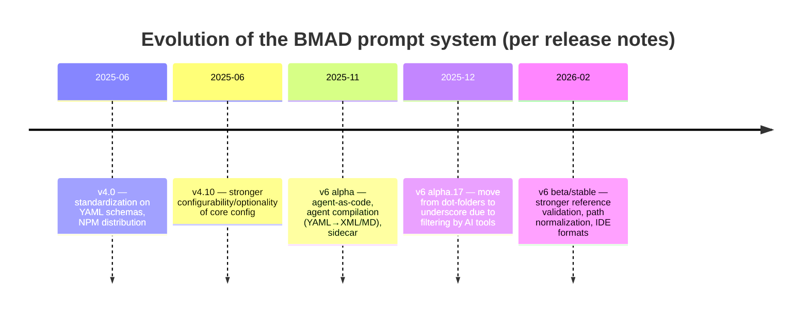

# Breaking down the BMAD-METHOD structure: why XML + config + "critical notes" are arranged exactly this way

## Executive summary

In BMAD-METHOD the "prompt system" is not just a set of texts, but an assembly from **sources (YAML/MD/XML) + a compiler + reference-validation rules + user configuration**, which turns into artifacts (agents/commands/web bundles) executable for specific IDEs/platforms. citeturn9search0turn12view0turn22view0turn28view3turn35search0

The rationale for choosing "XML + config + critical notes" recurs across the repository materials and issue threads as a set of very engineering-driven reasons:

* **Reliability and controllability of LLM behavior**: the XML DSL in `instructions.md` (tags like `<step>`, `<action>`, `<ask>`, `<check>`) sets the execution "rails", reduces interpretation arbitrariness, and makes it easier to break long processes into chunks; "critical actions/notes" are pulled out separately so the model runs the mandatory steps on activation. citeturn17search8turn23search10turn25view0turn17search5turn37search2turn37search9  
* **Cross-IDE/cross-platform support**: the same source agent/workflow must be deployed into different formats (for example, IDE commands/agents, web bundles, specific integrations). The release notes explicitly record the move to "agent-as-code" and compilation (YAML → XML/MD). citeturn22view0turn27view2turn9search4turn10search3  
* **Config as an "update-safe" layer and a duplication reducer**: user settings/paths/languages/ephemeral directories must live outside the core and survive updates; meanwhile, incorrect/non-unified references to config break activation and workflows en masse — as is evident from a series of bug reports. citeturn17search5turn24search0turn24search3turn24search2turn24search13turn23search10turn28view3  
* **"Dissent" and alternatives** are present in the issues too: people proposed relying on **AGENTS.md as a common standard** (instead of many IDE specifics), switching to "workflows" where the IDE supports them (instead of rules), and fixing the bundling format for compatibility (for example, the Gemini renderer and nested code fences). citeturn37search10turn23search8turn24search6turn23search9  

Below is how this system is arranged in the repository and what arguments/trade-offs surface in the discussions.

## What is in the repository and where the "prompts" are located

The repository is positioned as an NPM package `bmad-method` with a CLI, an installer, artifact generators, and documentation, rather than as a "prompts folder". citeturn9search0turn12view0turn22view0

At the structural level (by root and metadata) you can see:

* sources and content: `src/` (core + modules), `docs/`, `samples/…`, `website/` citeturn1view0turn9search0  
* tooling: `tools/` and `test/` (schema validators, the cross-file reference validator, installation tests, etc.) citeturn12view0turn28view2turn28view3turn33view0  
* the dependency on YAML/XML parsers and working with the markdown structure indicates that the "prompts" are processed programmatically: the dependencies include `xml2js`, `yaml`, `js-yaml`, `@kayvan/markdown-tree-parser`. citeturn12view0  

Important context from the release notes: starting with v4, the repository clearly moves from "hard-wired prompts" to **standardized schemas and installation/generation**. citeturn9search4turn10search3

A clear "evolution timeline" that reads directly from the release descriptions and changelog (simplified):

Actual reference points for this scale: v4.0 about YAML schemas and the architectural overhaul citeturn9search4, v4.10 about "Configuration & Flexibility" citeturn10search3, v6 alpha.11 about the "Agent Compilation Engine: YAML → XML" citeturn27view2, v6 alpha.17 about the `.bmad` → `_bmad` migration because dot-folders are "often filtered out by AI systems" citeturn27view2, v6 beta about strict validation of file references and standardization of `{project-root}/_bmad/…` citeturn22view0turn28view3.

## Mechanics of the prompt system: YAML sources, the XML DSL, configs, and sidecar

### Agents as a "source-of-truth in YAML" rather than in a "finished prompt"

The key v6 pattern (and exactly what you called a "set of prompts") is this:

1) **an agent is described declaratively** (schema-validated YAML);  
2) during installation/update this YAML is **compiled** into an IDE-executable format (a Markdown file with XML activation rules and persona/menu/critical actions sections);  
3) user edits live in a separate customization layer and survive updates. citeturn35search0turn35search1turn17search5turn28view2turn22view0  

Even a secondary but useful overview (DeepWiki) phrases it exactly this way: agents are defined in `.agent.yaml` and "compiled to Markdown with XML activation rules". citeturn35search0turn35search1  

Why does this matter for your question about "why XML"? Because XML here is not a "storage format" but an **execution/interpretation format** in tools (and a way to make activation + critical rules more "machine-readable" for IDE integrations). citeturn35search0turn25view0turn27view2

### Workflows: `workflow.yaml` + `instructions.md` with XML tags = a managed DSL

For workflows in v6, a two-layer construction can be traced:

* `workflow.yaml` — configuration: metadata, paths to instruction/template/checklist files, config and variable sources; citeturn15search6turn15search5turn24search13  
* `instructions.md` — the "execution logic", where steps are marked up with XML tags (`<step>`, `<action>`, `<ask>`, `<check>`, etc.). citeturn15search6turn23search10turn17search10  

Issue #720 provides a rare "primary" example right inside the bug report: `instructions.md` contains a block `<step n="9" ...><action>...` and the workflow behavior is built on it. citeturn23search10  

Separately important: the reference validator (`tools/validate-file-refs.js`) explicitly accounts for `.xml` as a file type to scan and checks patterns like `{project-root}/_bmad/...`, `exec="..."`, "Load: `./file.md`", step-file metadata, and others. This shows that the "XML/DSL" is part of the formal reference and validation system, not "prompt styling". citeturn28view3turn22view0  

### The config layer: why is it needed "at all" if there are prompts

From the customization docs it is clear that the system assumes:

* menus where items lead either to a `workflow` path or to an `action`/`prompt` id;  
* `critical_actions` as a separate list of "instructions that run at agent startup";  
* `prompts` as reusable blocks that can be referenced from the menu. citeturn17search5  

Instead of duplicating paths/settings in every prompt, a variable mechanism is introduced (for example, `{project-root}`, `{output_folder}`, `{ephemeral_files}`, `{config_source}:…` regularly appear in issues). citeturn24search13turn23search10turn28view3turn17search5  

It is precisely this layer (together with reference discipline) that becomes a "pain point" if the system is loosely consistent. The series of issues about `core-config.yaml` shows that **an incorrect config reference breaks absolutely everything**, because the config is read at the agent activation step. citeturn24search0turn24search3turn24search17turn37search7  

### "Critical notes / critical actions" as an engineering response to LLM unpredictability

Two types of evidence from primary sources:

1) users record that the IDE/LLM **sometimes ignores critical instructions** (does not load mandatory files, does not apply rules) — see issue #387; citeturn37search2  
2) when there are contradictions within the "critical operating instructions", the model chooses the "safest prohibition" and breaks the business logic — see issue #496 about the inability to update a story's status. citeturn37search9  

Issue #823 adds an architectural formalization: for Expert agents with a sidecar, a `<critical-actions>` section is mandatory, which **directly mandates loading the sidecar files and following them**. citeturn25view0  

This is important: "critical notes" here are not just a "tone amplifier" but an attempt to make mandatory steps **structurally separated** and therefore less prone to being "lost in the middle of the prompt".

## What the issue threads say: solutions, pains, trade-offs

Below are only those issues that directly concern **XML/DSL, config architecture, and critical instructions**. Format: number/link (via source), participants, dates, brief outcome, quotes, resolution.

### Issue #823 — Critical Sidecar Integration for the master agent citeturn25view0  
Participants: author — entity["people","pomazanbohdan","github user"] (no other comments are visible in the HTML snapshot). citeturn25view0  
Date range: 26 Oct 2025 → closed (the closing date is not shown in the available page markup). citeturn25view0  

Brief summary (3-6 sentences): The report claims that the master agent in v6 is conceived as an Expert agent with a sidecar configuration, but because the `<critical-actions>` section is missing, the sidecar is not loaded and the "delegation/orchestration" architectural model does not take effect. The author shows the expected XML fragment and ties this to the "Expert-agent architecture standards" (with a link to the documentation inside the project). In essence, this explains why "critical actions" exists at all as a separate layer: to guarantee the loading of rules and prohibitions that must take priority over the rest of the agent's behavior. The outcome is formally marked as "Closed". citeturn25view0  

Key quotes (verbatim):  
> “missing the mandatory `<critical-actions>` section required for Expert agents with sidecar configurations.”  
Source: issue #823. citeturn25view0  

> “Load COMPLETE file … and follow ALL directives”  
Source: issue #823 (fragment of the expected `<critical-actions>`). citeturn25view0  

Outcome: closed; a concrete fix was proposed (add `<critical-actions>` with a directive to load the sidecar). citeturn25view0  

### Issue #387 — Claude Code "does not follow critical instructions" of the dev agent citeturn37search2  
Participants: author — entity["people","urso","github user"]. citeturn37search2  
Date range: 2 Aug 2025 → closed (closing details are not visible in the snippet). citeturn37search2  

Brief summary: The user describes flapping behavior: when the dev agent is activated, Claude Code sometimes does not read the "CRITICAL instructions" and does not load the required documents (standards/tech-stack), which leads to incorrect decisions and ignoring the environment (docker/python env). This highlights the problem of "non-deterministic execution" even when explicit instructions are present. In the context of the project's architecture, this looks like one of the reasons to move mandatory actions into a separate *critical* loop and (in v6) to make it a structural element. citeturn37search2  

Key quote:  
> “Claude Code is not follow its critical instructions and does not load coding-standards…”  
Source: issue #387. citeturn37search2  

Outcome: closed. citeturn37search2  

### Issue #496 — conflict of "critical operating instructions" breaks updating the story status citeturn37search9  
Participants: author — entity["people","ichunlai","github user"]. citeturn37search9  
Date range: 22 Aug 2025 → closed. citeturn37search9  

Brief summary: The report articulates a typical prompt-engineering failure mode: two adjacent "critical" directives contradict each other, one allows editing `Status`, the next prohibits it — the model chooses the prohibition and does not move the story to `Review`. This is a demonstration that "critical notes" are not magic; they require engineering consistency and, preferably, automated checks. As an indirect consequence, the emergence of more formalized schemas/validators is logical (in v6 and later releases, validation of references and templates is strengthened). citeturn37search9turn22view0  

Key quote:  
> “direct contradiction in the agent's critical operating instructions.”  
Source: issue #496. citeturn37search9  

Outcome: closed. citeturn37search9  

### Issue #436 — "how much is core-config.yaml actually used?" citeturn24search5  
Participants: author — entity["people","thecontstruct","github user"]. citeturn24search5  
Date range: 13 Aug 2025 → status not shown in the snippet (whether the issue is open/closed is not visible from this fragment). citeturn24search5  

Brief summary: The question is not about a bug, but about a design trade-off: the user expects the config to control naming/output artifacts (multiple PRDs, etc.), but discovers "hard-wired" output file names in the templates. This is an important "counter-point" to the idea that "everything is configurable": the config may be introduced primarily for paths/options/integrations, but does not necessarily cover all user scenarios (for example, feature-based documentation) — which later results in separate requests/refactorings. citeturn24search5turn24search16  

Key quote:  
> “trying to figure out what the deal is with core-config.yaml.”  
Source: issue #436. citeturn24search5  

Outcome: unclear from the available fragment. citeturn24search5  

### Issue #471 — incorrect path to the project configuration in the agent description citeturn24search17  
Participants: author — entity["people","huweiATgithub","github user"]. citeturn24search17  
Date range: 18 Aug 2025 → closed. citeturn24search17  

Brief summary: The report targets the fact that the agent activation text references `bmad-core/core-config.yaml`, whereas the `{root}` variable is expected to be used for independence from the installation location. This illustrates a key requirement for the config layer: paths must be parameterized, otherwise activation breaks in different environments. The thread shows a "minimal engineering contract" — specify not an absolute/hardcoded path, but a root variable. citeturn24search17  

Key quote:  
> “Shouldn't that be "{root}"?”  
Source: issue #471. citeturn24search17  

Outcome: closed. citeturn24search17  

### Issue #526 — mass incompatibility of references to `core-config.yaml` breaks activation citeturn24search0  
Participants: author — entity["people","manateeit","github user"]. citeturn24search0  
Date range: 29 Aug 2025 → closed. citeturn24search0  

Brief summary: The report reveals a systemic problem: the file on disk is in one location (`.bmad-core/core-config.yaml`), while dozens of files reference another (`bmad-core/core-config.yaml`), which causes agent activation to fail. This is a "clean" engineering reason for why the project needs a strict mode of path management (variables, reference standards) and why automatic validation of file references later appears. citeturn24search0turn28view3turn22view0  

Key quote:  
> “BMad agent activation fails with "File does not exist" errors…”  
Source: issue #526. citeturn24search0  

Outcome: closed. citeturn24search0  

### Issue #580 — Step 3 "Load and read core-config.yaml" breaks due to a hardcoded path citeturn37search1  
Participants: author — entity["people","joshwilhelmi","github user"]. citeturn37search1  
Date range: 14 Sep 2025 → closed, marked `v6-resolved`. citeturn37search1  

Summary: Essentially this is a "special case" of topic #526/#471: in the agent file the activation step references `bmad-core/core-config.yaml`, but in reality the required path is different; the author proposes replacing it with `{root}/core-config.yaml`. Important signal: the project itself acknowledges (via the `v6-resolved` label) that the correct abstraction is variables/roots, not hardcoded strings. This strengthens the argument for the "config layer" as a stability interface between versions and installations. citeturn37search1turn28view3  

Key quote:  
> “it was hardcoded to … core-config.yaml. Other references were based on {root} placeholder.”  
Source: issue #580. citeturn37search1  

Outcome: closed, marked as resolved for v6. citeturn37search1  

### Issue #494 — dependency resolution bug due to incorrect variable interpolation syntax citeturn24search2  
Participants: author — entity["people","piatra-automation","github user"]. citeturn24search2  
Date range: 22 Aug 2025 → open (per the snippet). citeturn24search2  

Summary: This thread shows how a "documentation trifle" in the `{root}/{type}/{name}` syntax can break agent behavior: it treats `root` as a literal directory and fails to find files (including `core-config.yaml`). This is an argument that config/variables need a single, machine-verifiable style, otherwise errors migrate into runtime. citeturn24search2turn28view3  

Key quote:  
> “missing variable interpolation syntax … causing the agent to treat "root" as a literal directory name”  
Source: issue #494. citeturn24search2  

Outcome: open (as of the snapshot). citeturn24search2  

### Issue #919 — undefined `{context_dir}` in `workflow.yaml` breaks code-review citeturn24search13  
Participants: author — entity["people","enjohnso","github user"]. citeturn24search13  
Date range: 15 Nov 2025 → open. citeturn24search13  

Summary: The report is already about a v6 workflow: the workflow config uses the `{context_dir}` variable, which is undefined, and therefore the process cannot find `sprint-status.yaml`. The author immediately proposes the "correct" source `{ephemeral_files}` and explains that it is already defined in the same YAML. This is a characteristic trade-off of config systems: it is powerful, but an error in a variable name breaks the scenario completely — which is why reference validators and attempts to standardize paths appear in the repo. citeturn24search13turn28view3turn22view0  

Key quote:  
> “The variable `{context_dir}` is undefined in the workflow configuration.”  
Source: issue #919. citeturn24search13  

Outcome: open (as of the snapshot). citeturn24search13  

### Issue #720 — conflict between README and `instructions.md` with XML steps citeturn23search10  
Participants: author — entity["people","ln1998cn","github user"]; assignee — entity["people","pbean","github user"]. citeturn23search10  
Date range: 10 Oct 2025 → closed. citeturn23search10  

Summary: The user identified a desync between "principle" and "implementation": the README states that the tech-spec is created JIT "one epic at a time", but in `instructions.md` the XML step describes generating the tech-spec for *all* epics at once. This is an important demonstration that the XML-DSL is indeed an "executable specification", and any changes in philosophy must be synchronized with `instructions.md`. It is also evident that the workflow logic lives not in the agent but inside the workflow instructions — i.e., YAML/MD/XML are separated not by accident but architecturally. citeturn23search10turn9search0  

Key quotes:  
> “README.md states … ‘tech-spec … JIT during implementation’”  
Source: issue #720. citeturn23search10  

> “instructions.md … `<step n="9" …>` … generates … for ALL epics at once”  
Source: issue #720. citeturn23search10  

Outcome: closed (likely resolved by synchronization/refactoring, but the closure details are not visible in the snippet). citeturn23search10  

### Issue #813 — incorrect dependency references in `workflow.yaml` (v6 `document-project`) citeturn23search0  
Participants: author — entity["people","deduktion","github user"]. citeturn23search0  
Date range: 23 Oct 2025 → closed. citeturn23search0  

Summary: The workflow config hardcodes paths to CSV dependencies and to `instructions.md`, which causes the workflow to fail to start in one CLI environment (while working in another). This is another signal of the need for strict path/variable discipline, as well as of the fact that `workflow.yaml` is a sensitive layer: it links "instructions" and "assets", and an error in a reference renders the entire XML-DSL useless (the instructions simply won't be loaded). citeturn23search0turn28view3  

Key quote:  
> “file paths … appear to be hardcoded incorrectly within the workflow's configuration file”  
Source: issue #813. citeturn23search0  

Outcome: closed. citeturn23search0  

### Issue #867 — the generator/Builder creates an agent in the "wrong" YAML format citeturn23search3  
Participants: author — entity["people","marconardelli","github user"]. citeturn23search3  
Date range: 5 Nov 2025 → closed. citeturn23search3  

Summary: The report shows the flip side of "schemas and compilation": if the Builder generates YAML using the old structure (`meta:` instead of the expected `agent: metadata:`), then the subsequent install/parse process breaks. That is, choosing YAML as the source of truth leads to the need for: (a) strict schema validation, (b) synchronizing the Builder's templates with the current schema. This thread supports the thesis that the "XML part" (compilation/execution) is impossible without a strict upstream YAML contract. citeturn23search3turn28view2turn27view2  

Key quote:  
> “generated … use incorrect/legacy format … causing YAML parsing errors during module installation.”  
Source: issue #867. citeturn23search3  

Outcome: closed. citeturn23search3  

### Issue #639 — web bundles break in Gemini due to nested code fences citeturn24search6  
Participants: author — entity["people","troy216","github user"]. citeturn24search6  
Date range: 20 Sep 2025 → closed, marked `v6-resolved`. citeturn24search6  

Summary: This is a pure "compatibility constraint": if the resulting bundle (which is essentially a large prompt file) contains nested fenced blocks, the Gemini UI truncates the content. For the project's choice of formats this means: the final "prompt artifact" must be robust to renderer quirks, otherwise users cannot even copy the results (architecture, spec, etc.). In the context of the XML approach this explains the drive toward more "structural" representations and toward caution with markdown syntax in final artifacts. citeturn24search6turn10search3  

Key quote:  
> “markdown renderer fails … if the file contains nested code fences.”  
Source: issue #639. citeturn24search6  

Outcome: closed/resolved for v6. citeturn24search6  

### Issue #904 — in `*.xml` web bundles the "options menu is incomplete" citeturn23search9  
Participants: author — entity["people","jotatriana","github user"]. citeturn23search9  
Date range: 12 Nov 2025 → closed. citeturn23search9  

Brief summary: The bug is already directly about XML artifacts: web bundles of the form `sm.xml / tea.xml / dev.xml` are present but contain incomplete menus compared to the IDE. This usually means either a compiler/bundler discrepancy or a "trimming" of part of the functionality due to web-platform limitations. The very existence of `*.xml` bundles supports the thesis that XML is used as a transport/structural format specifically for web delivery. citeturn23search9turn10search3  

Key quote:  
> “Web Bundles for sm.xml, tea.xml and dev.xml Menu options appear incomplete”  
Source: issue #904. citeturn23search9  

Outcome: closed. citeturn23search9  

### Issue #643 — proposal: move the Cline integration to "workflows" instead of rules citeturn23search8  
Participants: author — entity["people","chisleu","github user"]. citeturn23search8  
Date range: 22 Sep 2025 → closed. citeturn23search8  

Brief summary: This is an example of an "alternative prompt architecture": instead of a set of rules that prompt the LLM to react to commands, use the IDE's native workflow mechanisms (slash commands as separate prompts). The author's argument is stability of UI/UX across agents and reduced fragility. This is not "against XML", but against the "rules/global prompts" approach, and overall it fits into the BMAD strategy: more declarative workflow artifacts. citeturn23search8turn15search6  

Key quote:  
> “Cline supports workflows … slash commands you can use like a prompt (not a system prompt).”  
Source: issue #643. citeturn23search8  

Outcome: closed. citeturn23search8  

### Issue #517 — request: support AGENTS.md as a "common standard" citeturn37search10  
Participants: author — entity["people","tinuva","github user"]. citeturn37search10  
Date range: 27 Aug 2025 → closed. citeturn37search10  

Brief summary: The author proposes relying on AGENTS.md (as a "universal standard for agent instructions") in order to automatically work with IDE agents that support this file, instead of supporting many IDEs individually. This is a direct "alternative prompt-schema format": a single canonical file instead of many downstream generations. From an engineering standpoint this reduces integration cost, but it worsens the ability to tailor behavior to IDE specifics and loses the benefits of compilation (menus, critical sections, sidecar patterns). citeturn37search10turn27view2  

Key quote:  
> “AGENTS.md is a new standard … enable bmad-method automatically on any IDE … that supports AGENTS.md”  
Source: issue #517. citeturn37search10  

Outcome: closed. citeturn37search10  

## Synthesis of the reasons for choosing XML + config + critical notes

### Engineering reasons

**XML-DSL as the workflow "execution language."** Judging by the structure of `instructions.md` (XML tags) and the description of the workflow engine, BMAD effectively builds a DSL that the LLM "interprets" as a step-by-step scenario. This reduces the risk of skipping steps and makes it easier to break down complex processes (especially when workflows are long and heavily branched). citeturn15search6turn17search8turn23search10turn17search10  

**Compilation YAML → (conceptually) XML/MD as a way to separate "source" from "runtime."** The changelog explicitly mentions an "Agent Compilation Engine: YAML → XML" and a sidecar architecture. This looks like a solution to the problem: *store* the agent declaratively and validatably (YAML), but *execute* it in formats that IDEs/platforms understand (Markdown+XML activation, web bundles, etc.). citeturn27view2turn35search0turn28view2turn10search3  

**Formal checks as an answer to path fragility.** The canonicalization of `{project-root}/_bmad/...` and the appearance of tools that scan YAML/MD/XML/CSV for the validity of references are explained not "academically" but by practice: dozens of real bugs were simply "broken references/variables". citeturn28view3turn24search0turn24search13turn23search0turn22view0  

### Usability/operational reasons

**Update-safe customization.** The documentation emphasizes that user settings/customizations must survive updates. This logically requires a separate config layer and a merge mechanism (rather than edits directly in the "compiled" prompts). citeturn17search5turn22view0turn35search0  

**Adapting to platform limitations.** In the web world, rendering problems and UI limitations ("nested code fences") genuinely break usage. Therefore the format of the final artifact (bundle) becomes part of the architectural decision, not "cosmetics". citeturn24search6turn23search9  

### Safety/behavior control (the internal "agent policy")

**Critical actions as a "fuse" and a priority layer.** Issues #387 and #496 show that even with explicit critical rules the LLM can (a) fail to read them reliably, (b) run into a contradiction and go down a "prohibiting" branch. citeturn37search2turn37search9  

**The `<critical-actions>` section as a mandatory mechanism in the Expert architecture.** Issue #823 is effectively an ADR in the form of a bug report: sidecar policies (delegation, prohibitions, routing) must *always* be loaded, and so it is formalized as an explicit structural block. citeturn25view0  

### Implicit assumptions (what shows through between the lines)

1) It is assumed that **the LLM follows "structure" more reliably** (tags/formal blocks) than "prose". citeturn15search6turn23search10  
2) It is assumed that users are willing to accept **pipeline compilation** (installation/update as a "build"). citeturn9search0turn22view0turn27view2  
3) It is assumed that filesystem contracts (paths/directories) will break in the real world, and therefore variables and validators are needed. citeturn24search0turn24search13turn28view3  
4) It is assumed that AI tools/IDEs **may ignore dot folders**, so the path architecture must account for "indexer/agent quirks," which is directly reflected in the changelog. citeturn27view2  

## Alternatives that were discussed

The table below is not a "theoretical list" but options that surface in the release notes and issues as real alternatives or competing approaches.

| Schema option | Proponents (where discussed) | Pros | Cons/risks | Decision status |
|---|---|---|---|---|
| YAML source → compilation into runtime artifacts (MD+XML activation, bundles) | the "v6 line" in the changelog; bugs around mandatory blocks/schemas citeturn27view2turn25view0turn23search3 | Schema validatability; update-safe customization; can generate for different IDEs/platforms; structural critical blocks | Requires synchronizing generators/templates; variable/path errors break processes; tooling needed | Accepted (v6 core) citeturn27view2turn22view0 |
| AGENTS.md as a single standard | entity["people","tinuva","github user"], issue #517 citeturn37search10 | Universality; lower maintenance cost across many IDEs | Loses IDE specificity; harder to maintain menu/sidecar/critical contracts; everything becomes "more monolithic" | Request closed (not the primary path) citeturn37search10 |
| IDE-native workflows instead of rules (Cline example) | entity["people","chisleu","github user"], issue #643 citeturn23search8 | More stable UX in the IDE; commands as separate prompts | Fragmentation across IDEs; some platforms do not support it identically | Discussed, issue closed citeturn23search8 |
| "Markdown-only bundles" without complex nesting | issue #639 citeturn24search6 | Better compatibility with web UI renderers | Limits expressiveness (mermaid/yaml blocks); requires repackaging artifacts | Resolved in the v6 line (label `v6-resolved`) citeturn24search6 |
| "JSON-only integration / compact mode" (as a mode) | the v4.44.1 release notes mention JSON-only integration citeturn10search3 | Compactness; potentially fewer tokens; easier to parse by machine | Harder for humans to read; requires strict schema discipline; not always friendly with IDEs/renderers | Exists as an option/integration (not the only format) citeturn10search3 |

## Recommendations and open questions

1) **Formulate and lock in an "ADR" on the XML DSL and critical contracts.** Issue #823 looks like an architectural specification but in the form of a bug report. A separate document on "why `<critical-actions>` is mandatory, what the sidecar loading order is, which prohibitions have the highest priority" would reduce the risk of repeating #387/#496. citeturn25view0turn37search2turn37search9  

2) **Strengthen static analysis of contradictions in critical instructions.** #496 shows a classic "prompt consistency" defect. It can be caught by a linter using a pattern ("allow X" + "forbid X" in the same block) or at least by a CI checklist. The technical foundation is already there: the repository is developing reference and schema validators. citeturn37search9turn28view3turn22view0  

3) **Introduce a "variable validator" for `workflow.yaml`.** #919 illustrates that a nonexistent variable breaks the runtime. The current reference validator explicitly states that it does not check `{config_source}:key` (deferred), but it is precisely workflow-config-level variables that are the zone of highest error frequency. citeturn28view3turn24search13  

4) **Clarify the boundaries of configurability.** Question #436 ("why can't names/multiple PRDs be resolved via core-config") shows a gap in expectations. The customization documentation talks about `prompts`, `critical_actions`, menus, etc., but does not always answer *which* artifacts are actually parameterized. A clear matrix of "what can be changed via config" vs "what is hardcoded by templates" would reduce frustration and lessen "dissent." citeturn24search5turn17search5  

5) **Treat web bundles as "first-class" artifacts, but test them separately.** Issues #639 and #904 show that the web channel has its own constraints and bugs (rendering and incomplete menus). Given that the releases emphasize web bundle support, it is useful to keep a separate test track specifically for the web output. citeturn24search6turn23search9turn10search3  

6) **Further investigation (if you want to get to "why XML specifically, and not …" at the authors' level):** in the current issue threads the arguments are often implicit and driven "from bugs." If you specifically need the "architects' intentions," you will additionally have to dig up: (a) the PR discussions around the "YAML → XML compiler" from the alpha.11 changelog, (b) the docs/guide on agent architecture inside BMB, referenced by #823. citeturn27view2turn25view0turn35search0