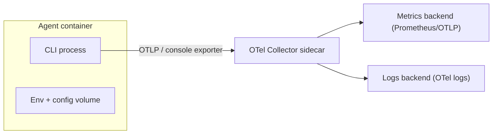

# Capabilities and containerization requirements of Claude Code CLI, Codex CLI, Cursor CLI, and Gemini CLI

## Scope and evidence base

This report compares four “agent CLIs” from a container-orchestration perspective, focusing on six operator-relevant dimensions: authorization, MCP, tools, skills, context management, and cost/token tracking. All findings are grounded in vendor documentation and primary sources where available, with explicit callouts when official docs do not disclose implementation details (e.g., credential file schemas). citeturn11view0turn21view0turn25view0turn26search2

A practical limitation: **Cursor Docs pages were not reliably retrievable in full-text** via direct access in this environment (dynamic rendering). Where Cursor’s official docs could not be opened, this report relies on (a) the **search-indexed snippets of Cursor Docs**, plus (b) Cursor’s official forum threads for behavioral details, and (c) other authoritative third-party technical references only when they align with those official sources. citeturn26search2turn26search9turn26search19turn28search0

## Executive comparison highlights

Across the four CLIs, the **biggest container-ops differences** are:

**Authentication ergonomics and portability**
- Codex explicitly supports **portable file-based credential caching** at `~/.codex/auth.json` (or OS keyring), and documents how to force file/keyring storage—useful for containers and CI. citeturn21view0
- Gemini CLI strongly supports **headless/container auth via environment variables** and recommends a `.gemini/.env` file that the CLI auto-discovers (first match only; not merged). citeturn25view0
- Claude Code supports multiple auth backends (native, cloud providers), but the official docs emphasize **OS-secure stores on macOS** and add a container-friendly escape hatch via environment variables and an `apiKeyHelper` script hook. citeturn11view0turn10view1
- Cursor CLI is **API-key centric** (`CURSOR_API_KEY` / `--api-key`) and appears workable in containers, but there are **headless trust/approval gaps** around MCP in CI-like environments per Cursor’s own forum. citeturn28search5turn26search19

**MCP support exists in all four**, but operational maturity differs:
- Claude Code and Codex document **OAuth flows and multi-scope config** for MCP. citeturn10view4turn21view2
- Gemini CLI documents `mcpServers` in `settings.json` and offers global allow/deny controls and per-server `trust`. citeturn23search0
- Cursor supports MCP per docs/forum, but **CI/headless approvals are a known limitation** (no workaround/ETA stated in a forum moderation reply). citeturn26search19turn26search9

**Token/cost observability**
- Codex is the outlier with **machine-readable streaming JSONL that includes token usage** (`usage.input_tokens`, `usage.output_tokens`) in non-interactive mode. citeturn21view1
- Claude Code and Gemini CLI both support **OpenTelemetry-based observability**, including cost/token counters (Claude) and token consumption metrics (Gemini) in exported telemetry. citeturn11view2turn25view2
- Cursor CLI does **not** appear to expose per-request token/cost locally today; public feature requests explicitly ask for it (both GitHub issue and Cursor forum). citeturn26search1turn26search12

## Summary table

The table below answers the user’s six required questions for each CLI and translates them into concrete **container implementation requirements** (files to mount, paths, and how to configure).

| Dimension | Claude Code CLI | Codex CLI | Cursor CLI | Gemini CLI |
|---|---|---|---|---|
| Authorization | **Supported.** Multiple auth backends: Claude.ai / Console, plus cloud providers (Bedrock/Vertex/Foundry). citeturn11view0  **Container-friendly methods:** (a) set `ANTHROPIC_API_KEY` (sent as `X-Api-Key`) or `ANTHROPIC_AUTH_TOKEN` (used as `Authorization: Bearer …`) as env vars; (b) configure `apiKeyHelper` to run a script that returns an API key (good for secret managers). citeturn10view1turn11view0  **Files to include/mount:** official docs do not provide a single cross-OS “token file” path; they note macOS Keychain storage for credentials, and that `CLAUDE_CONFIG_DIR` changes where config/data live. Treat the config dir (e.g., `~/.claude*`) as state to persist, but exact credential file formats are not documented. citeturn11view0turn10view2 | **Supported.** Two main methods: ChatGPT subscription login (browser/device flow) or API key login. citeturn21view0  **Credential cache files:** `~/.codex/auth.json` (plaintext) when file storage is used; alternatively OS credential store. Storage mode controlled via `cli_auth_credentials_store = "file|keyring|auto"`. citeturn21view0  **Container implementation:** mount a volume at `CODEX_HOME` (default `~/.codex`) holding `auth.json` + config; or inject API key per-run in CI via `codex login --api-key` (interactive sessions) and/or `CODEX_API_KEY` for `codex exec` only. citeturn21view0turn21view1turn22search7  **Expected file format:** `auth.json` contains access tokens (treat like password), but official docs do not publish its JSON schema. citeturn21view0 | **Supported.** Official docs indicate API-key auth: generate a “User API Key” in dashboard (Integrations → User API Keys). citeturn28search0  **How to pass creds in containers:** CLI flag `-a/--api-key <key>` or environment variable `CURSOR_API_KEY`. citeturn28search5turn28search4  **Files to include/mount:** official snippets emphasize config files (e.g., `~/.cursor/cli-config.json`) but do **not** document a canonical “auth cache file” equivalent to Codex. Practical container setups therefore generally inject `CURSOR_API_KEY` as a secret env var (no on-disk key file required). citeturn26search2turn28search5 | **Supported.** Interactive mode offers: “Login with Google” (browser flow), “Use Gemini API key” (`GEMINI_API_KEY`), or “Vertex AI” via ADC (`gcloud`), service account key JSON, or Google Cloud API key (`GOOGLE_API_KEY`). citeturn25view0  **Headless/container auth (recommended):** set env vars or place them in `.gemini/.env` (project-level or `~/.gemini/.env`); CLI auto-loads the *first* `.env` it finds (not merged). citeturn25view0  **Files to include/mount:** `.gemini/.env` and (if Vertex service account) the JSON key file referenced by `GOOGLE_APPLICATION_CREDENTIALS` (absolute path). citeturn25view0  **OAuth cache path:** Gemini docs confirm credentials are cached and reused in headless mode if present, but do not specify the exact token file path/schema. citeturn25view0 |
| MCP support | **Supported.** MCP servers can be added and scoped: project `.mcp.json`, user/local scope in `~/.claude.json`, and admin-managed `managed-mcp.json` in system directories (`/etc/claude-code/managed-mcp.json` on Linux/WSL). citeturn9view6turn9view8  **Container implementation:** mount project working dir containing `.mcp.json`; optionally mount `~/.claude.json` (or set `CLAUDE_CONFIG_DIR`) to persist user-scoped MCP configs. For strict enterprise control, bake `/etc/claude-code/managed-mcp.json` into the image (read-only) to pin allowed servers. citeturn9view6turn9view8turn10view2  **OAuth with remote MCP:** supported for HTTP servers; tokens are stored and refreshed automatically (storage path not specified). citeturn10view4 | **Supported.** MCP supported in CLI and IDE extension; supports STDIO and streamable HTTP servers; supports bearer tokens and OAuth (`codex mcp login <server>`). citeturn21view2  **Config files:** MCP configured in `config.toml` (user `~/.codex/config.toml` and/or trusted project `.codex/config.toml`). The CLI shares config across clients. citeturn21view2turn22search4  **Container implementation:** mount `CODEX_HOME` (default `~/.codex`) with `config.toml`; install MCP server binaries inside the container (or mount them) and reference via `command/args` (stdio) or URL (http). citeturn21view2turn22search7 | **Supported, with caveats.** Cursor CLI supports MCP and expects config in `.cursor/mcp.json` or `~/.cursor/mcp.json`; the CLI attempts to discover and load those servers. citeturn26search9turn26search6  **Container implementation:** mount `.cursor/mcp.json` into the workspace and/or volume-mount `~/.cursor/mcp.json`. Forum guidance suggests setting `CURSOR_CONFIG_DIR=~/.cursor` when the CLI fails to find config. citeturn26search9  **Headless CI limitation:** Cursor forum explicitly describes MCP approvals not being implemented for headless/CI, with no workaround. For CI orchestration, treat MCP as “best-effort” unless you can run an interactive trust/approval step. citeturn26search19 | **Supported.** MCP servers configured via `mcpServers` in `settings.json`, with global controls under `mcp` (e.g., allow/excluded lists). Server definitions can include `command`, `args`, `env`, `cwd`, timeouts, and a per-server `trust` boolean. citeturn23search0  **Container implementation:** mount `~/.gemini/settings.json` (user scope) or `.gemini/settings.json` (project scope); install MCP server executables in the image or mount them; pass secrets via env variables (referenced in config). citeturn23search0turn25view1 |
| Tools without MCP | **Supported.** Claude Code has built-in tools (e.g., Bash, Read/Write, Grep, WebFetch/WebSearch) governed by permission rules; these do not require MCP. citeturn10view3  **Container implementation:** install required CLIs inside the container (`git`, language toolchains, etc.); use Claude Code’s Bash tool to run them. Anthropic explicitly notes CLI tools (e.g., `gh`, `aws`, `gcloud`) can be more context-efficient than MCP servers. citeturn11view1  **Mounting tools:** bake binaries into image; mount repo at `/workspace`; consider persisting shell history separately (the reference devcontainer does). citeturn16search0turn13search3 | **Supported.** Codex local agent runs with sandbox + approval policy rather than “MCP required,” and supports command execution and file changes within configured sandbox modes. citeturn21view3  **Container implementation:** bake toolchain/deps into image; prefer `codex exec --json` for automation; enforce least-privilege sandbox (e.g., workspace-write) and only enable network when needed. citeturn21view1turn21view3  **Rules for out-of-sandbox commands:** use `.rules` files to control which commands can run outside the sandbox. citeturn22search2 | **Supported.** Cursor CLI is designed to “write/review/modify code” from the terminal (non-MCP by default). citeturn28search2  **Permissions model:** official snippets suggest permissions are configured via CLI config files (global `~/.cursor/cli-config.json` and a project config). citeturn26search2turn28search3  **Container implementation:** install build tools/test runners in the image; mount repo; run CLI in headless mode for CI patterns (Cursor docs cookbook references `--output-format` with `--print`). citeturn26search7turn28search16 | **Supported.** Gemini CLI includes a large built-in toolset (filesystem operations, shell commands, web fetching, etc.), and MCP is an extension mechanism rather than a prerequisite. citeturn23search8turn23search16  **Container implementation:** bake required system utilities; mount repo/workspace; optionally enable Gemini’s sandboxing, which uses a prebuilt `gemini-cli-sandbox` Docker image by default and supports a project-level `.gemini/sandbox.Dockerfile` for custom deps. citeturn25view1 |
| Skills | **Supported (feature exists), but file-level mechanics are not fully evidenced here.** Claude Code includes a “Skill” tool and official docs recommend moving specialized instructions from `CLAUDE.md` into skills because skills load on-demand. citeturn10view3turn11view1  **Container guidance:** keep `CLAUDE.md` minimal; persist whatever skill storage Claude Code uses by mounting the Claude config directory (location customizable via `CLAUDE_CONFIG_DIR`). However, official sources retrieved in this run do not disclose exact skill directory paths or file formats. citeturn11view1turn10view2 | **Supported, well-documented.** Codex skills are directories containing `SKILL.md` with YAML front matter (`name`, `description`) plus instructions; skills can be invoked explicitly (`$skill-name`) or selected automatically. citeturn22search0turn22search6  **Where to store:** examples show repo-scoped `.codex/skills/<skill>/SKILL.md` or user-scoped `~/.codex/skills/<skill>/SKILL.md`; official “create skills” docs also mention repo skills under `.agents/skills/` for portability. citeturn22search6turn22search1  **Container implementation:** mount repo (including `.codex/skills` or `.agents/skills`) and mount `CODEX_HOME` to persist user skills; restart/reattach sessions to pick up newly installed skills. citeturn22search0turn22search7 | **Unclear from accessible primary sources.** Cursor has an “Agent Skills” documentation page, but its content (including file locations/formats) was not retrievable in full here due to dynamic docs rendering. The snippet confirms skills exist and are auto-discovered from “skill directories,” but does not expose paths or schema. citeturn26search21  **Practical container stance:** treat skills as “potentially supported” but plan for fallback to rules/commands/hooks until you can validate exact on-disk structure in your environment. citeturn26search21turn26search10 | **No first-class “skills” terminology; closest equivalents are extensions + custom commands.** Extensions support variable substitution and are stored under a user filesystem path (example: `~/.gemini/extensions/<extension>`), and custom commands live as TOML in `<project>/.gemini/commands/*.toml`. citeturn23search4turn23search26  **Container implementation:** bake or mount extension directories into `~/.gemini/extensions`; mount project `.gemini/commands` for repo-scoped reusable workflows. citeturn23search4turn23search26 |
| Context management | **Primary mechanism:** `CLAUDE.md` is loaded at session start; Anthropic recommends keeping it small and moving specialized workflow instructions into skills. citeturn11view1  **Auto-read files:** `CLAUDE.md`, plus MCP configs (`.mcp.json` / `~/.claude.json`) and project settings (`.claude/settings.json`) when present. Local general settings are referenced as `.claude/settings.local.json` in docs. citeturn9view6turn10view3  **Container best practices:** mount repo as the only writable workspace; keep `.claude/` (project settings) in repo; persist `CLAUDE_CONFIG_DIR` volume for history/config reuse. citeturn10view2turn13search3 | **Primary mechanism:** `AGENTS.md` hierarchical instructions: global `~/.codex/AGENTS.md`, optional global override `~/.codex/AGENTS.override.md`, plus repo-level `AGENTS.md`. citeturn22search3  **Config layering:** user `~/.codex/config.toml` plus trusted project `.codex/config.toml` (closest wins). citeturn22search4turn21view4  **Container best practices:** mount repo; mount `CODEX_HOME` for persistent instructions/config; ensure the repo is a Git repo (required by default) or opt out explicitly (`--skip-git-repo-check`) only in controlled sandboxes. citeturn21view1turn22search7 | **Likely mechanisms:** Cursor supports context features like commands and rules (docs exist), and MCP config is shared between IDE and CLI via `mcp.json`. However, full docs content for context rules/commands was not retrievable here. citeturn26search6turn26search18  **Known file locations for MCP:** `.cursor/mcp.json` or `~/.cursor/mcp.json`. citeturn26search9  **Container best practices:** keep all contextual assets repo-scoped where possible; persist `~/.cursor` to avoid repeated trust prompts, but headless CI trust/approval may remain blocked. citeturn26search19turn26search9 | **Primary mechanism:** hierarchical context files named `GEMINI.md` by default. Global: `~/.gemini/GEMINI.md`; project/ancestors: search upward to project root (detected via `.git`); plus subdirectory scanning. citeturn23search3turn25view1  **Automatic context mutation:** `save_memory` appends facts to `~/.gemini/GEMINI.md` under a dedicated section. citeturn23search18  **Inspection controls:** `/memory show|refresh|list` to inspect and refresh loaded memory. citeturn23search9  **Container best practices:** mount repo; mount `~/.gemini/GEMINI.md` and settings for persistence; use path imports (`@path/to/file.md`) to keep context modular. citeturn25view1turn23search3 |
| Cost & token tracking | **Supported via two paths:** (a) interactive `/cost` command reports token usage and cost for the current session; (b) OpenTelemetry export provides metrics/events including cost and token counters. citeturn11view1turn11view2  **Container implementation:** run an OTEL collector sidecar and set env vars (`CLAUDE_CODE_ENABLE_TELEMETRY`, `OTEL_*`) in the container; optionally enforce org-wide via managed settings. citeturn11view2  **Notes:** background token usage exists (e.g., summarization jobs) per docs. citeturn11view1 | **Strongly supported (best-in-class for automation):** `codex exec --json` emits JSONL events and includes per-turn token usage (`input_tokens`, `cached_input_tokens`, `output_tokens`). citeturn21view1  **Container implementation:** capture stdout JSONL and aggregate; you can compute cost externally from model pricing, but Codex does not promise cost fields in the JSONL. citeturn21view1  **CI credentialing for tracking:** `CODEX_API_KEY` is supported only in `codex exec`, simplifying ephemeral containers with no persisted auth cache. citeturn21view1 | **Not clearly supported locally today.** Public requests ask Cursor to add token usage/cost reporting per request/session and to include token usage in stream-json output, implying the capability is missing or incomplete in the CLI output. citeturn26search1turn26search12  **What you can do instead:** use account/team reporting and APIs where available (pricing includes “usage analytics and reporting” for Teams; third-party descriptions note an Admin API for metrics/spend). These are not per-session CLI intercepts. citeturn26search23turn28search1 | **Supported via telemetry.** Gemini CLI provides OpenTelemetry integration configured via `.gemini/settings.json` and/or env vars/flags; docs list “token consumption” as a core benefit and describe file-based and collector-based export. citeturn25view2turn25view1  **Container implementation:** enable telemetry and write to a mounted file (e.g., `.gemini/telemetry.log`) or export to a collector; for GCP export you may need ADC or service account credentials. citeturn25view2turn25view0 |

## Container blueprints and file layout patterns

This section consolidates the “what to mount where” into repeatable container patterns. The goal is to make **auth + config durable** while keeping **repos ephemeral** and secrets out of the image layers.

### Common layout convention

A robust, cross-CLI pattern is:

- mount your repository read-write at `/workspace`
- run the CLI under a non-root user with `HOME=/home/agent`
- mount a **dedicated volume per CLI** under that home directory (or set CLI-specific env vars like `CODEX_HOME` / `CLAUDE_CONFIG_DIR`)

Example conceptual filesystem in the container (not vendor-specific):

```text
/workspace                 # bind mount: repo
/home/agent/
  .codex/                  # volume: codex state (config/auth/skills/history)
  .gemini/                 # volume: gemini state (settings/GEMINI.md/tmp/telemetry)
  .claude*                 # volume: claude code state (config, MCP, hooks)
  .cursor/                 # volume: cursor state (cli-config, mcp.json, approvals)
```

### Claude Code CLI blueprint

**Key container requirement: treat the container as the security boundary** if you ever run with reduced prompts (e.g., bypass permissions). Anthropic’s official devcontainer guidance explicitly highlights container isolation + firewalling as a way to safely run `--dangerously-skip-permissions`. citeturn12search2turn16search11

**Reference devcontainer mechanics worth replicating in your own orchestration:**
- create a dedicated workspace and a persistent Claude config dir inside the container (the reference Dockerfile creates `/workspace` and `/home/node/.claude`) citeturn16search0
- enforce outbound network allowlisting via an init script using iptables/ipset; the reference firewall script (init-firewall.sh) defaults to deny-all and then selectively allows DNS/SSH/localhost plus specific domains such as GitHub, npm, and Anthropic endpoints. citeturn16search2

A minimal “auth in containers” pattern for Claude Code is:
- pass `ANTHROPIC_API_KEY` (or `ANTHROPIC_AUTH_TOKEN`) as an environment variable at runtime citeturn10view1
- optionally use `apiKeyHelper` to source API keys from a script (useful when the container reads from a mounted secret or a secret-store CLI). citeturn11view0
- mount project-local settings at `.claude/settings.json` and MCP config at `.mcp.json`, plus consider persisting `~/.claude.json` if you rely on user-scope MCP servers. citeturn10view3turn9view6

### Codex CLI blueprint

Codex is unusually container-friendly because it documents:
- a deterministic state root (`CODEX_HOME`, default `~/.codex`) and the common files stored there (`config.toml`, `auth.json` if file-based, history/logs/caches). citeturn22search7turn21view0
- non-interactive JSONL output that includes token usage fields (ideal for log-based metering). citeturn21view1

A minimal file layout you can standardize inside containers:

```text
/home/agent/.codex/
  config.toml
  auth.json                 # only if cli_auth_credentials_store="file"
  AGENTS.md                 # optional global guidance
  skills/                   # optional user skills (if you choose user scope)
  rules/                    # execpolicy rules (*.rules)
```

All of these locations and capabilities are directly documented, with the key caveat that `auth.json` is sensitive and its schema is not specified publicly. citeturn21view0turn22search2turn22search3turn22search7

For CI/ephemeral containers:
- if you only need `codex exec`, injecting `CODEX_API_KEY` lets you avoid persisting `auth.json` entirely (but note: `CODEX_API_KEY` is documented as **only supported in `codex exec`**). citeturn21view1

### Cursor CLI blueprint

Cursor’s official snippets indicate:
- API-key auth via `--api-key` or `CURSOR_API_KEY` citeturn28search5turn28search0
- global CLI configuration in `~/.cursor/cli-config.json` citeturn26search2
- MCP configuration expected in `.cursor/mcp.json` or `~/.cursor/mcp.json` and sometimes requiring a config dir override (`CURSOR_CONFIG_DIR`) in troubleshooting. citeturn26search9

A container baseline that’s consistent with what’s publicly documented:

```text
/home/agent/.cursor/
  cli-config.json            # global CLI config
  mcp.json                   # global MCP config (optional)
  hooks.json                 # global hooks (optional)
```

Hooks are documented as a first-class on-disk config (`<project>/.cursor/hooks.json` or `~/.cursor/hooks.json`), making them the most concrete “interception point” Cursor exposes in files today. citeturn26search10

Operational caveat: Cursor’s forum explicitly states that **MCP approvals in headless/CI are not implemented** (as of the referenced thread), so you should not assume you can “just mount mcp.json” and have it work unattended in CI. citeturn26search19turn26search13

### Gemini CLI blueprint

Gemini CLI is highly explicit about where config should live and how it is layered:
- user settings: `~/.gemini/settings.json`
- project settings: `.gemini/settings.json`
- system overrides: `/etc/gemini-cli/settings.json` (platform-specific equivalents exist)
- system defaults: `/etc/gemini-cli/system-defaults.json` (platform-specific equivalents exist) citeturn25view1turn24search3

For pure container orchestration (no interactive browser auth), the official docs recommend environment variables and/or `.gemini/.env` discovery. citeturn25view0

Gemini’s context model is also file-grounded and deterministic:
- default context filename: `GEMINI.md`
- global: `~/.gemini/GEMINI.md`
- project root/ancestors plus subdirectory discovery citeturn23search3turn25view1

A minimal container layout that cleanly separates state from repo:

```text
/home/agent/.gemini/
  settings.json
  .env
  GEMINI.md
  extensions/                # if using extensions
  tmp/                       # checkpoints, shell history, telemetry collector logs
/workspace/
  .gemini/settings.json      # if using repo-scoped config
  .gemini/commands/*.toml    # repo-scoped custom commands
  GEMINI.md                  # repo/ancestor context
```

Gemini’s own docs also support running “dangerous” operations inside a sandbox image (`gemini-cli-sandbox` by default) and allow a project-level `.gemini/sandbox.Dockerfile` to customize dependencies—an unusually direct “container-first” workflow. citeturn25view1turn23search23

## Tracking, metering, and interception patterns

This section is the practical answer to “how do I wire cost/token tracking into containers” for each CLI.

### Three viable interception layers

**CLI-native usage output**
- Best example: Codex `--json` JSONL events in `codex exec`, with per-turn token usage in the stream. This is the cleanest integration point for agent orchestration that needs deterministic metering. citeturn21view1

**OpenTelemetry export**
- Claude Code supports OpenTelemetry metrics/events and documents configuration via env vars (including `CLAUDE_CODE_ENABLE_TELEMETRY`) and `OTEL_*` exporter configuration. citeturn11view2
- Gemini CLI likewise documents OpenTelemetry enablement and supports both file-based and collector-based exports, explicitly calling out token consumption as a tracked metric category. citeturn25view2

**External account/admin reporting**
- Cursor’s public user feedback indicates that per-request token/cost is not exposed in CLI output today; enterprise/team reporting exists, and a separate Admin API is publicly described by third parties, but neither is a drop-in, per-container “intercept” unless you build polling + correlation. citeturn26search1turn26search23turn28search1

### Minimal architecture diagram for OTel-based CLIs



Claude Code’s “cost counter” and “token counter” concepts are explicitly listed in its monitoring documentation, which is a strong signal that this architecture can support accurate billing telemetry when you run Claude Code inside containers. citeturn11view2

Gemini CLI similarly documents an OTel pipeline, including local file output (useful when you want to scrape logs from a container filesystem) and collector-based export with stored collector logs under `~/.gemini/tmp/<projectHash>/…`. citeturn25view2turn25view1

## Gaps, ambiguities, and “don’t assume” notes

The following items are **explicitly not fully resolvable** from the official sources successfully retrieved in this run. These are high-impact gaps for container orchestration, so they are called out directly.

**Claude Code CLI**
- Official docs confirm skills exist and are invoked on demand, and that `CLAUDE.md` is loaded at session start, but the **exact skill storage paths and file formats** were not obtained from the accessible official sources here. Treat skills as supported but validate on a real installation (e.g., inspect the config dir controlled by `CLAUDE_CONFIG_DIR`). citeturn11view1turn10view2turn10view3
- Credential storage is explicitly OS-dependent (macOS Keychain mentioned), and while env vars + `apiKeyHelper` are documented, the report cannot name a single “token file path” equivalent to Codex’s `auth.json`. citeturn11view0turn10view1

**Cursor CLI**
- Cursor Docs pages for configuration, MCP, skills, commands, hooks could not be opened in full text in this environment. The report therefore cannot extract complete schemas (e.g., full `cli-config.json` structure) from those official docs, only file path snippets and forum-confirmed behaviors. citeturn26search2turn26search9turn26search10
- Cursor “Agent Skills” feature exists per docs snippet, but **skill directory paths and formats** are not available from the captured sources. citeturn26search21
- Token/cost tracking is not clearly exposed in the CLI output; multiple public requests ask for it, which is evidence you should not assume it exists for headless orchestration. citeturn26search1turn26search12

**Gemini CLI**
- OAuth “Login with Google” credential caching is described, but the **exact on-disk token cache file path and format** are not specified in the retrieved official docs. For strict containerized auth, prefer API keys or Vertex service accounts, which are explicitly file/env driven. citeturn25view0turn25view2

**Codex CLI**
- `~/.codex/auth.json` is clearly documented as a sensitive token store, but the official docs do not publish its JSON schema; orchestration should treat it as an opaque secret blob. citeturn21view0