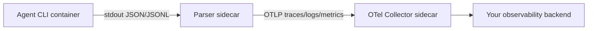
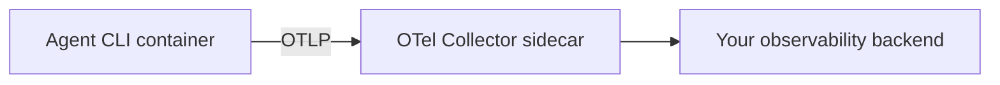
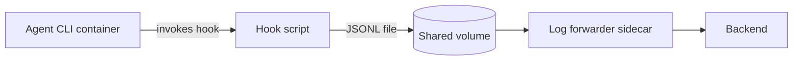

# Deep research on agent CLI command surfaces and container telemetry

I found a clear split between **CLIs with first‑class, documented OpenTelemetry (OTel) export** (Codex CLI and Gemini CLI), **CLIs with first‑class OTel/metrics that are controlled mostly by environment variables** (Claude Code CLI), and **CLIs where “telemetry” is most practical through hook systems and/or output parsing** (Cursor CLI). citeturn6view0turn6view1turn22view5turn34view3turn12view0
For container automation, the strongest baseline pattern across all four is: **run the agent in a non‑interactive/headless mode → force structured output (JSON/JSONL/stream‑JSON) → send telemetry to an OTEL collector sidecar**, only switching to hook‑level interception when the CLI supports it (Claude Code hooks, Cursor hooks) or when you need deterministic “tool gating” in addition to observability. citeturn24view0turn3view2turn7view0turn18view5turn5search11
Cursor is the hardest to “fully specify” from primary sources because the official docs pages were not reliably retrievable by my tooling (pages returned empty content), so some Cursor entries below are explicitly marked **unverified/partial** and rely on secondary sources (Cursor forum posts, third‑party blogs, integration writeups, GitHub repos). citeturn8search4turn8search5turn5search14turn5search11turn12view0

## Summary table of command hierarchies and automation hooks

The table below focuses on (a) **command trees**, (b) **non‑interactive automation**, (c) **machine output**, and (d) how those surfaces connect to auth/MCP/tools/skills/context and usage tracking.

| CLI | Primary invocation surface | Top-level commands / subcommands (documented) | Non-interactive / automation controls | Machine-readable output for parsers | How command surface ties to auth, MCP, tools, skills, context, token tracking |
|---|---|---|---|---|---|
| Claude Code CLI | `claude` | **CLI commands**: `claude`, `claude "query"`, `claude -p ...`, `claude -c ...`, `claude -r ...`, `claude update`, `claude mcp ...` citeturn20view0  **Interactive built-ins** (partial list; more discoverable in-client): `/clear`, `/compact`, `/config`, `/context`, `/cost`, `/debug`, `/doctor`, `/export`, `/help`, `/init`, `/mcp`, `/memory`, `/model`, `/permissions`, `/plan`, `/rename`, `/resume`, `/rewind`, `/stats`, `/status`, `/statusline`, `/copy`, `/tasks`, `/teleport` citeturn36view0turn22view1 | `-p/--print` for headless; `--output-format json|stream-json`; `--json-schema` for validated structured output; `--allowedTools` & permission flags; `--max-turns`, `--max-budget-usd`; `--no-session-persistence` citeturn24view0turn21view0turn20view2 | JSON (single object) and `stream-json` (NDJSON events). Docs show filtering `stream_event` deltas via `jq`. citeturn24view0turn21view0 | Auth is primarily outside the command list but affects `/cost` billing relevance; MCP is managed via `claude mcp add/list/get/remove` and in-client `/mcp`. Tools are controlled via `--tools`, `--allowedTools`, and hooks. Skills are invoked as `/...` commands and can be packaged as plugins. Context: `CLAUDE.md` is loaded at session start, and skills are on-demand; `/cost` reports token usage. citeturn35view0turn23view2turn19view0turn22view2turn22view1 |
| Codex CLI | `codex` | Commands list (from CLI reference): `codex` (TUI), `codex app`, `codex app-server`, `codex apply`, `codex cloud` (incl. `list`, `exec`), `codex completion`, `codex debug app-server send-message-v2`, `codex exec` (incl. `resume`), `codex execpolicy`, `codex features` (`list|enable|disable`), `codex fork`, `codex login`, `codex logout`, `codex mcp`, `codex mcp-server`, `codex resume`, `codex sandbox` citeturn27view0turn27view4turn28view2turn28view3 | Core automation entry point is `codex exec` (CI-style runs). Headless login supports `codex login --device-auth`. Container/sandbox controls include `--dangerously-bypass-approvals-and-sandbox` / `--yolo`. citeturn27view1turn6view0turn26view2turn28view3 | `codex exec --json` emits JSONL event stream; schema includes `turn.completed` with token usage fields (`input_tokens`, `cached_input_tokens`, `output_tokens`). citeturn3view2turn5search7 | Auth: cached credentials in `~/.codex/auth.json` (or OS keyring); doc includes explicit “copy into Docker container” workflow. MCP: `codex mcp ...` edits `~/.codex/config.toml` (or `.codex/config.toml` in trusted projects). Tools: MCP tools + built-in tools gated by approvals/sandbox; rules/execpolicy separate command. Skills live in `.agents/skills` (repo), `$HOME/.agents/skills` (user), `/etc/codex/skills` (admin); loaded progressively by description; AGENTS.md chain is the main “context instructions” surface. Token/usage tracking: via JSONL stream and/or Codex OTel export events/metrics. citeturn26view2turn31view1turn30view3turn29view0turn6view1turn6view0turn3view2 |
| Cursor CLI | `cursor-agent` (commonly referenced) | **Official docs not fully retrievable** in my tooling; command list is therefore partial. A Cursor docs “Parameters” page snippet indicates commands such as `logout`, `status`, `models` (exact subcommand naming may be `agent logout`, `agent status`, etc.). citeturn8search4  CLI usage & output flags observed in public sources: `cursor-agent -p --output-format stream-json` and `--output-format text|json|stream-json` appear documented. citeturn5search14turn5search2  MCP appears accessible via `cursor-agent mcp ...` in forum reports and integration pages. citeturn8search5turn8search8turn8search9 | Evidence of non-interactive/headless mode via `-p` and `--print` patterns, plus `--output-format stream-json` for automation pipelines. Some reports cite shutdown/hanging issues in non-interactive runs; plan for timeouts. citeturn5search14turn8search15turn8search11 | Stream JSON exists (NDJSON). A third-party post demonstrates stream objects with `type: "user"/"assistant"`, `message`, and `session_id`. citeturn5search14 | Auth/MCP: forum evidence shows trust/approval artifacts like `.workspace-trusted` and `mcp-approvals.json` under `~/.cursor/projects/<workspace>`; this impacts CI/container orchestration of MCP. citeturn8search5  Tools/skills/context: the strongest documented extension point is **Cursor Agent Hooks**, which can run deterministic scripts on events; hooks can be used for analytics and policy enforcement (but official hook docs were not retrievable directly). citeturn10search6turn5search11turn5search20  Token/cost: no primary-source guarantee of token/cost callbacks in CLI output; treat as “unknown unless present in output or hook payload.” citeturn5search14turn8search4 |
| Gemini CLI | `gemini` | Primary entry is `gemini` with flags. **Extension management** is a subcommand family: `gemini extensions install|uninstall|enable|disable|update|new`. citeturn34view1  **Interactive commands** (slash/at): `/bug`, `/chat save|resume|list|delete|share`, `/clear`, `/directory add|show`, `/extensions`, `/help`, `/mcp ...`, `/memory add|show|refresh|list`, `/restore`, `/settings`, `/stats`, `/auth`, `/about`, `/tools ...`, `/privacy`, `/quit`, `/vim`, `/init`, plus `@<path>` prompt injection. citeturn33view0turn33view1turn33view2turn33view4 | Headless: `--prompt/-p`, `--output-format json`, `--include-directories`, `--yolo`, `--approval-mode`, `--model`, etc. Telemetry can be enabled via CLI flags `--telemetry ...`. citeturn7view0turn34view3 | Headless JSON output includes `response` plus a `stats` object with per-model token totals (prompt/response/cached/total), plus tool stats (calls/duration/decisions). This is excellent for container-side parsing even without OTel. citeturn7view0 | Auth influences token/cached token reporting (`/stats` notes cached tokens only in some auth modes) and headless requires env-based auth if no cached creds exist. MCP is configured via `settings.json` (`mcpServers`) and visible via `/mcp`. Extensions package prompts/MCP/custom commands. Context: hierarchical “memory” from `GEMINI.md` managed by `/memory` and generated by `/init`. Token tracking: `/stats`, headless JSON `stats`, and OTel export. citeturn32view0turn33view1turn33view2turn34view2turn7view0turn34view3 |

## Detailed command reference and container automation options

### Claude Code CLI

**CLI command surface (shell level).** The official CLI reference enumerates a small set of shell-level commands (interactive REPL launch, print/SDK mode, session continue/resume, update, and MCP management). citeturn20view0
For container automation, the key flags are: `-p/--print` (headless), `--output-format json|stream-json`, `--json-schema` (schema-validated structured output), `--allowedTools` / `--tools` (tool gating), `--max-turns` / `--max-budget-usd` (guardrails), and session controls (`--continue`, `--resume`, `--session-id`, `--no-session-persistence`). citeturn21view0turn24view0turn20view2

**Interactive command surface (in-session).** Claude Code includes numerous built-in `/...` commands; the docs explicitly state the published table is “commonly used commands but not all,” and that typing `/` in the client reveals the full list. citeturn36view0
From a telemetry standpoint, `/cost`, `/context`, `/stats`, `/status`, and `/mcp` are the most relevant built-ins for introspection and control. citeturn36view0turn22view1turn35view0

**Container-specific automation flags you should plan around.**
Claude Code provides machine-friendly streaming via `--output-format stream-json` (NDJSON events) and structured summaries via `--output-format json` (including metadata fields). For automation that needs incremental results, the docs recommend `--verbose --include-partial-messages` + NDJSON filtering, which is compatible with container log pipelines. citeturn24view0turn21view0

### Codex CLI

**Full documented command tree.** OpenAI’s CLI reference page explicitly lists Codex commands and their maturity level; it also documents subcommands such as `codex cloud list|exec`, `codex features list|enable|disable`, and `codex exec resume`. citeturn27view4turn28view2turn28view3turn27view1

**Automation entry points.** `codex exec` is explicitly designed for “scripted or CI-style runs,” and `codex exec --json` produces JSONL suitable for parsing. citeturn27view1turn3view2
For containerized executions, you should pay close attention to sandbox/approval flags like `--dangerously-bypass-approvals-and-sandbox` / `--yolo`, and the docs explicitly mention that Codex’s sandbox may not work in some Docker environments unless kernel features (Landlock/seccomp) are available—so you may need to rely on container isolation and run with the bypass flags. citeturn6view0turn28view3

**Machine output.** The non-interactive docs show the JSONL event stream and a `turn.completed` event that includes token usage (`input_tokens`, `cached_input_tokens`, `output_tokens`). citeturn3view2turn5search7
That event stream is the most straightforward place to capture per-run token usage, model selection, and tool call outcomes without requiring OTel. citeturn3view2

### Cursor CLI

**Command list status.** Cursor’s official CLI docs pages were not reliably retrievable by my tooling (empty content on open), so I cannot confirm a complete command inventory from first-party docs. citeturn8search4turn8search13turn5search2
However, a Cursor doc snippet labeled “Parameters” clearly indicates a command table containing at least `logout`, `status`, and `models`. citeturn8search4

**Automation flags (evidence-based).** A third-party example demonstrates using `cursor-agent -p --output-format stream-json ...` and piping into `jq`, which strongly implies that Cursor CLI can emit NDJSON chat/event objects. citeturn5search14turn5search2

**Reliability caveat for containers/CI.** Multiple reports indicate that non-interactive runs may hang or not exit cleanly (for example, `--print` never exiting), so in containers you should wrap runs with `timeout`, enforce PID 1 reaping, and prefer sidecar parsing rather than waiting indefinitely for process exit. citeturn8search11turn8search15

### Gemini CLI

**Primary command surface.** Gemini CLI’s headless mode is a first-class documented interface: `gemini --prompt/-p`, `--output-format json`, plus flags like `--include-directories`, `--yolo`, and `--approval-mode` for automation. citeturn7view0
Separately, it has an explicit management command family `gemini extensions ...` for installing, enabling, disabling, and updating extensions (which can package prompts, MCP servers, and custom commands). citeturn34view1

**Interactive command inventory.** The CLI command reference enumerates many `/...` commands and explains that `@<path>` injects file/directory content into prompts using an internal tool (`read_many_files`), including git-aware filtering. citeturn33view1turn33view4

**Machine output with built-in usage stats.** Gemini’s `--output-format json` schema includes a `stats` section with **per-model token counts** (prompt/total/cached/etc.) and **tool execution totals** (calls, duration, decisions). This is unusually complete compared to most agent CLIs and is ideal for container parsing. citeturn7view0

## Telemetry, hooks, and extension points

### Native telemetry support and official extension mechanisms

**Claude Code CLI.** Claude Code supports OTel metrics export controlled by environment variables (for example `CLAUDE_CODE_ENABLE_TELEMETRY=1`, `OTEL_METRICS_EXPORTER`, and OTLP endpoint/protocol variables). It also documents resource attributes formatting via `OTEL_RESOURCE_ATTRIBUTES`. citeturn22view5
For “hooks/plugins,” Claude Code has a robust hook lifecycle with explicit events (e.g., `PreToolUse`, `PostToolUse`, `PermissionRequest`, `Stop`, `SubagentStart/Stop`) and clearly documented configuration scopes (`~/.claude/settings.json`, `.claude/settings.json`, `.claude/settings.local.json`, plugin `hooks/hooks.json`, etc.). citeturn23view2turn23view4
Claude Code also has a plugin format (`.claude-plugin/plugin.json`) and an official `--plugin-dir` flag for loading plugins, which can bundle skills, agents, hooks, and MCP servers. citeturn19view0turn21view0

**Codex CLI.** Codex supports **opt-in OTel export** in its configuration (`[otel]` block in `~/.codex/config.toml`) with exporters `none|otlp-http|otlp-grpc` and explicit privacy controls such as `log_user_prompt=false`. It documents event categories and metrics (API request counters, tool call counters, durations) and states that batching flushes on shutdown. citeturn6view0turn6view1
Codex’s “extension points” are primarily **configuration, MCP, skills, and instruction discovery** (AGENTS.md). I did not find an official “hook scripts on lifecycle events” API analogous to Claude Code hooks or Cursor hooks; the comparable controls are approval/sandbox policy, rules/execpolicy, and skills/agents metadata. citeturn6view2turn30view3turn29view0turn27view1

**Cursor CLI.** Cursor has a documented concept of **Agent Hooks** and “third-party hooks” in its docs (but those pages were not retrievable directly by my tooling). citeturn10search6turn5search17
A highly relevant primary-ish source for how hooks are invoked is the Langfuse integration page: it describes Cursor hooks receiving a JSON **event payload via stdin**, requiring a JSON response to stdout of a specified schema, and stresses schema matching and debugging via a hooks output channel. citeturn5search11turn5search17
Because Cursor CLI does not (from available sources) advertise a native OTel exporter, hooks and stream output parsing are the practical telemetry routes. citeturn5search14turn10search6turn12view0

**Gemini CLI.** Gemini has **explicit OTel integration** with configuration in `.gemini/settings.json`, overridable by environment variables and CLI flags such as `--telemetry`, `--telemetry-target`, `--telemetry-otlp-endpoint`, and `--telemetry-outfile`. It documents both direct export and file-based output. citeturn34view3
Gemini also offers a formal extension mechanism: **extensions package prompts, MCP servers, and custom commands**, and are managed through `gemini extensions ...` commands (install/enable/disable/update/new). citeturn34view1turn34view2

### Community telemetry adapters and the Cursor-specific LangGuard hook

#### LangGuard-AI/cursor-otel-hook: architecture and captured events

The repository describes itself as a Python-based “OpenTelemetry integration for Cursor IDE” that “captures agent activity” and exports traces to OTEL backends, with privacy controls and support for gRPC / HTTP(Protobuf) / HTTP(JSON). citeturn12view0turn15view0
It explicitly claims to capture “all Cursor IDE hook events,” including **session lifecycle**, **tool usage (pre/post/failure)**, **shell execution**, **MCP calls**, **file operations**, **prompt submissions**, **context compaction**, and **subagent activities**—which aligns with Cursor’s broader hook concept. citeturn12view0turn5search20turn5search19
Injection mechanism: the repo’s setup flow states it creates a **wrapper script in `~/.cursor/hooks/`** and “configures Cursor hooks to use the OTEL exporter,” so it does **not** require patching the Cursor binary; it plugs in via Cursor’s hook system (script-based interception). citeturn12view0turn5search11
Maintenance status: the commit history shows a most-recent commit on **Feb 5, 2026**, with multiple commits in late Jan/early Feb 2026, suggesting the project is actively maintained at the time of this report. citeturn15view0

#### Additional Cursor hook ecosystem examples

Endor Labs publishes an example repository for Cursor hooks (focused on malware/dependency checks) that references `.cursor/hooks.json` and hook scripts (e.g., `beforeShellExecution`, `afterFileEdit`, `stop`). Even though this is security-focused, it confirms a stable hook configuration pattern that telemetry hooks can reuse (emit JSON decisions plus summaries). citeturn10search10turn5search19
A practical caution: Cursor hook processing appears to involve base64 decoding and shell-specific behavior; a Cursor forum report attributes hook failures on Windows Git Bash to a PowerShell-based decoding mechanism. Even in Linux containers, this hints that hooks are sensitive to shell/runtime particulars, so you should lock down the execution environment inside your container. citeturn10search11turn5search20

### Telemetry comparison table and recommended capture strategy

| CLI | Native telemetry support | Documented hook/extension API | Community telemetry adapters (examples) | Best capture pattern in containers | Known limitations / gotchas |
|---|---|---|---|---|---|
| Claude Code CLI | Yes: OTel metrics export via env vars; plus structured JSON/stream-json CLI output. citeturn22view5turn24view0 | Yes: hook lifecycle/events; plugin packaging; hooks configurable at multiple scopes. citeturn23view2turn19view0 | I did not find a dominant “Cursor-otel-hook-like” community adapter in the sources reviewed; most needs are covered by official hooks + OTel env-based exporters. citeturn18view5turn22view5 | Prefer **native OTel export** for metrics + **stream-json parsing** for per-run logs; add Claude hooks for deterministic tool-call auditing. citeturn22view5turn24view0turn23view4 | Hook scripts are an additional runtime dependency (jq/bash/python) and must not write MCP protocol to stdout unless required; also `/...` command set is larger than the docs table (discoverable in-client). citeturn23view4turn36view0 |
| Codex CLI | Yes: explicit opt-in OTel logs/metrics via `[otel]` config; plus JSONL output from `codex exec --json`. citeturn6view0turn6view1turn3view2 | Skills and MCP are formal, but I did not find an official “lifecycle hook scripts” system akin to Claude/Cursor; control is via rules/execpolicy/config. citeturn30view3turn27view1turn6view2 | Vendor guides exist (e.g., SigNoz monitoring guide), but these are not adapters/hook APIs; treat as implementation references. citeturn5search15 | Prefer **native OTel export** for fleet observability; use **`codex exec --json` parsing** as a fallback/augment (especially if you want per-run JSON artifacts). citeturn6view1turn3view2 | Linux sandbox may not function inside Docker without kernel features; docs recommend relying on container isolation + bypass flags in that case. citeturn6view0 |
| Cursor CLI | No official OTel exporter found in retrievable sources; best options are hooks and output parsing. citeturn10search6turn5search14turn5search11 | Yes (but not fully retrievable directly): Agent hooks + third-party hooks; hook event payloads delivered over stdin as JSON (per Langfuse integration). citeturn10search6turn5search11turn5search17 | **LangGuard-AI/cursor-otel-hook** (active as of Feb 2026) exports Cursor hook events to OTel backends. citeturn12view0turn15view0 | Prefer **hook-based export** (cursor-otel-hook or your own hook wrapper) for tool/MCP/file events; combine with **stream-json output parsing** when available. citeturn12view0turn5search14turn5search11 | CI/container friction around MCP approvals/trust files and occasional CLI hangs/not-exiting; plan for explicit workspace seeding and watchdog timeouts. citeturn8search5turn8search11turn8search15 |
| Gemini CLI | Yes: explicit OTel support with CLI flags/env vars + file-based output; plus headless JSON output includes rich stats. citeturn34view3turn7view0 | Yes: extensions package prompts/MCP/custom commands; CLI subcommands manage extensions. citeturn34view1turn34view2 | I did not find a single canonical community “adapter repo” because native telemetry is already comprehensive; community content focuses on deploying OTel pipelines. citeturn34view3turn5search24 | Prefer **native OTel** for centralized telemetry + **headless JSON `stats` parsing** for per-run artifacts and reconciliation. citeturn34view3turn7view0 | Auth is multi-mode; headless/container runs must rely on env-based auth if no cached browser login exists. Config files exist at system/user/project scopes and must be mounted carefully. citeturn32view0turn32view4 |

Community repo URLs (as requested):

```text
https://github.com/LangGuard-AI/cursor-otel-hook
https://github.com/endorlabs/cursor-hook-examples
```

citeturn12view0turn10search10

## Unified telemetry schema and OpenTelemetry mapping

### Design goals

I recommend a schema that can be fed from **any** of these sources:

- CLI JSON / JSONL / stream-json (Claude Code headless stream, Codex `--json` JSONL, Gemini headless JSON, Cursor stream-json when available). citeturn24view0turn3view2turn7view0turn5search14
- Hook payloads (Claude Code hooks provide transcript paths and tool inputs/decisions; Cursor hooks provide event payloads via stdin; cursor-otel-hook claims to cover tool/shell/MCP/file/subagent events). citeturn23view4turn5search11turn12view0
- Native OTel exports (Codex and Gemini, and Claude Code metrics). citeturn6view0turn6view1turn22view5turn34view3

### Unified event schema (JSON Schema)

This schema is intended for **JSONL ingestion** (one object per event). It is not a vendor’s official schema; it is a normalization layer so you can store/route everything consistently.

```json
{
  "$schema": "https://json-schema.org/draft/2020-12/schema",
  "$id": "https://example.com/agent-cli-telemetry.schema.json",
  "title": "Agent CLI Telemetry Event",
  "type": "object",
  "required": ["schema_version", "timestamp", "event_type", "run", "agent", "environment"],
  "properties": {
    "schema_version": { "type": "string", "const": "1.0" },
    "timestamp": { "type": "string", "format": "date-time" },

    "event_type": {
      "type": "string",
      "enum": [
        "run.start",
        "run.end",
        "model.select",
        "message.user",
        "message.assistant",
        "tool.call",
        "tool.result",
        "mcp.connect",
        "mcp.tool.call",
        "file.read",
        "file.write",
        "sandbox.decision",
        "approval.decision",
        "error",
        "usage.tokens",
        "usage.cost"
      ]
    },

    "run": {
      "type": "object",
      "required": ["run_id"],
      "properties": {
        "run_id": { "type": "string" },
        "session_id": { "type": "string" },
        "conversation_id": { "type": "string" },
        "parent_run_id": { "type": "string" }
      },
      "additionalProperties": false
    },

    "agent": {
      "type": "object",
      "required": ["cli_name"],
      "properties": {
        "cli_name": { "type": "string", "enum": ["claude-code", "codex", "cursor", "gemini"] },
        "cli_version": { "type": "string" },
        "agent_name": { "type": "string" },
        "agent_id": { "type": "string" }
      },
      "additionalProperties": false
    },

    "environment": {
      "type": "object",
      "required": ["containerized"],
      "properties": {
        "containerized": { "type": "boolean" },
        "workspace_path": { "type": "string" },
        "repo_url": { "type": "string" },
        "repo_commit": { "type": "string" },
        "deployment_env": { "type": "string" }
      },
      "additionalProperties": false
    },

    "model": {
      "type": "object",
      "properties": {
        "provider": { "type": "string" },
        "name": { "type": "string" },
        "version": { "type": "string" }
      },
      "additionalProperties": false
    },

    "tokens": {
      "type": "object",
      "properties": {
        "prompt": { "type": "integer", "minimum": 0 },
        "completion": { "type": "integer", "minimum": 0 },
        "cached": { "type": "integer", "minimum": 0 },
        "total": { "type": "integer", "minimum": 0 }
      },
      "additionalProperties": false
    },

    "cost": {
      "type": "object",
      "properties": {
        "currency": { "type": "string", "default": "USD" },
        "amount": { "type": "number", "minimum": 0 },
        "estimate": { "type": "boolean", "default": true }
      },
      "additionalProperties": false
    },

    "tool": {
      "type": "object",
      "properties": {
        "name": { "type": "string" },
        "call_id": { "type": "string" },
        "args": { "type": "object" },
        "duration_ms": { "type": "integer", "minimum": 0 },
        "success": { "type": "boolean" },
        "result_preview": { "type": "string" }
      },
      "additionalProperties": true
    },

    "mcp": {
      "type": "object",
      "properties": {
        "server_name": { "type": "string" },
        "transport": { "type": "string", "enum": ["stdio", "http", "sse", "streamable_http", "unknown"] },
        "tool_name": { "type": "string" }
      },
      "additionalProperties": true
    },

    "message": {
      "type": "object",
      "properties": {
        "role": { "type": "string", "enum": ["user", "assistant", "system"] },
        "text": { "type": "string" },
        "redacted": { "type": "boolean", "default": false }
      },
      "additionalProperties": false
    },

    "error": {
      "type": "object",
      "properties": {
        "type": { "type": "string" },
        "message": { "type": "string" }
      },
      "additionalProperties": true
    }
  },
  "additionalProperties": true
}
```

### OpenTelemetry semantic conventions mapping

I recommend emitting **spans** for inference/tool calls and **logs/metrics** for usage summaries, following OpenTelemetry’s GenAI semantic conventions and (for OpenAI-specific flows) the OpenAI semantic conventions extension. citeturn17view1turn17view3turn17view4turn17view5turn17view0

**Resource attributes (apply to all signals):**
- `service.name`: `claude-code`, `codex`, `cursor`, `gemini` (or your orchestrator service name)
- `service.version`: CLI version
- `deployment.environment`: `dev|staging|prod` (Codex explicitly supports an environment label in its OTel config). citeturn6view0turn6view1
- `gen_ai.agent.name`, `gen_ai.agent.id`, `gen_ai.agent.description` if you have “agent persona” identifiers. citeturn17view1

**Span mapping (traces):**
- For an AI inference run: span name should follow `{gen_ai.operation.name} {gen_ai.request.model}` where applicable (OpenAI semconv guidance). citeturn17view0
- Required attributes typically include:
  - `gen_ai.operation.name`
  - `gen_ai.provider.name`
  - `gen_ai.request.model`
  - `gen_ai.conversation.id` for session/thread correlation. citeturn17view0turn17view1

**Event mapping (logs/events within spans):**
- Use `gen_ai.client.inference.operation.details` as an **opt-in** event when you decide to store prompt/response details (OTel explicitly treats this as opt-in because it can contain sensitive data). citeturn17view4

**Metric mapping:**
- Emit counters/histograms for:
  - model request count/duration
  - tool call count/duration
  - token counts (prompt/completion/total/cached) as monotonic counters or per-run gauges (Gemini and Codex both surface token metrics; Codex documents “tool call” metrics and stream event metrics; Gemini advertises GenAI semantic convention metrics). citeturn6view1turn34view3turn17view5

## Container integration blueprints and checklist

This section gives concrete patterns (native output parsing, OTEL sidecar, file-hook volume, in-process hooks/extensions). The snippets are meant as “drop-in skeletons” you can adapt.

### Reference topology diagrams

**Pattern A: CLI emits JSON/JSONL → sidecar parser → OTEL collector → backend**



citeturn24view0turn3view2turn7view0turn17view5

**Pattern B: CLI native OTel export → OTEL collector → backend**



citeturn6view1turn22view5turn34view3

**Pattern C: Hook writes structured logs to a mounted volume → log-forwarder sidecar**



citeturn23view4turn5search11turn12view0

### Per-CLI integration recommendations

**Claude Code CLI**
- Best: **Native OTel metrics export + stream-json parsing for per-run logs**. The OTel knobs are env-var driven, and stream-json is officially documented for token-by-token streaming. citeturn22view5turn24view0
- Deterministic tool-call telemetry: write Claude hooks for `PreToolUse`/`PostToolUse` and send OTEL spans/logs from those scripts (or write to a mounted JSONL file). citeturn23view4turn23view2

**Codex CLI**
- Best: **Native OTel export** configured via `[otel]` in `~/.codex/config.toml`, plus optional reconciliation by parsing `codex exec --json` JSONL. citeturn6view0turn6view1turn3view2
- In containers: if Codex sandbox can’t work due to kernel constraints, use container isolation and the documented bypass flags (with extreme caution). citeturn6view0turn28view3

**Cursor CLI**
- Best: **Hook-based telemetry** (Cursor agent hooks), ideally via LangGuard’s cursor-otel-hook if you want OTEL spans directly; otherwise parse stream-json output if present. citeturn12view0turn5search11turn5search14
- In CI containers: plan for MCP trust/approval state if you rely on MCP servers; forum evidence suggests approval files under `~/.cursor/projects/<workspace>`. citeturn8search5

**Gemini CLI**
- Best: **Native OTel** + headless `--output-format json` stats parsing for per-run artifacts. Gemini uniquely exposes per-model token counts and tool stats directly in headless JSON output. citeturn34view3turn7view0
- Authentication for headless containers should be env-driven (API key / Vertex service account) if no cached login exists; Gemini also supports a `.gemini/.env` discovery mechanism. citeturn32view0turn32view4

### Cursor + LangGuard hook: step-by-step container deployment example

This is a pragmatic “sidecar + volume” approach. It assumes you run Cursor in a Linux container and that Cursor’s hook mechanism is active in that environment; Cursor’s official docs were not retrievable directly, so treat this as an implementation sketch that may require adjustment based on your Cursor build. citeturn10search6turn12view0turn8search11

**What the repo does (from its own description):**
- Installs wrapper/hook scripts under `~/.cursor/hooks/` and configures Cursor to invoke them. citeturn12view0
- Exports OTEL spans for Cursor hook events (tools, shell, MCP, files, prompts, subagents). citeturn12view0

**Dockerfile sketch (Cursor + Python hook installed into same image)**
(Replace `cursor-agent` installation steps with however you install Cursor CLI in your environment; Cursor’s official install docs are not in the retrieved sources.)

```dockerfile
FROM ubuntu:24.04

RUN apt-get update && apt-get install -y \
  python3 python3-venv python3-pip git ca-certificates jq \
  && rm -rf /var/lib/apt/lists/*

# Install cursor-otel-hook (clone because pip packaging details aren't confirmed here)
WORKDIR /opt
RUN git clone https://github.com/LangGuard-AI/cursor-otel-hook.git

# Install Python deps into a venv
RUN python3 -m venv /opt/venv \
  && /opt/venv/bin/pip install --upgrade pip \
  && /opt/venv/bin/pip install -r /opt/cursor-otel-hook/requirements.txt

# Create a place for Cursor hook scripts
RUN mkdir -p /root/.cursor/hooks

# NOTE: The repo’s README claims setup scripts create wrapper scripts in ~/.cursor/hooks
# In containers, you typically copy/link the wrapper explicitly.
# (Exact wrapper filename depends on the repo; verify in /opt/cursor-otel-hook.)
```

citeturn12view0

**docker-compose topology (Cursor container + OTel Collector sidecar)**
This uses OTLP/HTTP or OTLP/gRPC depending on how you wire the hook exporter.

```yaml
services:
  cursor:
    build: .
    environment:
      OTEL_ENDPOINT: "http://otel-collector:4317"
      SERVICE_NAME: "cursor-agent-container"
      OTEL_PROTOCOL: "grpc"
      # Add auth headers if your collector requires it:
      # OTEL_HEADERS: '{"Authorization":"Bearer ..."}'
    volumes:
      - ./workspace:/workspace
      - cursor-home:/root/.cursor
    working_dir: /workspace
    command: ["bash", "-lc", "cursor-agent -p --output-format stream-json 'analyze repo' | tee /workspace/cursor.ndjson"]

  otel-collector:
    image: otel/opentelemetry-collector:latest
    volumes:
      - ./otel-collector.yaml:/etc/otelcol/config.yaml:ro
    command: ["--config=/etc/otelcol/config.yaml"]
    ports:
      - "4317:4317"
      - "4318:4318"

volumes:
  cursor-home:
```

citeturn5search14turn12view0

**Security and stability caveats**
- Hook scripts run code on lifecycle events; treat them as privileged automation. Cursor community reports show hook processing can be brittle across shells (Windows Git Bash case), which is a general reminder to strictly control shell/runtime dependencies inside containers. citeturn10search11turn5search20
- Cursor CLI may not exit cleanly in some non-interactive patterns (`--print` hang reports); always guard with timeouts and process supervision in containers. citeturn8search11turn8search15

### Minimal parser example: convert CLI JSONL/NDJSON → OTEL logs

This example is intentionally minimal: it reads stdin line-by-line, parses JSON if possible, and emits OTEL logs to an OTLP endpoint. Use it for Claude `stream-json` or Codex `--json` or Cursor stream JSON. (Gemini already supports native OTel and has a richer `stats` object in a single JSON response.) citeturn24view0turn3view2turn5search14turn34view3

```python
#!/usr/bin/env python3
"""
stdin_jsonl_to_otel_logs.py

Run:
  <agent-cli> | python stdin_jsonl_to_otel_logs.py

Env:
  OTEL_EXPORTER_OTLP_ENDPOINT (e.g., http://otel-collector:4318)
  OTEL_SERVICE_NAME (e.g., codex-runner)
"""
import json
import os
import sys
from datetime import datetime, timezone

from opentelemetry._logs import set_logger_provider
from opentelemetry.sdk._logs import LoggerProvider, LoggingHandler
from opentelemetry.sdk.resources import Resource
from opentelemetry.exporter.otlp.proto.http._log_exporter import OTLPLogExporter
from opentelemetry.sdk._logs.export import BatchLogRecordProcessor

def main() -> int:
    endpoint = os.getenv("OTEL_EXPORTER_OTLP_ENDPOINT", "http://otel-collector:4318/v1/logs")
    service = os.getenv("OTEL_SERVICE_NAME", "agent-cli")
    resource = Resource.create({"service.name": service})

    provider = LoggerProvider(resource=resource)
    exporter = OTLPLogExporter(endpoint=endpoint)
    provider.add_log_record_processor(BatchLogRecordProcessor(exporter))
    set_logger_provider(provider)

    handler = LoggingHandler(level=0, logger_provider=provider)

    import logging
    logger = logging.getLogger("stdin-jsonl")
    logger.addHandler(handler)
    logger.setLevel(0)

    for line in sys.stdin:
        line = line.strip()
        if not line:
            continue
        try:
            payload = json.loads(line)
            logger.info("agent_cli_event", extra={"payload": payload})
        except Exception:
            logger.info("agent_cli_text", extra={"payload": {"text": line}})

    # Best-effort flush
    provider.shutdown()
    return 0

if __name__ == "__main__":
    raise SystemExit(main())
```

(OTel GenAI semantic conventions: use them when you upgrade from “log everything” to structured spans/metrics; see mappings and attribute sets in the OTel spec.) citeturn17view1turn17view4turn17view5

## Actionable implementation checklist

- Decide your “truth source” per CLI:
  - Claude Code: env-based OTel metrics + `--output-format stream-json` parsing + hooks for tool decisions. citeturn22view5turn24view0turn23view4
  - Codex: `[otel]` export in `~/.codex/config.toml` + `codex exec --json` JSONL artifact capture. citeturn6view1turn3view2turn6view2
  - Cursor: hook-based export (cursor-otel-hook or custom) + stream-json parsing when available; add watchdog timeouts. citeturn12view0turn5search14turn8search11
  - Gemini: native `--telemetry` + headless JSON `stats` capture (`--output-format json`). citeturn34view3turn7view0

- Standardize container wiring:
  - Mount a persistent “home” volume for each CLI so auth/config survives restarts (e.g., `~/.codex/auth.json`, `.gemini/settings.json`, Claude settings). citeturn26view2turn32view4turn23view2
  - Run an OTel collector sidecar and point all exporters/parsers to it. citeturn6view1turn22view5turn34view3

- Normalize events:
  - Emit your unified JSONL schema for every run into a mounted volume for audit/replay.
  - Convert to OTel spans/metrics/logs using GenAI semantic conventions (`gen_ai.*`) and provider-specific conventions where applicable. citeturn17view1turn17view0turn17view5

- Harden the runtime:
  - Enforce timeouts for Cursor non-interactive runs (known hang reports). citeturn8search11turn8search15
  - If running Codex inside Docker, confirm whether sandboxing works in your kernel; otherwise rely on container isolation and use the documented bypass flags cautiously. citeturn6view0turn28view3
  - Keep prompt/tool argument logging opt-in and apply redaction (Codex explicitly recommends `log_user_prompt=false` by default; Gemini exposes `logPrompts` toggle). citeturn6view0turn34view3