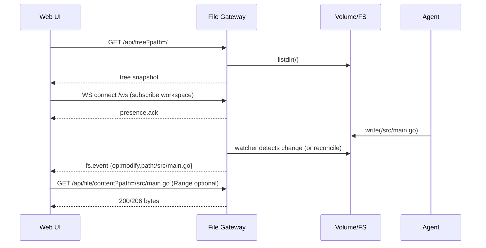

# Evaluation of ready-made open-source servers for a file tree, Range delivery, and WebSocket events in Docker and Kubernetes

## Executive summary

The request to "find a ready-made production-grade open-source server (preferably in Go/high-perf) that *simultaneously* provides a file tree, serves file contents over HTTP with Range/206, and also maintains a bidirectional WebSocket channel for events (create/modify/delete), locks, and presence" runs up against the reality of the ecosystem: **a "thin" universal sidecar server of this class in Go is almost nonexistent**. In practice, the market and open-source fall into two lines of solutions:

The first line is **full-fledged Web-IDE/remote-IDE servers** (for example, OpenVSCode Server and code-server). They "cover" the tree/editing/real-time interaction between the browser and the server via WebSockets, and this is proven in large products and at scale. But they:  
- are heavyweight (this is an entire IDE, not a file service),  
- their file access is tied to VS Code's internal protocols (not a "simple REST/Range API"),  
- "locks/presence" as a universal mechanism for editing files for many clients usually **are not included by default** (they may require a separate model/extensions). citeturn18view0turn20view0turn19view1turn28view0

The second line is **file/transfer servers in Go**, where the protocols are strong rather than the IDE: SFTP/FTP/WebDAV/HTTP(S) + ACL/virtual folders + audit/hooks. The most "mature" representative here is SFTPGo: production-grade, many protocols, REST API with JWT/API keys, events (webhook/commands) on operations. But **a WebSocket bus for "file events/locks/presence" as an out-of-the-box product is not there**, and the events cover primarily operations passing through the server itself (which does not solve your case of "agents writing directly into the volume" without an additional watcher). citeturn26view0turn3search29turn27search16turn27search3

The Rust project **monaco-vscode-server** (the link you gave) is *not* a "file server" but a **lifecycle manager for the VS Code server backend** for the `monaco-vscode-api` stack (download/start/stop, match versions). It is useful if you want to **not design your own file protocol at all** and instead "piggyback" on the VS Code server as the backend for services for Monaco. But this also means: you accept the architecture/operational nuances of the VS Code server (tokens, version compatibility, potential licensing caveats/flags, etc.). citeturn9view0turn12view0turn11view0

If **HTTP Range/206** as the standard transport (video files, tail/binary viewer, "chunked loading") is specifically critical for you — then even when choosing a Web-IDE approach it often makes sense to build **your own separate "content gateway"** on net/http with `ServeContent`, because the Go standard library explicitly describes correct handling of Range, preconditions, and related headers. citeturn15view0

---

## Evaluation criteria and what exactly usually "breaks" in real production

In your scenario (many files, many workspaces/containers, agents creating and changing files), "production readiness" is not only "can the server display the tree" but also:

Watcher reliability on large trees. On Linux, mass subscription to directories can hit inotify limits; the systems then fall back to polling/rescans, which changes latency and load. Even IDE ecosystems explicitly document this problem and recommend raising the watch-handle limit (or using a scanning fallback). citeturn21search20

Path safety and isolation. For any HTTP file serving, the following are critical: path normalization, protection against `..`, control over symbolic links, root-directory restrictions, as well as strict authentication and authorization. Notably, even the Go standard library warns: if a file name is built from user input, it must be sanitized, and separately notes that `ServeFile` rejects `..` in `r.URL.Path` as protection against an unsafe `filepath.Join`. citeturn15view0

WebSocket operations in Kubernetes. Long-lived connections require proper Upgrade support and timeouts on the proxy/ingress. Even the code-server documentation explicitly states that the environment must have WebSockets enabled, which are used for browser-to-server communication. citeturn19view1

---

## Project shortlist and comparison

Below is a shortlist that actually shows up as a "ready-made solution" and where there are enough signs of production usage. The table reflects **actual conformance** to your requirements; where there is no information in primary sources, I mark it as "needs verification".

| Project | Language/archetype | Tree/browsing | HTTP Range/206 for files | Bidirectional WS | File events (create/modify/delete) | Locks / presence | Kubernetes pattern | License | Activity/maturity signals |
|---|---|---:|---:|---:|---:|---:|---|---|---|
| OpenVSCode Server (Gitpod) | TypeScript, web-IDE server | Yes (VS Code explorer) citeturn18view0 | Not as a "simple REST file API" (internal VS Code protocols; Range is usually not the goal) | Yes; there are options for websocket compression citeturn28view0 | Yes, within VS Code logic; there is a `file-watcher-polling` flag (important for large FS) citeturn28view0 | Not as a universal mechanism for "all clients" by default | Sidecar/Deployment with a volume mount; there is an official docker run example citeturn18view0 | MIT citeturn18view0 | 5.9k⭐, 100 releases, recent release (Dec 2, 2025) citeturn18view0 |
| code-server (Coder) | TypeScript, web-IDE server | Yes (VS Code in the browser) citeturn20view0 | Not as a "simple REST file API" | Yes; it explicitly states that WebSockets are used for browser↔server communication citeturn19view1 | Yes within VS Code | Not as a universal locks/presence layer by default | Sidecar/Deployment; a WS-compatible ingress/proxy is required citeturn19view1 | MIT citeturn20view0 | 76.3k⭐; repo is active citeturn20view0 |
| monaco-vscode-server (Rust crate) + VS Code server | Rust (manager) + external VS Code server backend | Indirectly: provides backend services for Monaco via the VS Code server citeturn9view0turn12view0 | The crate itself — no (it is a manager), Range depends on your separate content service | Indirectly: uses the WS mechanics of the VS Code server | Indirectly: file events from the VS Code server | Not required | Suitable as a sidecar template, but requires managing versions/tokens/startup | MIT (crate) citeturn9view0turn12view0 | Early stage: 0.1.0, few stars/commits citeturn9view0turn12view0 |
| SFTPGo | Go, multi-protocol file transfer + Web UI + REST | Yes (Web UI / WebDAV listing / virtual folders) citeturn26view0turn27search5 | Quite possible over HTTP/WebDAV GET, but the docs do not highlight it (needs testing) citeturn27search3turn15view0 | Not stated as a core feature | There are hooks/HTTP notifications on events (upload/download/delete/rename, etc.) citeturn27search16turn3search15 | No presence; locks can be done at the level of WebDAV LOCK semantics (depends on client/server) | Fits well into a sidecar/Deployment; many helm/compose examples in the ecosystem (not always upstream) | AGPL-3.0 citeturn26view0 | 11.7k⭐, positioned as a production-ready community edition citeturn26view0 |
| File Browser (filebrowser/filebrowser) | Go+Vue, web file manager | Yes (upload/delete/preview/edit) citeturn22view0 | Rather yes (file downloads), but Range is not explicitly declared | WebSocket is used in at least some functions (there is an issue about the WS handshake) citeturn25view0 | Not positioned as a "live file events bus" | No presence/locks | A sidecar is possible, but there are security/support concerns | Apache-2.0 citeturn22view0 | "Maintenance-only mode" + many security advisories citeturn22view0turn2search28 |
| Nextcloud + notify_push + files_lock | PHP server + Rust push backend (notify_push) + lock app | Yes (WebDAV/Files UI) | Range depends on the HTTP/WebDAV layer; not a core goal | notify_push uses WebSocket (wss) citeturn5search36turn5search8 | notify_push can send file events (the "notify_file" example) citeturn5search8 | There are file locks (transactional + apps) citeturn5search37turn5search5 | As a separate service, not a "sidecar on a pod"; possible via helm/operator, but heavy | AGPL-3.0 (server) citeturn29view0 | A very mature ecosystem, but this is already a "platform", not a minimal sidecar |

The main takeaway from the table: **a "thin" Go server that covers everything (tree + Range + WS events + locks/presence) "out of the box" is not visible among widely used OSS projects**. The closest to "everything at once" are **platforms at the level of Nextcloud** (but this is a different class of solution) or the approach of "using a VS Code server/IDE server as a backend" (but then it is not a "file API server", but an IDE protocol). citeturn5search8turn18view0turn26view0

---

## Analysis of monaco-vscode-server and how well it "fits" your case

**What it is according to the primary source.** `monaco-vscode-server` is a Rust crate that "manages the VSCode server backend": downloading, starting/stopping, instance management, used by `monaco-vscode-api` to give Monaco "VSCode services". citeturn9view0turn12view0

**Exactly which "server" is meant.** The `monaco-vscode-api` documentation suggests installing the VS Code server from the official update channel or the VSCodium server, editing `product.json`, then running `./bin/code-server ... --without-connection-token --accept-server-license-terms ...` and connecting via `remoteAuthority`, after which you can open the workspace through the `vscode-remote://...` scheme. citeturn11view0

**Why this can be very advantageous specifically for Monaco.** For Monaco, a "VS Code-like" integration usually requires: file protocols, the workspace model, watchers, configs, extensions. This stack is precisely trying to bring "ready-made VS Code services" into your Monaco integration. In essence, you are buying a mature model instead of designing your own tree/event protocol. citeturn9view0turn11view0

**But there are significant "buts" for the Docker/Kubernetes sidecar case.**

Version compatibility. The `monaco-vscode-api` production notes emphasize that commit/quality must match on the client and the server, and during a gradual client upgrade you may need to keep several server versions running simultaneously and route by a call prefix. This is direct operational overhead. citeturn11view0

Token security and attack surface. In the VS Code server world, the access level is comparable to a remote IDE (often with a terminal and code execution). OpenVSCode Server explicitly provides `connection-token` and `connection-token-file`, and the code emphasizes that the token file is preferable because the secret is not exposed via `ps`, and it is recommended to store the file in a directory with `chmod 0700`. citeturn28view0

Maturity of the Rust wrapper specifically. According to docs.rs and the repository, the crate is currently at version 0.1.0 and looks early, with a small number of stars/commits. This is not a "red flag," but for production embedding you need to plan your own hardening: healthchecks, restarts, version pinning, mirroring of binaries/artifacts, and so on. citeturn9view0turn12view0

**Conclusion on fit.** If your goal is to quickly get a "VS Code-like backend" for Monaco and you are willing to accept IDE-level complexity, then `monaco-vscode-server` *may be* a reasonable accelerator (especially for Node watcher problems: you move to an ecosystem where polling and watcher parameters are already provided as server options). citeturn28view0turn9view0  
If, however, you need a **clear minimal file API** (tree + Range + WS events + locks/presence) as an infrastructure component on a volume, this crate *by itself* does not solve the task: it does not provide a file API, it launches a VS Code server, which solves the task differently (via the IDE protocol). citeturn9view0turn11view0

---

## Recommendations and practical integration patterns for Kubernetes

### Recommended selection strategy

If the priority is **reliability and speed of adoption** (and you are ready for an IDE-level solution), then the pragmatic choice is usually as follows:

- For an "IDE-like experience" (including a file explorer, editing, a stable WS connection): **OpenVSCode Server** as the more "upstream-oriented" part of the ecosystem, with explicit `file-watcher-polling` and `connection-token(-file)` options and an active release life. citeturn18view0turn28view0  
- If you already live in the Coder/remote IDE stack: **code-server**, but observe the security requirements (authentication/encryption + a correct WS proxy). The documentation explicitly warns against publishing the service without auth+TLS, otherwise the machine can be taken over through the terminal. citeturn19view1turn20view0

If the priority is a **minimal sidecar "as a file service"** (rather than an IDE), then there is almost no ready-made "all-in-one" OSS, and in reality people build a composition:

- Your own **File API gateway** (Go/Rust):  
  - HTTP `GET` with Range/206 via `net/http ServeContent` (Range behavior is explicitly documented),  
  - a WebSocket event channel (create/modify/delete) + lock/presence as a separate model (Redis/etcd),  
  - a watcher on the volume based on fsnotify/notify + fallback scanning under inotify limits. citeturn15view0turn3search30turn21search20  
- When "ready-made" ACL/virtual folders/audit are needed, people add SFTPGo as a protocols component, but a watcher is still needed for "changes bypassing the server" (your agents). citeturn26view0turn27search16

### Sidecar pattern per pod

Logic: your agent container writes files to a shared volume (usually `emptyDir` or a PVC). The "file-gateway" sidecar mounts the same volume (read-write) and serves the tree/content/events to the outside.

```yaml
apiVersion: apps/v1
kind: Deployment
metadata:
  name: agent-workspace
spec:
  replicas: 1
  selector:
    matchLabels:
      app: agent-workspace
  template:
    metadata:
      labels:
        app: agent-workspace
    spec:
      volumes:
        - name: workspace
          emptyDir: {}
      containers:
        - name: agent
          image: your-agent-image:latest
          volumeMounts:
            - name: workspace
              mountPath: /workspace
        - name: file-gateway
          image: your-file-gateway:latest
          ports:
            - containerPort: 8080
          env:
            - name: ROOT
              value: /workspace
          volumeMounts:
            - name: workspace
              mountPath: /workspace
---
apiVersion: v1
kind: Service
metadata:
  name: agent-workspace-files
spec:
  selector:
    app: agent-workspace
  ports:
    - name: http
      port: 80
      targetPort: 8080
```
citeturn5search35

Where this pattern wins: a simple security model (the volume is "inside the pod"), simple "pod = workspace" scaling, less risk of accidentally exposing a hostPath to everyone.

### DaemonSet pattern per node

A DaemonSet is appropriate if you want one "observer/file gateway" per node and map workspaces into it via hostPath (for example, when the orchestrator places artifacts into `/var/lib/workspaces/<id>`). This improves watcher efficiency (one process per node) but sharply complicates multi-tenant security (ACL, path traversal, symlink attacks, API-level RBAC).

---

## Migrating from the unstable Node watcher and what to test first

### Migration steps

The "make it more reliable without rewriting everything at once" step usually looks like this:

Stabilize the event contract. Fix a single JSON event format (create/modify/delete, version/etag, actor=agent/ui, optional diff-hints). This will let you change the watcher implementation without rewriting the frontend.

Introduce a “dual source of truth” for events. A watcher alone is not enough: with churn/limits/VFS quirks you will lose events. So you need a periodic reconcile mechanism: for example, every N seconds recompute the directory snapshot and compare hashes/mtime+size. In practice this is unavoidable, because even rich IDE stacks have polling watcher options. citeturn28view0turn21search20

Check and tune inotify limits. For large trees, test: number of directories, number of watch handles, behavior when the limit is reached. In the IDE ecosystem this is a directly known cause of falling back to scanning, and the recommended remedy is to raise the limit (sometimes by an order of magnitude). citeturn21search20

### Minimal “reference” protocol architecture

If you are building your own file gateway, Range/206 can be done “correctly and quickly” by relying on the Go standard library: `ServeContent` explicitly describes support for Range requests, MIME, If-Match/If-Range, etc. citeturn15view0

Pseudo-API (REST):

- `GET /api/tree?path=/` → tree (pagination/limit, sorting, includeHidden)  
- `GET /api/file?path=/foo.txt` → metadata + text preview  
- `GET /api/file/content?path=/big.bin` → **stream** (Range)  
- `PUT /api/file?path=/foo.txt` → write (atomic write, etag/if-match)  
- `POST /api/lock` / `DELETE /api/lock` → locks (redis/etcd)  
- `GET /ws` → events + presence (client sends heartbeat)

WS message schema (example):

```json
// server -> client
{
  "type": "fs.event",
  "ts": "2026-02-20T12:34:56.789Z",
  "workspaceId": "w-123",
  "path": "/src/main.go",
  "op": "modify",
  "meta": { "size": 1842, "mtimeMs": 1739997296789 }
}

// client -> server
{
  "type": "presence.hello",
  "workspaceId": "w-123",
  "clientId": "ui-abc",
  "capabilities": ["tree", "range", "locks"]
}
```

---

## Flow diagrams

Below are two mermaid diagrams for a typical sidecar file gateway.

```mermaid
flowchart LR
  UI[Web UI + Monaco] <-- HTTP (tree/content) --> GW[File Gateway (sidecar)]
  UI <-- WebSocket (events/locks/presence) --> GW
  GW <-- fs events / polling --> FS[(Shared Volume)]
  Agent[Agent in container] --> FS
```



---

## Security considerations that follow directly from the sources

Three “hard” points that should be treated as mandatory requirements:

Do not expose an IDE-level service without auth+TLS. The code-server documentation explicitly states: do not expose it directly to the internet without authentication and encryption, otherwise takeover via the terminal is possible. citeturn19view1

Token secrets — only via secure channels/files. OpenVSCode Server has a `connection-token-file`, and the code emphasizes: this reduces the risk of leakage through the process list (`ps`), plus it is recommended to store the token in a directory readable only by the owner (example with `chmod 0700`). citeturn28view0

Path traversal and path normalization. Even the standard `net/http ServeFile` provides partial protection against `..` in `r.URL.Path`, but when designing your own file gateway you still need to sanitize user input, especially if the path is built from request parameters. citeturn15view0

Separately: if you consider File Browser as a ready-made foundation, it is important to note that the project is officially in maintenance-only mode, and also has a significant trail of security advisories in the Go vulnerability database. This does not “forbid” its use, but raises the cost of ownership and the risk for a component you want to make infrastructural. citeturn22view0turn2search28

---

## Effort estimate

Below is a rough effort estimate (low/medium/high) tied to the chosen trajectory.

Use a ready-made IDE server (OpenVSCode Server / code-server) as a sidecar and simply mount the workspace volume: **low–medium**. The main risk is security (tokens, ingress with WS), resources, and the fact that it is “an IDE instead of a file API”. citeturn18view0turn19view1turn28view0

Monaco + `monaco-vscode-api` + VS Code server (via `monaco-vscode-server`): **medium**. You save on designing Monaco file services, but pay with version/compatibility complexity and the maturity of the wrapper (0.1.0). citeturn11view0turn9view0turn12view0

Your own file gateway (tree + Range/206 + WS events + locks/presence) in Go/Rust as a minimal sidecar: **high**. Technically this is solvable and relies on strong primitives (`ServeContent` for Range), but the “prod” cost is watcher reliability, reconcile, path security, lock model, and a test matrix across FS and load. citeturn15view0turn21search20turn3search30