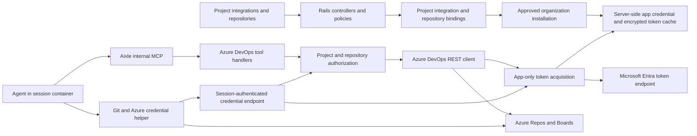

# Azure DevOps integration — technical design

**Status:** Proposed; core release under implementation.  
**Date:** 2026-09-11 (revised after a code/API review — see §7 credential-endpoint authentication, §6.2 `Repository` changes, §1 MSA boundary)  
**Code baseline:** `f9521f19`  
**Audience:** Backend, frontend, and runtime engineers implementing the integration.

## 1. Decision and intended behavior

Add `azure_devops` as a separate, project-scoped integration alongside GitHub and GitLab. A user connects an Azure DevOps organization, selects an Azure project, attaches repositories, and gives agents tools for pull requests, discussions, and Azure Boards work items. Agents clone code into their existing session containers and push changes through authenticated Git.

Use the existing Rails integration and repository models, encrypted credential infrastructure, and internal `aixle-tools` MCP server. Implement Azure DevOps REST clients in Rails. **Service principal with Microsoft Entra client credentials is the default production authentication mode**, as selected on 2026-09-11. Use one operator-owned multi-tenant app registration per Aixle deployment, a tenant-local service principal in each participating Entra tenant, and an explicit access grant in each Azure DevOps organization. Allow an organization-scoped personal access token (PAT) as an optional pilot/fallback mode. Both modes use the same repository and tool services. Delegated user OAuth is outside the core release.

The target includes the development workflow described below. “GitHub parity” means equivalent user outcomes, with Azure-specific objects and permissions; it does not imply that every GitHub operation currently has a built-in Aixle tool.

| User outcome                            | Azure DevOps equivalent                                                    | Delivery         |
| --------------------------------------- | -------------------------------------------------------------------------- | ---------------- |
| Connect a code host separately          | `azure_devops` integration with organization, project, and acting identity | Core release     |
| Select repositories and branches        | Azure Repos Git discovery and project repository picker                    | Core release     |
| Clone, inspect, commit, fetch, and push | Existing session workspace plus Azure Git credential helper                | Core release     |
| Open and inspect PRs                    | Pull requests, source/target refs, draft state, changes, linked work items | Core release     |
| Read and answer review comments         | PR threads and their comments, including inline locations                  | Core release     |
| Read and manage issues                  | Azure Boards work items, queries, comments, fields, and relations          | Core release     |
| Link a fix to its task                  | PR ↔ work item artifact relation                                           | Core release     |
| Complete a PR or configure reviewers    | PR completion, reviewer identities/votes, branch policy evaluation         | Parity extension |
| Wait for CI and react to changes        | Azure Pipelines builds, Service Hooks, Aixle gates/triggers                | Parity extension |

Initial support is **Azure DevOps Services on `dev.azure.com`, using Git repositories**. Azure DevOps Server/on-premises, TFVC, Artifacts, Test Plans, Wiki management, and full Boards synchronization require separate scope. They must not appear as supported features in the first release. This cloud boundary also matters for authentication: Microsoft's Entra/OAuth guidance distinguishes Services from Server. [Microsoft authentication guidance](https://learn.microsoft.com/en-us/azure/devops/integrate/get-started/authentication/authentication-guidance?view=azure-devops).

A second boundary is the organization's identity backing. A service principal can only be added to an Azure DevOps organization from **the Microsoft Entra tenant that organization is connected to**; an organization still backed by a personal Microsoft account (MSA) has no such tenant and cannot be onboarded in service-principal mode at all. For those organizations PAT mode is not a preference but the only available path, and the connection UI must say so rather than reporting a generic setup failure. [Service principals and managed identities](https://learn.microsoft.com/en-us/azure/devops/integrate/get-started/authentication/service-principal-managed-identity?view=azure-devops).

## 2. Existing code and required changes

The design follows inspected application code. Older architecture documents are supporting context; they are not the source of truth for the current tool registry.

| Existing component                                                                                                        | Observed behavior                                                                                                            | Azure change                                                                                                    |
| ------------------------------------------------------------------------------------------------------------------------- | ---------------------------------------------------------------------------------------------------------------------------- | --------------------------------------------------------------------------------------------------------------- |
| [Integration](../../app/models/integration.rb)                                                                            | Provider enum; encrypted `credentials_data`; project/company visibility; deleting an integration deletes its repository rows | Add provider; require a project for Azure; add connection lifecycle and exact credential binding                |
| [Repository](../../app/models/repository.rb)                                                                              | `CODE_HOST_PROVIDERS = %w[github gitlab]` gates `integration_hosts_code`; `set_clone_url` derives the URL from `full_name` for those two providers only; one global `full_name` format that admits neither `:` nor a space; `repo_name`/`owner_name` split `full_name` on `/` | Widen the code-host allowlist, make `set_clone_url` and the `full_name` format provider-aware, add Azure identity fields and trusted URL resolution |
| [RepositoryService](../../app/services/repository_service.rb)                                                             | Dispatches GitHub/GitLab repository adapters                                                                                 | Add `AzureDevops::RepositoryService`                                                                            |
| [RepositoriesController](../../app/controllers/web/company/projects/repositories_controller.rb)                           | Picker filters GitHub/GitLab; create accepts `full_name` and `integration_id`                                                | Add Azure discovery and attach-by-external-ID; resolve against the current project's integrations               |
| [SessionContextService](../../app/services/session_context_service.rb)                                                    | Clones by provider, using `/workspace/repo/<repo_name>`; authenticated GitHub/GitLab URLs contain credentials                | Add Azure credential helper and shared workspace-path resolution                                                |
| [ContextBuilders::Resources](../../app/services/context_builders/resources.rb)                                            | Reports clone paths by reconstructing `repo_name`                                                                            | Read the exact path selected during provisioning                                                                |
| [Tools::CallExecutor](../../app/services/tools/call_executor.rb)                                                          | Rewrites **every** argument named `repository_id` into `REPO`, `GITHUB_TOKEN`, and `BRANCH`; rejects other providers         | Remove this implicit transformation for native Azure handlers; preserve the existing GitHub contract explicitly |
| [Tools::DefinitionDSL](../../app/services/tools/definition_dsl.rb), [Definition](../../app/services/tools/definition.rb)  | Code-defined internal tools become app-mode tools through reconciliation                                                     | Add typed Azure handlers with integration requirements and accurate MCP annotations                             |
| [OauthCredential](../../app/models/oauth_credential.rb), [Oauth::TokenService](../../app/services/oauth/token_service.rb) | Delegated token sets and refresh-token grant; generic lookup selects by owner/provider                                       | Keep these flows separate; implement app-only token acquisition with installation-bound encrypted caching       |
| [IntegrationData](../../app/models/integration_data.rb)                                                                   | Per-integration JSON state with optional expiry                                                                              | Use for non-secret operation/cursor state; app-only access tokens need an encrypted installation cache          |
| [IntegrationResource](../../app/resources/integration_resource.rb)                                                        | Exposes the entire `settings` object to the browser                                                                          | Keep only non-secret settings; serialize explicit Azure connection status/capabilities                          |
| [Gate](../../app/models/gate.rb), [webhooks](../../app/controllers/webhooks/github_controller.rb)                         | Existing CI waits and provider event receivers                                                                               | Add Azure-specific types and receivers in the parity extension                                                  |

Three changes are prerequisites, not follow-up cleanup:

1. A repository ID must not automatically imply GitHub authentication.
2. Azure project/repository names may contain spaces; IDs and display names must be separate. Never construct Azure API identity by splitting `full_name`. This is also a storage problem, not only an API one: `Repository`'s current format validation is `\A[a-zA-Z0-9._-]+(/[a-zA-Z0-9._-]+)+\z`, which rejects a space as firmly as it rejects the `:` discriminator, and `owner_name` would read back `azure_devops:<org>` for an Azure row. Every reader of `owner_name`/`repo_name` must be provider-aware or Azure-guarded before those columns carry Azure values.
3. Two repositories named `api`, including repositories on different hosts, must not overwrite the same workspace directory.

## 3. Connection and user experience

### 3.1 Connection boundary

One integration represents:

```text
Aixle company + approved AzureDevopsInstallation
  → one Azure organization and tenant-local service principal
  → one Aixle project Integration
  → one selected Azure project
```

Multiple integrations can exist in one Aixle project. Connecting another Azure project creates another integration referencing the approved organization installation; it does not require another Entra app registration. The selected Azure project is immutable after activation; changing it creates a new connection so existing repository and work-item references cannot silently switch targets.

The default connection uses the **application's service principal**: authorized project sessions create PRs/comments as that application identity. `connected_by` records the Aixle user who attached it, not the Azure acting identity. PAT mode acts as the PAT owner and must be labeled separately. Project agents share the permissions of the selected connection; an employee leaving Aixle does not itself revoke the application's Azure identity.

### 3.2 Connection flow

1. Project owner/admin selects **Azure DevOps** in Project → Integrations. Apply the existing [IntegrationsPolicy](../../app/policies/web/company/projects/integrations_policy.rb).
2. Select an organization installation already approved for the current Aixle company. For first-time setup, enter the organization URL and tenant ID to start the admin onboarding in §5.2; an arbitrary organization URL never grants access through the shared app.
3. The default **Service principal** mode uses the application's server-side credential. No personal Microsoft sign-in, authorization-code callback, or refresh token is required for runtime authentication. Optional PAT mode has an explicit token form.
4. Rails obtains an app-only access token, verifies the installation's Azure access, and lists only the Azure projects allowed by both its approved project list and Azure permissions. Select one project. Verify a browser-supplied project ID before activation.
5. Save the organization/project IDs, display names, acting identity, auth mode, and observed capabilities. A successful token exchange alone does not mean the selected project is accessible.
6. In Repositories, select this integration, then a repository and source branch. Resolve repository details server-side before saving. Show organization/project labels to distinguish duplicate names.
7. The integration card shows **Service principal**, the bot identity and organization, and offers **Test connection**, **Repair connection**, and **Disconnect**. PAT mode additionally offers **Replace token**. App certificate/secret rotation is an installation/operator operation, not a per-project user login.

Use Mantine components, Inertia props through Alba resources, generated TypeScript types, and the existing permission hooks. Repair retains the integration ID and repository attachments. Failed credential rotation must not replace a working credential version. PAT values are cleared from form state after submission and are never returned in props.

## 4. Architecture



Proposed components:

| Component                                     | Responsibility                                                                                        |
| --------------------------------------------- | ----------------------------------------------------------------------------------------------------- |
| `AzureDevops::IntegrationService`             | Attach an approved installation, verify selected project, repair, disconnect                          |
| `AzureDevops::InstallationService`            | Bind Azure admin-approved organization/project access to the correct Aixle company                    |
| `AzureDevops::AppTokenService`                | Client-credentials token acquisition, encrypted cache, renewal and credential rotation                |
| `AzureDevops::CredentialProvider`             | Resolve the exact integration/installation or PAT; return auth material and expiry to trusted callers |
| `AzureDevops::Client`                         | Fixed service hosts, request construction, endpoint versions, bounded pagination, sanitized errors    |
| `AzureDevops::RepositoryService`              | Projects during setup; repositories/refs within the selected project; verified attachment             |
| `AzureDevops::PullRequestService`             | PRs, changes, threads/comments, links; later reviewers/completion                                     |
| `AzureDevops::WorkItemService`                | Structured queries, work item fields, comments, process metadata, updates                             |
| `InternalTools::Concerns::AzureDevopsContext` | Resolve and authorize integration/repository targets on every tool call                               |
| `AzureDevops::GitCredentialService`           | Provision and refresh authentication for Git network commands                                         |
| `AzureDevops::GitSessionKey`                  | Derived per-session bearer for the credential endpoint, in the shape of `CloudAuth::SessionKey`       |
| `RepositoryWorkspacePath`                     | One deterministic workspace path used by provisioning, context, and tools                             |

The adapter is deliberately small. Do not introduce a universal issue/PR domain model or rewrite the GitHub/GitLab service layers as a prerequisite. Keep Azure-specific semantics visible in the Azure service classes.

### 4.1 Why native tools instead of only connecting Microsoft's MCP server

Microsoft maintains Azure DevOps MCP as a hosted remote server at `https://mcp.dev.azure.com/{organization}` plus a local implementation; Microsoft's own guidance is "choose remote first", and only its Enterprise Live Migration toolset is marked preview. It is a useful alternative for evaluating tools. [Official Azure DevOps MCP repository](https://github.com/microsoft/azure-devops-mcp).

The remote service uses a separate OAuth resource (`2a72489c-aab2-4b65-b93a-a91edccf33b8`); a REST API token is not automatically an MCP token. Its Entra flow requires compatible client registration rather than dynamic client registration. Aixle's generic MCP discovery path therefore needs explicit compatibility work before it can promise one-click connection to this server. [Remote MCP setup](https://learn.microsoft.com/en-us/azure/devops/mcp-server/remote-mcp-server?view=azure-devops).

For this feature, Aixle also needs repository attachment, session cloning, selected-project authorization, credential lifecycle, and later event routing. Merely adding an MCP catalog entry does not implement those behaviors. Native Rails handlers give these operations the same integration identity and authorization rules. An optional official MCP connection can be evaluated later, with separate authentication and an explicit access model; do not expose overlapping native and remote tools by default.

## 5. Authentication and credential lifecycle

### 5.1 One application, explicit installations

The default deployment uses one operator-owned **multi-tenant** Entra app registration. Its client ID and server-side certificate configuration are set up once per Aixle deployment/trust boundary, not once per Aixle company, Azure project, or repository. Each customer Entra tenant has its own enterprise application/service principal referring to that client ID. The customer does not receive Aixle's private key or create a replacement app registration. [Entra application/service-principal model](https://learn.microsoft.com/en-us/entra/identity-platform/app-objects-and-service-principals).

| Level                     | Repeated setup                                                                                                  |
| ------------------------- | --------------------------------------------------------------------------------------------------------------- |
| Aixle deployment          | Register the app once; configure client ID, certificate/secret reference, and rotation                          |
| Customer Entra tenant     | Provision one local service principal for the shared app                                                        |
| Azure DevOps organization | Explicitly add that tenant-local principal and assign access level and permissions                              |
| Azure project/repository  | Assign resource permissions and create Aixle integration/repository attachments; no new app registration        |
| Aixle company/namespace   | Record an approved binding to the appropriate Azure organization; never assume a company equals an Entra tenant |

For example, `acme-web` and `acme-mobile` in one Azure organization share its installed principal. Two organizations in the same tenant can reuse that principal, but each needs explicit Azure DevOps onboarding. A second customer's tenant has a different principal object ID for the same global app/client ID. These are separate local authorization records even when the central app registration is shared.

This resembles registering a GitHub App once and installing it in organizations. Azure adds an Entra tenant provisioning step and separate Azure DevOps onboarding; it is not an identical installation API or token boundary. A single-tenant registration is sufficient for a deployment serving only its home tenant. Customer-owned registrations remain an optional future isolation mode rather than the default requirement.

### 5.2 Administrator onboarding and company ownership

Core-release onboarding is an explicit operator-assisted setup:

1. The operator registers the Aixle multi-tenant app and publishes its client ID. The production credential is a server-held certificate; a client secret is an optional setup/pilot alternative, also held only on the server.
2. A customer Entra administrator creates the enterprise application/service principal from that published client ID in the organization's tenant. This can be done through supported administrator tooling; a new app registration is unnecessary. [Cross-tenant enterprise application setup](https://learn.microsoft.com/en-us/entra/identity/enterprise-apps/create-service-principal-cross-tenant).
3. An authorized Azure DevOps administrator adds the **customer tenant's own service principal** to each required Azure DevOps organization. Three identifiers are easy to confuse and only two of them work: the portal's Organization settings → Users → Add users form matches on the principal's **display name**; the [ServicePrincipalEntitlements REST API](https://learn.microsoft.com/en-us/rest/api/azure/devops/memberentitlementmanagement/service-principal-entitlements?view=azure-devops-rest-7.1) — the automatable route, and the one to prefer for scripted onboarding — takes the **object ID shown on the Enterprise applications pane**, which is *not* the app registration's object ID. Assign the appropriate access level and selected project/repository permissions. Repository access requires at least Basic — a Stakeholder license produces "the Git repository with name or identifier does not exist or you do not have permissions" — and access levels/licensing apply per organization with no multi-organization discount. [Azure DevOps service principal onboarding](https://learn.microsoft.com/en-us/azure/devops/integrate/get-started/authentication/service-principal-managed-identity?view=azure-devops).
4. The Aixle operator verifies the customer administrator's authorization through the established onboarding process and provisions an `AzureDevopsInstallation` binding the exact Aixle company, tenant, organization, principal, and approved project IDs. Record the approving operator and verification time. A project administrator cannot create or widen this binding just by submitting IDs.
5. The installation service verifies application access against the approved organization. Only then can project owners discover/attach its approved Azure projects and repositories. Additional Azure projects require an approved binding update and appropriate Azure permissions.

A successful app-only API call proves that **the application** can access an organization; it does not prove that the requesting Aixle company owns that access. Knowing a tenant ID, organization URL, or client ID is never proof of authority. Check the approved company binding before discovery, attachment, tool execution, or Git credential issuance. Refuse reuse of a cache entry as a substitute for this authorization.

Self-service onboarding may be added later with authenticated organization-authority verification. Entra admin consent/provisioning alone does not grant Azure DevOps resource permissions. If an admin-consent callback is used, its returned `tenant` field is not authenticated ownership proof; Microsoft explicitly warns against using it to authorize users. [Admin-consent callback security](https://learn.microsoft.com/en-us/entra/identity-platform/v2-admin-consent). The default app-only runtime does not need a user consent callback or changes to `Oauth::State`.

### 5.3 App-only token acquisition

Use a tenant-specific Entra token endpoint:

```text
POST https://login.microsoftonline.com/{customer_tenant_id}/oauth2/v2.0/token
Content-Type: application/x-www-form-urlencoded

grant_type=client_credentials
client_id=<configured Aixle application ID>
scope=https://app.vssps.visualstudio.com/.default
client_assertion_type=urn:ietf:params:oauth:client-assertion-type:jwt-bearer
client_assertion=<short-lived assertion signed with the configured app certificate>
```

Client-secret mode supplies `client_secret` instead of the assertion fields. Prefer a maintained compatible identity library where available; verify assertion audience/signing, request encoding, and returned expiry in the live spike. Use a validated customer tenant GUID, never a caller-controlled token URL or `/common`. Do not include the Azure organization/project in the OAuth scope.

The scope value looks like a legacy ADAL resource and is not one: `https://app.vssps.visualstudio.com/.default` is exactly what Microsoft's service-principal documentation shows for this flow, and `499b84ac-1321-427f-aa17-267ca6975798/.default` — the Azure DevOps application ID — is the equivalent spelling used in the same page's cross-tenant sample and in `az account get-access-token --resource`. Either is correct; keep this note so neither gets "corrected" into a broken third form.

There is **no refresh token** in this flow. Microsoft Entra access tokens for this resource expire in about an hour, which is what makes renewal a hot path rather than a rare event: a session that lives longer than a token will reacquire mid-run, and §7's Git credential path must be built for that rather than for a one-shot credential. When an access token is close to expiry, acquire a new one using the app credential. Do not request `offline_access`, use PKCE/authorization-code exchange, or issue a `refresh_token` grant for this mode. Azure API requests use the resulting bearer token. [Client credentials protocol](https://learn.microsoft.com/en-us/entra/identity-platform/v2-oauth2-client-creds-grant-flow).

Use the Azure DevOps REST resource, not Microsoft Graph or the remote MCP resource. Azure DevOps authorizes the principal through its own ACLs; do not configure delegated `vso.*` scopes as Entra application permissions or require a `roles` claim as proof that an app-only Azure token is valid. The token provider authenticates the app; Azure determines resource access on the actual operation.

### 5.4 Capabilities and permissions

Aixle capability names define which operations an integration enables. They are separate from Azure DevOps ACLs and from the token request's `.default` scope.

| Aixle capability                                    | Azure permission area to configure/test                             | First release              |
| --------------------------------------------------- | ------------------------------------------------------------------- | -------------------------- |
| `repositories.read`                                 | Project visibility and repository Read                              | Required                   |
| `repositories.write`                                | Repository/branch Contribute and Create branch as needed            | Required for fixes         |
| `pull_requests.write`, `pull_request_threads.write` | Contribute to pull requests and relevant repository access          | Required for PRs/replies   |
| `work_items.read`                                   | View work items in approved area paths                              | Required for task context  |
| `work_items.write`                                  | Edit work items in approved area paths and applicable process rules | Enabled for task mutations |
| `builds.read`                                       | View builds and required definition/project access                  | Parity extension           |

Do not give the bot project-collection administration, policy bypass, or force-push permission as part of default onboarding. Test the required positive permissions against real Azure resources. In PAT mode, the user's PAT categories and Azure permissions apply; this is explicitly a different identity mode. PAT tokens are opaque values without a fixed-length assumption and require manual replacement after expiry/revocation. [PAT authentication](https://learn.microsoft.com/en-us/azure/devops/integrate/get-started/authentication/pats).

Separate the connection's enabled operation profile from observed Azure permissions. Observed capability state is `available`, `denied`, or `unknown`, with a timestamp and target scope (project, repository, branch, or area path where applicable). Read probes can prove read access, but must not claim that PR creation or Git push is authorized. Do not create dummy PRs/issues during setup to probe writes.

An `unknown` capability permits an otherwise authorized operation when that operation is enabled for the connection; the actual Azure response establishes its observed result. A `denied` observation is a recheckable diagnostic, not a permanent provider-wide prohibition. Do not retry the same forbidden mutation automatically, and do not let a 403 on one repository/area path disable unrelated targets. Disabled operations in Aixle's profile are rejected before any Azure request.

### 5.5 Credential storage, renewal, and rotation

- The default app certificate/private key or client secret resides once in trusted operator configuration/secret storage, referenced through `Settings.azure_devops.app.*`. It is not copied into integration rows, customer browsers, session containers, tool arguments, or Temporal payloads. Shared credential compromise affects every authorized installation of that app; separate deployments/registrations can provide stronger isolation when required.
- An `AzureDevopsInstallation` references the trusted app configuration and stores an **encrypted** cached access token with `token_expires_at` and a credential-generation marker. Cache identity includes installation/company, app configuration/client ID, tenant, resource, and credential generation. The installation itself carries the verified organization/principal binding; never find a token using only `provider` or `client_id`.
- `AzureDevops::AppTokenService` checks the calling integration and installation state, then renews under a lock when the cache is near expiry. Use returned expiry with a small safety window. Bound token endpoint timeouts and retry transient failures without overwriting a still-usable cached token.
- A 401 can invalidate that cached token and trigger one new client-credentials acquisition followed by one safe retry. Recheck binding/status and credential generation under the lock before storing/returning a token; a racing disconnect/rotation must not be undone.
- Invalid/expired certificate or client secret produces `credential_action_required` for the operator. A missing/disabled principal, organization membership, access level, or permission produces an installation/access diagnostic. Do not direct a user to sign in again for app-only failures.
- Rotate certificates/secrets centrally with a new credential generation, validate it against an approved installation, and invalidate old-generation token cache entries. Maintain an overlap window where supported before retiring the old credential. Project integrations retain their IDs and repository attachments.
- Existing `OauthCredential` and `Oauth::TokenService.fresh` implement delegated refresh-token behavior and are **not** used as the Azure app-only token store/provider. No OAuth credential association/index or refresh-sweep change is required for the core service-principal flow.
- PAT mode stores the PAT through `Integration#credentials_data=` and resolves it only for that integration. `IntegrationData` holds non-secret cursors, operation keys, and permission observations, never plaintext tokens or app credentials.

Managed identity/workload federation and customer-owned app registrations are optional follow-ups. Delegated user OAuth would be a separate identity mode if added later, with its own consent, encrypted refresh-token storage, and author attribution. Neither is needed for the default service-principal release.

## 6. Data model and repository identity

### 6.1 Installation and project integration

Add `AzureDevopsInstallation` as the approved company-to-organization binding for service-principal mode. It is not a company-wide `Integration` and does not automatically expose tools or repositories to every project.

| Field group       | Proposed columns / rules                                                                                                                   |
| ----------------- | ------------------------------------------------------------------------------------------------------------------------------------------ |
| Ownership         | `company_id`, `approved_by_id`, `approved_at`; approval comes from operator onboarding                                                     |
| Azure identity    | `tenant_id`, `client_id`, `service_principal_object_id`, verified `organization_id`, `organization_slug`; IDs are immutable after approval |
| Approved scope    | `allowed_project_ids` as validated Azure project GUIDs; empty means no projects, never unrestricted                                        |
| App configuration | `app_config_key`, resolving only to trusted operator settings; users cannot submit an arbitrary credential reference                       |
| Token cache       | `encrypted_access_token`, `token_expires_at`, `token_credential_generation`, `token_resource`; use existing encryption conventions/key configuration. The resource is a column rather than an implicit constant so a cache entry can never be reused across a scope change |
| Lifecycle         | `status` (`inactive`, `active`, `error`), sanitized `error_code`, `last_verified_at`                                                       |

Add a unique key on `(company_id, organization_id, tenant_id, service_principal_object_id)` and indexes for company lookup and token expiry. Enforce matching app/client/tenant configuration and forbid changing ownership or Azure identity while project integrations reference the row. Cache expiry does not itself mean an installation is disconnected; a token can be reacquired on demand.

Keep `Integration` as the project connection record, with provider `azure_devops` and mandatory `company_id`, `project_id`, and `connected_by_id`. Add nullable FK `azure_devops_installation_id`, required in service-principal mode and absent in PAT mode. Validate identical company ownership and that the selected Azure project remains in the installation's approved scope. Multiple project integrations can reference one installation. Deleting an installation with referencing integrations is restricted; disable it first and detach deliberately.

Proposed non-secret `settings` (installation identity fields are serialized from the authoritative installation rather than trusted as independently editable copies):

```json
{
  "auth_mode": "service_principal",
  "organization_slug": "acme",
  "organization_id": "<verified organization ID>",
  "azure_project_id": "<project GUID>",
  "azure_project_name": "Customer Platform",
  "tenant_id": "<customer tenant GUID>",
  "client_id": "<Aixle app/client ID>",
  "service_principal_object_id": "<customer tenant enterprise application object ID>",
  "identity_id": "<Azure identity ID>",
  "identity_display_name": "Aixle",
  "enabled_capabilities": [
    "repositories.read",
    "repositories.write",
    "pull_requests.write",
    "pull_request_threads.write",
    "work_items.read",
    "work_items.write"
  ],
  "capabilities": {},
  "last_verified_at": "2026-09-11T10:00:00Z"
}
```

Tenant/app identity fields are absent when not applicable in PAT mode. Tokens, app secrets/private keys, authorization headers, webhook passwords, and raw provider errors never belong in `settings`. Maintain existing integration statuses (`inactive`, `active`, `error`) and expose installation/capability diagnostics separately. Missing Boards write permission should not disable a functioning repository connection.

### 6.2 Repository

Add nullable `external_id`, `external_project_id`, and `external_organization_id` string columns to `repositories`; require verified Azure repository, project, and organization IDs for Azure-backed rows. Keep `full_name` as a display value, for example `azure_devops:acme/Customer Platform/api`. The colon discriminator is reserved for Azure and is invalid under the existing GitHub/GitLab name validation; a slash-only prefix would collide with legitimate nested GitLab groups. Source identity is the verified organization ID + project GUID + repository GUID.

Four concrete `Repository` changes follow, and none of them are optional — each one is a hard save failure on an Azure row today:

| Existing rule | Why an Azure row fails | Change |
| ------------- | ---------------------- | ------ |
| `CODE_HOST_PROVIDERS = %w[github gitlab]`, enforced by `integration_hosts_code` | Any Azure-backed row is rejected with "must be a GitHub or GitLab integration" | Add `azure_devops` to the code-host list |
| `set_clone_url` maps provider → host for github/gitlab only | `clone_url` stays blank and trips its own presence validation | Extend to Azure, building the encoded `dev.azure.com/{org}/{project}/_git/{repo}` URL from verified IDs — or require the caller to supply a provider-verified URL |
| `full_name` format `\A[a-zA-Z0-9._-]+(/[a-zA-Z0-9._-]+)+\z` | Rejects both the `:` discriminator and any space in an Azure project or repository name | Make the format conditional on provider; keep the existing expression verbatim for every non-Azure row |
| `repo_name` / `owner_name` split `full_name` on `/` | `owner_name` returns `azure_devops:<org>`, a value no caller expects | Leave the methods alone, and confirm every reader is Azure-guarded. `owner_matches_installation_account` already is (`if integration.github?`); the workspace path stops depending on `repo_name` per §6.3 |

Keep the existing `full_name` uniqueness index and `Repository.project_ids_for` working for the other providers — Azure rows simply must not be routed through them.

Allow one attachment of a physical Azure repository per Aixle project, even when several integrations can access it. Add a partial unique index on `(scope_type, scope_id, external_organization_id, external_project_id, external_id)` for Azure identity-bearing rows. A second attachment through another connection returns the existing repository and explains the duplicate; it must not silently rebind credentials. The same Azure repository can still be attached in different Aixle projects. Keep the existing scope/full-name index for compatibility and reconcile Azure display-name changes before updating it. If cross-provider display identity is generalized later, migrate that index explicitly rather than silently removing uniqueness protection.

Repository creation accepts an integration ID and external repository ID, then fetches the repository from Azure. Validate that:

1. The integration belongs to the current company and **exact** Aixle project, is Azure-backed, and is active.
2. The returned repository belongs to the selected Azure project and organization, and that project remains in the approved installation scope for service-principal mode.
3. Branch selection is valid; `defaultBranch` may be missing for an empty repository. Report an empty repository instead of inventing a cloneable `main` branch.
4. `clone_url`, names, privacy, and IDs come from verified provider data, not client-submitted metadata.

Normalize clone URLs to credential-free HTTPS on `dev.azure.com`, with organization/project/repository path components encoded separately. Validate provider-returned URLs too. Reject custom hosts, embedded credentials, query strings, fragments, and cross-organization redirects. A legacy `*.visualstudio.com` URL requires deliberate normalization and verification before support.

Use GUIDs for API calls so project/repository renames do not change identity. Refresh display names and clone URLs during discovery/revalidation. Do not use `Repository.project_ids_for(full_name)` to route Azure events.

### 6.3 Workspace paths

For Azure clones, use `/workspace/repo/azure-<local_repository_id>-<safe_slug>`. The local ID guarantees distinct paths even with duplicate names. Preserve existing non-colliding GitHub/GitLab paths; if a session contains legacy repositories with colliding basenames, resolve those collisions with ID-suffixed paths before cloning.

Persist the selected ID-to-path map in session metadata and use it everywhere: clone, context rendering, authenticated Git commands, and GitHub token refresh. Existing live sessions retain their actual paths. Do not recompute a clone path from a renamed remote repository.

## 7. Git cloning, fetch, and push

Git operations run in the existing Docker/Kubernetes session runtime. PR/Boards operations run in Rails. No Azure CLI installation is required for the core feature.

Microsoft documents Entra Git authentication using `Authorization: Bearer` and PAT authentication using Basic authorization. Do not reuse GitHub's username/password URL convention for Entra. [Git authentication overview](https://learn.microsoft.com/en-us/azure/devops/repos/git/auth-overview?view=azure-devops).

The transport is a dedicated Git credential helper, provisionally `git-credential-aixle-azure`, which reaches Rails for a short-lived token and hands it to Git.

**Which Git mechanism carries the bearer token.** Microsoft documents exactly one shape for Entra Git auth — an `Authorization: bearer <token>` header supplied through `http.extraheader`, with `--config-env` as the way to keep it out of argv:

```bash
git -c http.extraheader="AUTHORIZATION: bearer $token" clone https://dev.azure.com/{org}/{project}/_git/{repo}
export HEADER_VALUE="Authorization: Basic $(printf ':%s' "$PAT" | base64)"   # PAT mode
git --config-env=http.extraheader=HEADER_VALUE clone https://dev.azure.com/...
```

Modern Git also supports negotiated bearer credentials through the helper protocol's `authtype`, `credential`, and `ephemeral` fields, which would let a plain `git fetch`/`git push` authenticate with no per-command configuration. That is the better ergonomics and it is **unverified against Azure Repos**: Microsoft documents no such flow, and the current Dockerfile installs the distribution's Git without pinning the feature. So the risk ordering is the reverse of the ergonomic one, and the release order follows the risk:

- **Core release** uses the header-injection path — the only Microsoft-documented transport — driven by the helper process so the token never reaches argv or `.git/config`. Verify `--config-env` support per image.
- **Follow-up** adds `authtype` negotiation once a live spike proves Azure Repos accepts it, and only for images whose Git advertises the capability (test the capability, never the version string). Session context must state which of the two an image is using. [Git credential protocol](https://git-scm.com/docs/git-credential), [Azure Repos git auth](https://learn.microsoft.com/en-us/azure/devops/repos/git/auth-overview?view=azure-devops).

**How the two mechanisms divide in the shipped code.** The clone carries its credential as an `http.extraheader` supplied through `--config-env`; the header value reaches the container as a `0600` file written through the runtime's tar stream, because neither `ContainerRuntime` implements per-exec environment and argv would put the token in `ps` and in the session's own terminal log. Everything the agent runs afterwards on its own — `git fetch`, `git push` — goes through the credential helper, since nothing can inject a per-command header into a command the agent types; that is also what lets an hour-long Entra token be replaced mid-session. The helper emits `authtype`/`credential`/`ephemeral` only when the image's Git advertises the capability, and falls back to the username/password form otherwise.

1. Session setup installs the helper and configures only its executable/local repository ID. Apply `credential.useHttpPath=true` and URL-specific helper configuration. Initial clone receives the same configuration through non-secret Git options; later ordinary `git fetch` and `git push` use the repository configuration.
2. The helper checks protocol, host, and full organization/project/repository path, then submits the **local repository ID** to a dedicated Rails credential endpoint. Path-aware matching is required because Git can otherwise omit the HTTP path when resolving credentials. [Git credential contexts](https://git-scm.com/docs/gitcredentials).
3. **That endpoint is authenticated by a derived per-session key, never by the session's `mcp_key`.** This repository has already made and documented that call once: [CloudCredentialsController](../../app/controllers/cloud_credentials_controller.rb) vends AWS credentials into the same containers and authenticates with [CloudAuth::SessionKey](../../app/services/cloud_auth/session_key.rb) — an HMAC over `key_generator` output, purpose-labelled, never stored, recomputed on each call — with the reason written into the source: the `mcp_key` "already lets its holder act on the platform as the session, and there is an endpoint to disable it (`disable_mcp_token`) — reusing it would silently couple 'MCP access revoked' to 'Bedrock stops working'". Both halves apply here. The second half is availability coupling; the first is a real reach question, because `mcp_key` is handed **into the container** as the `X-Session-Key` header of the `aixle-tools` MCP server entry ([SessionContextService](../../app/services/session_context_service.rb)), so it is a value the agent-driven process holds and can read out of its own MCP configuration. Reusing it would mean the credential endpoint is gated on a secret the model can already see, and the claim "this endpoint is not an LLM-visible tool" would be true of the tool list and false of the access boundary. Mint an `AzureDevops::GitSessionKey` in the shape of `CloudAuth::SessionKey` (its own `PURPOSE`, `secure_compare`, no new column), pass it to the helper through the container environment, and reject personal MCP tokens and `mcp_key` values outright.
4. Rails verifies active session, current project access, repository attachment, active integration, approved company/installation binding, and selected Azure project. It resolves fresh authentication for that exact binding.

   The "active integration" check has exactly one exemption, and it is not this path: the connect and repair flow has to reach Azure in order to decide whether a connection should become active at all, so the credential resolver takes an explicit `allow_inactive` that only `AzureDevops::IntegrationService` passes. Without it a new connection could never be verified and an errored one could never be repaired. Tool execution, Git credential vending and repository discovery all leave it false.
5. Rails returns an access token and expiry (or PAT auth material in the explicitly enabled PAT mode) over the existing trusted application transport, with `Cache-Control: no-store`. Responses and headers are excluded from body logging.
6. The helper sends bearer credentials only through its private protocol pipe to Git, or builds the `http.extraheader` value in the fallback launcher's environment. Implement `store` as non-persisting and `erase` as a bounded authentication-recovery signal. Do not chain a persistent credential store for these URLs. PAT mode uses the supported Basic credential format.
7. Fetch/clone can retry once after authentication recovery. Before retrying a push after a timeout, inspect the remote ref: a push may already have succeeded. Because Entra tokens live about an hour, a long session will hit this path as a matter of course, not as an error case.

No credential is persisted in the remote URL or `.git/config`. This is a deliberate difference from the existing GitHub/GitLab clone path, which interpolates the token into the remote URL (`https://x-access-token:<token>@github.com/...`) and therefore leaves it in `.git/config` for the life of the checkout. The app certificate/private key or client secret stays on the server; this flow has no refresh token. Never put a secret in command arguments, terminal output, or tool results; restrict redirects and disable HTTP tracing for these calls. The helper configuration must not affect GitHub/GitLab credential handling.

Default to shallow checkout, matching current behavior. Support fetching target branches and deepening/unshallowing when a merge base or complete diff is needed. One clone failure is recorded in `failed_repos` without aborting independent repository clones. Submodule and Git LFS authentication are explicit follow-ups unless covered by the release acceptance tests; a failed fetch must not silently produce an incomplete checkout.

**Credential boundary:** the session process necessarily receives usable Git authentication. A service-principal token is bound to the tenant/application/resource, not one Azure DevOps organization or project. It can reach other organizations in that tenant where the same principal has Azure permissions. Neither an installation-specific cache nor the helper allowlist narrows that token. This differs from the repository-scoped GitHub installation tokens used by the current clone path.

Direct helper delivery assumes the principal's upstream access belongs to the approved customer's trust boundary. Do not enable it across mutually untrusted Aixle companies sharing the same tenant/principal access. Such installations require a separate appropriately restricted identity/registration or a server-side Git proxy that retains Azure tokens; the proxy is additional implementation scope. If strict per-repository confinement is required even within one company, use the proxy as well. PAT mode also carries the owner's upstream permissions and exposes a longer-lived credential; label it explicitly.

Disconnecting one project integration blocks its new token requests/API calls, removes its helper configuration where possible, and follows the existing repository detach/delete behavior. It must not disable a shared installation, delete the tenant-local service principal, or rotate the central app credential used by other integrations. Disabling an installation blocks all of its attached integrations and clears its cached token. An access token already handed to a running process can remain valid until Azure expiry/revocation. Do not promise instantaneous Azure-side revocation or delete repositories from Azure.

## 8. Agent tools and authorization

Implement `InternalTools::AzureDevops*` handlers with `tool do` definitions, `requires_integration :azure_devops`, and an Azure tag in `Tools::TagCatalog`. Use the existing code registry/reconciler; no separate seed registry or per-tool MCP server is needed.

Expose the tools as an attachable **Azure DevOps** group. Tool attachment authorizes project-scoped Azure API usage; repository operations additionally require that repository to be attached to the session. Work-item tools work without a cloned repository. Provider presence alone controls discovery, not permission to execute a particular operation.

### 8.1 Core tool contracts

All names below are proposed. `repository_id` always means an Aixle repository ID; `pull_request_id` and `work_item_id` mean Azure IDs.

| Tool                                      | Main input                                                                         | Result / behavior                                                               |
| ----------------------------------------- | ---------------------------------------------------------------------------------- | ------------------------------------------------------------------------------- |
| `azure_devops_list_connections`           | None                                                                               | Eligible project integrations, selected Azure project, capabilities; no secrets |
| `azure_devops_list_pull_requests`         | `repository_id`, state, `limit`, `cursor`                                          | PR summaries and next cursor                                                    |
| `azure_devops_get_pull_request`           | `repository_id`, `pull_request_id`                                                 | Full description, refs, author, draft/merge state, work item links              |
| `azure_devops_get_pull_request_changes`   | Repository/PR IDs, iteration, cursor                                               | Changed files and iteration metadata; bounded diff/context where supported      |
| `azure_devops_create_pull_request`        | Repository ID, source/target branch, title, description, draft, `operation_key`    | PR ID and browser URL; default draft unless explicitly requested otherwise      |
| `azure_devops_update_pull_request`        | Repository/PR IDs, title/description/draft fields                                  | Updated PR; completion is a separate operation                                  |
| `azure_devops_list_pull_request_threads`  | Repository/PR IDs, cursor                                                          | Threads, comments, authors, resolved state, file/iteration location             |
| `azure_devops_create_pull_request_thread` | Repository/PR IDs, text, optional verified file/iteration context, `operation_key` | New discussion/inline thread                                                    |
| `azure_devops_reply_pull_request_thread`  | Repository/PR/thread IDs, text, `operation_key`                                    | Reply in the same thread                                                        |
| `azure_devops_update_pull_request_thread` | Repository/PR/thread IDs, supported status                                         | Resolve/reopen discussion                                                       |
| `azure_devops_list_work_item_types`       | `integration_id`                                                                   | Available types, fields, allowed states/required-field metadata                 |
| `azure_devops_query_work_items`           | `integration_id`, structured filters, `limit`, `cursor`                            | Project-restricted work item summaries                                          |
| `azure_devops_get_work_item`              | Integration/work item IDs                                                          | Fields, revision, relations, browser URL                                        |
| `azure_devops_list_work_item_comments`    | Integration/work item IDs, `limit`, `cursor`                                       | Comments, authors, timestamps, continuation                                     |
| `azure_devops_create_work_item`           | Integration ID, type, allowed fields, `operation_key`                              | Created work item ID/URL                                                        |
| `azure_devops_update_work_item`           | Integration/work item IDs, expected revision, allowed fields                       | Revision-checked update                                                         |
| `azure_devops_add_work_item_comment`      | Integration/work item IDs, text, `operation_key`                                   | Added comment                                                                   |
| `azure_devops_link_work_item`             | Repository/PR IDs, work item ID, expected revision                                 | Link within the selected project; duplicate relation is a no-op                 |

The parity extension adds reviewer lookup/assignment, votes, policy/build status, and `azure_devops_complete_pull_request`. Completion takes the expected source commit and explicit merge strategy, respects Azure branch policies, and never enables policy bypass or automatic work-item state transitions implicitly. Re-read the PR until completion is confirmed or report it as pending; a successful update response alone is not proof of a completed merge. [Update/complete PR](https://learn.microsoft.com/en-us/rest/api/azure/devops/git/pull-requests/update?view=azure-devops-rest-7.1).

### 8.2 Target resolution and the GitHub coupling

Change `Tools::CallExecutor` so repository credential expansion is an **explicit legacy binding**, not a consequence of an input key's spelling. Introduce metadata such as `repository_binding: legacy_github` for existing consumers, projected where required; inventory and migrate existing code/configured tools before switching the dispatch. Native Azure handlers receive their original arguments and resolve credentials in Rails. Regression tests must preserve GitHub's `REPO`/`GITHUB_TOKEN`/`BRANCH` contract for declared consumers.

The Azure resolver applies, in order:

1. Require an authorized, active project session and an available/attached tool.
2. For repository tools, find the local ID in `session.repositories`, then verify company/project ownership and the Azure provider. Derive the integration from the repository.
3. For work-item tools, require an explicit eligible `integration_id`; never select the first available connection.
4. Require active integration and installation status, the approved company/organization/project binding (or the integration-specific PAT), and an enabled operation in the capability profile. Apply observed permission diagnostics using the `unknown`/`denied` rules in §5.4.
5. Resolve Azure paths from stored organization/project/repository IDs. Verify that every fetched PR, work item, or linked entity belongs to that scope before returning data or mutating it. Work item IDs are not proof of project membership.
6. Disallow arbitrary URLs, raw authorization headers, arbitrary JSON Patch paths, and caller overrides of organization/project routing.

The provider-presence check in `Tools::Context` is useful for availability but cannot replace these checks. MCP `readOnlyHint`, `destructiveHint`, and `idempotentHint` annotations describe behavior; they do not enforce authorization.

### 8.3 Results and mutation reliability

Return compact JSON with stable IDs and URLs, typed fields, and `{has_more, next_cursor}` for lists. Default to 50 items, maximum 100 per tool call, with response-size and upstream request budgets. Cursor payloads bind integration, operation, filters, and pagination position; reject altered or cross-integration cursors. No provider-supplied continuation URL is fetched directly.

Read operations are marked read-only. Creation/comment tools are not inherently idempotent. Require an `operation_key` and maintain a durable per-integration operation record with request hash, state, and known provider result. A unique database key serializes duplicate submissions. Same key plus a different request is a conflict.

If a create/comment request times out after dispatch, its outcome is **unknown**, not failed. Reconcile a PR against source/target refs and recorded identity where possible; otherwise report `outcome_unknown` and provide a read/recovery path. Do not blindly issue the mutation again. This provides retry control without claiming an exactly-once guarantee that Azure does not supply.

Record sanitized mutation audit entries with Aixle user/session, integration, Azure target, operation key, provider result ID, and outcome. Existing synchronous app tools do not automatically create `ToolResult` records in `Tools::CallExecutor`; implement this audit explicitly. Retain metadata, not complete issue bodies or credentials.

## 9. Azure API mapping and domain differences

Use an endpoint-specific version table. Core Git/Work Item APIs use `7.1`; work-item comments currently document `7.1-preview.4`. A global version blindly appended to all endpoints is insufficient. [REST reference](https://learn.microsoft.com/en-us/rest/api/azure/devops/?view=azure-devops-rest-7.1), [work-item comments](https://learn.microsoft.com/en-us/rest/api/azure/devops/wit/comments/get-comments?view=azure-devops-rest-7.1).

Paths below are relative to `https://dev.azure.com/{organization}/{project}` unless noted; all variable path components are encoded independently.

| Capability                 | REST family / operation                                                 | Implementation detail                                                  |
| -------------------------- | ----------------------------------------------------------------------- | ---------------------------------------------------------------------- |
| Project discovery          | Organization-level `GET /_apis/projects`                                | Setup only; continuation token                                         |
| Repository discovery       | `GET /_apis/git/repositories`; repository details by GUID               | Verify project and retain `remoteUrl`/`defaultBranch`                  |
| Branches                   | `GET /_apis/git/repositories/{repo}/refs` with `filter=heads/`          | Normalize `refs/heads/` for display only                               |
| PR list/read/create/update | `/_apis/git/repositories/{repo}/pullrequests[/{pr}]`                    | List/read GET, create POST, update PATCH                               |
| PR changed files           | `.../pullrequests/{pr}/iterations/{iteration}/changes`                  | Iteration paging; file metadata is not a full textual diff             |
| PR discussions             | `.../pullrequests/{pr}/threads[/{thread}]` and `.../comments`           | Thread creation vs reply vs status update are distinct operations      |
| Work item query            | `POST /_apis/wit/wiql`                                                  | Returns references; hydrate IDs separately                             |
| Work item details/batch    | `/_apis/wit/workitems/{id}` / `POST /_apis/wit/workitemsbatch`          | Batch at most 200 IDs upstream                                         |
| Work item create/update    | `POST /_apis/wit/workitems/${type}` / `PATCH /_apis/wit/workitems/{id}` | `application/json-patch+json`; revision guard on update                |
| Work item comments         | `/_apis/wit/workItems/{id}/comments`                                    | Separate preview API and continuation token                            |
| Build/policy status        | `/_apis/build/builds`, `/_apis/policy/evaluations`                      | Parity extension; a green build alone does not prove merge eligibility |

### 9.1 Pull requests and review threads

PR creation requires fully qualified source/target refs such as `refs/heads/feature/123` and `refs/heads/main`. Push the source branch before creating the PR. Fetch complete PR detail when the description is needed: the list API truncates descriptions. Comments belong to threads, and inline threads carry file and iteration context; a comment ID alone is not enough for a reply. [Create PR](https://learn.microsoft.com/en-us/rest/api/azure/devops/git/pull-requests/create?view=azure-devops-rest-7.1), [list PRs](https://learn.microsoft.com/en-us/rest/api/azure/devops/git/pull-requests/get-pull-requests?view=azure-devops-rest-7.1), [PR threads](https://learn.microsoft.com/en-us/rest/api/azure/devops/git/pull-request-threads?view=azure-devops-rest-7.1).

Do not fabricate a textual patch from a changed-file list. Fetch the corresponding content/commit ranges or compute a Git diff using the selected iteration's commits. If only metadata is available, say so in the tool response. Validate inline comment coordinates against the selected iteration.

### 9.2 Work items replace GitHub issues

Work items live in an Azure project, not in one repository. Types and states depend on the project's process: Bug, Task, User Story, Issue, and custom types are not interchangeable hard-coded enums. Read type/field metadata and preserve Azure field reference names such as `System.Title` and `System.State`.

The first query tool accepts structured filters (IDs, type, state, assigned identity, title text, tags). Build WIQL server-side with an enforced selected-project predicate and safely escaped values. Do not try to make arbitrary caller-supplied WIQL safe by appending a text fragment. Paginate structured queries with a deterministic order/cursor; WIQL does not provide a generic `$skip` list API. Hydrate selected IDs in bounded batches. [WIQL query](https://learn.microsoft.com/en-us/rest/api/azure/devops/wit/wiql/query-by-wiql?view=azure-devops-rest-7.1), [work item batch](https://learn.microsoft.com/en-us/rest/api/azure/devops/wit/work-items/get-work-items-batch?view=azure-devops-rest-7.1).

Updates use JSON Patch with a `test` operation on `/rev` before changing approved fields or relations. Reject stale revisions and return the current revision for rereading; do not silently overwrite concurrent changes. Avoid `bypassRules`. Work-item comments use their own API rather than assuming `System.History` is a complete discussion feed. [Update work item](https://learn.microsoft.com/en-us/rest/api/azure/devops/wit/work-items/update?view=azure-devops-rest-7.1).

PR/work-item linking uses Azure's artifact relation, resolved from verified IDs. Keep link creation separate from work-item state changes; a linked PR must not automatically close the work item. Return both IDs and URLs. Cross-project links are out of the core release.

## 10. Errors, limits, and data handling

| Condition                        | Result and recovery                                                                                                             |
| -------------------------------- | ------------------------------------------------------------------------------------------------------------------------------- |
| Missing/disconnected integration | `integration_unavailable`; link to the project integration page                                                                 |
| Expired/revoked authentication   | Reacquire an app token once; then `credential_action_required` or installation access diagnostic; PAT mode requests replacement |
| 403                              | `permission_denied` for the operation; preserve unrelated working capabilities                                                  |
| 404                              | `not_found_or_inaccessible`; do not infer that a hidden entity exists                                                           |
| Invalid fields or process rules  | `validation_failed`, sanitized field-level detail                                                                               |
| Work item revision mismatch      | `conflict`; reread before updating                                                                                              |
| PR policy/merge conflict         | `policy_blocked` or `merge_conflict`; no bypass                                                                                 |
| 429 / transient service failure  | Bounded backoff for safe operations; honor `Retry-After`                                                                        |
| Mutation timeout after dispatch  | `outcome_unknown`; reconcile before reissuing                                                                                   |

Set connect/read timeouts and a per-call deadline. Start with at most two safe retries with jitter. Respect Azure response throttling headers rather than assuming one universal requests-per-minute quota; Azure can return delay guidance with successful responses. A successful write with `Retry-After` delays the next request; it must not be replayed. Large waits should return a retry time to the caller or use a background job. [Azure DevOps rate limits](https://learn.microsoft.com/en-us/azure/devops/integrate/concepts/rate-limits?view=azure-devops).

Log endpoint family, status, duration, retry count, provider request identifier when available, and local integration/session IDs. Never log request authorization or token endpoint bodies. Current [Sessions::SecretRedactor](../../app/services/sessions/secret_redactor.rb) discovers attached config-item secrets; it does not automatically discover Azure tokens. Register newly delivered Git secrets with the relevant log redaction paths and suppress credential response logging at the source. Do not claim that post-processing can protect raw container stdout if a process prints a secret.

PR/work-item content is external input. Return it as data, retain source links, sanitize HTML for any application rendering, and do not interpret instructions in an issue/comment as authorization to access another project or expose credentials.

## 11. Service Hooks and CI parity extension

Core operations are on demand and do not require a webhook subscription. The extension adds Service Hooks for relevant PR, work-item, and build changes and maps them into existing trigger/gate behavior. Verify event availability and payload schema from the publisher metadata; do not assume every GitHub event has a direct counterpart. [Service Hook events](https://learn.microsoft.com/en-us/azure/devops/service-hooks/events?view=azure-devops).

Use an integration-specific endpoint such as `POST /webhooks/azure_devops/:endpoint_id`. The endpoint ID routes to a stored connection; it is not the secret. Configure HTTPS and per-subscription authentication using Azure's supported webhook settings. Do not copy GitHub's HMAC verification code and assume Azure sends an equivalent signature. Store subscription credentials encrypted and compare authentication values in constant time. [Azure webhooks](https://learn.microsoft.com/en-us/azure/devops/service-hooks/services/webhooks?view=azure-devops).

Validate organization/project/repository IDs against the resolved integration, enforce payload limits, persist/deduplicate by endpoint and event ID before acknowledging, and process asynchronously. Treat events as notifications to reconcile authoritative state, including the expected commit SHA for CI gates. In particular, `git.pullrequest.merged` reports a merge attempt and must not be interpreted as guaranteed PR completion. [Service Hook event semantics](https://learn.microsoft.com/en-us/azure/devops/service-hooks/events?view=azure-devops).

Handle duplicate/out-of-order delivery and inspect disabled/failing subscriptions; add bounded polling reconciliation for pending gates. Delivery failures can place a subscription on probation, during which new events can be lost, or disable it. Do not promise lossless delivery. [Service Hook troubleshooting](https://learn.microsoft.com/en-us/azure/devops/service-hooks/troubleshoot?view=azure-devops). Manual subscription setup is an acceptable first extension step if automated setup requires additional admin permissions.

New gates should identify integration, Azure project, repository, PR/build ID, and expected commit, for example `azure_devops_build_completed` and `azure_devops_pr_policies_satisfied`. Do not resolve a gate using only a PR number or repository name. Disconnect disables routing and schedules subscription cleanup while credentials are still available; cleanup failure remains visible for operator/manual removal.

## 12. Implementation sequence

| Step                             | Deliverable                                                                                                                                                          | Exit condition                                                                                                         |
| -------------------------------- | -------------------------------------------------------------------------------------------------------------------------------------------------------------------- | ---------------------------------------------------------------------------------------------------------------------- |
| 1. Provider and scope foundation | Provider enum; approved organization installations; integration FK; GUID-based repository identity; scoped resolver; workspace paths; explicit legacy GitHub binding | Azure IDs cannot select another company/project; existing providers retain behavior                                    |
| 2. Credentials and discovery     | App configuration, tenant-local SP/organization onboarding, client-credentials token cache/renewal, optional PAT, approved project/repository picker                 | One app serves verified installations without user OAuth or cross-company discovery                                    |
| 3. Git session support           | Credential endpoint/helper, fallback launcher, clone/fetch/push, long-session renewal, safe paths                                                                    | One session can clone duplicate repository names, use ordinary Git on supported images, and recover after token expiry |
| 4. Core agent tools              | PR lifecycle except completion, threads/replies, work items/comments/links, mutation retry records                                                                   | Complete the task → branch → fix → PR → review-reply scenario                                                          |
| 5. Release hardening             | UI errors, audits, pagination, permission failures, repair/disconnect, live tenant validation, operator docs                                                         | Core acceptance scenarios pass on Docker and Kubernetes                                                                |
| 6. Parity extension              | Reviewers/completion, builds/policies, Service Hooks, gates/triggers                                                                                                 | CI and review lifecycle work without policy bypass or cross-project event routing                                      |

Steps 1–5 constitute the proposed core release; a PAT-only prototype is not the final production milestone. No time estimate is assigned before a live service-principal/Git/Boards spike validates cross-tenant provisioning, per-organization access, selected permissions, and token reacquisition.

Implementation touchpoints beyond the new service classes:

- `app/controllers/web/company/projects/integrations_controller.rb`: provider-aware create/update/test/repair/disconnect. Its current `update` unconditionally invokes Coder settings logic.
- `app/controllers/web/company/projects/repositories_controller.rb`, `app/services/repository_service.rb`, `app/models/repository.rb`: Azure identity-aware discovery and attachment.
- New `app/models/azure_devops_installation.rb`, its migration/policy/operator provisioning, `Integration` foreign key, and `AzureDevops::{InstallationService,AppTokenService}`: approved company binding, encrypted access-token cache, app-only acquisition, and credential rotation. Existing delegated OAuth models/services remain separate.
- `app/services/session_context_service.rb`, `app/services/context_builders/resources.rb`, `app/services/internal_tools/refresh_github_token.rb`: one path map and authenticated Azure provisioning. `generate_clone_token` and `build_clone_url` both `case` on provider and must gain an Azure branch that does NOT embed a credential in the URL.
- `app/models/repository.rb`: `CODE_HOST_PROVIDERS`, `integration_hosts_code`, `set_clone_url` and the `full_name` format validation, per the table in §6.2. Skipping any one of these makes every Azure repository unsaveable.
- New credential endpoint modelled on `app/controllers/cloud_credentials_controller.rb` + `app/services/cloud_auth/session_key.rb`: same derived-key authentication, same "only a live session vends" rule, same decision to keep `mcp_key` out of it.
- `app/services/tools/{call_executor,definition,definition_dsl,tag_catalog}.rb` and new internal handlers: explicit repository binding, registry metadata, and tool access.
- `app/resources/{integration,repository}_resource.rb`, generated types, integration/repository pages and shared modal components: provider identity, GUID-based picker values, and status UX.
- `app/services/personal_tools/get_integration_setup_url.rb`: add `azure_devops` to the provider enum. Existing personal integration listing should show the connection without exposing secrets.
- `docker/base/` and applicable runtime image provisioning: Git capability validation, credential helper, fallback launcher, and required dependencies; no Azure CLI by default.
- `config/routes.rb`, policies, `config/settings.yml`, `.env.example`, and deployment configuration: feature enablement, trusted app/client/certificate-or-secret configuration and generation, installation setup, optional PAT mode, timeouts. Application code reads `Settings.*`.
- `docs/user-guide/integrations.md` and its in-app documentation mirror: one-time app setup, per-tenant/per-organization onboarding, identity permissions, Git/fallback usage, and operator credential rotation/repair when the feature ships.

Operator onboarding is `lib/tasks/azure_devops.rake` (`approve`, `verify`, `scope`, `disable`, `list`) rather than a UI: §5.2's verification step is a human judgement about who controls an Azure organization, and nothing a form collects is evidence of it.

Migrations are additive and leave GitHub/GitLab identity columns null. Azure connect controls and tools are hidden until the deployment is actually configured — the design's proposed `Settings.azure_devops.enabled` flag was dropped for a derived predicate, because a boolean beside the credentials can only ever disagree with them ("enabled but unconfigured" fails at the first call; "configured but disabled" is a switch to forget). Disabling the feature stops new Azure setup and execution without removing existing data; account for live sessions and outstanding credentials. A rollback must not route Azure records through GitHub fallback behavior.

## 13. Acceptance and validation

Use existing Minitest/WebMock/factory patterns for services and authorization, frontend tests for connection/picker behavior, and live sandbox Azure resources for protocol validation. This document does not claim that any Azure end-to-end test has already passed.

| Scenario                 | Required evidence                                                                                                                                                                     |
| ------------------------ | ------------------------------------------------------------------------------------------------------------------------------------------------------------------------------------- |
| Connect and repair       | Customer-local principal and approved company binding verified; foreign/unapproved organization rejected before discovery; failed credential rotation preserves working configuration |
| Repository access        | Foreign integration/repository/project IDs rejected server-side; names with spaces and renames use stable GUIDs                                                                       |
| Session checkout         | Two `api` repositories get different paths; failed clone is visible; Docker and Kubernetes report the correct paths; bearer-helper negotiation and old-Git fallback are tested        |
| Long session             | Fetch/push after expiry reacquires an app token; concurrent acquisition and credential-generation changes are safe; PAT expiry requests replacement                                   |
| PR workflow              | Agent reads a work item, creates/pushes a branch, opens a draft PR, reads full PR detail/changes, and links the work item                                                             |
| Review conversation      | Agent reads general and inline threads, replies to the intended thread, and resolves/reopens it without changing another PR                                                           |
| Boards workflow          | Project with non-default/custom types works; comments paginate; concurrent revision update is rejected                                                                                |
| Pagination               | More than one upstream page is retrieved without silently truncating results; malicious/cross-connection cursor rejected                                                              |
| Permission reduction     | Missing Boards write permission preserves repository read; revoked integration is rejected during tool execution and token issuance                                                   |
| Retry behavior           | Replayed operation key returns known outcome; different payload conflicts; timed-out mutation is not blindly duplicated                                                               |
| Secret handling          | No token in remote URL, `.git/config`, argv, Inertia props, tool output, Temporal payload, or routine request/error logs; runtime exposure limits documented                          |
| Credential endpoint auth | The endpoint accepts only the derived per-session key; a request bearing the session's `mcp_key`, a personal MCP token, or another session's derived key is rejected, and a finished session vends nothing |
| GitHub/GitLab regression | Existing repository pickers, clone behavior, declared GitHub credential expansion, and token refresh continue working                                                                 |
| Parity extension         | Duplicate/reordered webhook delivery cannot resolve the wrong gate; completion obeys policies and expected source commit                                                              |

The live spike must cover a tenant distinct from the app's home tenant, two organizations sharing one customer tenant/principal, an organization with restricted permissions, a long-lived session, and an Azure project with a non-default work-item process. Verify the identity shown on created PRs/comments and approved-company isolation before enabling shared-app discovery. Keep test mutations confined to sandbox resources. Run the project's relevant backend/frontend checks during implementation; documentation-only changes require link and formatting checks, not the application test suite.

## 14. Remaining decisions and verification gates

These are bounded follow-ups, not missing definitions of the core feature:

- **Cross-tenant onboarding:** the default is one operator-owned multi-tenant app, tenant-local principals, and separately approved organization installations. Verify that sequence in the first customer tenant. Self-service onboarding is a later enhancement to operator-assisted setup, not a different runtime identity.
- **Actual app permissions and access level:** confirm the principal's Azure DevOps ACLs and license with live clone, push, PR thread, and work-item calls. Do not add delegated scopes or broaden to administration after an error.
- **Pilot PAT availability:** enable only where organization policy permits it; never make PAT the automatic fallback for failed service-principal setup. The one case where PAT is not a pilot but the only option is an MSA-backed organization with no connected Entra tenant (§1); detect it and say so, rather than presenting it as a service-principal error the customer can fix.
- **Git bearer transport:** the core release ships the Microsoft-documented header-injection path. Promote `authtype` negotiation only after a live spike shows Azure Repos accepting it on an image whose Git advertises the capability (§7).
- **Submodules/LFS and custom images:** extend support after the standard Git helper works; capability-test custom images and document the fallback launcher when necessary.
- **Stronger isolation / credential hosting:** customer-owned app registrations, workload federation/managed identity, and a Git proxy can be added when a customer needs narrower token reach or a different key-management model. Service principal remains the default, not a deferred feature.
- **Events and CI:** choose the exact initial event/gate set from existing Aixle workflow requirements during the parity extension.

The architectural default is a separate Azure integration backed by a service principal, approved organization installation, explicit project identity, Rails-hosted tools, and session Git support. These follow-ups should not change repository ownership or require agents to handle credentials in conversation.
