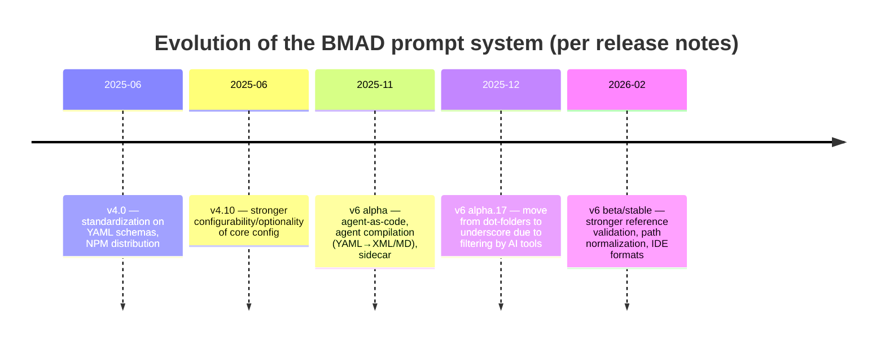

# BMAD Integration

This document consolidates everything about BMAD in Aixle into a single place. It
covers three distinct things, and their status is deliberately different — read the
section header before treating any part as ground truth:

1. **[BMAD Method Integration (implemented)](#bmad-method-integration-implemented)** —
   the shipped "Use BMAD Method" checkbox feature: `BmadMethodInjector`,
   `ContextBuilders::BmadMethod`, `steps.bmad_enabled`. This describes code that exists.
2. **[System-Workflow BMAD Integration (draft / RFC — not built)](#system-workflow-bmad-integration-draft--rfc--not-built)** —
   a forward-looking design to import BMAD as first-class system workflows. **None of the
   models, services, or entities described in this section exist in the codebase.** It is
   an RFC kept for reference and future direction.
3. **[BMAD-METHOD Framework Reference (external)](#bmad-method-framework-reference-external)** —
   a research writeup of how the upstream **BMAD-METHOD** framework itself is structured.
   It describes the third-party project, **not this codebase**.

## Table of contents

- [BMAD Method Integration (implemented)](#bmad-method-integration-implemented)
- [System-Workflow BMAD Integration (draft / RFC — not built)](#system-workflow-bmad-integration-draft--rfc--not-built)
- [BMAD-METHOD Framework Reference (external)](#bmad-method-framework-reference-external)

---

## BMAD Method Integration (implemented)

> **Status of this section:** Implemented / approved plan. Describes the shipped
> "Use BMAD Method" checkbox feature (`BmadMethodInjector`,
> `ContextBuilders::BmadMethod`, `steps.bmad_enabled`).

**Date:** 2026-03-16
**Status:** Approved Plan
**Author:** Artem Petrov + AI Analysis
**Depends on:** [System-Workflow BMAD Integration (draft / RFC)](#system-workflow-bmad-integration-draft--rfc--not-built), [session config & context](./session-config-and-context.md)

### 1. Goal

Add a **"Use BMAD Method"** checkbox when launching a standalone session and in the workflow step configuration. When enabled — automatically install BMAD Method into the container via the official npm CLI, ensuring:

- Slash commands (`/brainstorming`, `/create-prd`, `/dev-story`, etc.) work out of the box
- The Aixle context (user, language, project) is seamlessly passed through into the BMAD config
- BMAD files are invisible to the user in VS Code
- BMAD artifact output goes to `/workspace/outputs/` for reuse in the pipeline

### 2. Key decision: we use `npx bmad-method install`

BMAD Method v6.2 provides an npm CLI with a **non-interactive install mode**:

```bash
npx bmad-method install \
  --directory /workspace \
  --modules bmm,cis,bmb \
  --tools cursor \
  --user-name "Artem" \
  --communication-language Russian \
  --document-output-language English \
  --output-folder /workspace/outputs \
  --yes
```

#### What the installer does automatically

1. Copies `_bmad/` (core + selected modules) into `--directory`
2. Generates **skills** into IDE-specific folders:
   - Cursor: `.cursor/skills/<name>/SKILL.md`
   - Claude Code: `.claude/skills/<name>/SKILL.md`
   - Codex: `.agents/skills/<name>/SKILL.md`
   - Gemini: `.gemini/skills/<name>/SKILL.md`
3. Patches `config.yaml` with the user settings
4. Generates manifests (agent-manifest.csv, workflow-manifest.csv, etc.)

#### Advantages

- We don't write our own installer — we use the official CLI, always the latest version
- Automatic support for new community modules
- Correct format for each IDE — the CLI knows 20+ IDEs
- BMAD updates for free — a new npm version = new workflows
- Non-interactive mode — ideal for the container

### 3. Mapping agent_type → BMAD tools flag

| Aixle `agent_type` | BMAD `--tools` flag | Skills directory |
|---------------------|---------------------|----------------------------------|
| `cursor_cli` | `cursor` | `.cursor/skills/<name>/SKILL.md` |
| `claude_code` | `claude-code` | `.claude/skills/<name>/SKILL.md` |
| `codex` | `codex` | `.agents/skills/<name>/SKILL.md` |
| `gemini_cli` | `gemini` | `.gemini/skills/<name>/SKILL.md` |

### 4. Architecture

```
┌─────────────────────────────────────────────────────────────────────┐
│  "Use BMAD Method" checkbox (UI: session launch / step config)        │
│                                                                      │
│  What happens on assemble_session_context:                       │
│                                                                      │
│  1. RUN in the container:                                               │
│     npx bmad-method install \                                       │
│       --directory /workspace \                                       │
│       --modules bmm,cis,bmb \                                       │
│       --tools <agent_type_mapped> \                                  │
│       --user-name "<user.display_name>" \                            │
│       --communication-language "<user.locale>" \                     │
│       --output-folder /workspace/outputs \                           │
│       --yes                                                          │
│                                                                      │
│  2. The installer automatically:                                        │
│     - Creates /workspace/_bmad/ with all modules                   │
│     - Generates skills into the correct IDE-specific folders         │
│     - Patches config.yaml with our values                        │
│     - Generates manifests                                           │
│                                                                      │
│  3. POST-INSTALL (BmadMethodInjector):                              │
│     - files.exclude in VS Code settings: _bmad, .cursor/skills, etc │
│     - A section in the context file (AGENTS.md/CLAUDE.md)              │
│       via ContextBuilders::BmadMethod                             │
│                                                                      │
│  4. Result:                                                       │
│     - Slash commands work (/brainstorming, /create-prd...)       │
│     - The agent knows about BMAD through the context                           │
│     - Output goes to /workspace/outputs/                     │
│     - The files are hidden from the user                                  │
└─────────────────────────────────────────────────────────────────────┘
```

### 5. Code changes

#### 5.1 DB: Migration

```ruby
# terminal_sessions — add to the session_config jsonb
# session_config["bmad_enabled"] = true/false
# session_config["bmad_modules"] = ["bmm", "cis", "bmb"] (optional, default: all)

# steps — add a field
add_column :steps, :bmad_enabled, :boolean, default: false
```

For `terminal_sessions` we use the existing `session_config` jsonb — no separate column is needed.

#### 5.2 SessionConfigResolver

Resolve `bmad_enabled` from the step (for workflow) or from session_config (for standalone):

```ruby
def resolve_bmad_enabled
  return session.session_config&.dig("bmad_enabled") if standalone_session?

  step&.bmad_enabled || false
end
```

#### 5.3 BmadMethodInjector (new service)

```ruby
class BmadMethodInjector
  AGENT_TYPE_TO_BMAD_TOOL = {
    "cursor_cli" => "cursor",
    "claude_code" => "claude-code",
    "codex" => "codex",
    "gemini_cli" => "gemini"
  }.freeze

  BMAD_HIDDEN_PATHS = %w[
    _bmad
    _bmad-output
    .cursor/skills
    .claude/skills
    .agents/skills
    .gemini/skills
  ].freeze

  def initialize(container_id, session, runtime:)
    @container_id = container_id
    @session = session
    @runtime = runtime
  end

  def inject!
    run_bmad_install
    hide_bmad_in_vscode
  end

  private

  def run_bmad_install
    tool = AGENT_TYPE_TO_BMAD_TOOL[@session.agent_type]
    user = @session.user
    modules = resolve_modules.join(",")

    cmd = [
      "npx", "bmad-method", "install",
      "--directory", "/workspace",
      "--modules", modules,
      "--tools", tool,
      "--user-name", user.display_name || user.email,
      "--communication-language", resolve_language,
      "--document-output-language", "English",
      "--output-folder", "/workspace/outputs",
      "--yes"
    ]

    @runtime.exec(@container_id, cmd)
  end

  def resolve_modules
    @session.session_config&.dig("bmad_modules") || %w[bmm cis bmb]
  end

  def resolve_language
    # TODO: from user settings or session_config
    "English"
  end

  def hide_bmad_in_vscode
    # Add to VS Code settings files.exclude
    # to hide the _bmad/ and skills directories
  end
end
```

#### 5.4 SessionContextService — new step

In `assemble_session_context`, after repositories (step 7), before the context log:

```ruby
# Step 7.5: BMAD Method
if SessionConfigResolver.new(session).resolve_bmad_enabled
  measure_step("bmad_method") { inject_bmad_method(container_id, session) }
end
```

#### 5.5 ContextBuilders::BmadMethod (new builder)

Add to `SessionContextConstructor::BUILDERS` after `Resources`:

```ruby
module ContextBuilders
  class BmadMethod < Base
    def applicable?
      SessionConfigResolver.new(session).resolve_bmad_enabled
    end

    def build
      [section(
        tag: "bmad-method",
        priority: :info,
        content: build_bmad_context
      )]
    end

    private

    def build_bmad_context
      <<~MD
        ## BMAD Method

        The BMAD Method (Breakthrough Method of Agile AI-driven Development) is installed
        and available in this session. You have access to slash-commands for structured
        workflows covering the full product development lifecycle.

        - BMAD files: `/workspace/_bmad/`
        - BMAD config: `/workspace/_bmad/core/config.yaml`
        - Output folder: `/workspace/outputs/`

        Use the available skills/commands to invoke BMAD workflows (e.g. brainstorming,
        create-prd, create-architecture, dev-story, etc.).
        All BMAD output must go to `/workspace/outputs/`.
      MD
    end
  end
end
```

#### 5.6 VS Code Settings — files.exclude

In `docker/base/vscode-settings.json` or dynamically in `BmadMethodInjector#hide_bmad_in_vscode`:

```json
{
  "files.exclude": {
    "_bmad": true,
    "_bmad-output": true,
    "_bmad/_config": true,
    ".cursor/skills": true,
    ".claude/skills": true,
    ".agents/skills": true,
    ".gemini/skills": true
  }
}
```

#### 5.7 Frontend

- `SessionLaunchWidget` — add a "Use BMAD Method" toggle
- Step editor (workflow builder) — add a "Use BMAD Method" toggle
- Both pass `bmad_enabled: true` into session_config / step

#### 5.8 Docker — Node.js in the container

We need to ensure that Node.js (v20+) is installed in the agent container images.
`npx` must be available. Check the current Dockerfiles.

### 6. Hiding from the user

| What we hide | How |
|---|---|
| `_bmad/` directory | `files.exclude` in VS Code settings |
| `.cursor/skills/` (BMAD skills) | `files.exclude` in VS Code settings |
| `.claude/skills/` | `files.exclude` |
| `.agents/skills/` | `files.exclude` |
| `.gemini/skills/` | `files.exclude` |
| `_bmad-output/` | `files.exclude` + we rewrite output_folder to `/workspace/outputs/` |

At the same time, the agent (Cursor/Claude/Codex/Gemini) **sees** these files and can read them — skills work at the IDE agent level, not the VS Code file explorer.

### 7. Output → /workspace/outputs/

BMAD uses `output_folder` from config.yaml for all artifacts.
We set `--output-folder /workspace/outputs` → artifacts automatically land in the standard Aixle output directory.

The existing `collect_outputs` mechanism in `AgentSessionStrategy` picks up files from `/workspace/outputs/` and creates `Asset` records.

In the workflow pipeline, `WorkflowStepStrategy` passes outputs as `WorkflowRunAsset` to the next steps.

### 8. Extensibility (V2+)

#### V2: Custom modules

The user can specify additional BMAD modules via `--custom-content`:
```bash
npx bmad-method install \
  --custom-content /workspace/repo/my-custom-module \
  ...
```

This allows connecting modules from the user's repository.

#### V3: Module marketplace

At the platform level — a catalog of BMAD modules (npm packages).
The user selects which modules to connect in the UI.
`bmad_modules` in session_config stores the list of selected modules.

#### V4: Full integration (System Workflows)

Described in [System-Workflow BMAD Integration (draft / RFC)](#system-workflow-bmad-integration-draft--rfc--not-built).
BmadModuleRegistry, agent mapping, composite workflows.

### 9. Time estimate

| Task | Duration |
|--------|------|
| Model + migration (`bmad_enabled` on steps, session_config) | 0.5 days |
| `BmadMethodInjector` (running npx in the container + post-install) | 1.5 days |
| `ContextBuilders::BmadMethod` | 0.5 days |
| VS Code settings (files.exclude for BMAD) | 0.5 days |
| Frontend — checkbox in SessionLaunchWidget + Step editor | 1 day |
| Docker — verify/add Node.js v20+ in agent images | 0.5 days |
| e2e testing (all 4 agent types) | 1 day |
| **Total** | **~5.5 days** |

### 10. Open questions

| # | Question | Proposal |
|---|--------|-------------|
| 1 | Is Node.js v20+ present in all agent container images? | Check the Dockerfiles. If not — add it to the base image. |
| 2 | Do we need to cache the BMAD install between sessions? | MVP: no, we install every time. V2: Docker layer cache or pre-baked image. |
| 3 | Which modules should be installed by default? | MVP: bmm (core methodology). Optionally: cis, bmb. |
| 4 | How should npx install errors be handled? | Log them, don't block the session. BMAD = nice-to-have, not critical path. |
| 5 | Do we need `--communication-language` from the user profile? | Yes, map it from user.locale or user.settings. MVP: English. |
| 6 | How long does npx bmad-method install take? | ~10-30 sec. Run it in parallel with other assemble_session_context steps if possible. |

---

## System-Workflow BMAD Integration (draft / RFC — not built)

> **Status of this section:** Draft / RFC. This is a forward-looking design.
> **None of the models, services, or entities described below exist in the
> codebase** — no `BmadModule`, `BmadAgent`, `BmadWorkflow`, `SystemWorkflowMapping`,
> `BmadModuleImporter`, `BmadAgentMapper`, `ContextBuilders::BmadContext`, etc. Treat
> every code block here as proposed design, not present-day reality.

**Date:** 2026-03-02
**Status:** Draft / RFC
**Author:** Artem Petrov + AI Analysis
**Depends on:** [workflow architecture](../architecture/workflows.md), [meta-workflow design](./meta-workflow.md), [BMAD-METHOD Framework Reference](#bmad-method-framework-reference-external)

### 1. Goal and motivation

#### 1.1 Problem

The BMAD method (v6) is an aggregate of agents and workflows for the full cycle of product development (analysis → planning → architecture → implementation). Currently BMAD works as a set of prompts in the IDE: each workflow is launched manually via a command, context is lost between sessions, and there is no orchestration between phases.

Aixle is already a **persistent BMAD runtime** at the level of individual workflows (one BMAD workflow = one Aixle Step). But there is no mechanism that:
1. Runs the **full cycle** of the BMAD method as a single managed process
2. **Maps** BMAD agents and configuration into Aixle entities
3. Allows **reuse** of new BMAD modules (bmb, cis, future npm packages)
4. Differs from ordinary workflows by having **custom mappings**

#### 1.2 Goal

Create a **System Workflow** — a special type of workflow that:
- Orchestrates the BMAD method as a whole (or a subset of it chosen by the user)
- Automatically maps BMAD artifacts (agents, workflows, config vars) into Aixle entities
- Supports modularity: install a new BMAD module → its workflows become available in the system workflow
- Serves as the "single source of truth" for the BMAD environment configuration in Aixle

#### 1.3 How a System Workflow differs from an ordinary one

| Ordinary Workflow | System Workflow |
|---|---|
| Created by the user | Shipped with the platform or generated from BMAD modules |
| Fixed set of Steps | Dynamic: Steps are determined from the BMAD module catalog |
| Agents bound by hand | Agents are mapped automatically from BMAD agent definitions |
| Config via UI | Config includes the BMAD config layer (config.yaml vars) |
| `scope: Project / Company` | `scope: System` (visible to everyone, not editable) |
| No knowledge of external methodologies | Knows the BMAD structure (phases, modules, dependencies) |

### 2. Architecture

#### 2.1 Three levels

```
┌───────────────────────────────────────────────────────────────────────────┐
│  Level 3: System Workflow "BMAD Full Lifecycle"                            │
│                                                                           │
│  An orchestrator that knows about BMAD phases and offers the user        │
│  to compose a path from the available workflows. It can include steps from different │
│  modules (bmm, cis, bmb).                                                │
├───────────────────────────────────────────────────────────────────────────┤
│  Level 2: BMAD Module Catalog (Registry)                                  │
│                                                                           │
│  A catalog of all imported BMAD modules with their agents, workflows.     │
│  Each workflow from the catalog = a ready-made template for an Aixle Step.             │
│  The Registry knows the dependencies between workflows (PRD is needed for Architecture).│
├───────────────────────────────────────────────────────────────────────────┤
│  Level 1: Aixle Runtime (existing)                                        │
│                                                                           │
│  Workflow → Step → SubStep                                                │
│  WorkflowRun → StepRun → SubStepRun                                     │
│  TerminalSession, Agent, Tools, Skills, MCP Servers                      │
└───────────────────────────────────────────────────────────────────────────┘
```

#### 2.2 BMAD Module Registry

The central component is the registry of imported BMAD modules:

```ruby
class BmadModule < ApplicationRecord
  belongs_to :company
  has_many :bmad_agents, dependent: :destroy
  has_many :bmad_workflows, dependent: :destroy

  # name: string ("bmm", "cis", "bmb")
  # version: string ("6.0.1")
  # source: string ("built-in", "npm:bmad-method", "npm:bmad-creative-intelligence-suite")
  # config: jsonb (parsed module config.yaml)
  # manifest: jsonb (parsed module manifest — lists of agents, workflows, teams)
  # installed_at: datetime
  # updated_at: datetime
end

class BmadAgent < ApplicationRecord
  belongs_to :bmad_module
  belongs_to :aixle_agent, class_name: 'Agent', optional: true

  # bmad_name: string ("analyst", "architect", "pm")
  # display_name: string ("Mary", "Winston", "John")
  # title: string ("Business Analyst", "Architect", "Product Manager")
  # role: text
  # persona: text (full persona from BMAD agent file)
  # communication_style: text
  # principles: text
  # capabilities: string
  # source_path: string ("_bmad/bmm/agents/analyst.md")
  # source_hash: string (for tracking changes)
end

class BmadWorkflow < ApplicationRecord
  belongs_to :bmad_module
  has_many :bmad_workflow_steps, dependent: :destroy, order: :position

  # bmad_name: string ("create-product-brief", "create-architecture")
  # description: text
  # phase: string ("1-analysis", "2-planning", "3-solutioning", "4-implementation")
  # category: string ("research", "planning", "solutioning", "implementation", "quick-flow", "qa")
  # agent_name: string ("analyst", "architect") — which BMAD agent runs this
  # source_path: string ("_bmad/bmm/workflows/3-solutioning/create-architecture/workflow.md")
  # workflow_type: string ("step-file", "yaml-config")
  # config: jsonb (parsed workflow.yaml or workflow.md frontmatter)
  # depends_on: string[] (other bmad_workflow names this depends on)
  # produces: string[] (artifact names this produces)
  # requires: string[] (artifact names this needs as input)
end

class BmadWorkflowStep < ApplicationRecord
  belongs_to :bmad_workflow

  # position: integer
  # name: string ("step-01-init", "step-02-discovery")
  # source_path: string (path to step file)
  # description: text (extracted from step file)
end
```

#### 2.3 Mapping Engine

Mapping Engine — a service that translates BMAD entities into Aixle entities:

```
┌─────────────────┐        ┌──────────────────┐        ┌─────────────────┐
│  BMAD Source     │        │  Mapping Engine   │        │  Aixle Entities │
│                  │        │                   │        │                 │
│ BmadAgent        │───────▶│ AgentMapper       │───────▶│ Agent           │
│  analyst.md      │        │  - persona → sys  │        │  system_prompt  │
│  persona, role   │        │    prompt          │        │  principles     │
│                  │        │  - principles      │        │  comm_style     │
│                  │        │  - comm_style      │        │                 │
├─────────────────┤        ├──────────────────┤        ├─────────────────┤
│ BmadWorkflow     │───────▶│ WorkflowMapper    │───────▶│ Workflow        │
│  create-arch     │        │  - workflow →     │        │  Steps          │
│  steps/          │        │    Aixle Workflow  │        │  SubSteps       │
│  instructions    │        │  - BMAD steps →   │        │  instructions   │
│                  │        │    Aixle SubSteps  │        │  agent_id       │
├─────────────────┤        ├──────────────────┤        ├─────────────────┤
│ BmadModule       │───────▶│ ConfigMapper      │───────▶│ WorkflowRun     │
│  config.yaml     │        │  - config vars → │        │  shared_context  │
│  project_name    │        │    shared_context │        │  (BMAD vars)    │
│  output_folder   │        │  - paths →       │        │                 │
│                  │        │    workspace dirs  │        │                 │
└─────────────────┘        └──────────────────┘        └─────────────────┘
```

#### 2.4 Custom mappings (the key difference)

A System Workflow contains a **mapping configuration** — translation rules that ordinary workflows do not have:

```ruby
class SystemWorkflowMapping < ApplicationRecord
  belongs_to :workflow  # system workflow

  # mapping_type: enum
  #   :agent_mapping      — BmadAgent → Agent
  #   :config_mapping     — BMAD config var → shared_context key
  #   :artifact_mapping   — BMAD artifact name → WorkflowRunAsset name pattern
  #   :phase_mapping      — BMAD phase → Step group
  #   :instruction_transform — rules for adapting BMAD instructions to Aixle context

  # source_ref: string (BMAD-side reference, e.g. "bmm:analyst" or "config:output_folder")
  # target_ref: string (Aixle-side reference, e.g. "agent:42" or "shared_context.bmad_output_folder")
  # transform: jsonb (transformation rules, if any)
  # auto_sync: boolean (re-apply mapping when BMAD module updates)
end
```

##### 2.4.1 Agent Mapping

BMAD agents → Aixle agents:

```ruby
class BmadAgentMapper
  PERSONA_TRANSFORM = {
    role: :persona,
    identity: :system_prompt_identity_section,
    communication_style: :communication_style,
    principles: :principles,
    capabilities: :description
  }

  def map(bmad_agent, target_scope:)
    existing = bmad_agent.aixle_agent

    attrs = {
      title: bmad_agent.title,
      description: "#{bmad_agent.title} — #{bmad_agent.capabilities}",
      persona: build_persona(bmad_agent),
      communication_style: bmad_agent.communication_style,
      principles: bmad_agent.principles,
      source: :bmad_import,
      source_ref: "#{bmad_agent.bmad_module.name}:#{bmad_agent.bmad_name}",
      scope: target_scope
    }

    if existing
      existing.update!(attrs) if bmad_agent.source_hash_changed?
      existing
    else
      agent = Agent.create!(attrs)
      bmad_agent.update!(aixle_agent: agent)
      agent
    end
  end

  private

  def build_persona(bmad_agent)
    <<~PROMPT
      You are #{bmad_agent.display_name}, #{bmad_agent.title}.

      ## Role
      #{bmad_agent.role}

      ## Communication Style
      #{bmad_agent.communication_style}

      ## Principles
      #{bmad_agent.principles}
    PROMPT
  end
end
```

##### 2.4.2 Config Mapping

BMAD config.yaml → Aixle WorkflowRun shared_context:

```ruby
class BmadConfigMapper
  STANDARD_MAPPINGS = {
    'project_name' => 'bmad.project_name',
    'user_name' => 'bmad.user_name',
    'communication_language' => 'bmad.communication_language',
    'document_output_language' => 'bmad.document_output_language',
    'user_skill_level' => 'bmad.user_skill_level',
    'output_folder' => 'bmad.output_folder',
    'planning_artifacts' => 'bmad.planning_artifacts',
    'implementation_artifacts' => 'bmad.implementation_artifacts',
    'project_knowledge' => 'bmad.project_knowledge'
  }.freeze

  def map(bmad_module, workflow_run:)
    config = bmad_module.config
    context = workflow_run.shared_context || {}

    STANDARD_MAPPINGS.each do |bmad_key, aixle_key|
      value = config[bmad_key]
      next unless value

      value = resolve_path(value, workflow_run.project)
      deep_set(context, aixle_key, value)
    end

    workflow_run.update!(shared_context: context)
  end

  private

  def resolve_path(value, project)
    value
      .gsub('{project-root}', '/workspace')
      .gsub('{config_source}', '/workspace/_bmad/bmm/config.yaml')
  end
end
```

##### 2.4.3 Instruction Transform

BMAD workflow instructions → Aixle Step instructions:

```ruby
class BmadInstructionTransformer
  def transform(bmad_workflow, step)
    original = bmad_workflow.raw_instructions

    transformed = original
      .then { |text| strip_bmad_activation(text) }
      .then { |text| replace_path_variables(text) }
      .then { |text| inject_aixle_context_refs(text) }
      .then { |text| adapt_menu_handling(text) }

    step.update!(instructions: build_step_instructions(bmad_workflow, transformed))
  end

  private

  def strip_bmad_activation(text)
    # BMAD agents have <activation> blocks that handle config loading,
    # greeting, menu display. In Aixle, this is handled by SessionContextConstructor.
    # Strip activation blocks and replace with Aixle-native context reference.
    text.gsub(/<activation.*?<\/activation>/m, '')
  end

  def replace_path_variables(text)
    text
      .gsub('{project-root}', '/workspace')
      .gsub('{output_folder}', '/workspace/output')
      .gsub('{planning_artifacts}', '/workspace/input/planning')
      .gsub('{implementation_artifacts}', '/workspace/input/implementation')
  end

  def inject_aixle_context_refs(text)
    # Add Aixle-specific instructions at the top
    aixle_header = <<~MD
      ## Aixle Integration Notes
      - Your workflow context (previous steps, sub-steps) is in the WORKFLOW CONTEXT section above
      - Use `mark_sub_step` to track progress
      - Save outputs to `/workspace/output/`
      - Previous step outputs are in `/workspace/input/`

    MD
    aixle_header + text
  end

  def adapt_menu_handling(text)
    # BMAD workflows in IDE present interactive menus (A/P/C).
    # In Aixle interactive mode, these are preserved as-is (agent presents them in terminal).
    # In Aixle non-interactive mode, default choices are auto-selected.
    text
  end
end
```

### 3. BMAD Module Import Flow

#### 3.1 How modules get into the system

```
┌─────────────────────────────────────────────────────────────────────┐
│  Import Sources                                                      │
│                                                                      │
│  ┌──────────────┐  ┌──────────────────┐  ┌──────────────────────┐  │
│  │ _bmad/ folder │  │ npm package      │  │ Git repository       │  │
│  │ (in project)  │  │ (bmad-method,    │  │ (custom module)      │  │
│  │               │  │  bmad-creative-  │  │                      │  │
│  │               │  │  intelligence)   │  │                      │  │
│  └──────┬───────┘  └────────┬─────────┘  └──────────┬───────────┘  │
│         │                   │                        │              │
│         ▼                   ▼                        ▼              │
│  ┌──────────────────────────────────────────────────────────────┐   │
│  │  BmadModuleImporter                                          │   │
│  │                                                              │   │
│  │  1. Scan source (manifest.yaml, config.yaml)                │   │
│  │  2. Parse agent files (.md with YAML frontmatter)           │   │
│  │  3. Parse workflow files (workflow.md / workflow.yaml)       │   │
│  │  4. Parse step files (steps/step-*.md)                      │   │
│  │  5. Extract dependencies (requires/produces)                 │   │
│  │  6. Create BmadModule + BmadAgents + BmadWorkflows          │   │
│  │  7. Run AgentMapper → create/update Aixle Agents            │   │
│  │  8. Build dependency graph between workflows                 │   │
│  └──────────────────────────────────────────────────────────────┘   │
└─────────────────────────────────────────────────────────────────────┘
```

#### 3.2 Import service

```ruby
class BmadModuleImporter
  def import(company:, source_path:)
    manifest = parse_manifest(source_path)
    config = parse_config(source_path, manifest[:name])

    bmad_module = BmadModule.find_or_initialize_by(
      company: company,
      name: manifest[:name]
    )
    bmad_module.assign_attributes(
      version: manifest[:version],
      source: detect_source(source_path),
      config: config,
      manifest: manifest
    )
    bmad_module.save!

    import_agents(bmad_module, source_path)
    import_workflows(bmad_module, source_path)
    build_dependency_graph(bmad_module)

    bmad_module
  end

  private

  def import_agents(bmad_module, source_path)
    agent_files = Dir.glob("#{source_path}/agents/**/*.md")
    agent_files.each do |file|
      parsed = BmadAgentParser.parse(file)
      BmadAgent.find_or_create_by!(
        bmad_module: bmad_module,
        bmad_name: parsed[:name]
      ).update!(
        display_name: parsed[:display_name],
        title: parsed[:title],
        role: parsed[:role],
        persona: parsed[:persona],
        communication_style: parsed[:communication_style],
        principles: parsed[:principles],
        capabilities: parsed[:capabilities],
        source_path: file,
        source_hash: Digest::SHA256.file(file).hexdigest
      )
    end
  end

  def import_workflows(bmad_module, source_path)
    workflow_manifest = CSV.parse(
      File.read("#{source_path}/../_config/workflow-manifest.csv"),
      headers: true
    )

    workflow_manifest.select { |w| w['module'] == bmad_module.name }.each do |entry|
      wf_path = "#{source_path}/../#{entry['path']}"
      parsed = BmadWorkflowParser.parse(wf_path)

      bw = BmadWorkflow.find_or_create_by!(
        bmad_module: bmad_module,
        bmad_name: entry['name']
      )
      bw.update!(
        description: entry['description'],
        phase: detect_phase(entry['path']),
        category: detect_category(entry['path']),
        agent_name: parsed[:agent_name],
        source_path: entry['path'],
        workflow_type: parsed[:type],
        config: parsed[:config],
        produces: parsed[:produces],
        requires: parsed[:requires]
      )

      import_workflow_steps(bw, parsed[:steps_path]) if parsed[:steps_path]
    end
  end

  def build_dependency_graph(bmad_module)
    # Analyze requires/produces to build the dependency graph
    bmad_module.bmad_workflows.each do |wf|
      deps = bmad_module.bmad_workflows.select do |other|
        wf.requires.present? &&
        other.produces.present? &&
        (wf.requires & other.produces).any?
      end
      wf.update!(depends_on: deps.map(&:bmad_name))
    end
  end
end
```

#### 3.3 Parsing BMAD artifacts

##### Agent Parser

```ruby
class BmadAgentParser
  def self.parse(file_path)
    content = File.read(file_path)
    frontmatter = YAML.safe_load(content.match(/---\n(.*?)\n---/m)&.[](1) || '{}')

    # Extract from XML-embedded persona
    xml_content = content.match(/<agent.*?>(.*?)<\/agent>/m)&.[](1) || ''

    {
      name: frontmatter['name'],
      display_name: extract_xml_attr(content, 'agent', 'name'),
      title: extract_xml_attr(content, 'agent', 'title'),
      role: extract_xml_section(xml_content, 'role'),
      persona: extract_xml_section(xml_content, 'identity'),
      communication_style: extract_xml_section(xml_content, 'communication-style'),
      principles: extract_xml_section(xml_content, 'principles'),
      capabilities: extract_xml_attr(content, 'agent', 'capabilities')
    }
  end
end
```

##### Workflow Parser

```ruby
class BmadWorkflowParser
  def self.parse(file_path)
    content = File.read(file_path)

    if file_path.end_with?('.yaml')
      parse_yaml_workflow(content, file_path)
    else
      parse_md_workflow(content, file_path)
    end
  end

  def self.parse_md_workflow(content, file_path)
    frontmatter = YAML.safe_load(content.match(/---\n(.*?)\n---/m)&.[](1) || '{}')
    dir = File.dirname(file_path)
    steps_dir = "#{dir}/steps"

    steps = if Dir.exist?(steps_dir)
              Dir.glob("#{steps_dir}/step-*.md").sort.map.with_index do |f, i|
                { position: i + 1, name: File.basename(f, '.md'), source_path: f }
              end
            else
              []
            end

    {
      name: frontmatter['name'],
      type: 'step-file',
      agent_name: detect_agent_from_content(content),
      config: frontmatter,
      steps_path: steps_dir,
      steps: steps,
      produces: detect_outputs(content),
      requires: detect_inputs(content)
    }
  end

  def self.parse_yaml_workflow(content, file_path)
    config = YAML.safe_load(content)
    {
      name: config['name'],
      type: 'yaml-config',
      agent_name: nil,
      config: config,
      steps_path: nil,
      steps: [],
      produces: detect_yaml_outputs(config),
      requires: detect_yaml_inputs(config)
    }
  end
end
```

### 4. System Workflow: Structure and Execution

#### 4.1 Two types of System Workflows

##### Type A: BMAD Phase Workflow (pre-built)

One system workflow = one BMAD phase. Created automatically when a module is imported.

```
System Workflow: "BMM: Analysis Phase"
  Step 1: "Domain Research" → BmadWorkflow(domain-research), Agent: analyst
  Step 2: "Market Research" → BmadWorkflow(market-research), Agent: analyst  
  Step 3: "Technical Research" → BmadWorkflow(technical-research), Agent: analyst
  Step 4: "Create Product Brief" → BmadWorkflow(create-product-brief), Agent: analyst

System Workflow: "BMM: Planning Phase"
  Step 1: "Create PRD" → BmadWorkflow(create-prd), Agent: pm
  Step 2: "Create UX Design" → BmadWorkflow(create-ux-design), Agent: ux-designer

System Workflow: "BMM: Solutioning Phase"
  Step 1: "Create Architecture" → BmadWorkflow(create-architecture), Agent: architect
  Step 2: "Create Epics & Stories" → BmadWorkflow(create-epics-and-stories), Agent: pm/sm
  Step 3: "Check Readiness" → BmadWorkflow(check-implementation-readiness), Agent: architect

System Workflow: "BMM: Implementation Phase"
  Step 1: "Sprint Planning" → BmadWorkflow(sprint-planning), Agent: sm
  Step 2: "Create Story" → BmadWorkflow(create-story), Agent: sm
  Step 3: "Dev Story" → BmadWorkflow(dev-story), Agent: dev
  Step 4: "Code Review" → BmadWorkflow(code-review), Agent: dev
  Step 5: "Retrospective" → BmadWorkflow(retrospective), Agent: sm
```

##### Type B: BMAD Composite Workflow (user-assembled)

The user assembles their own path from the catalog of available BMAD workflows:

```
Custom System Workflow: "My Product Launch Process"
  Step 1: "Research" → from BMM/1-analysis/research
  Step 2: "Product Brief" → from BMM/1-analysis/create-product-brief
  Step 3: "PRD" → from BMM/2-planning/create-prd
  Step 4: "Architecture" → from BMM/3-solutioning/create-architecture
  Step 5: "Brainstorming" → from CIS/brainstorming   ← cross-module!
  Step 6: "Epics" → from BMM/3-solutioning/create-epics-and-stories
```

#### 4.2 System Workflow Model

```ruby
class Workflow < ApplicationRecord
  # Existing fields...

  # New fields for system workflows:
  # scope_type: string (Company, Project, System)
  # system_workflow_type: string (nil, "bmad_phase", "bmad_composite", "meta")
  # bmad_module_id: integer (optional — for auto-generated phase workflows)

  has_many :system_workflow_mappings, dependent: :destroy

  def system_workflow?
    scope_type == 'System'
  end

  def bmad_workflow?
    system_workflow_type.in?(%w[bmad_phase bmad_composite])
  end
end
```

#### 4.3 Step ↔ BmadWorkflow Link

```ruby
class Step < ApplicationRecord
  # Existing fields...

  # New field:
  # bmad_workflow_id: integer (optional — links this step to a BMAD workflow definition)
  belongs_to :bmad_workflow, optional: true

  def bmad_step?
    bmad_workflow_id.present?
  end
end
```

When a Step is bound to a BmadWorkflow, on StepRun launch:
1. BMAD workflow instructions are injected into the agent context
2. BMAD step files → SubSteps
3. BMAD config vars → available via shared_context
4. BMAD agent → the mapped Agent is selected automatically

#### 4.4 Execution Flow

```
The user selects a System Workflow (e.g. "BMM: Solutioning Phase")
    │
    ├─→ The UI shows steps with descriptions from BMAD
    ├─→ The user can skip/reorder steps (if skip_policy allows)
    ├─→ The user selects input assets and mode
    │
    ▼
A WorkflowRun is created
    │
    ├─→ BmadConfigMapper injects BMAD config vars into shared_context
    │   {
    │     "bmad": {
    │       "project_name": "my-app",
    │       "communication_language": "Russian",
    │       "document_output_language": "English",
    │       "user_skill_level": "expert"
    │     }
    │   }
    │
    ▼
Step 1: "Create Architecture"
    │
    ├─→ step.bmad_workflow → loads BmadWorkflow(create-architecture)
    │
    ├─→ BmadWorkflow.bmad_workflow_steps → creates SubStepRuns:
    │     1. step-01-init
    │     2. step-02-load-docs
    │     3. step-03-context-analysis
    │     4. step-04-decisions
    │     5. step-05-patterns
    │     6. step-06-project-structure
    │     7. step-07-validation
    │
    ├─→ Agent: mapped architect → Aixle Agent "Winston" (auto-selected via mapping)
    │
    ├─→ SessionContextConstructor builds context:
    │     ┌─────────────────────────────────────┐
    │     │  AGENTS.md                            │
    │     │                                       │
    │     │  ## Agent: Winston (Architect)         │
    │     │  [persona from mapped Agent]          │
    │     │                                       │
    │     │  ## BMAD Configuration                │
    │     │  project_name: my-app                 │
    │     │  communication_language: Russian       │
    │     │  document_output_language: English     │
    │     │                                       │
    │     │  ## Workflow Context                   │
    │     │  [standard Aixle workflow context]     │
    │     │                                       │
    │     │  ## Step Instructions                  │
    │     │  [transformed BMAD instructions]       │
    │     │  [references to step files in          │
    │     │   /workspace/input/_bmad/...]          │
    │     └─────────────────────────────────────┘
    │
    ├─→ /workspace/input/ contains:
    │     _bmad/bmm/workflows/3-solutioning/create-architecture/  (step files)
    │     _bmad/bmm/config.yaml
    │     prd.md (from previous step output)
    │     product-brief.md (from previous step output)
    │
    ▼
Agent runs in container, follows BMAD instructions natively
    │
    ├─→ Agent reads step files, follows BMAD workflow
    ├─→ Uses mark_sub_step to report progress
    ├─→ Saves output to /workspace/output/architecture.md
    │
    ▼
Step completes → next step starts
```

### 5. Context Builder: BMAD Layer

#### 5.1 New Context Builder

```ruby
module ContextBuilders
  class BmadContext
    def initialize(step_run)
      @step_run = step_run
      @workflow_run = step_run.workflow_run
      @step = step_run.step
    end

    def applicable?
      @step.bmad_step?
    end

    def build
      return '' unless applicable?

      sections = []
      sections << bmad_config_section
      sections << bmad_workflow_instructions_section
      sections << bmad_artifacts_reference_section
      sections.compact.join("\n\n")
    end

    private

    def bmad_config_section
      config = @workflow_run.shared_context&.dig('bmad')
      return nil unless config.present?

      lines = ["## BMAD Configuration"]
      config.each do |key, value|
        lines << "- #{key}: #{value}"
      end
      lines.join("\n")
    end

    def bmad_workflow_instructions_section
      bw = @step.bmad_workflow
      return nil unless bw

      <<~MD
        ## BMAD Workflow: #{bw.bmad_name}
        #{bw.description}

        ### Instructions
        Follow the workflow defined in the BMAD workflow files mounted at:
        `/workspace/input/_bmad/#{bw.source_path}`

        The step files are sequential. Process them in order.
        Use `mark_sub_step` to report progress on each step file.
      MD
    end

    def bmad_artifacts_reference_section
      bw = @step.bmad_workflow
      return nil unless bw

      requires = bw.requires
      return nil unless requires.present?

      lines = ["## Required Input Artifacts"]
      requires.each do |artifact_name|
        lines << "- #{artifact_name} (check /workspace/input/ for this file)"
      end
      lines.join("\n")
    end
  end
end
```

#### 5.2 Integration into SessionContextConstructor

```ruby
class SessionContextConstructor
  BUILDERS = [
    ContextBuilders::CriticalRules,
    ContextBuilders::AgentRole,
    ContextBuilders::SessionInfo,
    ContextBuilders::Workspace,
    ContextBuilders::WorkflowContext,
    ContextBuilders::BmadContext,      # ← NEW: added after WorkflowContext
    ContextBuilders::BoardContext,
    ContextBuilders::Tools,
    ContextBuilders::Resources,
    ContextBuilders::OutputRules,
  ].freeze
end
```

### 6. BMAD Module Extensibility

#### 6.1 Installing a new module

```
The user (admin) → Settings → BMAD Modules → "Install Module"
    │
    ├─→ Option 1: "Import from project" → scans _bmad/ in the project repository
    ├─→ Option 2: "Install from npm" → npm install bmad-creative-intelligence-suite
    ├─→ Option 3: "Import from URL" → git clone custom module
    │
    ▼
BmadModuleImporter.import(company: current_company, source_path: path)
    │
    ├─→ Creates BmadModule
    ├─→ Creates BmadAgents → maps to Aixle Agents
    ├─→ Creates BmadWorkflows → available in System Workflow catalog
    ├─→ Builds dependency graph
    │
    ▼
New workflows appear in:
  - System Workflow builder (for creating composite workflows)
  - Phase-based auto-generated System Workflows
  - BMAD Module catalog (for browsing)
```

#### 6.2 Updating a module

```ruby
class BmadModuleUpdater
  def update(bmad_module, new_source_path:)
    old_version = bmad_module.version
    importer = BmadModuleImporter.new

    ActiveRecord::Base.transaction do
      importer.import(
        company: bmad_module.company,
        source_path: new_source_path
      )

      # Re-map agents if source_hash changed
      bmad_module.bmad_agents.each do |ba|
        if ba.source_hash_changed?
          BmadAgentMapper.new.map(ba, target_scope: bmad_module.company)
        end
      end

      # Re-generate system workflows if workflow structure changed
      regenerate_phase_workflows(bmad_module) if workflows_changed?(bmad_module)
    end

    notify_update(bmad_module, old_version)
  end
end
```

#### 6.3 Future BMAD modules

When BMAD builds an extensible module system, our architecture is ready:

```
npm install bmad-security-module

→ BmadModuleImporter detects:
   - config.yaml with the security module settings
   - agents/: security-auditor.md, penetration-tester.md
   - workflows/: vulnerability-scan/, compliance-check/, threat-model/

→ Automatically creates:
   - BmadModule(name: "security")
   - BmadAgent → Agent(title: "Security Auditor", ...)
   - BmadAgent → Agent(title: "Penetration Tester", ...)
   - BmadWorkflow(vulnerability-scan, compliance-check, threat-model)
   - System Workflow: "Security: Full Audit" (auto-generated phase workflow)

→ The user can:
   - Run "Security: Full Audit" as a system workflow
   - Add a "vulnerability-scan" step to their composite workflow
   - Use the security-auditor agent in a standalone session
```

### 7. UI

#### 7.1 BMAD Module Management

```
┌─────────────────────────────────────────────────────────────────────┐
│  Settings → BMAD Modules                                             │
├─────────────────────────────────────────────────────────────────────┤
│                                                                      │
│  ┌──────────────────────────────────────────────────────────┐       │
│  │ 📦 BMM (BMAD Method Module)                  v6.0.1     │       │
│  │    Source: built-in                                       │       │
│  │    Agents: 10 (analyst, architect, pm, dev, ...)         │       │
│  │    Workflows: 22                                          │       │
│  │    [View Details] [Update] [Re-import]                   │       │
│  ├──────────────────────────────────────────────────────────┤       │
│  │ 📦 CIS (Creative Intelligence Suite)         v0.1.6     │       │
│  │    Source: npm:bmad-creative-intelligence-suite           │       │
│  │    Agents: 6 (brainstorming-coach, storyteller, ...)     │       │
│  │    Workflows: 4                                           │       │
│  │    [View Details] [Update] [Re-import]                   │       │
│  ├──────────────────────────────────────────────────────────┤       │
│  │ 📦 BMB (BMAD Builder)                        v0.1.6     │       │
│  │    Source: npm:bmad-builder                               │       │
│  │    Agents: 3 (agent-builder, module-builder, ...)        │       │
│  │    Workflows: 11                                          │       │
│  │    [View Details] [Update] [Re-import]                   │       │
│  └──────────────────────────────────────────────────────────┘       │
│                                                                      │
│  [+ Install Module]                                                  │
└─────────────────────────────────────────────────────────────────────┘
```

#### 7.2 System Workflow Catalog

```
┌─────────────────────────────────────────────────────────────────────┐
│  Workflows → System Workflows                                        │
├─────────────────────────────────────────────────────────────────────┤
│                                                                      │
│  📋 BMAD Method Phases                                               │
│  ┌──────────────────────────────────────────────────────────┐       │
│  │ 🔍 Analysis Phase              4 steps | BMM             │       │
│  │    Research → Product Brief                               │       │
│  │    [Run] [Customize]                                      │       │
│  ├──────────────────────────────────────────────────────────┤       │
│  │ 📋 Planning Phase              2 steps | BMM             │       │
│  │    PRD → UX Design                                        │       │
│  │    [Run] [Customize]                                      │       │
│  ├──────────────────────────────────────────────────────────┤       │
│  │ 🏗️ Solutioning Phase           3 steps | BMM             │       │
│  │    Architecture → Epics → Readiness Check                 │       │
│  │    [Run] [Customize]                                      │       │
│  ├──────────────────────────────────────────────────────────┤       │
│  │ 💻 Implementation Phase        5 steps | BMM             │       │
│  │    Sprint Planning → Story → Dev → Review → Retro         │       │
│  │    [Run] [Customize]                                      │       │
│  └──────────────────────────────────────────────────────────┘       │
│                                                                      │
│  🎨 Creative Intelligence Suite                                      │
│  ┌──────────────────────────────────────────────────────────┐       │
│  │ 🧠 Design Thinking             1 step | CIS              │       │
│  │ 💡 Innovation Strategy          1 step | CIS              │       │
│  │ 🔬 Problem Solving             1 step | CIS              │       │
│  │ 📖 Storytelling                1 step | CIS              │       │
│  └──────────────────────────────────────────────────────────┘       │
│                                                                      │
│  📐 Custom Compositions                                              │
│  ┌──────────────────────────────────────────────────────────┐       │
│  │ 🚀 My Product Launch Process    6 steps | BMM + CIS      │       │
│  │    Research → Brief → PRD → Arch → Brainstorm → Epics     │       │
│  │    [Run] [Edit]                                           │       │
│  └──────────────────────────────────────────────────────────┘       │
│                                                                      │
│  [+ Create Composite Workflow]                                       │
└─────────────────────────────────────────────────────────────────────┘
```

#### 7.3 Composite Workflow Builder

```
┌─────────────────────────────────────────────────────────────────────┐
│  Create Composite Workflow                                           │
├────────────────────────────────┬────────────────────────────────────┤
│  Available BMAD Workflows      │  Your Workflow                     │
│  ┌────────────────────────┐   │  ┌──────────────────────────────┐ │
│  │ Filter: [All modules ▼]│   │  │ Name: [My Product Process   ]│ │
│  │                        │   │  │                              │ │
│  │ BMM / Analysis         │   │  │ Step 1: Market Research  ✕  │ │
│  │   ☐ Domain Research    │   │  │   Agent: Mary (Analyst)     │ │
│  │   ✓ Market Research    │→  │  │                              │ │
│  │   ☐ Technical Research │   │  │ Step 2: Product Brief    ✕  │ │
│  │   ✓ Product Brief      │→  │  │   Agent: Mary (Analyst)     │ │
│  │                        │   │  │                              │ │
│  │ BMM / Planning         │   │  │ Step 3: Create PRD       ✕  │ │
│  │   ✓ Create PRD         │→  │  │   Agent: John (PM)         │ │
│  │   ☐ Create UX Design   │   │  │                              │ │
│  │                        │   │  │ Step 4: Architecture     ✕  │ │
│  │ BMM / Solutioning      │   │  │   Agent: Winston (Arch)    │ │
│  │   ✓ Create Architecture│→  │  │                              │ │
│  │   ✓ Create Epics       │→  │  │ Step 5: Epics & Stories  ✕  │ │
│  │   ☐ Check Readiness    │   │  │   Agent: John (PM)         │ │
│  │                        │   │  │                              │ │
│  │ CIS                    │   │  │        [↑ Move] [↓ Move]     │ │
│  │   ☐ Design Thinking    │   │  │                              │ │
│  │   ☐ Brainstorming      │   │  │ Dependencies: auto-detected │ │
│  │   ☐ Storytelling       │   │  │ PRD → Architecture ✓        │ │
│  │                        │   │  │ Brief → PRD ✓               │ │
│  └────────────────────────┘   │  └──────────────────────────────┘ │
│                                │                                    │
│                                │  [Save as Draft] [Save & Run]     │
└────────────────────────────────┴────────────────────────────────────┘
```

### 8. Dependency Resolution

#### 8.1 BMAD Workflow Dependencies

BMAD workflows have implicit dependencies through artifacts:
- `create-architecture` **requires** PRD.md → depends on `create-prd`
- `create-epics-and-stories` **requires** PRD.md + architecture.md → depends on `create-prd` + `create-architecture`
- `dev-story` **requires** sprint-status.yaml + story file → depends on `sprint-planning` + `create-story`

#### 8.2 Dependency Graph (BMM)

```
domain-research ──────┐
market-research ──────┤
technical-research ───┴──→ create-product-brief ──→ create-prd ──┬──→ create-architecture ──┬──→ create-epics-and-stories ──→ check-implementation-readiness
                                                                  │                          │
                                                                  └──→ create-ux-design ─────┘
                                                                  
                                                                  create-epics-and-stories ──→ sprint-planning ──→ create-story ──→ dev-story ──→ code-review
                                                                                                                                                      │
                                                                                                                                                      ▼
                                                                                                                                               retrospective
```

#### 8.3 Automatic Step Dependency Setting

When the user assembles a composite workflow, the system automatically sets `depends_on_step_ids` based on the artifact-dependency graph:

```ruby
class BmadDependencyResolver
  def resolve(workflow)
    workflow.steps.each do |step|
      next unless step.bmad_step?

      required_artifacts = step.bmad_workflow.requires || []
      next if required_artifacts.empty?

      # Find steps that produce required artifacts
      producer_steps = workflow.steps.select do |other|
        next if other == step
        next unless other.bmad_step?

        produced = other.bmad_workflow.produces || []
        (required_artifacts & produced).any?
      end

      step.update!(depends_on_step_ids: producer_steps.map(&:id))
    end
  end
end
```

### 9. BMAD → Aixle: Workspace Preparation

#### 9.1 BMAD Files in Workspace

When a StepRun for a BMAD step is launched, the workspace is prepared with BMAD files:

```
/workspace/
├── input/
│   ├── _index.md
│   ├── _bmad/                          ← BMAD module files
│   │   ├── bmm/
│   │   │   ├── config.yaml
│   │   │   └── workflows/
│   │   │       └── 3-solutioning/
│   │   │           └── create-architecture/
│   │   │               ├── workflow.md
│   │   │               ├── steps/
│   │   │               │   ├── step-01-init.md
│   │   │               │   ├── step-02-load-docs.md
│   │   │               │   └── ...
│   │   │               └── data/
│   │   │                   └── architecture-decision-template.md
│   │   └── _config/
│   │       └── workflow-manifest.csv
│   ├── prd.md                          ← from previous step output
│   └── product-brief.md               ← from previous step output
│
└── output/
    └── (agent saves architecture.md here)
```

#### 9.2 WorkflowStepStrategy Enhancement

```ruby
class ContainerStrategies::WorkflowStepStrategy
  def prepare_workspace(step_run, workspace_path)
    super # existing: mount input assets, workflow run assets

    if step_run.step.bmad_step?
      prepare_bmad_files(step_run, workspace_path)
    end
  end

  private

  def prepare_bmad_files(step_run, workspace_path)
    bmad_workflow = step_run.step.bmad_workflow
    bmad_module = bmad_workflow.bmad_module

    bmad_input_path = "#{workspace_path}/input/_bmad"
    FileUtils.mkdir_p(bmad_input_path)

    # Mount the specific workflow directory
    source = resolve_bmad_source_path(bmad_module, bmad_workflow)
    FileUtils.cp_r(source, "#{bmad_input_path}/#{bmad_module.name}/workflows/")

    # Mount module config
    config_source = resolve_config_path(bmad_module)
    FileUtils.cp(config_source, "#{bmad_input_path}/#{bmad_module.name}/config.yaml")
  end
end
```

### 10. Comparison of approaches

| Approach | Pros | Cons | Verdict |
|---|---|---|---|
| **A. Static mapping** (one huge workflow) | Simplicity; a single seed | Inflexible; not all projects need all phases; 20+ steps | ❌ |
| **B. Phase workflows + Composite builder** | Flexible; auto-generated + custom; understandable to the user | More complex, more code | ✅ Chosen |
| **C. Meta-workflow builds on the fly** | Maximum flexibility; AI decides | Unpredictability; expensive (agent + container for "planning") | ❌ For a different use case |
| **D. BMAD as a "plugin" to regular workflows** | Minimal changes | No unified concept; custom mappings scattered around | ❌ |

Choice **B**: Phase Workflows (auto-generated) + Composite Workflow Builder (user-assembled) + Module Registry (extensible).

### 11. Difference from Meta-Workflow

| Meta-Workflow (existing design) | System Workflow (this document) |
|---|---|
| **Builds** new workflows (constructor) | **Runs** existing BMAD workflows |
| Result: a new Workflow in the DB | Result: artifacts (PRD, architecture, epics) |
| Uses meta_create_* tools | Uses standard workflow tools + BMAD context |
| Always interactive | Supports all modes (interactive / non-interactive / mixed) |
| One system workflow | Multiple system workflows (per phase + composite) |
| Scope: System | Scope: System |
| Agent: Workflow Architect | Agents: mapped from BMAD (analyst, architect, pm, dev) |

These two mechanisms **do not conflict**, but complement each other:
- Meta-Workflow can **create** a new composite system workflow
- System Workflow **runs** BMAD processes

### 12. Implementation Plan

#### Phase 1: BMAD Module Registry (3-4 days)
- [ ] Migrations: `bmad_modules`, `bmad_agents`, `bmad_workflows`, `bmad_workflow_steps`
- [ ] `BmadModuleImporter` with parsers (agent, workflow, step)
- [ ] `BmadAgentMapper` → creating Aixle Agents from BMAD agents
- [ ] `BmadConfigMapper` → injection into shared_context
- [ ] Seed: import modules from `_bmad/` of the current project

#### Phase 2: System Workflow Generation (3-4 days)
- [ ] `scope_type: System` for the Workflow model
- [ ] `bmad_workflow_id` for the Step model
- [ ] `SystemWorkflowGenerator` — auto-creation of phase workflows from the registry
- [ ] `BmadDependencyResolver` — auto-dependency setting
- [ ] `BmadInstructionTransformer` — instruction adaptation
- [ ] `SystemWorkflowMapping` model

#### Phase 3: Runtime Integration (3-4 days)
- [ ] `ContextBuilders::BmadContext` — BMAD section in agent context
- [ ] `WorkflowStepStrategy` enhancement — mount BMAD files
- [ ] Adapting `PrepareStepActivity` for BMAD steps
- [ ] SubStep auto-creation from BMAD step files
- [ ] Testing: running a BMAD workflow through a system workflow

#### Phase 4: Composite Builder UI (4-5 days)
- [ ] BMAD Module Management page (Settings)
- [ ] System Workflow Catalog page
- [ ] Composite Workflow Builder (drag & drop)
- [ ] Dependency visualization
- [ ] Phase workflow auto-generation UI

#### Phase 5: Module Extensibility (2-3 days)
- [ ] npm-based module installation
- [ ] Module update flow (version diff + re-mapping)
- [ ] Cross-module composite workflows
- [ ] Module uninstall (with dependency check)

**Overall estimate: 15-20 days**

### 13. Open Questions

| # | Question | Proposal |
|---|--------|-------------|
| 1 | Where to store BMAD source files? In the DB (as a blob) or on the file system? | File system (mount from git/npm), only metadata in the DB |
| 2 | How to handle BMAD workflows with `step-file architecture` (multiple step-*.md files)? | Each step-file → SubStep. The agent receives all files in the workspace and follows them. |
| 3 | How to handle BMAD config vars in non-interactive mode? Some workflows ask for user_name. | ConfigMapper substitutes from the BMAD config. In non-interactive mode — automatically. |
| 4 | Is it necessary to support BMAD "teams" (groups of agents)? | Not for now. Teams are just a pre-set for Party Mode and do not affect workflow execution. |
| 5 | How to map BMAD "menu handlers" (workflow/exec/action)? | Aixle has no interactive agent menus. Menu → instructions in step.instructions. |
| 6 | How to handle BMAD validation workflows (validate-prd, validate-agent)? | Separate Steps with `allow_non_interactive: true`. Output = validation report. |
| 7 | Is a versioned migration of system workflows needed when BMAD is updated? | Yes: on a module update → re-generate phase workflows. Running WorkflowRuns are not affected. |

### 14. Glossary

| Term | Definition |
|--------|-------------|
| **System Workflow** | A Workflow with `scope_type: System`, shipped by the platform, containing BMAD mapping configuration |
| **BMAD Module** | A package (bmm, cis, bmb) with agents, workflows, config — the unit of extension |
| **BMAD Module Registry** | Catalog of imported modules in Aixle (the `bmad_modules` table) |
| **Phase Workflow** | An auto-generated System Workflow corresponding to one BMAD phase (Analysis, Planning, etc.) |
| **Composite Workflow** | A user-assembled System Workflow from workflows of different modules |
| **Mapping** | Rule for translating a BMAD entity into an Aixle entity (agent → Agent, config var → shared_context) |
| **BmadInstructionTransformer** | Service that adapts BMAD workflow instructions for the Aixle runtime |

_Document v1 generated 2026-03-02_

---

## BMAD-METHOD Framework Reference (external)

> **Status of this section:** External reference. This describes how the upstream
> **BMAD-METHOD** framework itself is structured (its XML DSL, config layer, and
> "critical notes"). It is a research writeup of the third-party project and **does
> not describe this codebase or any Aixle implementation.**

### Breaking down the BMAD-METHOD structure: why XML + config + "critical notes" are arranged exactly this way

#### Executive summary

In BMAD-METHOD the "prompt system" is not just a set of texts, but an assembly from **sources (YAML/MD/XML) + a compiler + reference-validation rules + user configuration**, which turns into artifacts (agents/commands/web bundles) executable for specific IDEs/platforms.

The rationale for choosing "XML + config + critical notes" recurs across the repository materials and issue threads as a set of very engineering-driven reasons:

* **Reliability and controllability of LLM behavior**: the XML DSL in `instructions.md` (tags like `<step>`, `<action>`, `<ask>`, `<check>`) sets the execution "rails", reduces interpretation arbitrariness, and makes it easier to break long processes into chunks; "critical actions/notes" are pulled out separately so the model runs the mandatory steps on activation.
* **Cross-IDE/cross-platform support**: the same source agent/workflow must be deployed into different formats (for example, IDE commands/agents, web bundles, specific integrations). The release notes explicitly record the move to "agent-as-code" and compilation (YAML → XML/MD).
* **Config as an "update-safe" layer and a duplication reducer**: user settings/paths/languages/ephemeral directories must live outside the core and survive updates; meanwhile, incorrect/non-unified references to config break activation and workflows en masse — as is evident from a series of bug reports.
* **"Dissent" and alternatives** are present in the issues too: people proposed relying on **AGENTS.md as a common standard** (instead of many IDE specifics), switching to "workflows" where the IDE supports them (instead of rules), and fixing the bundling format for compatibility (for example, the Gemini renderer and nested code fences).

Below is how this system is arranged in the repository and what arguments/trade-offs surface in the discussions.

#### What is in the repository and where the "prompts" are located

The repository is positioned as an NPM package `bmad-method` with a CLI, an installer, artifact generators, and documentation, rather than as a "prompts folder".

At the structural level (by root and metadata) you can see:

* sources and content: `src/` (core + modules), `docs/`, `samples/…`, `website/`
* tooling: `tools/` and `test/` (schema validators, the cross-file reference validator, installation tests, etc.)
* the dependency on YAML/XML parsers and working with the markdown structure indicates that the "prompts" are processed programmatically: the dependencies include `xml2js`, `yaml`, `js-yaml`, `@kayvan/markdown-tree-parser`.

Important context from the release notes: starting with v4, the repository clearly moves from "hard-wired prompts" to **standardized schemas and installation/generation**.

A clear "evolution timeline" that reads directly from the release descriptions and changelog (simplified):



Actual reference points for this scale: v4.0 about YAML schemas and the architectural overhaul, v4.10 about "Configuration & Flexibility", v6 alpha.11 about the "Agent Compilation Engine: YAML → XML", v6 alpha.17 about the `.bmad` → `_bmad` migration because dot-folders are "often filtered out by AI systems", v6 beta about strict validation of file references and standardization of `{project-root}/_bmad/…`.

#### Mechanics of the prompt system: YAML sources, the XML DSL, configs, and sidecar

##### Agents as a "source-of-truth in YAML" rather than in a "finished prompt"

The key v6 pattern (and exactly what you called a "set of prompts") is this:

1) **an agent is described declaratively** (schema-validated YAML);
2) during installation/update this YAML is **compiled** into an IDE-executable format (a Markdown file with XML activation rules and persona/menu/critical actions sections);
3) user edits live in a separate customization layer and survive updates.

Even a secondary but useful overview (DeepWiki) phrases it exactly this way: agents are defined in `.agent.yaml` and "compiled to Markdown with XML activation rules".

Why does this matter for your question about "why XML"? Because XML here is not a "storage format" but an **execution/interpretation format** in tools (and a way to make activation + critical rules more "machine-readable" for IDE integrations).

##### Workflows: `workflow.yaml` + `instructions.md` with XML tags = a managed DSL

For workflows in v6, a two-layer construction can be traced:

* `workflow.yaml` — configuration: metadata, paths to instruction/template/checklist files, config and variable sources;
* `instructions.md` — the "execution logic", where steps are marked up with XML tags (`<step>`, `<action>`, `<ask>`, `<check>`, etc.).

Issue #720 provides a rare "primary" example right inside the bug report: `instructions.md` contains a block `<step n="9" ...><action>...` and the workflow behavior is built on it.

Separately important: the reference validator (`tools/validate-file-refs.js`) explicitly accounts for `.xml` as a file type to scan and checks patterns like `{project-root}/_bmad/...`, `exec="..."`, "Load: `./file.md`", step-file metadata, and others. This shows that the "XML/DSL" is part of the formal reference and validation system, not "prompt styling".

##### The config layer: why is it needed "at all" if there are prompts

From the customization docs it is clear that the system assumes:

* menus where items lead either to a `workflow` path or to an `action`/`prompt` id;
* `critical_actions` as a separate list of "instructions that run at agent startup";
* `prompts` as reusable blocks that can be referenced from the menu.

Instead of duplicating paths/settings in every prompt, a variable mechanism is introduced (for example, `{project-root}`, `{output_folder}`, `{ephemeral_files}`, `{config_source}:…` regularly appear in issues).

It is precisely this layer (together with reference discipline) that becomes a "pain point" if the system is loosely consistent. The series of issues about `core-config.yaml` shows that **an incorrect config reference breaks absolutely everything**, because the config is read at the agent activation step.

##### "Critical notes / critical actions" as an engineering response to LLM unpredictability

Two types of evidence from primary sources:

1) users record that the IDE/LLM **sometimes ignores critical instructions** (does not load mandatory files, does not apply rules) — see issue #387;
2) when there are contradictions within the "critical operating instructions", the model chooses the "safest prohibition" and breaks the business logic — see issue #496 about the inability to update a story's status.

Issue #823 adds an architectural formalization: for Expert agents with a sidecar, a `<critical-actions>` section is mandatory, which **directly mandates loading the sidecar files and following them**.

This is important: "critical notes" here are not just a "tone amplifier" but an attempt to make mandatory steps **structurally separated** and therefore less prone to being "lost in the middle of the prompt".

#### What the issue threads say: solutions, pains, trade-offs

Below are only those issues that directly concern **XML/DSL, config architecture, and critical instructions**. Format: number/link (via source), participants, dates, brief outcome, quotes, resolution.

##### Issue #823 — Critical Sidecar Integration for the master agent
Participants: author — pomazanbohdan (no other comments are visible in the HTML snapshot).
Date range: 26 Oct 2025 → closed (the closing date is not shown in the available page markup).

Brief summary (3-6 sentences): The report claims that the master agent in v6 is conceived as an Expert agent with a sidecar configuration, but because the `<critical-actions>` section is missing, the sidecar is not loaded and the "delegation/orchestration" architectural model does not take effect. The author shows the expected XML fragment and ties this to the "Expert-agent architecture standards" (with a link to the documentation inside the project). In essence, this explains why "critical actions" exists at all as a separate layer: to guarantee the loading of rules and prohibitions that must take priority over the rest of the agent's behavior. The outcome is formally marked as "Closed".

Key quotes (verbatim):
> “missing the mandatory `<critical-actions>` section required for Expert agents with sidecar configurations.”
Source: issue #823.

> “Load COMPLETE file … and follow ALL directives”
Source: issue #823 (fragment of the expected `<critical-actions>`).

Outcome: closed; a concrete fix was proposed (add `<critical-actions>` with a directive to load the sidecar).

##### Issue #387 — Claude Code "does not follow critical instructions" of the dev agent
Participants: author — urso.
Date range: 2 Aug 2025 → closed (closing details are not visible in the snippet).

Brief summary: The user describes flapping behavior: when the dev agent is activated, Claude Code sometimes does not read the "CRITICAL instructions" and does not load the required documents (standards/tech-stack), which leads to incorrect decisions and ignoring the environment (docker/python env). This highlights the problem of "non-deterministic execution" even when explicit instructions are present. In the context of the project's architecture, this looks like one of the reasons to move mandatory actions into a separate *critical* loop and (in v6) to make it a structural element.

Key quote:
> “Claude Code is not follow its critical instructions and does not load coding-standards…”
Source: issue #387.

Outcome: closed.

##### Issue #496 — conflict of "critical operating instructions" breaks updating the story status
Participants: author — ichunlai.
Date range: 22 Aug 2025 → closed.

Brief summary: The report articulates a typical prompt-engineering failure mode: two adjacent "critical" directives contradict each other, one allows editing `Status`, the next prohibits it — the model chooses the prohibition and does not move the story to `Review`. This is a demonstration that "critical notes" are not magic; they require engineering consistency and, preferably, automated checks. As an indirect consequence, the emergence of more formalized schemas/validators is logical (in v6 and later releases, validation of references and templates is strengthened).

Key quote:
> “direct contradiction in the agent's critical operating instructions.”
Source: issue #496.

Outcome: closed.

##### Issue #436 — "how much is core-config.yaml actually used?"
Participants: author — thecontstruct.
Date range: 13 Aug 2025 → status not shown in the snippet (whether the issue is open/closed is not visible from this fragment).

Brief summary: The question is not about a bug, but about a design trade-off: the user expects the config to control naming/output artifacts (multiple PRDs, etc.), but discovers "hard-wired" output file names in the templates. This is an important "counter-point" to the idea that "everything is configurable": the config may be introduced primarily for paths/options/integrations, but does not necessarily cover all user scenarios (for example, feature-based documentation) — which later results in separate requests/refactorings.

Key quote:
> “trying to figure out what the deal is with core-config.yaml.”
Source: issue #436.

Outcome: unclear from the available fragment.

##### Issue #471 — incorrect path to the project configuration in the agent description
Participants: author — huweiATgithub.
Date range: 18 Aug 2025 → closed.

Brief summary: The report targets the fact that the agent activation text references `bmad-core/core-config.yaml`, whereas the `{root}` variable is expected to be used for independence from the installation location. This illustrates a key requirement for the config layer: paths must be parameterized, otherwise activation breaks in different environments. The thread shows a "minimal engineering contract" — specify not an absolute/hardcoded path, but a root variable.

Key quote:
> “Shouldn't that be "{root}"?”
Source: issue #471.

Outcome: closed.

##### Issue #526 — mass incompatibility of references to `core-config.yaml` breaks activation
Participants: author — manateeit.
Date range: 29 Aug 2025 → closed.

Brief summary: The report reveals a systemic problem: the file on disk is in one location (`.bmad-core/core-config.yaml`), while dozens of files reference another (`bmad-core/core-config.yaml`), which causes agent activation to fail. This is a "clean" engineering reason for why the project needs a strict mode of path management (variables, reference standards) and why automatic validation of file references later appears.

Key quote:
> “BMad agent activation fails with "File does not exist" errors…”
Source: issue #526.

Outcome: closed.

##### Issue #580 — Step 3 "Load and read core-config.yaml" breaks due to a hardcoded path
Participants: author — joshwilhelmi.
Date range: 14 Sep 2025 → closed, marked `v6-resolved`.

Summary: Essentially this is a "special case" of topic #526/#471: in the agent file the activation step references `bmad-core/core-config.yaml`, but in reality the required path is different; the author proposes replacing it with `{root}/core-config.yaml`. Important signal: the project itself acknowledges (via the `v6-resolved` label) that the correct abstraction is variables/roots, not hardcoded strings. This strengthens the argument for the "config layer" as a stability interface between versions and installations.

Key quote:
> “it was hardcoded to … core-config.yaml. Other references were based on {root} placeholder.”
Source: issue #580.

Outcome: closed, marked as resolved for v6.

##### Issue #494 — dependency resolution bug due to incorrect variable interpolation syntax
Participants: author — piatra-automation.
Date range: 22 Aug 2025 → open (per the snippet).

Summary: This thread shows how a "documentation trifle" in the `{root}/{type}/{name}` syntax can break agent behavior: it treats `root` as a literal directory and fails to find files (including `core-config.yaml`). This is an argument that config/variables need a single, machine-verifiable style, otherwise errors migrate into runtime.

Key quote:
> “missing variable interpolation syntax … causing the agent to treat "root" as a literal directory name”
Source: issue #494.

Outcome: open (as of the snapshot).

##### Issue #919 — undefined `{context_dir}` in `workflow.yaml` breaks code-review
Participants: author — enjohnso.
Date range: 15 Nov 2025 → open.

Summary: The report is already about a v6 workflow: the workflow config uses the `{context_dir}` variable, which is undefined, and therefore the process cannot find `sprint-status.yaml`. The author immediately proposes the "correct" source `{ephemeral_files}` and explains that it is already defined in the same YAML. This is a characteristic trade-off of config systems: it is powerful, but an error in a variable name breaks the scenario completely — which is why reference validators and attempts to standardize paths appear in the repo.

Key quote:
> “The variable `{context_dir}` is undefined in the workflow configuration.”
Source: issue #919.

Outcome: open (as of the snapshot).

##### Issue #720 — conflict between README and `instructions.md` with XML steps
Participants: author — ln1998cn; assignee — pbean.
Date range: 10 Oct 2025 → closed.

Summary: The user identified a desync between "principle" and "implementation": the README states that the tech-spec is created JIT "one epic at a time", but in `instructions.md` the XML step describes generating the tech-spec for *all* epics at once. This is an important demonstration that the XML-DSL is indeed an "executable specification", and any changes in philosophy must be synchronized with `instructions.md`. It is also evident that the workflow logic lives not in the agent but inside the workflow instructions — i.e., YAML/MD/XML are separated not by accident but architecturally.

Key quotes:
> “README.md states … ‘tech-spec … JIT during implementation’”
Source: issue #720.

> “instructions.md … `<step n="9" …>` … generates … for ALL epics at once”
Source: issue #720.

Outcome: closed (likely resolved by synchronization/refactoring, but the closure details are not visible in the snippet).

##### Issue #813 — incorrect dependency references in `workflow.yaml` (v6 `document-project`)
Participants: author — deduktion.
Date range: 23 Oct 2025 → closed.

Summary: The workflow config hardcodes paths to CSV dependencies and to `instructions.md`, which causes the workflow to fail to start in one CLI environment (while working in another). This is another signal of the need for strict path/variable discipline, as well as of the fact that `workflow.yaml` is a sensitive layer: it links "instructions" and "assets", and an error in a reference renders the entire XML-DSL useless (the instructions simply won't be loaded).

Key quote:
> “file paths … appear to be hardcoded incorrectly within the workflow's configuration file”
Source: issue #813.

Outcome: closed.

##### Issue #867 — the generator/Builder creates an agent in the "wrong" YAML format
Participants: author — marconardelli.
Date range: 5 Nov 2025 → closed.

Summary: The report shows the flip side of "schemas and compilation": if the Builder generates YAML using the old structure (`meta:` instead of the expected `agent: metadata:`), then the subsequent install/parse process breaks. That is, choosing YAML as the source of truth leads to the need for: (a) strict schema validation, (b) synchronizing the Builder's templates with the current schema. This thread supports the thesis that the "XML part" (compilation/execution) is impossible without a strict upstream YAML contract.

Key quote:
> “generated … use incorrect/legacy format … causing YAML parsing errors during module installation.”
Source: issue #867.

Outcome: closed.

##### Issue #639 — web bundles break in Gemini due to nested code fences
Participants: author — troy216.
Date range: 20 Sep 2025 → closed, marked `v6-resolved`.

Summary: This is a pure "compatibility constraint": if the resulting bundle (which is essentially a large prompt file) contains nested fenced blocks, the Gemini UI truncates the content. For the project's choice of formats this means: the final "prompt artifact" must be robust to renderer quirks, otherwise users cannot even copy the results (architecture, spec, etc.). In the context of the XML approach this explains the drive toward more "structural" representations and toward caution with markdown syntax in final artifacts.

Key quote:
> “markdown renderer fails … if the file contains nested code fences.”
Source: issue #639.

Outcome: closed/resolved for v6.

##### Issue #904 — in `*.xml` web bundles the "options menu is incomplete"
Participants: author — jotatriana.
Date range: 12 Nov 2025 → closed.

Brief summary: The bug is already directly about XML artifacts: web bundles of the form `sm.xml / tea.xml / dev.xml` are present but contain incomplete menus compared to the IDE. This usually means either a compiler/bundler discrepancy or a "trimming" of part of the functionality due to web-platform limitations. The very existence of `*.xml` bundles supports the thesis that XML is used as a transport/structural format specifically for web delivery.

Key quote:
> “Web Bundles for sm.xml, tea.xml and dev.xml Menu options appear incomplete”
Source: issue #904.

Outcome: closed.

##### Issue #643 — proposal: move the Cline integration to "workflows" instead of rules
Participants: author — chisleu.
Date range: 22 Sep 2025 → closed.

Brief summary: This is an example of an "alternative prompt architecture": instead of a set of rules that prompt the LLM to react to commands, use the IDE's native workflow mechanisms (slash commands as separate prompts). The author's argument is stability of UI/UX across agents and reduced fragility. This is not "against XML", but against the "rules/global prompts" approach, and overall it fits into the BMAD strategy: more declarative workflow artifacts.

Key quote:
> “Cline supports workflows … slash commands you can use like a prompt (not a system prompt).”
Source: issue #643.

Outcome: closed.

##### Issue #517 — request: support AGENTS.md as a "common standard"
Participants: author — tinuva.
Date range: 27 Aug 2025 → closed.

Brief summary: The author proposes relying on AGENTS.md (as a "universal standard for agent instructions") in order to automatically work with IDE agents that support this file, instead of supporting many IDEs individually. This is a direct "alternative prompt-schema format": a single canonical file instead of many downstream generations. From an engineering standpoint this reduces integration cost, but it worsens the ability to tailor behavior to IDE specifics and loses the benefits of compilation (menus, critical sections, sidecar patterns).

Key quote:
> “AGENTS.md is a new standard … enable bmad-method automatically on any IDE … that supports AGENTS.md”
Source: issue #517.

Outcome: closed.

#### Synthesis of the reasons for choosing XML + config + critical notes

##### Engineering reasons

**XML-DSL as the workflow "execution language."** Judging by the structure of `instructions.md` (XML tags) and the description of the workflow engine, BMAD effectively builds a DSL that the LLM "interprets" as a step-by-step scenario. This reduces the risk of skipping steps and makes it easier to break down complex processes (especially when workflows are long and heavily branched).

**Compilation YAML → (conceptually) XML/MD as a way to separate "source" from "runtime."** The changelog explicitly mentions an "Agent Compilation Engine: YAML → XML" and a sidecar architecture. This looks like a solution to the problem: *store* the agent declaratively and validatably (YAML), but *execute* it in formats that IDEs/platforms understand (Markdown+XML activation, web bundles, etc.).

**Formal checks as an answer to path fragility.** The canonicalization of `{project-root}/_bmad/...` and the appearance of tools that scan YAML/MD/XML/CSV for the validity of references are explained not "academically" but by practice: dozens of real bugs were simply "broken references/variables".

##### Usability/operational reasons

**Update-safe customization.** The documentation emphasizes that user settings/customizations must survive updates. This logically requires a separate config layer and a merge mechanism (rather than edits directly in the "compiled" prompts).

**Adapting to platform limitations.** In the web world, rendering problems and UI limitations ("nested code fences") genuinely break usage. Therefore the format of the final artifact (bundle) becomes part of the architectural decision, not "cosmetics".

##### Safety/behavior control (the internal "agent policy")

**Critical actions as a "fuse" and a priority layer.** Issues #387 and #496 show that even with explicit critical rules the LLM can (a) fail to read them reliably, (b) run into a contradiction and go down a "prohibiting" branch.

**The `<critical-actions>` section as a mandatory mechanism in the Expert architecture.** Issue #823 is effectively an ADR in the form of a bug report: sidecar policies (delegation, prohibitions, routing) must *always* be loaded, and so it is formalized as an explicit structural block.

##### Implicit assumptions (what shows through between the lines)

1) It is assumed that **the LLM follows "structure" more reliably** (tags/formal blocks) than "prose".
2) It is assumed that users are willing to accept **pipeline compilation** (installation/update as a "build").
3) It is assumed that filesystem contracts (paths/directories) will break in the real world, and therefore variables and validators are needed.
4) It is assumed that AI tools/IDEs **may ignore dot folders**, so the path architecture must account for "indexer/agent quirks," which is directly reflected in the changelog.

#### Alternatives that were discussed

The table below is not a "theoretical list" but options that surface in the release notes and issues as real alternatives or competing approaches.

| Schema option | Proponents (where discussed) | Pros | Cons/risks | Decision status |
|---|---|---|---|---|
| YAML source → compilation into runtime artifacts (MD+XML activation, bundles) | the "v6 line" in the changelog; bugs around mandatory blocks/schemas | Schema validatability; update-safe customization; can generate for different IDEs/platforms; structural critical blocks | Requires synchronizing generators/templates; variable/path errors break processes; tooling needed | Accepted (v6 core) |
| AGENTS.md as a single standard | tinuva, issue #517 | Universality; lower maintenance cost across many IDEs | Loses IDE specificity; harder to maintain menu/sidecar/critical contracts; everything becomes "more monolithic" | Request closed (not the primary path) |
| IDE-native workflows instead of rules (Cline example) | chisleu, issue #643 | More stable UX in the IDE; commands as separate prompts | Fragmentation across IDEs; some platforms do not support it identically | Discussed, issue closed |
| "Markdown-only bundles" without complex nesting | issue #639 | Better compatibility with web UI renderers | Limits expressiveness (mermaid/yaml blocks); requires repackaging artifacts | Resolved in the v6 line (label `v6-resolved`) |
| "JSON-only integration / compact mode" (as a mode) | the v4.44.1 release notes mention JSON-only integration | Compactness; potentially fewer tokens; easier to parse by machine | Harder for humans to read; requires strict schema discipline; not always friendly with IDEs/renderers | Exists as an option/integration (not the only format) |

#### Recommendations and open questions

1) **Formulate and lock in an "ADR" on the XML DSL and critical contracts.** Issue #823 looks like an architectural specification but in the form of a bug report. A separate document on "why `<critical-actions>` is mandatory, what the sidecar loading order is, which prohibitions have the highest priority" would reduce the risk of repeating #387/#496.

2) **Strengthen static analysis of contradictions in critical instructions.** #496 shows a classic "prompt consistency" defect. It can be caught by a linter using a pattern ("allow X" + "forbid X" in the same block) or at least by a CI checklist. The technical foundation is already there: the repository is developing reference and schema validators.

3) **Introduce a "variable validator" for `workflow.yaml`.** #919 illustrates that a nonexistent variable breaks the runtime. The current reference validator explicitly states that it does not check `{config_source}:key` (deferred), but it is precisely workflow-config-level variables that are the zone of highest error frequency.

4) **Clarify the boundaries of configurability.** Question #436 ("why can't names/multiple PRDs be resolved via core-config") shows a gap in expectations. The customization documentation talks about `prompts`, `critical_actions`, menus, etc., but does not always answer *which* artifacts are actually parameterized. A clear matrix of "what can be changed via config" vs "what is hardcoded by templates" would reduce frustration and lessen "dissent."

5) **Treat web bundles as "first-class" artifacts, but test them separately.** Issues #639 and #904 show that the web channel has its own constraints and bugs (rendering and incomplete menus). Given that the releases emphasize web bundle support, it is useful to keep a separate test track specifically for the web output.

6) **Further investigation (if you want to get to "why XML specifically, and not …" at the authors' level):** in the current issue threads the arguments are often implicit and driven "from bugs." If you specifically need the "architects' intentions," you will additionally have to dig up: (a) the PR discussions around the "YAML → XML compiler" from the alpha.11 changelog, (b) the docs/guide on agent architecture inside BMB, referenced by #823.
