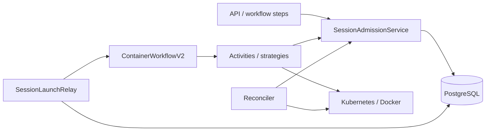

# Session admission architecture contract

This is the recommended design contract, not a claim that every proposed behavior is implemented. Decisions A1-A5 and their rationale are in the [technical design](TECH-DESIGN.md). A1 selects an installation-wide pool for AWS Marketplace. Implementation adjustments in [ROLLOUT.md](ROLLOUT.md) take precedence for the current version.

## Design paradigm

PostgreSQL owns the queue, policy and permits. Temporal owns execution. The runtime supplies resource facts. Relay and reconciliation recover delivery and consistency.

## Invariants and rules

### AD-1: One applicable pool

- **Binds:** policy resolver, enqueue and administration.
- **Prevents:** inconsistent combinations of installation, project and user limits across launch paths.
- **Rule:** a positive `SESSION_CONCURRENCY_LIMIT` selects `installation:default`; an absent ENV selects project/user fallback pools. A session never needs a second pool. Zero or invalid values prevent activation. Marketplace licensing is a separate integration. DB policy and revision are authoritative; deployment sync writes them, not individual worker boots. The proposed protocol uses policy SHARE for admission and UPDATE for mutations; the implementation conservatively uses UPDATE for all short admission transactions. Refresh derived pool limits before issuing grants.

### AD-2: Capacity unit and ownership

- **Binds:** SessionService, workflow-step launch, runtime and quota migration.
- **Prevents:** bypass through another session type or web replica.
- **Rule:** agent_session, workflow_step and auth_setup each consume one slot. Standalone tools are excluded. Every supported new session has one unique admission. After cutover, session runtime creation requires a valid admission/token. Resolve company ownership through SessionCompany; never guess from memberships. A whole WorkflowRun does not hold a slot.

### AD-3: Atomic FIFO

- **Binds:** enqueue, drain, cancel, release and limit updates.
- **Prevents:** exceeding capacity or bypassing the queue under concurrent requests.
- **Rule:** the proposed lock order is policy SHARE, optional WorkflowRun, optional StepRun, pool, admission, session and runtime operation; writers begin with policy UPDATE. The implementation serializes short decisions with policy UPDATE. Allocate a globally unique immutable FIFO ordinal from a DB sequence under the admission lock. Recheck the head and eligibility before granting. Occupancy is admitted/unreleased rows. A grant requires occupancy below the locked cap; decreases do not evict existing sessions. Keep network calls and external callbacks outside these transactions.

### AD-4: Durable launch intent

- **Binds:** SessionService, relay, TemporalService and container workflow v2.
- **Prevents:** losing a launch between DB commit and Temporal, or executing an agent twice.
- **Rule:** granting atomically stores an immutable permit and pending launch intent. Relay claims are durable; claim expiry never releases the slot. Use `agent-session-<id>` as workflow identity. Recover an existing execution; do not restart a closed one. Closed admissions never dispatch. Initial/create activities validate the permit and stop marker. Preserve errors for reconciliation.

### AD-5: Unknown creation retains capacity

- **Binds:** runtime create/start/exec, cancellation, cleanup and reconciliation.
- **Prevents:** a late Pod appearing after its slot was reassigned.
- **Rule:** persist a runtime-operation envelope before side effects. Cover Pod/Docker creation and startup as well as session routing resources and readiness repairs. Verify stable identity and ownership when adopting resources; use UID preconditions on deletion. Stop markers prevent new attempts but cannot revoke an already sent RPC. Unresolved operations block release until completion or quiescence is established. A DB token is not Kubernetes fencing. GET 404, timeout and a closed Temporal execution do not prove that a late create is impossible. Unresolvable uncertainty requires operator evidence and retains the slot.

### AD-6: Confirmed release

- **Binds:** finish/cancel/fail, cleanup strategies and stale/orphan sweepers.
- **Prevents:** treating terminal UI state or accepted DELETE as proof of free capacity.
- **Rule:** only the admission service sets released_at, idempotently, after stopping possible creators and confirming absence of the workload and its session routing resources. Keep runtime identity outside the session's cleared container_id. Unknown runtime/node state, pending deletion and cleanup errors retain capacity. Permits have no TTL. Common namespace resources are preserved. Missed release wakeups are recovered by periodic drain.

### AD-7: Separate waiting and execution clocks

- **Binds:** state machine, API/UI/MCP, parent workflows, watchdogs and analytics.
- **Prevents:** classifying queued work as crashed execution or consuming its execution budget.
- **Rule:** queued_at starts queue time; started_at starts admitted provisioning; ready_at marks readiness. Before admission there is no container workflow or Pod. API create remains 201. Parent waits exclude queue time and reconcile durable child state. StepRun launch retries return the existing session. Cancelling a queued workflow-step session cancels its parent and marks the step cancelled without automatic failure retry; the UI labels the action accordingly. A durable run stop marker gates subsequent enqueue/grant/launch/operation registration, and reconciliation repairs cancellation fan-out. Queue waiting has no TTL. Queued sessions use active-session privacy rules; do not expose other tenants' queue details.

### AD-8: Runtime capacity is a separate wait reason

- **Binds:** KubernetesRuntime, phase activities and ContainerWorkflowV2.
- **Prevents:** turning temporary capacity pressure into immediate failure, or hiding RBAC errors behind endless retry.
- **Rule:** typed quota-capacity and Unschedulable results wait while retaining admission. Use bounded probes and Temporal timers. Exempt explicit capacity waiting from the ordinary 30-minute running reaper and use its execution deadline/liveness instead. Unknown transport outcomes follow AD-5. Diagnose RBAC, image, configuration and authentication failures separately. Runtime waiting consumes the admitted container's 24-hour budget; pre-admission waiting does not. Do not automatically return an already executed agent to the business queue.

### AD-9: Recovery does not require another request

- **Binds:** relay, reconciler, schedules and observability.
- **Prevents:** permanently stalled queues after lost wakeups or restarts.
- **Rule:** a registered minutely schedule repeats bounded drain, relay and reconciliation. Durable claims and DB locks provide correctness across replicas; schedule overlap settings alone do not. Recover lost start acknowledgments using stable workflow identity. Unexpected resources without permits require reconciliation rather than being counted as free. Diagnostics should cover queue age, uncertain operations, cleanup lag and policy/occupancy mismatches.

### AD-10: One migration gate

- **Binds:** application deployment, aixle-infra, quota migration and operators.
- **Prevents:** legacy workers bypassing admission or old quotas remaining an accidental business limit.
- **Rule:** deploy compatible states/APIs and v2 workflows, stop legacy producers/workers, drain executions and resources, then activate. Derive fallback limits from effective CPU/memory/Pod quotas, not max_pods alone. Disable old quota creation before audited deletion. Preserve per-Pod limits and namespace isolation. Retire quota RBAC only after cleanup. Mode changes and rollback require pause/drain. Version or drain parent histories too.

## Stack

Versions were checked in source; live cluster versions were not measured.

| Component | Version |
|---|---|
| Ruby | 4.0.6 |
| Rails | 8.1.3.1 |
| Temporal Ruby SDK | 1.7.0 |
| PostgreSQL, production Terraform default | 18.2 |

## Consistency conventions

| Concern | Convention |
|---|---|
| Permit ownership | One admission per session; unreleased admissions prevent deletion |
| Policy precedence | DB revision, positive cap and a separate pause control |
| Runtime identity | Stable kind/name/namespace and verified ownership; UID preconditions for deletion |
| Launch recovery | pending/claimed/acknowledged/closed; repeated delivery does not repeat execution |
| Waiting UI | concurrency_limit, dispatch_pending, namespace_quota, cluster_capacity |
| Capacity guarantee | New grants do not exceed the cap; uncertainty reduces availability, never creates free slots |

## Deferred

- Multi-company pools within one shared SaaS deployment.
- Exact existing-scope overrides until deployment inventory is reviewed; proposed new-installation defaults are 2.
- Priority, weighted CPU/RAM scheduling, inter-company fairness and standalone-tool limits.
- Queue TTL and an expanded operational dashboard.
- Live pool-mode rebalancing; the current implementation requires a full drain.
