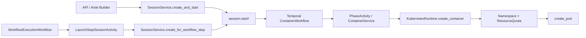
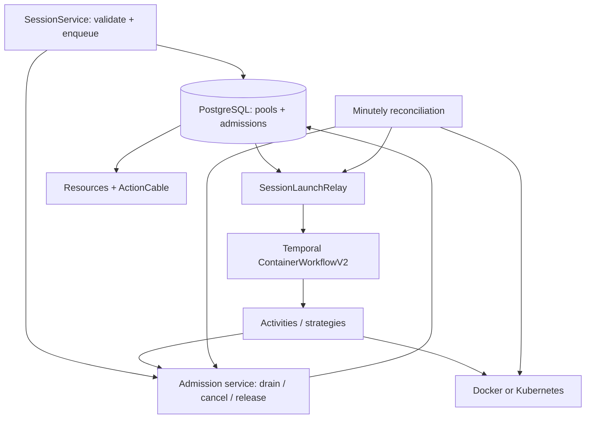
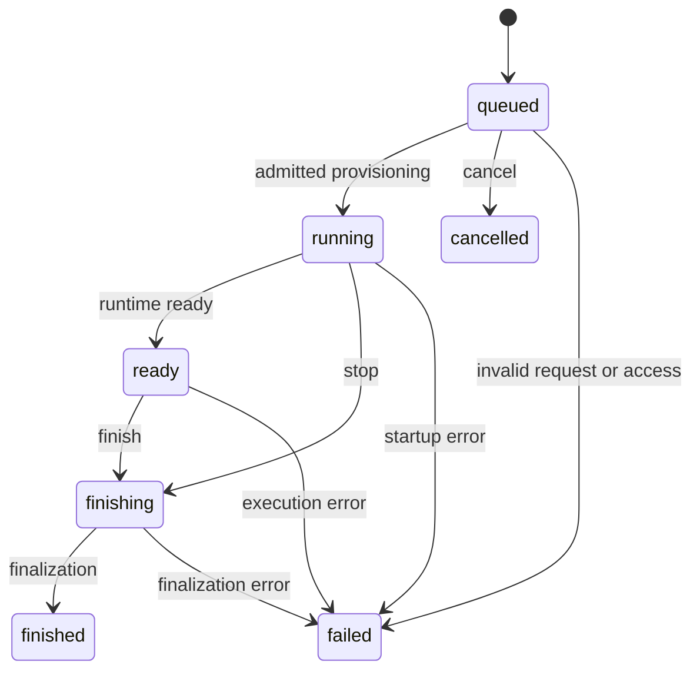

# Session launch queues and concurrency limits

Date: 2026-09-05. Status: design proposal with implementation underway.

Inspected checkouts: app@32efafaa and aixle-infra@c4bff01. Live cluster configuration and production database records were not inspected.

The current activation and recovery procedure is in [ROLLOUT.md](ROLLOUT.md). Implementation adjustments take precedence over the detailed proposal below: short admission transactions serialize on one policy row; uncertain create/start/exec requires operator-confirmed fencing; activation follows a complete legacy producer/worker drain. Marketplace entitlement APIs are outside this change. An absent ENV always selects project/user fallback queues.

## 1. Proposed solution

Move business concurrency control from Kubernetes ResourceQuota into the application. PostgreSQL stores the queue and occupied slots; Temporal starts and cleans up admitted sessions. No additional broker or Kubernetes operator is required.

```text
SESSION_CONCURRENCY_LIMIT=20
```

When all 20 slots are occupied, further sessions show Queued. The next session starts automatically after a slot is released. If the variable is absent, the same mechanism uses separate project or user queues.

**Decision A1:** the variable sets one cap for the entire Aixle installation. A Marketplace installation serves one company, and parallelism is sold separately. ENV delivers the purchased limit to deployment; it is neither a user preference nor billing/license enforcement.

Core decisions:

- Exactly one applicable pool: installation, otherwise project, otherwise user.
- Reserve a slot atomically before container launch; release only after confirmed cleanup. A failed Rails row alone does not free capacity.
- Business-queue waiting creates neither a Pod nor a container workflow.
- Retire legacy namespace business quotas after migration, preserving namespace isolation and per-Pod requests/limits.
- Present temporary Kubernetes capacity pressure as waiting; diagnose access, image and configuration failures separately.

The concise contract is [ARCHITECTURE-SPINE.md](ARCHITECTURE-SPINE.md).

## 2. Existing behavior at the inspected baseline

### 2.1. Launch and cleanup



Both SessionService launch paths immediately enter running and start Temporal. Running sets started_at; ready means the terminal is ready. Session persistence and workflow start have no durable delivery boundary. Repeating a workflow-step launch activity can create another session for the same StepRun.

Kubernetes creates bare Pods after ensuring namespaces, policies, secrets and aixle-resource-quota.

| Session | Namespace | Existing quota scope |
|---|---|---|
| Project-bound | <K8S_NAMESPACE>-project-<project_id> | Project |
| Project-less | <K8S_NAMESPACE>-user-<user_id> | User |

User quotas do not stack with project quotas or aggregate all projects belonging to that user. User scope is not split by company.

ResourceQuota exhaustion rejects creation with HTTP 403 before a Pod exists, so the scheduler cannot queue that Pod. [Kubernetes quotas](https://kubernetes.io/docs/concepts/policy/resource-quotas/)

The application wraps phase failures in ContainerService::PhaseError and marks them non-retryable. Retrying Temporal alone therefore does not provide a user-facing queue.

### 2.2. Pod count is not the only existing limit

Project/User defaults are max_pods 100, CPU limits 4000m and memory limits 8Gi. NamespaceResourceQuota overrides individual fields; nil inherits defaults.

For identical agent Pods in an otherwise empty namespace, estimate capacity as:

```text
min(max_pods,
    floor(namespace_cpu_limit / pod_cpu_limit),
    floor(namespace_memory_limit / pod_memory_limit),
    equivalent request limits when configured)
```

| Repository configuration | Pod CPU limit | Pod memory limit | Estimated Pods |
|---|---:|---:|---:|
| Application/dev defaults | 1000m | 1Gi | 4 |
| Staging | 1000m | 2Gi | 4 |
| Production | 1000m | 3Gi | 2 |

These are declaration-based estimates, not measured production limits. Overrides, other Pods and admission policies change them. Mapping max_pods=100 directly to max_sessions=100 could sharply increase load.

### 2.3. Integration points

| Source | Relevant baseline behavior |
|---|---|
| [SessionService](../../../app/services/session_service.rb) | Two launch paths plus finish/cancel/fail; Temporal start errors fail sessions |
| [TerminalSession](../../../app/models/terminal_session.rb) and [state machine](../../../app/state_machines/terminal_session_state_machine.rb) | No queued state; active excludes finishing; terminal callbacks clear container_id |
| [ContainerWorkflow](../../../app/temporal/workflows/container_workflow.rb) | Executes phases, waits for a signal and cleans up; cleanup-only failure is not raised when execution succeeded |
| [BaseStrategy](../../../app/services/container_strategies/base_strategy.rb) | Cleanup can return failed without raising, while after_cleanup still finalizes the session |
| [KubernetesRuntime](../../../app/services/container_runtime/kubernetes_runtime.rb) | Application owns quota creation; Pod creation lacks adoption on retry; DELETE does not await disappearance |
| [SessionCompany](../../../app/services/session_company.rb) | Explicit company_id, then project ownership; never guess from memberships |
| [Parent workflow](../../../app/temporal/workflows/workflow_execution_workflow.rb) | Sequential/parallel steps, 23-hour waits and a 600-second session launch activity |
| [Session stale scanner](../../../app/temporal/activities/session/cleanup_stale_activity.rb) | Running: 30 minutes; ready: 25 hours; finishing: 10 minutes |
| [Run stale scanner](../../../app/temporal/activities/workflow/cleanup_stale_runs_activity.rb) | Age-only 4-hour running/paused threshold |
| [OutboxRelay](../../../app/services/outbox_relay.rb) and [GateReconciler](../../../app/services/gate_reconciler.rb) | Existing durable delivery and reconciliation patterns with external work after commit |
| [Orphan sweeper](../../../app/temporal/activities/container/sweep_orphaned_resources_activity.rb) | Route-token ownership, 10-minute sweep and 15-minute age guard; too slow for ordinary slot release |
| [Production HPA](../../../../aixle-infra/kube/prod/15-hpa.yaml) | Web/MCP: 2-6 replicas; workers: 1-4; process-local counters are insufficient |

## 3. Limit selection

### 3.1. Configuration semantics

| Condition | Applicable limit | Pool key |
|---|---|---|
| Positive integer SESSION_CONCURRENCY_LIMIT | Installation cap | installation:default |
| Absent/empty ENV, project present | Project override or project default | project:<id> |
| Absent/empty ENV, no project | User override or user default | user:<id> |
| Zero, negative, fractional or malformed ENV | Configuration error; do not activate | None |

Installation mode preserves stored scoped overrides but ignores them for admission. Stacking installation AND project AND user caps is outside v1.

**Assumption A2:** fallback defaults are 2. Existing deployments derive reviewed defaults and overrides from section 2.2; dev/staging may explicitly retain 4. This is a business setting, not a value derived from current CPU utilization.

Deployment sync validates ENV and writes authoritative DB policy with a revision. Workers read policy rather than rewriting it on boot. This prevents inconsistent limits during rolling deployment. Licensing metadata can be added by a separate integration; its absence must not contradict the required scoped fallback.

The proposed protocol reads policy under FOR SHARE and writes cap/default/override/pause changes under FOR UPDATE with a revision increment. Under the pool lock, refresh any stale derived limit before issuing grants. Thus no post-update grant can use an old cap. The current implementation instead serializes all short admission decisions using policy UPDATE.

### 3.2. Sessions consuming slots

**Assumption A3:** agent_session, workflow_step and auth_setup each consume one slot, regardless of interactive mode. An idle interactive session still holds capacity.

The existing tool_setup validation value is not supported by TerminalSession strategy; queueing does not make that unsupported type executable.

Standalone tool workflows without a session are excluded. Limiting all containers would require a separate contract: a nested tool must not wait for the same slot held by its calling agent. Similarly, a whole WorkflowRun must not reserve capacity; only its actual session steps do.

### 3.3. FIFO and limit changes

Use a globally unique immutable enqueue ordinal from a DB sequence, allocated under the queue lock. Within a pool, this defines enqueue order rather than HTTP arrival time across replicas. Gaps are allowed; cross-pool execution order is not guaranteed.

Increasing capacity permits more grants. Decreasing from 8 occupied slots to cap 5 does not kill sessions; new grants wait until occupancy is below 5. The invariant concerns new grants, not retroactively eliminating excess occupancy caused by a decrease.

The proposal allowed paused remapping of queued entries using their original global ordinals after occupied slots drained. The current implementation requires all admissions and active runs to drain before a pool-mode change; live redistribution is deferred.

### 3.4. Future multi-company installations

A shared SaaS deployment could replace installation:default with company:<SessionCompany.company_id_for(session)> and per-company max_concurrent_sessions. This is outside the Marketplace rollout. A default of 20 for two companies could mean 40 total sessions.

Project-less sessions need explicit company ownership. Changing the global User fallback to a company/user pair would change existing semantics and require migration. Queues do not require renaming namespaces.

### 3.5. Marketplace boundary

Marketplace owns the commercial offer and entitlement. Delivery into ENV may use deployment bootstrap, Terraform, Helm or a license adapter; this design does not select that integration or calculate billing inside workers.

The initial implementation needs only a positive deployment input persisted in policy. Purchased-tier changes use the same policy update and do not restart existing sessions. Future online entitlement checks need explicit cache/grace behavior and must not create extra slots on failure.

## 4. Architecture and data

A pool groups sessions sharing a cap. An admission represents a session in admission control. A permit reserves one slot. Relay delivers persisted launch intent; reconciliation compares DB, Temporal and runtime facts.



### 4.1. Data responsibilities

The detailed schema was proposed before implementation; exact deployed columns are defined by the migration.

| Record | Required responsibility |
|---|---|
| Policy singleton | Enabled/pause state, installation cap, project/user defaults and revision |
| Scoped limit | Unique Project/User scope and positive max_sessions |
| Admission pool | Unique key, positive derived limit and policy revision; stable lockable row |
| Admission | Unique session, pool, immutable enqueue ordinal, admission/release/stop timestamps, immutable permit token and wait reason |
| Admission delivery fields | pending/claimed/acknowledged/closed, durable claim identity/time and launch error |
| Admission runtime fields | Runtime kind and stable identity, phase state and reconciliation evidence |
| Runtime operations | Durable identity/phase and in-flight/completed/uncertain outcomes; never overwrite unresolved attempts |

Enforce unique session admissions, FIFO identity, referential integrity and guards against deleting unreleased admissions. Closed launch intent cannot dispatch again. Pending admissions may close on cancellation without ever consuming a slot.

Occupancy is the count of admissions whose admitted_at is set and released_at is absent. Keep admissions for audit; do not add a mutable cached occupancy counter initially. Admission also serves as launch outbox rather than reusing the unrelated TriggerEvent domain.

TerminalSession owns the user-visible result. Admission owns permission to consume capacity. Runtime identity remains available after session callbacks clear container_id.

### 4.2. Atomic enqueue and grant

1. Validate access, supported session type and credentials. Invalid requests do not become waiting jobs.
2. Resolve policy inside the admission transaction. The proposed order is policy, optional WorkflowRun, optional StepRun, pool, admission, session and runtime operation. Check the parent's durable stop marker. The implementation uses policy UPDATE to serialize these short decisions.
3. Save the queued session, admission and StepRun association atomically. Attach resolved resources before drain can see the session. Activity retry returns the existing StepRun session, including a terminal one; an explicit user retry creates a new StepRun.
4. Under the same admission protocol, recompute occupancy and grant only available slots in FIFO order. Store admitted_at, an immutable random permit token and pending launch intent together. Recheck candidate eligibility and the queue head while locked.
5. Perform relay and external work after commit.

Use bounded batches and skip/cancel stopped candidates. A fast path must not bypass earlier queued work. Kubernetes, Temporal and OAuth requests must not run under admission locks; external AASM callbacks must respect that boundary.

PostgreSQL row locks coordinate independent replicas. SKIP LOCKED may distribute unrelated pool/relay work, but does not replace a common lock or FIFO within one pool. [PostgreSQL locking](https://www.postgresql.org/docs/18/explicit-locking.html)

### 4.3. Durable launch delivery

Relay persists a claim token/time before making Temporal RPCs. Claim expiry permits redelivery, never slot release. Validate that the admission is still open before starting.

Use workflow ID agent-session-<session_id> and a separately registered ContainerWorkflowV2. Pass session/admission IDs, permit token and manifest. Apply explicit workflow ID reuse/conflict behavior.

A lost start response is recovered against the same identity. An existing open execution is delivered; a closed execution triggers outcome/cleanup reconciliation, not another agent run. Closed admissions remain closed even after Temporal history retention expires. Verify SDK behavior against pinned temporalio 1.7.0. [Temporal Ruby Client](https://ruby.temporal.io/Temporalio/Client.html)

During Temporal outages, durable launch intent remains available for retry. A request must not become failed solely because its start acknowledgment was lost.

### 4.4. Runtime idempotency and late publishers

Initial activities and operations capable of creating/starting resources check the admission token and parent stop marker. Register durable operation envelopes before side effects, including routing creation and readiness repair. Do not replace an unresolved attempt with a fresh one.

Keep deterministic terminal-<route_token> identity in the recorded namespace. Adoption verifies ownership and expected identity/specification. Use UID preconditions when deleting session resources. Common namespace policies/middleware do not belong to the session cleanup set.

A DB token cannot atomically fence Kubernetes. Cancellation can occur between a permit check and a sent RPC. Record stop first and prevent subsequent attempts; in-flight or uncertain attempts continue holding their slot.

Timeout, worker death, workflow closure and GET 404 do not prove a create cannot complete later. Reconciliation can locate resources by stable identity, but release also requires proof that old publishers cannot act. If that proof is unavailable, retain the slot for operator recovery. Never rerun an already executed agent merely to recover delivery.

Successful cleanup first closes new operation registration, then verifies all earlier operations are resolved, deletes session resources and confirms absence. This also prevents late route repair after release.

## 5. States, release and UI



Queued may briefly include a reserved session awaiting dispatch. Distinguish concurrency_limit from dispatch_pending. Provisioning sets started_at; queue time is measured separately.

Capacity remains occupied from admitted_at until released_at, including provisioning, ready, finishing and cleanup after failed/cancelled. User-visible completion and infrastructure release can occur at different times.

Only the admission service releases capacity after runtime absence and creator-quiescence checks. Accepted Kubernetes DELETE is insufficient. Unavailable control plane/node state remains unknown; force deletion does not prove a process on an unreachable node has stopped. Docker likewise requires confirmed container deletion.

The conservative cleanup set includes the workload, Service, IngressRoute and session Middleware. Route cleanup failure can delay a slot. Preserve shared namespace resources. Propagate cleanup-only errors and failed cleanup results into reconciliation; neither workflow success nor a finished session is cleanup proof.

### API and interface

- Keep POST /api/v1/terminal_sessions returning 201 for a persisted queued session; validation/preflight failures retain their error responses.
- Expose queued_at and wait_reason. The broader proposal also considered admitted_at, approximate nullable queue_position and can_cancel; the first implementation need not publish a global queue position.
- Do not expose other tenants' IDs, owners, prompts or precise global occupancy.
- Show waiting and cancellation; mount terminal/editor only when ready. A queue position, if added, is not an ETA.
- Update generated resources/types, session views, Builder, profile authentication, onboarding, workflow pages, sessions/runs feeds and MCP status/stop tools.
- Treat queued as active for privacy. Treat cancelled as terminal without automatically invoking failure retry. Preserve destruction guards for unreleased capacity.
- Cancelling a queued workflow-step session cancels the parent and labels the action Cancel workflow. Standalone cancellation affects only that session. The existing finish endpoint routes queued requests to cancellation.
- Use existing GET/session updates and ActionCable. Exact real-time position recomputation for every waiting session is unnecessary.

## 6. Workflow steps and clocks

LaunchStepSessionActivity creates or returns a queued session and completes promptly; it never occupies a worker thread waiting for capacity. API, Builder and background launches share admission control.

| Mechanism | Queue-aware rule |
|---|---|
| 24-hour container workflow timeout | Starts after admission; pre-admission queue is outside it |
| 30-minute running reaper | Exempt queued and explicit capacity waits; use phase deadline/liveness |
| Ready/finishing scanners | Use phase state and route release through admission cleanup |
| 4-hour stale-run reaper | A queued child does not make its parent stale; unknown Temporal response is not death |
| 23-hour parent waits | Separate admission waiting from execution/decision time |
| Parallel steps | Handle completed/cancelled children even when siblings remain queued |
| Run cancellation | Persist stop before fan-out; block new enqueue/grants/operations and reconcile children |
| Dead-container/provider scanners | Inspect executable phases, never classify queue waiting as a dead agent |

The proposal allowed idempotent admission/terminal signals plus durable-state polling. The implemented parent v2 polls child state and ignores premature container-finished notifications until cleanup is reflected durably. Queue-to-cancel/failure must resolve the parent even without a child container workflow. Parent histories need versioning or a complete legacy drain. [Temporal message passing](https://docs.temporal.io/develop/ruby/workflows/message-passing)

Run cancellation commits a durable stop marker under the shared admission protocol. Later attempts cannot register; already registered RPCs require their normal uncertainty/cleanup resolution. Child fan-out happens after commit and is recoverable without locking all pools together.

**Assumption A4:** business queues have no TTL. They persist until admission or cancellation. Any future queue_deadline must be distinct from execution and stale thresholds. An active parent therefore cannot retain an execution timeout that implicitly includes unlimited queue time.

## 7. Runtime capacity waiting

| Situation | Behavior |
|---|---|
| No application slot | Queued; no Pod |
| Explicit 403 exceeded quota | namespace_quota wait; retain reservation |
| Pending/Unschedulable for CPU/RAM | cluster_capacity wait; retain Pod and reservation |
| Control-plane timeout/5xx | Unknown outcome; retain capacity and reconcile |
| RBAC/admission/configuration denial | Diagnosed failure, not a business-capacity wait |
| Invalid image or credentials | Startup failure and cleanup; do not hide in indefinite retry |

Preserve the underlying Kubernetes error in PhaseError. Do not classify every 403 as capacity or reuse the LLM-provider QuotaErrorDetector.

Use idempotent endpoint creation and bounded readiness probes, with retry timers in Temporal. Existing readiness timeouts must not automatically turn Unschedulable into permanent failure. Other image/port/route failures retain finite deadlines. [Temporal error handling](https://docs.temporal.io/develop/ruby/best-practices/error-handling)

**Assumption A5:** runtime capacity waiting consumes the existing 24-hour container execution budget, with earlier operational alerts. Exhaustion produces an infrastructure error and cleanup. Do not send an admitted agent back to the business queue automatically.

A DB-only queue does not stimulate the cluster autoscaler; admitted unschedulable Pods do. Choose N with node capacity, Pod requests/limits and platform/tool workloads in mind. N does not guarantee available RAM. [Autoscaler manifest](../../../../aixle-infra/kube/prod/14-cluster-autoscaler.yaml)

## 8. Reconciliation and operations

Best-effort drain/relay handles normal launches; a registered minutely Temporal schedule with overlap skip repairs missed work. Existing worker schedule synchronization registers it. Correctness comes from DB locks and durable claims, not schedule overlap alone.

Bound and rotate scans of pending launches, reservations and cleanup work. One failing scope must not permanently starve others.

| Failure | Recovery rule |
|---|---|
| Crash after enqueue commit | Periodic drain finds the admission |
| Crash after reservation before start | Launch intent retries |
| Lost Temporal acknowledgment | Same workflow identity, no second execution |
| Lost resource-creation response | Stable identity plus operation evidence; retain uncertainty |
| Cancel races with start | Stop marker; retain slot until publishers are fenced and cleanup confirmed |
| Cleanup fails or deletion remains pending | Retain reservation and retry verified cleanup |
| DB unavailable | No new grants; recover releases later |
| Runtime unavailable | Missing response never frees capacity |
| Unexpected post-cutover resource without admission | Reconcile/alert; never count it as free |

Normal handoff should follow cleanup promptly; periodic recovery targets roughly a minute plus batch processing under healthy services. The orphan sweeper is a fallback, not the normal admission clock, and must respect admission ownership.

Operational diagnostics should expose queue age/depth, occupied capacity, dispatch delay, capacity waits, uncertain operations, cleanup lag and recovery failures. Avoid unbounded pool/session IDs as metric labels; keep detailed IDs in logs/admin views. A force-release button without proof of workload absence is inappropriate.

## 9. aixle-infra changes

1. Document optional SESSION_CONCURRENCY_LIMIT in dev/staging/prod app ConfigMaps. Production N requires a capacity audit, not a replica-count formula.
2. Deployment applies migrations and explicitly syncs ENV into DB policy. Existing workloads use envFrom; changing ENV requires process recreation, but worker boots must not overwrite policy. [ConfigMaps](https://kubernetes.io/docs/concepts/configuration/configmap/)
3. Use an operational admission pause for cutover. Replicas may scale independently of the shared DB cap.
4. Inventory exact legacy aixle-resource-quota objects using runtime-origin/scope ownership on the Namespace. Quotas themselves lack these labels. Record an audited UID allowlist; changed UIDs require re-review.
5. Cleanup needs list/delete permissions on an appropriate migration identity. Existing [runtime RBAC](../../../../aixle-infra/kube/prod/06-rbac-runtime.yaml) supplies create/get/update for quotas. Retire unnecessary rights after cleanup.
6. Preserve namespace isolation, network policies, secrets, routing and per-Pod resources. No extra Redis, broker or Terraform resource is needed for admission.

If independent safety quotas remain, document them separately and verify compatibility with N. Do not silently retain old 4000m/8Gi limits as a second business cap.

## 10. Migration and rollout

Use a controlled drain rather than attempting to infer ownership for every legacy execution. The executable sequence is maintained in [ROLLOUT.md](ROLLOUT.md).

1. Inventory effective quota fields, defaults, overrides and other workloads. Preserve a rollback snapshot. A calculated capacity of zero needs correction, not rounding up to one.
2. Deploy schema, queued/cancelled surfaces, idempotent runtime, v2 workflows, relay/reconciliation and queue-aware clocks with admission initially disabled.
3. Stop legacy launch traffic, scheduled producers and workers. Drain container and parent executions and verify runtime absence. A surviving worker that can launch without admission invalidates the gate.
4. Import reviewed scoped limits and apply the intended installation cap/defaults. Preserve old data during the rollback window.
5. Disable legacy quota creation and remove only audited quotas. Merely returning early from quota creation does not delete existing objects.
6. Activate admission after compatibility checks. Never replay old histories through incompatible new workflow logic; version or drain parents too. [Temporal versioning](https://docs.temporal.io/develop/ruby/workflows/versioning)
7. Validate N=2 across replicas/projects: two reservations, queued excess work, cancellation, slot handoff and recovery. Compare DB admissions with actual resources.
8. Retire obsolete quota administration/model/defaults/RBAC only after the rollback window.

Rollback also requires pause/drain. Old code must not receive queued rows it cannot understand. Restore old quotas from the snapshot only after v2 work and cleanup have drained; until then, rollback only to an admission-compatible release.

## 11. Implementation and validation

| Stage | Changes | Evidence required |
|---|---|---|
| Admission core | Policy/pool/admission/limits and migration | Independent DB connections enforce N, FIFO, overrides, decrease and pause |
| Durable launch | SessionService, StepRun idempotency, relay and Temporal | Failures at commit/RPC boundaries neither lose intent nor duplicate execution |
| Runtime lifecycle | Workflow v2, operations, identity and cleanup | Late creates/cancel/unknown deletion never release early |
| Queue-aware consumers | UI/API/MCP, parent clocks and scanners | Long waits survive old thresholds; cancellation and privacy hold |
| Infra cutover | ConfigMaps, sync, quota allowlist and runbook | Legacy quotas are removed without touching unrelated infrastructure |

Acceptance scenarios include:

- Shared N=2 across concurrent users/projects, and independent scoped fallback when ENV is absent.
- Concurrent enqueue/release/cancel and equal timestamps, using real DB connections.
- StepRun activity retry, lost start acknowledgment, closed workflow before acknowledgment and relay after admission closure.
- Worker death after create, delayed RPC, failed cleanup, stuck Terminating and unavailable control plane.
- Pending Pods that later start without another user request; RBAC 403 remains a diagnosed failure.
- Cancellation before grant, after reservation, during create/ready/cleanup and across queued siblings.
- Restart between enqueue and drain, missed wakeup and recovery without another HTTP request.
- Long waits with revoked credentials/membership and no privacy leaks through queue metadata or broadcasts.
- Cap/mode changes, mixed deployment and legacy replay compatibility; no ungated launch after cutover.

## 12. Alternatives and remaining decisions

| Alternative | Tradeoff |
|---|---|
| ResourceQuota plus 403 retry | No shared cross-namespace business cap, durable FIFO or cancellation UX |
| Temporal worker/activity slots | Limits activities, not Pods living between activities; replica scaling changes concurrency |
| Redis semaphore | Adds a DB/Redis/runtime recovery protocol; lease expiry can free a slot while a Pod lives |
| One Temporal dispatcher per pool | Feasible, but duplicates DB/UI queue state and adds ownership/history rollover concerns |
| PostgreSQL plus existing Temporal | Selected: one transactional admission authority and existing recovery patterns |

A1 is resolved as an installation cap for Marketplace. A2-A5 define proposed operational defaults: fallback 2, auth sessions included, FIFO without priorities, no business-queue TTL and runtime waiting within the admitted execution budget. Weighted scheduling, priorities, multi-company fairness and limits for all standalone tools remain separate extensions.
