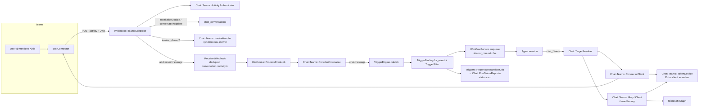

# Microsoft Teams integration — technical design

**Status:** Direction agreed 2026-09-30 (§18). Phase 0 in PR #365; phase 1 built on top of it (§19) and verified end to end on staging with a second Microsoft 365 tenant (2026-10-07). Spikes (§16): all pass, 5 (slash commands, answered as targeted messages) on staging on 2026-10-07. Phase 2, Teams only and without approvals, is built in the same PR (§20); the same self-service start for Slack followed (§21)
**Date:** 2026-09-30
**Code baseline:** `6438f08a`
**Audience:** backend, frontend and operations engineers
**Related:** the parallel task-tracker design (`docs/design/task-tracker-integrations.md` on branch
`artempartos/hogfish`, §17 lists the shared seams); [azure-devops-integration.md](./azure-devops-integration.md)
(the Entra app and certificate credential this reuses); [federated-identity.md](./federated-identity.md)
(the `oid`-keyed Microsoft identity this maps senders onto); the Slack research that shaped what ships today,
[technical-slack-chatops-integration-research-2026-06-25.md](../research/technical-slack-chatops-integration-research-2026-06-25.md)
and [technical-slack-multi-tenant-workspace-routing-design-2026-06-28.md](../research/technical-slack-multi-tenant-workspace-routing-design-2026-06-28.md).

## 1. Goal and product shape

Today someone @mentions the Aixle bot in a Slack channel. If the message matches a trigger, a workflow runs,
its agent reads the thread and answers in it, and files attached to the message arrive as run inputs.
The business wants the same thing from Microsoft Teams.

A company that connects Microsoft Teams gets:

1. **One connection per Microsoft 365 organization.** A Microsoft 365 administrator approves Aixle once and
   publishes the Aixle app to the organization. From then on, anyone can add it to a team or a chat.
2. **Message triggers.** An @mention in a channel or group chat, or any message in a 1:1 chat with the bot,
   starts the matching workflow. The trigger model, filters and fan-out are the same as for Slack.
3. **A status card in the thread** that changes in place: accepted → running → completed or failed, with a
   link to the run. It also covers the cases where the run never started, and says why.
4. **Agent replies.** The agent reads the thread and posts, edits and deletes messages with the same tools
   it uses for Slack.
5. **Help.** `help` (or `/help`) lists what this channel can start.
6. **Files, both ways.** Files in the triggering message, in a channel, a group chat or a 1:1 chat, become
   run input assets. Files the agent attaches are uploaded natively. This needs the file access the
   Microsoft 365 admin approves at connection time (§8.5).

| Capability | Slack today | Teams v1 | Later |
|---|---|---|---|
| Connect once, route by workspace/tenant | OAuth install per workspace | Admin approval per tenant (§6.2) | Teams Store self-service (phase 3) |
| Start a workflow from a message | `app_mention` only | @mention in channel and group chat; every 1:1 message | "Run workflow" message action with a form (phase 2) |
| Channel filter | Raw channel id typed by hand | Picker from the conversations the bot has seen (§6.4) | Same picker for Slack |
| Tell the requester what happened | Failure notice only, when `notify_on_failure` is on | Status card updated in place (§8.2), in Teams **and Slack** | — |
| Agent reads the thread | `conversations.replies` | Graph, with resource-specific consent (RSC), in channels and group chats | — |
| Agent posts, edits, deletes | Four `slack_*` tools | The same four tools, renamed `chat_*` (§8.3) | — |
| Rich layout | Block Kit | Adaptive Cards ≤ 1.5 | Interactive cards (phase 2) |
| Files in | Any message | Channels, group chats and 1:1 chats, with admin-approved file access (§8.5) | — |
| Files out | Native upload | Channels: uploaded to the channel's files. 1:1: file consent card. Group chats: linked as project assets | Native upload in group chats |
| Help | `/help`, and when nothing matched | `help` / `/help`, and when nothing matched | `run <workflow>`, `status` commands |
| Approve a gate from chat | No | No | Adaptive Card buttons (phase 2) |
| Who may trigger | Anyone in the workspace | Anyone in the tenant (same as Slack) | — (decision 4) |

## 2. Decisions

| Area | Decision |
|---|---|
| Shape | A **messaging port** (`Chat::`) with two providers, Slack and Teams. It covers event normalization, run context, replies, help and status reporting. Slack moves onto it first, with no behavior change (phase 0). The alternative, a Teams copy of every Slack branch, is rejected in §5.1. |
| Transport | A Teams **bot** speaking the Bot Framework Connector REST protocol from Rails. No SDK and no Node/.NET/Python sidecar (§5.4). Outgoing webhooks, Workflows webhooks and Graph change notifications cannot do the job (§4, F12). |
| Bot identity (SaaS) | A **single-tenant Azure Bot** attached to the existing multi-tenant **"Aixle Flow"** Entra app, which production already uses for Microsoft sign-in and Azure DevOps. The bot authenticates with that app's certificate. Multi-tenant bot creation was deprecated after 2025-07-31 (F3). The same app also carries the file permission: **one Entra app per environment for everything** (§6.1). |
| Bot identity (self-hosted) | Each operator registers their own Entra app and Azure Bot. The same code runs with a different configuration (§6.1). |
| Connection | Company-wide `Integration(provider: teams)`, one per Entra tenant. **One tenant belongs to exactly one company**, which is the Slack workspace rule. Routing uses a `WebhookEndpoint` slug, as Slack does. |
| Binding proof | A tenant is bound to a company only when a directory administrator of that tenant signs in with Microsoft, inside a flow an admin of that company started (§6.2). A tenant id in a redirect is never evidence. |
| Distribution | v1: an app package that Aixle generates and the customer's admin uploads to the org catalog. Phase 3: Teams Store listing. Self-hosters always use their own package (§6.3). |
| Events | One provider-neutral event type, `chat.message`, with a documented data contract (§7.3). `slack.message` bindings are migrated onto it. |
| Trigger kind | `chat`, replacing `slack`. `slack` stays accepted as an input alias for the API, MCP and templates. |
| Run context | `shared_context["chat"]` replaces `shared_context["slack"]`. Readers fall back to the old key for runs that were in flight or retried across the deploy. |
| Agent tools | `chat_post_message`, `chat_read_thread`, `chat_update_message`, `chat_delete_message`. The provider comes from the run's origin or an explicit target. Provider-native rich payloads use explicitly named arguments (§8.3). `slack_*` become deprecated aliases for one release. |
| Status reporting | Per-trigger `status_reporting`: `none`, `failures` (today's Slack behavior) or `lifecycle` (the status card). The column is source-neutral: tracker triggers use `failures` for their one failure comment on the issue. `WorkflowTriggers::Creator` sets the default per kind: `lifecycle` for chat triggers (Teams and Slack alike, decision 3), `failures` for trackers, `none` elsewhere. |
| Graph permissions | RSC `ChannelMessage.Read.Group` and `ChatMessage.Read.Chat`, consented by the team or chat owner at install. Tenant-wide `Files.ReadWrite.All` is requested from the Microsoft 365 admin in the connection flow (§6.2). It is in v1 and asked for by default, and the admin may decline it. The connection then works without files, and every Graph file call is confined to the triggering message and its conversation (§8.5). |
| Identity | A sender is `(tenant id, aadObjectId)`. It maps to an Aixle user through the existing `UserIdentity(provider: microsoft, subject: oid)` rows. It is never matched by email (§9). Run ownership does not change: the run belongs to the trigger's creator. |
| Unaddressed messages | RSC also delivers channel messages that do not mention the bot. The controller drops them before anything is persisted or logged (§7.2). |
| Clouds | Commercial cloud in v1. Every endpoint comes from one configured endpoint set, so GCC is configuration only. GCC High and DoD are for self-hosters only (F14). |

## 3. What exists

### 3.1 Slack as built

- **One app per deployment.** `Settings.slack.*` holds the app credentials (`config/settings.yml:344-354`).
  Each company installs the app through OAuth v2 (`app/services/slack/oauth.rb`,
  `app/controllers/web/integrations/slack_oauth_controller.rb`). The install is stored company-wide as
  `Integration(provider: slack, project_id: nil)`, with the bot token in encrypted `credentials_data`
  (`app/services/slack/integration_service.rb:19-66`).
- **Routing and uniqueness.** `provision_endpoint` creates a company-scoped
  `WebhookEndpoint(slug: "slack-team-<team_id>")`. Its unique slug is what enforces "one workspace, one
  company" (`integration_service.rb:75-98`, `db/schema.rb:1570`).
- **Inbound path.**
  1. `POST /webhooks/slack/events` checks the `slack_v0` signature and finds the endpoint by team.
  2. It records a `ReceivedWebhook` keyed by `event_id`, enqueues `Webhooks::ProcessEventJob` and returns
     200 (`app/controllers/webhooks/slack_controller.rb:11-40`).
  3. The job's `normalize_slack` keeps only `app_mention` and drops bot authors. It emits `slack.message`
     with `channel, user, text, team, ts, thread_ts, files, integration_id`
     (`app/jobs/webhooks/process_event_job.rb:40-87`).
  4. `TriggerEngine.publish` fans the company-scoped event out to the bindings of every project
     (`app/models/trigger_binding.rb:48-57`).
  5. `TriggerFilter` matches the filters (`app/services/trigger_filter.rb`).
- **Run start.** `TriggerEngine.fire_workflow` calls
  `WorkflowService.enqueue(user: binding.created_by, mode: :non_interactive, shared_context: slack_run_context(event), input_asset_ids: …)`.
  Files are downloaded **per project at fire time** by `Slack::FileIngestor`
  (`app/services/trigger_engine.rb:199-232, 285-304, 385-401`).
- **Agent tools.** `slack_post_message`, `slack_read_thread`, `slack_update_message` and
  `slack_delete_message` are injected into every workflow-step session when Slack is connected.
  They default to the triggering thread (`app/services/internal_tools/slack_*.rb`,
  `concerns/slack_context.rb`). Interactive Block Kit elements are rejected because there is no
  interactivity endpoint.
- **Replies without an agent.**
  - `Slack::HelpResponder` answers `/help` and messages that matched nothing.
  - `Slack::RunFailureNotifier` answers when a run fails and its binding has `notify_on_failure`. It is
    started from `WorkflowRunStateMachine#announce_failure`.
- **Identity.** Slack users are not mapped to Aixle users. The run belongs to the binding's creator.
  Anyone who can mention the bot anywhere in the workspace can fire any matching binding in any project of
  the company.

### 3.2 Slack-specific code in generic places

A second provider has to touch each of these. The port in §5 removes them rather than adding
`when "teams"` next to each one.

| Place | What is hardcoded |
|---|---|
| `TriggerEngine` | `SLACK_MENTION_TOKEN`; help branches keyed on the `slack.` prefix; `slack_run_context`; `input_asset_ids_for` requiring `source` to start with `slack:`; `INTERNAL_DATA_KEYS`; `slack_help_request?` |
| `Webhooks::ProcessEventJob` | the `case "slack"` normalizer switch, and a comment tying company scope to Slack |
| `Webhooks::IngressController` | Slack `url_verification` and `event_id` branches. These are dead code, because Slack endpoints store no per-endpoint secret |
| `TriggerBinding` | `RESERVED_SLACK_COMMAND`; `notify_on_failure` treated as Slack-only |
| `WorkflowRunStateMachine#announce_failure` | calls `Slack::NotifyRunFailureJob` directly |
| `ContextBuilders::WorkflowContext` | "This run was started by a Slack message from <@U…>", reading `dig("slack", …)` |
| Integration lookup for a run | three copies: `slack_context.rb:64-77`, `run_failure_notifier.rb:54-67`, `help_responder.rb:38-50` |
| Trigger kinds | five lists: `WorkflowTriggers::Creator::KINDS`, `TriggersController#binding_kind`, `PersonalTools::WorkflowTriggerSupport`, `Templates::Exporter`, `config/templates/template.v1.json` |
| Frontend | `TriggerFormPanel.tsx` (the kind union, Slack fields, submit branch), `TriggersTab.tsx`, `IntegrationsContent.tsx` (provider labels, connect menu) |
| Enums | `Integration#provider`, `WebhookEndpoint#provider` / `verification_strategy`, `AssetVersion#source` |

### 3.3 Drift and latent defects found while mapping

These are fixed as part of phase 0, because the port touches exactly these lines:

- **Filters see the raw mention token.** The trigger filter matches `text` with `<@U123>` still in it. Only
  the `/help` check strips it (`trigger_engine.rb:32, 406-411`). So `eq` and `starts_with` patterns never
  match the way users expect.
- **`triggers-and-gates.md` does not match the code:**
  - it promises triggers on "a message / mention / reaction", but only mentions are handled;
  - it calls triggers project-scoped, but chat events fan out across the company;
  - it lists Schedule as "planned", but it is implemented;
  - it names `WorkflowService.start` as the entry point, but the code calls `enqueue`.
- **`config-schema.md`** says the signing secret verifies "interaction payloads", but there is no
  interaction endpoint.
- **Dead attribute.** `IntegrationResource#slack_request_url` reads a setting that nothing writes.

## 4. Teams platform facts that constrain the design

Verified against Microsoft Learn pages updated in 2025–2026. Sources are listed at the end.
**[C]** marks a fact where sources conflict, and §16 schedules a spike for each one.

- **F1. No Ruby SDK; the raw protocol is supported.**
  - The Bot Framework SDK reached end of support on 2025-12-31 and is archived.
  - Microsoft's current SDKs (the Teams SDK and the Microsoft 365 Agents SDK) cover C#, JavaScript and
    Python only.
  - The Connector REST protocol is still documented (updated 2026-09-01), "no special SDKs are required",
    and 2026 features such as targeted messages and streaming are documented as raw HTTP.
  - The one Ruby port, `teams_rb`, has a single maintainer and is five months old. We use it as a
    reference, not a dependency.
- **F2. Inbound auth is a JWT we validate ourselves.**
  - The token comes from `https://login.botframework.com/v1/.well-known/openidconfiguration`.
  - Checks: `iss = https://api.botframework.com`, `aud = <bot app id>`, RS256 against the JWKS, 5 minutes
    of skew, and the `serviceurl` claim equal to `activity.serviceUrl`.
  - The signing key's `endorsements` must include `msteams`.
  - Teams also sends `x-ms-tenant-id`.
- **F3. Multi-tenant bot creation is deprecated.** "Multi-tenant bot creation will be deprecated after July
  31, 2025."
  - The supported pattern for serving other organizations is a SingleTenant Azure Bot whose Entra app is
    multi-tenant.
  - Microsoft's own SDK acquires **one** Connector token from the bot's home tenant for every
    conversation, in any tenant.
  - **[C]** One Q&A thread reports 401s on cross-tenant proactive sends. Spike 1 settles it.
- **F4. The bot receives only messages addressed to it**, unless RSC says otherwise.
  - In channels and group chats that means @mentions. In 1:1 chats, everything.
  - `ChannelMessage.Read.Group` and `ChatMessage.Read.Chat` (RSC, granted by the team or chat owner at
    install, no tenant admin) make it receive all messages **and** let it read history through Graph.
- **F5. The Connector cannot read history.** Thread replies come from Graph:
  - `GET /teams/{group-id}/channels/{channel-id}/messages/{id}/replies` for channels;
  - `GET /chats/{id}/messages` for group chats.
  - Both use the app-only token of the **customer's** tenant under RSC.
  - Teams Graph APIs stopped being metered on 2025-08-25.
- **F6. Thread addressing.**
  - A channel reply chain is the conversation id `19:…@thread.tacv2;messageid=<root>`.
  - A new channel thread is `POST /v3/conversations` carrying `channelData.channel.id`.
  - Update and delete are `PUT` / `DELETE /v3/conversations/{id}/activities/{activityId}`, so every id we
    may edit later has to be stored.
- **F7. Proactive messages need a conversation reference** — `serviceUrl`, conversation id and tenant —
  captured from an earlier activity, typically `installationUpdate` or `conversationUpdate`. A bot cannot
  create a channel or a group chat.
- **F8. Invokes are synchronous.**
  - Card actions (`adaptiveCard/action`), message-extension submits and dialog fetches expect their answer
    in the HTTP response, within about 5 s.
  - Ordinary messages expect only a fast 200.
  - The Store requires a reply or a typing indicator within 2 s.
- **F9. Files split by scope.**
  - In 1:1 chats (`supportsFiles`), an attachment carries a pre-authenticated `downloadUrl`, and sending a
    file goes through a file-consent card.
  - In channels and group chats, the bot gets no attachment details. Reading one means Graph and
    SharePoint, whose least-privileged application permission is tenant-wide `Files.ReadWrite.All` with
    admin consent. No RSC permission covers channel files.
- **F10. Sender identity.**
  - `from.aadObjectId` is the Entra object id: the same `oid` our Microsoft sign-in stores as
    `UserIdentity.subject` (`app/services/auth/methods/microsoft.rb:22`).
  - `from.id` (`29:…`) is specific to the bot.
  - `GET /v3/conversations/{id}/members/{id}` returns email and UPN.
  - Bot SSO does not work in channels, and it depends on the Bot Framework Token Service.
- **F11. Limits.**
  - Per bot per thread: 7 sends/s, 60 per 30 s, 1800 per hour.
  - Per app per tenant: 50 RPS.
  - Messages up to 100 KB. Teams renders Adaptive Cards up to schema 1.6; 1.5 is the safe ceiling
    across clients **[C]**.
  - Streaming works in 1:1 chats only.
  - On 429, honor `Retry-After`.
- **F12. The shortcuts do not fit.**
  - Outgoing webhooks: channel-only, a 5–10 s synchronous reply, no proactive messages, no API access.
  - Office 365 connectors: fully retired in May 2026.
  - Workflows (Power Automate) webhooks: owned by one user, post-only.
  - Graph change notifications: cannot reply.
- **F13. Distribution.**
  - An admin can upload a zip to the org catalog, which needs no Microsoft review.
  - Sideloading an RSC app whose Entra app lives in another tenant fails unless the installer is a tenant
    admin.
  - The Teams Store needs Partner Center, publisher verification, a yearly Publisher Attestation, and a
    validation checklist (welcome message, help command, 2 s response, AI disclosure, RSC data-use
    statement, a bot id that never changes).
  - A Store listing is bound to one bot id and endpoint, so it cannot serve self-hosters.
- **F14. Sovereign clouds.** GCC uses public Azure with its own service URL. GCC High and DoD need a bot
  registered in Azure Government, with different issuer, token and Graph hosts, no third-party apps and no
  bot file support.
- **F15. Slash commands and targeted messages** (manifest ≥ 1.29).
  - `triggers: ["slash"]` on `commandLists` and `supportsTargetedMessages` give custom bots `/help`-style
    commands.
  - Replies can be visible to one person only (`?isTargetedActivity=true`).
  - Announced GA in August 2026; **[C]** the SDK docs still say preview.

## 5. Architecture

### 5.1 Why a messaging port

Adding Teams as a twin of Slack would mean a second branch at every place in §3.2. It would also mean a
second trigger kind, a second set of four tools and a second run-context key. Templates would stop being
portable too: a template written with a Slack trigger does not install for a company that uses Teams.

The parallel task-tracker design reached the same conclusion for trackers, and the user agreed to it:
common `tracker.*` events and `tracker_*` tools, because event types and tool names are persisted into
workflows and templates, and renaming them later is a data migration. This design applies that rule to
chat.

The port is **not** an ingress registry. Each provider keeps its own receiver (`Webhooks::SlackController`
today, `Webhooks::TeamsController` new), because verification, acknowledgement and synchronous replies
differ too much. What the providers share starts at the normalized message.

### 5.2 The port

```ruby
module Chat
  PROVIDERS = { "slack" => Chat::Slack::Provider, "teams" => Chat::Teams::Provider }.freeze

  # One per provider. Stateless; every call takes the Integration it acts for.
  class Provider
    def normalize(received_webhook)            # → Chat::Message or nil (skip)
    def post(target, text:, rich: nil)         # → Chat::PostedMessage(id:, url:)
    def update(target, message_id:, text:, rich: nil)
    def delete(target, message_id:)
    def read_thread(target, limit:)            # → [Chat::ThreadMessage]
    def ingest_files(message, project:)        # → [asset_id]
    def render_help(catalog)                   # → provider-native rich payload
    def render_status(status)                  # → provider-native rich payload
  end

  # Where a post goes. Resolved by Chat::TargetResolver: from the run's shared_context["chat"],
  # or from explicit tool arguments that are checked against chat_conversations of an
  # integration visible to the project. This replaces the three copies of "find the integration for this run".
  Target = Data.define(:integration, :conversation_id, :thread_id)
end
```

`Chat::Slack::Provider` wraps the existing `Slack::Client`, `Slack::Notifier` and `Slack::FileIngestor`
without rewriting them. The shared pieces are `Chat::HelpResponder` (building the catalog),
`Chat::RunStatusReporter` (§8.2), `Chat::TargetResolver`, and `ContextBuilders::ChatContext`, which
replaces `WorkflowContext#trigger_message_section`.

### 5.3 Flow



### 5.4 Teams components

| Component | Responsibility |
|---|---|
| `Chat::Teams::Config` | The deployment's app id, home tenant, credential and cloud endpoint set, read from `Settings.teams`. The feature is available exactly when a usable credential is configured, with no enable flag (the Azure DevOps rule). |
| `Chat::Teams::TokenService` | Client-credentials tokens: one Connector token from the home tenant (F3); Graph tokens per customer tenant. Encrypted cache with a refresh skew, in the shape of `AzureDevops::AppTokenService`. The client assertion comes from `Entra::ClientAssertion`, which Azure DevOps and Microsoft sign-in already use (#383). |
| `Chat::Teams::ActivityAuthenticator` | The checklist in §7.1. The OpenID metadata and JWKS are cached for at most 24 h, and refreshed on an unknown `kid`. |
| `Chat::Teams::ConnectorClient` | Send, reply, update, delete, create conversation, get member, get team, list channels. Talks only to `serviceUrl` values recorded from authenticated activities, and only through `SafeHttp` with a cloud host allowlist. Handles 429, 412 and 5xx with bounded retries. |
| `Chat::Teams::GraphClient` | Thread and chat history under RSC; message attachments and SharePoint/OneDrive files under file access; uploads into a channel's files folder. |
| `Chat::Teams::Provider` | Normalization (§7.4); rendering (Adaptive Cards); converting Markdown to the text format Teams renders. |
| `Chat::Teams::ConnectionService` | Binding flow, disconnect, and installation lifecycle (§6). |
| `Chat::Teams::AppPackage` | Builds the app package zip (manifest plus icons) from configuration (§6.3). |
| `Webhooks::TeamsController` | `POST /webhooks/teams/activities`, the Azure Bot messaging endpoint. Authenticates, routes by activity type, acknowledges. |

**A Teams SDK sidecar in Node was considered and rejected.**
- Every self-hoster would run and upgrade a second runtime.
- Conversation references would live in two places.
- The part of the protocol we use is about ten REST calls plus JWT validation, and Microsoft documents it
  as raw HTTP (F1).

## 6. Registration, connection and distribution

### 6.1 One bot per deployment

| | Managed SaaS | Self-hosted |
|---|---|---|
| Bot's Entra app | The existing multi-tenant **"Aixle Flow"** registration in Aixle's tenant, which the deployment already uses for Microsoft sign-in and Azure DevOps | Operator's own registration; single-tenant is enough. It may be the one they use for sign-in |
| Azure Bot resource | A subscription **in the app's home tenant**: a SingleTenant bot must sit in its app's home tenant (F3). Teams channel enabled, messaging endpoint `https://<domain>/webhooks/teams/activities`. F0/S1 cost nothing for Teams | Operator's subscription, same settings |
| Credential | "Aixle Flow"'s existing certificate, held server-side, the one Azure DevOps already uses. Workload identity federation from the cluster's OIDC issuer is the later improvement: no secret at all | Certificate or client secret |
| App package | Built by Aixle with the SaaS bot id | Built by the operator's Aixle with their bot id |
| Who can connect | Any company, on proof (§6.2) | Companies of that deployment; `allowed_tenant_ids` can pin the operator's tenant |
| Staging | Its own registration in the same tenant, "Aixle Flow (staging)", used for staging sign-in and the staging bot. Never "Aixle Flow". Reusing production's would give staging a credential that can post into every customer's Teams | — |

**Why reuse "Aixle Flow" for the bot** (product owner's call, 2026-09-30):
- Customers who already sign in with Microsoft or use Azure DevOps already have its enterprise
  application in their tenant, so a Teams connection adds no new app for their admin to review.
- The binding sign-in (§6.2) is an ordinary sign-in to an app they know.
- Nothing new has to be registered or rotated.
- Teams' rule of one Entra app per Teams app still holds, because no other Teams app uses "Aixle Flow".

**The file permission goes on the same app** (product owner's call, 2026-09-30). One registration per
environment carries everything: sign-in, Azure DevOps, the bot and `Files.ReadWrite.All`. A separate
file-only app was considered and declined, as one more registration to run for a limit the rules below
already give.

**The cost is the blast radius.** The certificate of "Aixle Flow" becomes the most sensitive secret the
deployment holds. Whoever has it can:
- push code into every onboarded Azure DevOps organization;
- post as Aixle into every connected Teams;
- read and write the files of every organization that granted file access.

So the credential rules are strict:
- **Every credential on "Aixle Flow" is a certificate.** A client secret authenticates the registration
  for every flow it serves, not just the flow it was created for, so on a shared registration the
  certificate-only rule holds only once no secret remains. Sign-in moved to the certificate in #383
  (verified with the multi-tenant `common` authority), and the deployment no longer configures the
  secret. What remains before the bot is attached is deleting the now unused secret from the registration
  itself.
- **The certificate stays server-side,** in the secret store, and is never copied to a laptop or to
  staging. Workload identity federation, which leaves no secret at all, is the first hardening after
  phase 1.
- **Consent keeps file access separate even on one app.**
  - The binding sign-in requests only `openid profile`, so it grants no application permission.
  - File access is a second, explicit admin consent (§6.2, §8.5).
  - Revoking file access in a customer tenant removes that grant and leaves the connection working.

**Naming.** A customer sees the Entra app as "Aixle Flow": on consent screens and under Enterprise
applications. That name is already product-neutral, so the registration is not renamed. What changes is
the presentation around it:
- **In Entra.** The registration's description and branding say what it is for: "Sign-in, Azure DevOps and
  Microsoft Teams for Aixle Flow". Publisher verification is done once, so consent screens show a verified
  publisher rather than an "unverified" warning. That warning matters most for an admin consenting to
  `Files.ReadWrite.All`, and the Store requires verification anyway (F13).
- **In Aixle.** Azure DevOps and Microsoft Teams stay **separate integrations**, with separate cards,
  separate connect flows and separate disconnects. A company can use one without the other, and
  connecting one must never switch the other on. Both cards sit under one "Microsoft" heading, and each
  says it uses the organization's "Aixle Flow" app.
- **In code and configuration.** Today the app is configured as if Azure DevOps owned it:
  `azure_devops.apps.default` holds the certificate, and sign-in has its own `microsoft_oauth` block.
  Phase 1 moves the registration into a shared `entra.apps.<key>` block (§13). Azure DevOps, Teams and
  sign-in each name the key they use, `default` unless an operator splits them.
  - `AzureDevops::AppConfig` becomes `Entra::AppConfig`. Its "an installation stores the key, never the
    secret" rule carries over unchanged.
  - The old variable names stay readable as fallbacks for one release, so infrastructure can switch
    without a gap.

The operator runbook is `docs/operations/teams-app-registration.md` (phase 1), written in the same shape
as the Azure DevOps runbook.

### 6.2 Binding a tenant to a company

Slack's OAuth install is its own ownership proof: Slack only lets people who may install apps into a
workspace complete it. Teams has no install OAuth. The decision that an organization's Teams messages flow
into a given Aixle company belongs to that organization's directory administrator, so we ask the directory
directly:

```mermaid
sequenceDiagram
  participant A as Aixle company admin
  participant F as Aixle
  participant M as Microsoft 365 admin
  participant E as Entra ID
  A->>F: Company → Integrations → Connect Microsoft Teams
  F-->>A: Pending connection + approval link (signed, single use, 7 days)
  A->>M: sends the link (or is the M365 admin)
  M->>F: opens the link
  F->>E: OIDC authorization code, "Aixle Flow" app, prompt=consent
  E-->>F: id_token (tid, oid, wids) + code
  F->>F: verify id_token for tid; require an admin role in wids;<br/>tid not bound to another company; tid in allowed_tenant_ids when set
  F-->>M: Tenant bound. Next: grant file access (checked by default, may be declined)
  M->>E: admin consent for Files.ReadWrite.All on "Aixle Flow"
  E-->>F: consent result; F confirms it with a client-credentials Graph token for tid
  F-->>M: Connected. Download the app package → upload it in Teams admin center
  F-->>A: Integration active (tenant name, approved by, file access on/off)
```

**Rules:**

- **The pending connection is created by an Aixle company admin** under the existing integrations policy.
  The approval link binds the company, the requester and an expiry. It is not a login: the Microsoft 365
  admin does not need an Aixle account.
- **The tenant comes from the verified `id_token`**, never from a query parameter. Microsoft explicitly
  warns that the admin-consent callback's `tenant` field is not authentication.
- **Admin evidence is the `wids` claim.** It must contain a directory role that can approve apps for the
  organization: Global Administrator, Privileged Role Administrator, Cloud Application Administrator,
  Application Administrator or Teams Administrator. Emitting `wids` needs `groupMembershipClaims` on the
  app registration (spike 3). If `wids` cannot be obtained reliably, the fallback is a delegated Graph read
  of the signed-in user's directory roles in the same flow.
- **Consent has a side effect we rely on.** The consent in this flow creates Aixle's service principal in
  the customer tenant, and the client-credentials Graph token for §8.3 needs that principal (spike 2).
- **File access is a second, separate admin consent** on the same app (§6.1). It is granted only after
  the binding succeeded, for the tenant just bound. It is confirmed by checking that the app's
  client-credentials Graph token for the tenant carries `Files.ReadWrite.All` in its `roles`. The consent callback's own parameters are not trusted.
  Declining it leaves a working connection without files (§8.5).
- **Uniqueness.** One tenant is bound to one company. It is enforced by the unique `teams-tenant-<tid>`
  endpoint slug, exactly as `slack-team-<team_id>` does it. A second company asking for a bound tenant is
  refused with a message that names no other company.
- **Recorded.** The integration records who requested it, who approved it (oid, UPN, display name) and
  when.

Activity from a tenant that is not bound is not processed. The bot answers such a conversation at most
once a day with "This organization hasn't connected Aixle yet", plus the connect URL, and stores nothing
from the message.

**The rejected alternative was pairing from inside Teams.** In that design, the bot posts a "Connect"
button when it is installed, and any Teams member who is also an Aixle admin completes it. Before a Store
listing, an admin must already have uploaded the app, so this proves some approval. It would still let
the first employee who happens to administer *some* Aixle company claim the whole organization. After a
Store listing, when any user can install the app, it proves nothing.

### 6.3 App package

`Chat::Teams::AppPackage` builds `aixle-teams.zip` from configuration. It is downloadable from the
connection page by company admins, and on SaaS from the docs. The manifest (schema 1.30):

```json
{
  "$schema": "https://developer.microsoft.com/json-schemas/teams/v1.30/MicrosoftTeams.schema.json",
  "manifestVersion": "1.30",
  "id": "<TEAMS_MANIFEST_ID — stable per deployment, never changes>",
  "version": "1.0.0",
  "supportsChannelFeatures": "tier1",
  "bots": [{
    "botId": "<TEAMS_APP_ID>",
    "scopes": ["personal", "team", "groupChat"],
    "supportsFiles": true,
    "isNotificationOnly": false,
    "supportsTargetedMessages": true,
    "commandLists": [{
      "scopes": ["personal", "team", "groupChat"],
      "triggers": ["mention", "slash"],
      "commands": [{ "title": "help", "description": "What this channel can start" }]
    }]
  }],
  "webApplicationInfo": { "id": "<TEAMS_APP_ID>", "resource": "api://<domain>/botid-<TEAMS_APP_ID>" },
  "authorization": { "permissions": { "resourceSpecific": [
    { "name": "ChannelMessage.Read.Group", "type": "Application" },
    { "name": "ChatMessage.Read.Chat", "type": "Application" }
  ]}},
  "validDomains": ["<domain>"]
}
```

Phase 2 adds `composeExtensions` (a "Run workflow" action on a message) and the `run` and `status`
commands. Any manifest change bumps `version`, and the connection page says when the installed package is
older than the current one.

**Distribution per topology:**
- **SaaS v1:** the approving admin uploads the zip in the Teams admin center (Manage apps → Upload new
  app). It appears as "Built for your org", and users add it to teams and chats.
- **SaaS phase 3:** a Teams Store listing (F13), which removes the upload step.
- **Self-hosted:** always the operator's own zip, because a Store listing is bound to Aixle's bot id and
  endpoint.

### 6.4 Installation lifecycle and the conversation registry

Teams channel ids (`19:…@thread.tacv2`) cannot be typed by hand, and proactive posts need a stored
reference (F7). So the bot records every conversation it is added to or addressed in:

```text
chat_conversations
  id
  integration_id      FK integrations, NOT NULL
  provider            "teams" | "slack"
  external_id         Teams: "19:…@thread.tacv2" (channel) | "19:…@thread.v2" (group chat) | "a:…" (1:1)
  kind                channel | group | direct
  name                channel or chat display name
  team_external_id    Teams team id from channelData; null outside teams
  team_aad_group_id   the Microsoft 365 group GUID that Graph's /teams/{id} needs; from GET /v3/teams/{id}
  team_name
  service_url         only ever written from an authenticated activity
  installed           installationUpdate add → true, remove → false
  last_activity_at
  unique (integration_id, external_id)
```

**How the registry is filled:**
- **`installationUpdate` (add) in a team:**
  1. Upsert the team's conversation row.
  2. Call `GET /v3/teams/{id}` for the group GUID and `GET /v3/teams/{id}/conversations` for the channel
     list and names.
  3. Post the one-time welcome message: what the bot does, how to mention it, `help`. The Store requires
     this.
- **`conversationUpdate`** (channel created, renamed or deleted; members added) keeps names current.
- **1:1 and group chats** are upserted on their first addressed message.
- **Remove:** `installationUpdate` (remove) sets `installed: false`. The row stays, so triggers filtered
  on that channel keep their label.

Slack can populate the same table from `conversations.list` later. Nothing in phase 1 depends on it.

### 6.5 Disconnect

Disconnect is soft, as in the tracker design:
- the integration becomes inactive;
- the endpoint is disabled;
- the cached tokens are purged;
- the conversation rows and triggers remain.

Reconnecting the same tenant from the same company restores it. Uninstalling the app from a team only
clears `installed` on that team's rows. The design relies on no tenant-wide "uninstalled" signal: an
organization that removes the app from its catalog simply stops sending activities.

## 7. Inbound

### 7.1 Endpoint and authentication

`POST /webhooks/teams/activities`. Before anything else is read, `Chat::Teams::ActivityAuthenticator`
requires all of the following:

1. `Authorization: Bearer <jwt>`, RS256, and a `kid` present in the cached Bot Framework JWKS.
2. `iss` = the cloud's Bot Framework issuer (`https://api.botframework.com` commercial).
3. `aud` = our app id.
4. `nbf` and `exp` hold, with 5 minutes of skew.
5. The key's `endorsements` include the activity's `channelId`, which must be `msteams`.
6. The `serviceurl` claim equals `activity.serviceUrl`, and that host is in the cloud's allowlist.
7. `channelData.tenant.id` (which equals `conversation.tenantId` and the `x-ms-tenant-id` header) is
   bound to an active integration, and is in `allowed_tenant_ids` when that is set.

A failure answers 401 or 403 and logs only the rule that failed. Rule 7 failing is not an error: it takes
the path for unbound tenants in §6.2.

In development only, `teams.dev_auth_bypass` accepts the anonymous requests that Microsoft 365 Agents
Playground sends. The application refuses to boot in production with it set.

### 7.2 Routing by activity type

| Activity | Handling | Answer |
|---|---|---|
| `message` in personal scope | Addressed → persist and enqueue | 200 |
| `message` in channel or group chat that mentions the bot (`entities[].mentioned.id == recipient.id`) | Addressed → persist and enqueue | 200 |
| `message` in channel or group chat without a mention (delivered because of RSC, F4) | **Dropped in the controller**: no `ReceivedWebhook`, no log line with content | 200 |
| `message` from a bot (`from.id` starts with `28:`) | Dropped, which prevents loops | 200 |
| `installationUpdate`, `conversationUpdate` | Registry upsert (§6.4), inline and cheap | 200 |
| `invoke` `fileConsent/invoke` (v1, §8.5) | `Chat::Teams::InvokeHandler`: on accept, enqueue the upload; answer at once | 200 |
| `invoke` (`adaptiveCard/action`, `composeExtension/*`, `task/*`), phase 2 | `Chat::Teams::InvokeHandler`: validate, enqueue, answer within F8's budget | 200 + body |
| Any other `invoke` before phase 2 | Not supported | 200 + an empty body the client accepts |
| Anything else (`messageReaction`, `messageUpdate`, `messageDelete`, `typing`, `event`) | Ignored | 200 |

**Addressed messages** get one insert and one enqueue, the Slack three-second pattern. The job's first
outbound call is a `typing` activity, so the person sees a response well inside the Store's 2 s rule
whenever the queue is not backed up. If the latency measured in phase 1 shows it can be backed up, the
controller sends the typing activity itself: one outbound call, still well inside the Connector's timeout.

### 7.3 The `chat.message` contract

Every provider emits the same event type and the same `data`. This is what trigger filters match against,
so it is a documented contract:

```json
{
  "provider": "teams",
  "integration_id": 42,
  "workspace":    { "id": "<tenant id | slack team id>", "name": "Contoso" },
  "conversation": { "id": "19:…@thread.tacv2", "type": "channel", "name": "Onboarding",
                    "team": { "id": "19:…@thread.tacv2", "name": "Sales" } },
  "channel": "19:…@thread.tacv2",
  "thread_id": "1727690000000",
  "message_id": "1727690000000",
  "actor": { "id": "<aadObjectId | slack user id>", "name": "Olo Brockhouse", "aixle_user_id": 17 },
  "text": "run onboarding for ACME",
  "raw_text": "<at>Aixle</at> run onboarding for ACME",
  "files": [{ "name": "brief.pdf", "size": 48213, "mimetype": "application/pdf" }],
  "url": "https://teams.microsoft.com/l/message/19:…/1727690000000"
}
```

- **`text`** has the bot's own mention removed and whitespace collapsed. This fixes the Slack filter defect
  in §3.3. `raw_text` keeps the original for anyone who needs it.
- **`channel`** stays a top-level key, so the existing "Channel" control and the filters already stored
  keep working unchanged.
- **`conversation.type`** is `channel`, `group` or `direct`. It lets a trigger say "direct messages only"
  or "channels only".
- **`actor`** uses the same name and shape as the tracker design's `actor` (§17). `aixle_user_id` is null
  when the sender has no linked account (§9).
- **`files`** carries metadata only. Transport references such as Slack's `url_private` or Teams'
  `downloadUrl` travel in an internal key. They are listed in `INTERNAL_DATA_KEYS`, never rendered into
  card bodies, and scrubbed from `received_webhooks.raw_payload` once processed. A Teams `downloadUrl` is a
  bearer URL.

### 7.4 Teams normalization rules

- **Mention removal.** Remove the `<at>…</at>` span of the entity whose `mentioned.id` is our
  `recipient.id`. Leave other mentions in `text` as their display names. Decode HTML entities.
- **Conversation id.** `conversation.id` without the `;messageid=` suffix.
  - In a channel, `thread_id` is the suffix, which is the root message id. If there is no suffix, the
    activity is the root, and `thread_id` is its own id.
  - Chats are flat, so `thread_id` is null there.
- **`conversation.name` and `team`** come from `channelData` and the registry.
- **Files:**
  - `application/vnd.microsoft.teams.file.download.info` attachments (1:1 only, F9) become `files`.
  - `image/*` attachments with a `contentUrl` are included when spike 4 confirms that the bot token fetches
    them.
  - In channels and group chats the activity carries no attachment details (F9). When the message has
    attachments, the job reads the message itself through Graph and takes the `reference` attachments,
    which point to SharePoint or OneDrive. The files become `files` metadata. The bytes are fetched at
    fire time (§8.5).
  - Without file access, those files are left out, and the status card says so.
- **`url`** is the deep link to the message, built from the conversation and message ids.

### 7.5 Dedup

- **Delivery:** `ReceivedWebhook.idempotency_key = "<conversation.id>:<activity.id>"`, unique per endpoint.
  The Connector redelivers on timeout, and the redelivery lands on the unique index.
- **Event:** `TriggerEvent.dedup_key = "chat:teams:<tenant>:<conversation.id>:<activity.id>"`.
- **Launch:** the existing `TriggerDispatch` key, event plus binding.

### 7.6 Matching, fan-out and who may trigger

- **Matching and fan-out are unchanged.** A company-scoped `chat.message` fans out to active `chat.message`
  bindings in every project of the company (`TriggerBinding.for_event`), and `TriggerFilter` applies. A
  Teams trigger's filter typically holds `provider`, `channel` or `conversation.type`, and a `text` pattern.
- **v1 keeps Slack's rule on who may trigger:** anyone who can address the bot in a bound tenant can fire a
  matching trigger. The run belongs to the trigger's creator, whose permissions it uses. The sender is
  recorded (`actor`) on the event, in the run context and on the status card.
- **Restricting triggers to project members was considered and not planned** (decision 4: Slack parity,
  and simpler). The event already carries `actor.aixle_user_id`, so a per-trigger restriction can be added
  later without changing the event contract.
- **Running as the sender** instead of the trigger creator stays out of scope. Whose identity a triggered
  run acts as is a separate, open product question for every trigger source, and this design should not
  answer it on the side.

## 8. Runs and replies

### 8.1 Run context

```json
"chat": {
  "provider": "teams", "integration_id": 42,
  "conversation": { "id": "19:…@thread.tacv2", "type": "channel", "name": "Onboarding", "team_name": "Sales" },
  "thread_id": "1727690000000", "message_id": "1727690000000",
  "actor": { "id": "b130c271-…", "name": "Olo Brockhouse", "aixle_user_id": 17 },
  "text": "run onboarding for ACME", "url": "https://teams.microsoft.com/l/message/…"
}
```

The run context holds no `serviceUrl` and no token. The Connector client looks the service URL up in
`chat_conversations`, so an agent cannot steer an outbound call by editing context or arguments.

`ContextBuilders::ChatContext` renders the triggering message as today's Slack section does, naming the
provider and sender. It also carries two things the tool descriptions cannot fit: which rich format this
origin takes (Adaptive Card or Block Kit), and that `chat_read_thread` has the rest of the conversation.

### 8.2 Status card

For a trigger with `status_reporting: lifecycle`, `Chat::RunStatusReporter` posts one card per dispatch
into the triggering thread. It then edits that card in place (F6):

| Moment | Card | Transition |
|---|---|---|
| Dispatch started a run | "Accepted — *Onboarding* · run #128" + Open run | `dispatched`, after `TriggerEngine.fire_workflow` |
| Dispatch did not start one | "Not started — cooldown / needs an interactive step / workflow archived" | `skipped`, with the dispatch's reason |
| Run started | "Running since 12:04" | `running`, from `WorkflowRunStateMachine` `start` |
| Run ended | "Completed in 4 m", "Failed: <summary>" or "Cancelled", each with a link | `completed` / `failed` / `cancelled` |

A run-level transition is named after the state the run entered, so `run.state == transition` holds
for each of them. Only `dispatched` and `skipped` describe the dispatch rather than the run.

- **One enqueue point for every origin.** `WorkflowRunStateMachine#announce_transition` replaces
  `announce_failure` and runs on `start`, `complete`, `fail` and `cancel`. `TriggerEngine` calls the same
  entry for `dispatched` and `skipped`. Each call enqueues one
  `Triggers::ReportRunTransitionJob(dispatch_id, transition)`. It is keyed by dispatch, not by run,
  because a skipped launch has no run.

  Neither design adds a second hook on the state machine. The hook stays on the transition, not in
  `WorkflowService`, for the reason `announce_failure` gives today: the stale-run sweeper calls `fail!`
  directly.
- **Fan-out, not inline.**
  - Reporters live in an explicit list, `Triggers::ORIGIN_REPORTERS`: `Chat::RunStatusReporter` (reads
    `status_reporting`) and `Trackers::RunStatusReporter` (failure comments on the issue, tracker design
    §6.9).
  - Each reporter implements `applies?(dispatch)` and `report(dispatch, transition)`.
  - `ReportRunTransitionJob` only selects the reporters that apply. It then enqueues one job per reporter,
    keyed `(dispatch_id, transition, reporter)`, and each job has its own retry policy.
  - Otherwise a tracker reporter backing off for an hour would, on each retry, post the chat message
    again.
- **Reporters re-read.** A reporter loads the run and dispatch when it runs. It never relies on the state
  at the moment the job was enqueued.
  - A state that has not caught up with the transition yet is a retryable condition.
  - Reporters are monotonic: jobs can run out of order, and a late `running` must not turn a "Completed"
    card back into "Running". `Chat::RunStatusReporter` therefore renders the run's current state and
    uses the transition only as a wake-up.
  - In production today the enqueue commits with the transition anyway: Solid Queue's tables sit in the
    primary database (`db/schema.rb`, no separate `connects_to`). The re-read contract is what keeps that
    true if the queue database is ever split.
- **Idempotent posting.**
  - The first post stores its message id in the dispatch before anything else happens. A retry that finds
    the id edits that message instead of posting a new one.
  - The window left open is a crash between Microsoft accepting the post and our write. Its only cost is
    a duplicate card.
- **Where the card is stored.** Its coordinates live in `trigger_dispatches.detail["chat_status"]`, because
  the dispatch is already the per-(message, trigger) ledger and exists even when no run does.
- **Cost.** At most four writes per run, well inside the per-thread limits (F11).
- **Failure summary.** The failure text reuses `Slack::RunFailureNotifier`'s summary logic, moved to
  `Chat::`.
- **Slack gets the same card** (decision 3). It is rendered as Block Kit and edited with `chat.update`,
  and it replaces today's separate failure message: a failed run turns the card red instead.
- **The failure-only mode.** `failures` keeps today's Slack behavior: one message, on failure only. It
  remains available per trigger for anyone who wants the thread quiet.
- **The trigger form offers all three values:** `none`, `failures` and `lifecycle`.

The status card matters more in Teams than in Slack: the Store rules and Teams users both expect the bot
to acknowledge. It is also the only honest answer when the session admission queue holds a run for
minutes. The same holds in Slack, which is why Slack gets the card too.

### 8.3 Agent tools

The four tools keep today's Slack behavior and contract, generalized:

| Tool | Slack | Teams v1 |
|---|---|---|
| `chat_post_message` | `chat.postMessage`, files uploaded natively | Connector reply into the thread. `new_thread: true` in a channel starts a new thread (`POST /v3/conversations`). Files are uploaded natively (§8.5) |
| `chat_read_thread` | `conversations.replies` | Graph replies (channel) or chat messages (group chat) under RSC, bounded to the latest N. In 1:1 chats it returns only the triggering message and says why (no RSC for personal chats) |
| `chat_update_message` | `chat.update` | `PUT` activity; the bot's own messages only |
| `chat_delete_message` | `chat.delete` | `DELETE` activity; the bot's own messages only |

**Arguments:**
- **`text`** is Markdown. Each provider converts it to the format it renders: Slack mrkdwn, or Teams'
  Markdown/HTML subset.
- **Rich layout** uses a named argument per format: `slack_blocks` (Block Kit) or `adaptive_card`
  (Adaptive Card JSON ≤ 1.5). A payload for the other provider is rejected with an error naming the right
  argument, never silently dropped.
- **Interactive elements** (`Action.Submit`, `Action.Execute`) are rejected until phase 2 ships the invoke
  endpoint. This is the same rule Slack applies to interactive blocks today.
- **Target:** `conversation` (a registry id, an external id, or a `"Team/Channel"` name), `thread` and
  `new_thread`. Omitting them means the triggering thread. The value is resolved through
  `Chat::TargetResolver` against the conversations of integrations visible to the project.

**Availability** follows today's Slack rule. The tools are injected into workflow-step sessions
(`inject_when :workflow_step_session`) when the project can see an active chat integration
(`requires_integration` over both providers), so a board-started run can post to a channel too. That is
four tools, not the tracker design's twelve, so injecting them everywhere costs little.

**Errors:**
- **429:** after bounded retries the tool returns a `rate_limited` result carrying `retry_after`, and does
  not sleep for the agent.
- **413:** the tool reports "message too large; send a file" instead of truncating content silently.

### 8.4 Help and commands

`Chat::HelpResponder` builds the catalog once, for every provider: the triggers whose `channel` filter is
empty or equals this conversation, with label or pattern, workflow and project. The provider renders it:
an Adaptive Card for Teams, Block Kit for Slack.

It answers:
- `help` or `/help` after mention removal;
- the Teams slash command `help`, answered as a targeted message only the requester sees (F15). If spike 5
  shows slash commands are not yet available in real tenants, mention plus `help` still works;
- an addressed message that matched nothing, as Slack does today.

Unaddressed messages never get a help answer.

`help` stays reserved as a trigger pattern. `RESERVED_SLACK_COMMAND` becomes
`Chat::RESERVED_COMMANDS = %w[help]`, extended by phase 2 with `run` and `status`.

### 8.5 Files

Files are in v1, in both directions (decision 5). Teams splits them by scope (F9), and so does this
section.

**File access.** Channel and group-chat files live in SharePoint and OneDrive. Reaching them needs the
Graph application permission `Files.ReadWrite.All`, which is tenant-wide and needs admin consent. No
narrower permission and no RSC permission covers them.
- **Which app holds it.** "Aixle Flow", the same app as the bot and sign-in (§6.1). The binding sign-in
  grants no application permission, so file access is consented, and can be revoked, on its own.
- **When it is asked for.** The §6.2 flow asks the Microsoft 365 admin for it as its own consent step,
  right after binding. It is checked by default and explained on the page. The admin may decline: the
  connection then works without files, and the connection page shows "File access: not granted" with a
  button to grant it later.
- **What limits it.** The grant covers every file in the organization, so our code draws the boundary
  instead. Every Graph file call obeys these rules:
  - **Reads** only fetch items referenced by the attachments of a message that addressed the bot. The
    attachment list is read from Graph for that message id, never from the activity body.
  - **Writes** only go into the triggering channel's files folder, under an `Aixle/` subfolder.
  - **No agent tool** takes a SharePoint URL, a drive id or an item id. Agents name a conversation and pass
    bytes; the client resolves where they go.
  - **Every call is recorded** in the audit log with ids only: tenant, drive and item ids, message id, run.

**Inbound**, always at fire time and per project, the Slack pattern. Every download goes through
`SafeHttp`, with https only, a Microsoft host allowlist, and the Slack ingestor's caps (10 files, 50 MB).
Each file becomes an `Asset` in folder `teams` with `AssetVersion.source: teams`.

| Scope | How the bytes are fetched | Needs |
|---|---|---|
| 1:1 chat | The attachment's pre-authenticated `downloadUrl` (`application/vnd.microsoft.teams.file.download.info`) | `supportsFiles`; no Graph |
| Channel | Graph: read the message (`/teams/{group}/channels/{channel}/messages/{id}`, or `…/replies/{id}` for a reply), take its `reference` attachments, then `GET /shares/u!{base64url(contentUrl)}/driveItem/content` | RSC to read the message; file access for the bytes |
| Group chat | The same, via `/chats/{id}/messages/{id}`; the files live in the sender's OneDrive | RSC; file access |
| Pasted images, any scope | Graph `hostedContents/{id}/$value` of the message | RSC only (spike 4) |

**Outbound.** `chat_post_message` accepts files exactly as `slack_post_message` does today: inline
`content`, a `file_path` in the container, or an `asset_id`.

| Scope | How a file is sent | Needs |
|---|---|---|
| Channel | Resolve the channel's `filesFolder`, upload into `Aixle/`, then post the message with the file's link, which Teams renders as a file card. Files up to 250 MB use a simple upload; larger ones use an upload session | File access |
| 1:1 chat | File consent card: the user accepts, a `fileConsent/invoke` arrives, the bytes go to the `uploadUrl` it carries, then a file-info card follows. This is the one invoke v1 handles; everything else waits for phase 2 | `supportsFiles`; no Graph |
| Group chat | Linked as a project asset. A bot has no drive of its own there, and writing into a participant's OneDrive to share a file would be a larger grant than the feature is worth | — |

Without file access, channel uploads fall back to project-asset links too, and the tool result says so.

## 9. Identity

- **A sender is `(tenant id, aadObjectId)`.** The `29:` id is never stored as identity, because it is
  specific to the bot (F10).
- **Mapping to an Aixle user.** `actor.aixle_user_id` is resolved from `UserIdentity` rows of
  `microsoft`-kind identity providers whose `subject` is the sender's `oid`. It works for exactly the people
  who have signed in to Aixle with Microsoft. That identity was proven by Entra OIDC for that `oid`, so
  nothing new is trusted. Object ids are directory-assigned GUIDs; a tenant cannot choose one.
- **Never by email or UPN.** Entra does not verify addresses, and anyone can create a tenant and give an
  account a victim's address. That is the nOAuth class the federated-identity work already closed (AD-3).
  Email from `GET …/members/{id}` is display-only.
- **Explicit linking (phase 2)** is needed for gate approval from chat, because an approval acts as an
  Aixle user. It is for people who sign in to Aixle another way. They get a targeted "Link
  your account" message; the link carries signed state (provider, tenant, sender id).
  - **The person completing the link must prove, through the chat platform's own identity provider, that
    they are that sender.** For Teams that is a Microsoft sign-in whose `oid` equals the sender's; for
    Slack, Sign in with Slack.
  - A link clicked from a message is never proof by itself. Without this rule, a sender who forwards the
    link gets a victim's Aixle account attached to the sender's chat identity, and then approves gates
    as that victim.
  - Links are stored in `chat_identities (provider, workspace_id, external_user_id, user_id, proof,
    linked_at)`, unique on the first three columns.
- **v1 uses identity for three things:** event data, context and the status card. It is not an
  authorization input: anyone in the tenant may trigger, as in Slack (decision 4). Phase 2 makes it one for
  gate approval only, where the approval runs through the same policy as the web UI, as the linked
  user.

## 10. Moving Slack onto the port (phase 0)

Phase 0 is a refactor with no visible change for Slack users. It ships and runs in production before any
Teams code merges, so business-critical Slack behavior is verified on its own. The existing Slack tests
are the regression net. As built in PR #365:

| Change | Compatibility |
|---|---|
| `Chat` registry (`app/services/chat.rb`) and `Chat::SlackProvider`, which wraps the existing `Slack::` services: normalization, help, file ingestion, run context, failure notice | The `Slack::` classes stay; only the dispatch in front of them is new |
| A Slack mention is published as `chat.message` with the §7.3 fields, and keeps `channel`, `user`, `text`, `raw_text`, `team`, `ts`, `thread_ts` | Filters stored on the old keys keep matching |
| Triggers stay saved as `slack.message`. `TriggerBinding.for_event` matches a Slack `chat.message` against both `chat.message` triggers and `slack.message` ones | No data migration and no rolling-deploy window in which a migrated trigger misses messages from pods still running old code. The legacy type stays an alias until a contract step migrates it |
| A chat event counts only when its provider's own receiver produced it (`Chat.provider_for` checks the event source) | A generic webhook cannot pose as a chat message, the same rule the tracker events already follow |
| `shared_context["chat"]` is written next to `["slack"]` | Readers go through `Chat.origin`, which falls back to the Slack block for runs started before the deploy, and for retried runs |
| A card created by a Slack trigger is still titled and labeled with the trigger's own event type | `slack.message — <date>` stays as it was, although the event now says `chat.message` |
| `status_reporting` column, backfilled from `notify_on_failure`; the two follow whichever was set | Expand/contract: the API, MCP and templates still write `notify_on_failure` |
| The failure notice moved onto the run-transition seam as `Chat::RunStatusReporter`; `Slack::NotifyRunFailureJob` stays one release as a no-op for jobs a previous deploy enqueued | Same message, same opt-out |
| The tracker reporter reads `status_reporting == "failures"` | Same behavior; `notify_on_failure: false` still silences it |

Every compatibility entry in this table was retired in the same PR (see "Compatibility retired" in §19).

Already on `develop` before phase 0 started, so not part of it: the Slack text that trigger conditions
see has the bot's mention removed and compares without regard to case (#389). `Entra::ClientAssertion`
exists, and Microsoft sign-in runs on the certificate (#383).

**Moved to phase 1, with Teams, because nothing uses them before a second provider exists:**
- the trigger kind `chat` in the five kind lists, the API, the personal MCP and templates, with `slack`
  kept as an alias;
- the "Chat message" trigger form with a provider choice;
- the `chat_*` agent tools, with the `slack_*` tools kept as deprecated aliases for one release;
- the `lifecycle` status card;
- the docs drift in §3.3.

## 11. Security

1. **Inbound authentication.** §7.1 in full, with no partial acceptance. Unknown `kid` → refetch the JWKS
   once, then 401.
2. **Outbound is fenced.**
   - Connector calls go only to service URLs recorded from authenticated activities, and only to hosts in
     the configured cloud's allowlist (`smba.trafficmanager.net`, `smba.infra.gcc.teams.microsoft.com`, …),
     through `SafeHttp`.
   - Graph and token hosts are fixed per cloud.
   - No URL in a request body, context or tool argument is dialed.
3. **Tenant binding** needs the §6.2 proof. One tenant, one company. The tenant comes from a verified
   token only.
4. **The "Aixle Flow" credential is a master key.** It serves sign-in, Azure DevOps and, now, the bot
   (§6.1).
   - Production uses certificates only, or workload identity federation later. Removing the sign-in
     client secret is a phase-1 prerequisite.
   - It also carries `Files.ReadWrite.All` for every organization that granted file access. That grant
     is consented separately and can be revoked per tenant.
   - Staging never uses the production app, and the certificate never leaves the secret store.
   - Rotation follows the Azure DevOps certificate procedure. Rotating "Aixle Flow" now touches sign-in,
     Azure DevOps, the bot and files at once.
5. **Least privilege.**
   - Messages and threads are read with RSC only, per team or chat, consented by its owner.
   - The one tenant-wide permission, `Files.ReadWrite.All`, is a separate consent the admin may decline,
     even though it sits on the shared app.
     The connection page shows it as on or off, with who granted it.
   - Code, not the grant, limits its use: reads are limited to the triggering message's attachments,
     writes to the channel's `Aixle/` folder, no tool takes a file location, and every call is audited
     (§8.5).
6. **Privacy.**
   - Unaddressed channel messages, which RSC delivers, are dropped before persistence and never logged.
   - Persisted activities are addressed ones only.
   - Bearer download URLs are scrubbed after processing.
   - Logs carry ids, activity type and disposition, never text, tokens or headers.
7. **Loops.** Bot senders and the bot's own messages are dropped. Cooldown and session admission still
   bound any loop.
8. **Prompt injection.** A chat message is the requester's input, exactly as with Slack today.
   `ChatContext` labels its provenance. The Store's AI requirements (disclosure, a way to report content)
   are phase-3 work.
9. **Development bypass.** `dev_auth_bypass` exists only in development. The application refuses to boot
   in production with it set.
10. **Phase-2 actions.** Invokes that change state (approve a gate, run a workflow from a form) require a
    linked identity (§9) and pass the same authorization as the equivalent web action.

## 12. UI

- **Company → Integrations → Microsoft Teams** (and the same entry under Project → Integrations, as Slack
  has). It sits next to the Azure DevOps card under one "Microsoft" heading. The two stay separate
  integrations (§6.1):
  - "Connect Microsoft Teams" creates the pending connection and shows the approval link, with "Copy link
    for your Microsoft 365 admin".
  - Once connected, the page shows:
    - the tenant name;
    - who approved and when;
    - package version and "Download app package";
    - the teams and chats the bot is installed in (from the registry);
    - file access: granted or not, by whom, and "Grant file access" when it is not;
    - Test connection and Disconnect.
  - Rendered per provider in `IntegrationsContent.tsx`, whose provider list becomes data (label, icon,
    connect action) rather than branches.
- **Trigger form, kind "Chat message":**
  - provider (only connected ones);
  - workspace or tenant (when there are several);
  - where: a channel picker from the registry, direct messages, or anywhere;
  - text match (`contains` / `eq` / `starts_with` / `regex`, now evaluated on mention-free text);
  - status reporting;
  - subject policy.
  - Slack keeps its channel-id field until its registry is populated.
- **Run page:** the chat origin (provider, conversation, sender, link to the message) next to the trigger.

## 13. Configuration

```yaml
entra:                                              # the deployment's Entra registrations, by key
  apps:
    default:
      client_id: <%= ENV['ENTRA_CLIENT_ID'] || ENV['AZURE_DEVOPS_CLIENT_ID'] %>
      home_tenant_id: <%= ENV['ENTRA_HOME_TENANT_ID'] %>
      private_key: <%= (ENV['ENTRA_PRIVATE_KEY'] || ENV['AZURE_DEVOPS_PRIVATE_KEY']).to_json %>
      certificate_thumbprint: <%= ENV['ENTRA_CERT_THUMBPRINT'] || ENV['AZURE_DEVOPS_CERT_THUMBPRINT'] %>
      client_secret: <%= ENV['ENTRA_CLIENT_SECRET'] %> # development / pilot only

microsoft_oauth: { app: default }                   # sign-in
azure_devops:    { app: default }                   # plus its existing non-credential settings
teams:
  app: default                                      # bot id = entra.apps.<app>.client_id
  manifest_id: <%= ENV['TEAMS_MANIFEST_ID'] %>       # the Teams app id; must never change once published
  cloud: <%= ENV['TEAMS_CLOUD'] || 'public' %>       # public | gcc | gcc_high | dod → endpoint set
  allowed_tenant_ids: <%= ENV['TEAMS_ALLOWED_TENANT_IDS'] %> # optional; self-hosters pin their tenant
  dev_auth_bypass: false                            # Agents Playground; refused outside development
```

- **Expand/contract.** `ENTRA_*` falls back to the Azure DevOps variable names for one release, and
  `MICROSOFT_CLIENT_ID` keeps working the same way. Infrastructure switches to the new names, and the
  fallbacks are removed afterwards.
- **A self-hoster** may define more than one key and point the features at different apps. One app is the
  default, not a requirement.
- **Teams is offered** exactly when its app has a client id and a credential.

- `private_key` goes through `.to_json`, because YAML folds the newlines of a double-quoted PEM (the Azure
  DevOps trap).
- The thumbprint is sent as base64url of the raw SHA-1, not hex (`Entra::ClientAssertion` already does
  this).
- The feature is offered exactly when `app_id` plus a credential is configured.

## 14. Testing and local development

Per `docs/testing.md`:

- **Adapters:** `Chat::Teams::ConnectorClient`, `GraphClient` and `TokenService` are the app-owned
  adapters. `FakeTeamsConnector` in `test/support/fakes/` backs callers, and WebMock contract tests pin
  each adapter, using payload shapes from Microsoft's documented examples.
- **`ActivityAuthenticator` runs for real** in tests. It uses a locally generated RSA key, and a JWKS and
  OpenID document served by WebMock at the real URLs. Every rule in §7.1 gets a failing case.
- **Controller request tests:**
  - an addressed mention → `ReceivedWebhook` + job;
  - unaddressed RSC traffic → no row;
  - an unbound tenant → the throttled hint;
  - `installationUpdate` → registry + welcome;
  - `fileConsent/invoke` accept and decline;
  - a phase-2 invoke → a synchronous body.
- **File access boundary tests:** a read of an item not attached to the triggering message and a write
  outside the channel's `Aixle/` folder are both refused before any Graph call.
- **Phase 0:** the Slack suites are renamed, not rewritten. Where a test pinned `slack.message` or
  `shared_context["slack"]`, a migration test pins the mapping instead.
- **Frontend:** Vitest for the trigger form and the Teams connection panel, with typed factories.
- **Local:** Microsoft 365 Agents Playground (npm, winget) posts `msteams` activities to
  `localhost/webhooks/teams/activities` in anonymous mode (the dev bypass). It needs no tenant or tunnel.
- **End to end:** a real Microsoft 365 tenant plus a tunnel. The Developer Program sandbox is restricted
  now (F13), so budget a paid test tenant.
- **Budget for a live run.** The Azure DevOps integration had four defects that a green suite passed,
  because its contract tests pinned payloads we had written ourselves. The spikes in §16 exist for the
  same reason.

## 15. Phasing

**Phase 0 — messaging port, Slack only.** Everything in §10. Exit criterion: Slack triggers, tools, help
and failure notices behave in production exactly as before.

**Phase 1 — Teams core.**
- Prerequisites (§6.1):
  - the unused client secret on "Aixle Flow" is deleted. Sign-in already runs on the certificate (#383);
  - the Azure Bot is created in a subscription in the app's home tenant;
  - the registration moves into the shared `entra` configuration (§13).
- The parts of the port moved out of phase 0 (§10): the `chat` trigger kind and form, the `chat_*`
  tools, the docs drift.
- `Settings.teams`, the token service, the authenticator, and the Connector and Graph clients.
- Tenant binding (§6.2), the app package, the connection UI, and the operator runbook.
- The activities endpoint, routing and normalization; the conversation registry, welcome message and
  channel picker.
- `chat.message` from Teams; status cards; help.
- Status cards switched on for Slack. A data migration moves Slack triggers from `failures` to
  `lifecycle`; triggers set to `none` stay silent. This is the first release in which Slack users see a
  change, and the release notes say so.
- The four tools on Teams, with thread reads under RSC.
- File access consent; files in from channels, group chats and 1:1 chats; files out to channels and 1:1
  chats (§8.5).
- `actor.aixle_user_id` from Microsoft identities.
- User guide and configuration reference.

**Phase 2 — interaction.**
- The invoke endpoint and interactive Adaptive Cards.
- Gate approve/reject from the status card.
- The "Run workflow" message action with a dialog: choose a workflow and add notes, with the message as
  input.
- Slash commands `run` and `status`.
- Explicit account linking, for gate approval.
- Slack interactivity (buttons on the status card) through the same port.

As built (§20): the invokes, the message action, `run`, `status` and account linking, for Teams only.
Gate approval and Slack interactivity are out: nothing in a chat-started run waits for a person yet.

**Phase 3 — reach.**
- Teams Store listing: Partner Center, publisher verification, attestation, validation fixes.
- GCC configuration.
- Streaming progress in 1:1 chats.
- The `copilot` scope, so the same bot also answers as a Microsoft 365 Copilot agent.

## 16. Spikes before phase 1 is built

| # | Question | Why it matters | If the answer is no |
|---|---|---|---|
| 1 | Can a single-tenant bot, using one home-tenant Connector token, reply and send proactively in a **second** tenant? **[C]** in F3 | The whole SaaS topology rests on it | Bring-your-own-bot for SaaS customers: `Chat::Teams::Config` becomes per integration (credential in `credentials_data`, endpoint `/webhooks/teams/:endpoint_token/activities`, a package per customer). The port and data model do not change |
| 2 | Does the client-credentials Graph token for the customer tenant read thread replies under RSC once the §6.2 consent created our service principal? | `chat_read_thread` in channels | Thread reads need tenant-wide `ChannelMessage.Read.All`, making them a capability like file access |
| 3 | Does the id_token carry `wids` for directory roles with `groupMembershipClaims` set, for an admin from a foreign tenant? | §6.2 admin evidence | A delegated Graph read of the signed-in user's directory roles |
| 4 | How long does a 1:1 `downloadUrl` stay valid, and do pasted images read through `hostedContents` under RSC alone? | §7.4, §8.5, and whether file ingestion can wait until fire time | Ingest in the job before publishing, then fan the asset out to projects; pasted images need file access |
| 5 | Are slash commands and targeted messages live in a fresh tenant today? **[C]** in F15 | The `/help` UX and private link prompts | Mention plus `help`; public link prompts in 1:1 chats only |
| 6 | Job-queue latency from activity to first `typing` in production-like load | Store 2 s rule; perceived responsiveness | The controller sends `typing` inline |
| 7 | Can `Files.ReadWrite.All` on "Aixle Flow" be admin-consented after, and separately from, a binding sign-in that requested only `openid profile` (v2 `adminconsent`)? Does the Graph token's `roles` then show it? | Decision 5 with a working connection when an admin says no | The connection page links the admin to Entra admin center → Enterprise applications → "Aixle Flow" → Grant admin consent, then re-checks |

**Results so far** (2026-10-02/05, staging app and Azure Bot; Web Chat, Teams in the bot's home tenant, then in a second tenant):

| Check | Result |
|---|---|
| Connector token from the home tenant by `private_key_jwt` | ✅ |
| §7.1 inbound JWT checks on real Teams traffic | ✅ |
| Reply in a channel thread; edit the bot's own message | ✅ `201`, then `PUT` `200` |
| Proactive post into the same thread; new channel thread through `POST /v3/conversations` | ✅ both `201` |
| Spike 2: Graph thread replies with the tenant's client-credentials token under RSC | ✅ `200`, 7 replies. The token carries `roles: ["Group.Selected"]`, which is how RSC shows up in it. `GET /v3/teams/{id}` gives the `aadGroupId` Graph needs |
| Spike 4, 1:1: an attached file | ✅ `application/vnd.microsoft.teams.file.download.info`; the `downloadUrl` answers `200` with no token |
| Spike 4, channel: an attached file and a pasted image | Both arrive at the bot as `text/html` only. Graph shows them as `reference` attachments (SharePoint), and `/shares/{id}/driveItem` answers `403 accessDenied` without `Files.ReadWrite.All`, which confirms decision 5 |
| **Spike 1: a second tenant** (2026-10-05) | ✅ In another organization's Teams the bot received installs and mentions, and its replies, proactive thread posts and a new channel thread were all accepted (`201`) with the Connector token from its **home** tenant. A Graph token for the **customer's** tenant was issued with `roles: ["Group.Selected"]` without any admin consent there (installing the app with RSC was enough), and read the thread (`200`). One bot serves every customer |
| **Spike 7: file access by its own admin consent** (2026-10-05) | ✅ In the second tenant, the v1 `…/{tenant}/adminconsent?client_id=…` link alone granted `Files.ReadWrite.All`; no sign-in to Aixle was involved. A **fresh** Graph token then carried `["Files.ReadWrite.All", "Group.Selected"]`. The channel file read through `/shares/u!{base64url(contentUrl)}/driveItem` (`200`, 11 240 bytes), and the channel's `filesFolder` gave the same item, whose `/content` answers `302` to a pre-authenticated SharePoint URL |
| Spikes 3, 5 | Not run yet |

What the live runs taught that the docs do not say plainly:
- The Connector rejects a reply without `from`, with `400 MissingProperty`. Every outgoing activity has
  to carry the reversed reference: from = the bot, recipient = the user, the same conversation.
- Activity ids contain `|` in Web Chat (`<conversation>|0000002`), so both the conversation id and the
  activity id are URL-encoded in every path.
- For several minutes after the messaging endpoint was saved, the channel log still said "Activity dropped
  because the bot's endpoint is missing", although the resource's JSON already held the endpoint.
- **With RSC, an `@Name` typed by hand is not a mention.** It arrives as plain text, without `<at>` and
  without a mention entity. The bot receives it anyway, because RSC delivers every channel message. Only
  the `entities` check of §7.2 tells the two apart. Microsoft's own guidance is to strip the mention
  entity's `text` from the message, never to parse the text for the name
  ([channel and group conversations](https://learn.microsoft.com/en-us/microsoftteams/platform/bots/how-to/conversations/channel-and-group-conversations),
  [receive all messages](https://learn.microsoft.com/en-us/microsoftteams/platform/agents-in-teams/enable-receive-all-chat-messages)).
- **A token's roles are fixed when Entra issues it.** A Graph token cached from before an admin consent still lacks the new permission and keeps answering `403 accessDenied` ("The sharing link no longer exists, or you do not have permission") until it expires. Granting or revoking file access therefore drops that tenant's cached Graph token (`Teams::TokenService.forget!`) before the grant is checked.
- **Private channels are out.** The 2026-09-28 Microsoft page settles the earlier conflict: "agents can't
  post messages or Adaptive Cards in private channel conversations."

## 17. Coordination with the task-tracker design

The task-tracker design (branch `artempartos/hogfish`) and this one were written in parallel. Agreed so
far:

- **Neither design generalizes the Slack/webhook ingress.**
  - Trackers get their own route and tables: `/webhooks/trackers/:endpoint_token`, `tracker_subscriptions`,
    `tracker_deliveries`.
  - Teams follows Slack's dedicated-controller pattern.
  - The only layer shared by both is `TriggerEngine.publish` → `TriggerBinding` → `TriggerFilter` →
    `WorkflowService`.
- **Both follow the same vocabulary rule:** provider-neutral event types and tools (`tracker.*` /
  `tracker_*`, `chat.*` / `chat_*`). Both use `actor` in event data. `actor.aixle_user_id` (§9) is the
  mapping the tracker design said it would consume later.
- **Files both change**, so the second to land rebases:
  - `WorkflowTriggers::Creator::KINDS`: trackers add `tracker`, this adds `chat`;
  - `Integration#provider`: trackers add tracker providers, this adds `teams`;
  - `Tools::InjectionRules`: trackers add `tracker_run`. This design needs no new rule; chat tools keep
    `workflow_step_session`;
  - `ContextBuilders`: trackers add `TrackerContext`, this adds `ChatContext`.
- **Shared, introduced here:**
  - `trigger_bindings.status_reporting`. Trackers use `failures` for their one failure comment on the
    originating issue. `WorkflowTriggers::Creator` sets the per-kind default, and the kind-blind backfill
    keeps existing bindings at `failures`.
    - Allowed values depend on the kind. A tracker binding accepts only `none` or `failures`, and
      `TriggerBinding` validation rejects `lifecycle` for it: a tracker issue has no message to edit in
      place.
  - The run-transition enqueue point, `announce_transition` → `Triggers::ReportRunTransitionJob` (§8.2).
    - `Trackers::RunStatusReporter` registers in `Triggers::ORIGIN_REPORTERS`. It acts on `failed` and
      `cancelled` only: one comment on the originating issue with the reason, or "cancelled by …", and a
      link to the run. It ignores `dispatched`, `skipped`, `running` and `completed`.
    - The platform never moves a ticket itself; the agent does that with its tools.
    - The contract both reporters follow:
      - one job per reporter, with its own retries;
      - re-read the run, and treat a lagging state as retryable;
      - never report a state older than one already reported.
    - Trackers add no second state-machine hook.
- **Not shared:**
  - trackers' `external_resources` and the `includes` filter operator (usable here, not needed);
  - this design's `chat_conversations` and `chat_identities`.
- **Actor shape.** Both use `actor: {id, name, aixle_user_id}`. Trackers add `login` and `is_me`.
- **Entra.** Trackers' Azure Boards provider reuses `AzureDevops::CredentialProvider` as-is. The bot's
  tokens use `Entra::ClientAssertion`, which #383 already moved out of `AzureDevops::`.

## 18. Decisions

Taken by the product owner on 2026-09-30.

| # | Question | Outcome |
|---|---|---|
| 1 | Messaging port with Slack migrated onto it, or a Teams twin of the Slack code? | **Port.** Phase 0 moves Slack onto it first (§10) |
| 2 | How a tenant is bound to a company | **Microsoft 365 admin sign-in** with a directory role, inside a flow a company admin started (§6.2). Not pairing from inside Teams |
| 3 | Default `status_reporting` | **`lifecycle` (the status card) for Teams and Slack.** Existing Slack triggers move from `failures` to `lifecycle` in phase 1, not in phase 0, which stays free of visible change; `none` stays `none` |
| 4 | Who may trigger | **As in Slack:** anyone who can address the bot in the tenant; the run belongs to the trigger creator. A per-trigger "project members only" rule is not planned (§7.6) |
| 5 | Files | **In v1, both directions** (§8.5). `Files.ReadWrite.All` is asked for in the connection flow, checked by default; the admin may decline it |
| 6 | Distribution for SaaS | **Phased:** org-catalog upload of a generated package in v1; Teams Store listing in phase 3 |
| 7 | One tenant, one company | **Yes**, as in Slack |
| 8 | RSC, which also delivers unaddressed channel messages | **Accepted.** Unaddressed messages are dropped in the controller, unpersisted (§7.2) |
| 9 | Which Entra app the bot and the file permission use | **One app per environment for everything.** Production: "Aixle Flow" (sign-in, Azure DevOps, bot, `Files.ReadWrite.All`); staging: its own sign-in app. No separate file-only app. Certificates only on the shared app (§6.1) |
| 10 | Rename anything because the app now also serves Teams? | **Not the Entra app:** "Aixle Flow" is already neutral, so only its description and branding change, plus publisher verification. **Not the integrations:** Azure DevOps and Microsoft Teams stay separate cards under one "Microsoft" heading. **Yes in configuration:** the app moves from `azure_devops.apps` to a shared `entra.apps` block (§13) |

## 19. Phase 1 as built

Built 2026-10-05, stacked on phase 0. Where it departs from the sections above:

| Area | As built | Why |
|---|---|---|
| Configuration (§13) | Teams reads its own `TEAMS_*` variables and falls back to Microsoft sign-in's `MICROSOFT_*` app id, key and thumbprint. The shared `entra.apps` block is not built | Moving sign-in and Azure DevOps onto a new block needs the infrastructure to rename variables in step; the fallback gives one app without that |
| Disconnect (§6.5) | **Remove** deletes the connection and its conversation rows, as Slack's does. Triggers stay; reconnecting runs the approval again, and the registry refills as the app is used or reinstalled | The integrations page has one Remove for every provider; a soft disconnect needs its own state and UI for little gain before customers ask for it |
| Typing indicator (§7.2) | Not sent | The status card's "Accepted" answers within the same job, which is what the indicator was for |
| Help (§8.4) | Markdown text in Teams, not an Adaptive Card | Same content, fewer moving parts; the card can come with phase 2's interactive cards |
| Files out to a channel (§8.5) | Uploaded into `Aixle/` and linked in the thread as Markdown links | A link opens the file in Teams; a file card needs a second Graph call for the item's ids |
| Files skipped without file access (§7.4) | Left out silently; the status card does not mention it | The connection row shows "files off"; noted for a follow-up |
| Connection UI (§12) | The integrations row shows the organization, who approved and whether files are on; the approval page offers file access and the package. The teams and chats the app is in are listed only in the trigger form's picker. No "Test connection" | Enough to connect and use; the rest is display |
| Seam (§8.2) | Reporters take the transition: `applies?(dispatch, transition)`, so the tracker reporter is not woken for `running` or `completed` | Four extra jobs per tracker-started run otherwise |
| Slack status cards | Existing Slack triggers on `failures` moved to `lifecycle` by migration `20261006090000`, which also names Slack on `chat.message` triggers saved without a provider | Decision 3 |
| Who starts a connection (§6.2) | Any member who can change a project, as for Slack; only a company admin can remove it | Slack parity; the Microsoft 365 administrator's approval is what binds the organization |
| Approval sign-in (§6.2) | `prompt=select_account`, reached only by a POST from the approval page | The administrator picks the right account; the POST keeps another site from walking a browser into the sign-in |
| One consent screen (§6.2) | The approval page asks first whether to include file access. Included, the sign-in requests `https://graph.microsoft.com/.default` with `prompt=consent`, so one Microsoft screen covers sign-in, catalog publishing and `Files.ReadWrite.All`, and the grant is read back right after; left out, the sign-in asks only for itself and the catalog. The separate consent stays as the way to add files later | Product owner, 2026-10-06: one step instead of two. Microsoft's consent cannot be accepted in part, so the choice is made before the screen |
| File access consent (§6.2) | The v1 `/{tenant}/adminconsent` link. It consents to every application permission configured on the app, not only `Files.ReadWrite.All` | Microsoft has no per-permission admin consent for application permissions; verify on staging what else the shared app lists |
| File reads (§8.5) | A channel file is read only from the team's own drive, a group-chat file only from the sender's OneDrive; anything else a message links is skipped | The permission reaches every file of the organization |
| File writes (§8.5) | Only into the channel the run was started from; any other target gets project-asset links | Same |
| Audit of file calls (§8.5, §11) | Each Graph file read and write is logged with tenant, drive and item ids; there is no audit table | No audit facility exists in the app yet |
| Distribution (decision 6, §6.3) | The approval sign-in also asks for delegated `AppCatalog.ReadWrite.All` and publishes the package to the organization's catalog as the approving administrator (`POST /appCatalogs/teamsApps`, or a new app definition for a newer version). A role that cannot publish falls back to the downloadable package | Product owner, 2026-10-06: no manual upload. Microsoft has no application permission for catalog publishing |
| App manifest (§6.3) | Schema 1.30 with `supportsTargetedMessages` and `help` on the `slash` and `mention` triggers; `/help` is answered as a targeted (private) message. A targeted message other than help starts nothing and gets a private hint to mention the app | A private request must not produce a public status card |

**Verified live on staging, 2026-10-06/07**, with a second Microsoft 365 tenant:

- Approval by a directory administrator: `wids` arrives once the app has Token configuration → Directory roles
  (spike 3). One consent screen grants sign-in, catalog publishing and `Files.ReadWrite.All` together; the
  app is published to the organization's catalog in the same callback.
- Disconnect frees the tenant; reconnecting binds it again.
- Installing in a team records its channels and posts the welcome; `help` answers.
- A channel mention starts a run; the status card goes Accepted → Running → Completed with a link; the agent reads
  the thread through Graph and answers in it; its file lands in the channel's `Aixle` folder; a file attached
  to the channel message reaches the run.
- A 1:1 message with a file starts a run with the file; the agent's file goes out through the consent card, and
  accepting it uploads to the person's OneDrive.

Two defects only a live run could show were fixed: the bot's copy of a channel message carries no trace of its
files (the message is now read from Graph when file access is granted), and SharePoint's signed links answer 401
when a client re-encodes their query (they are now sent byte for byte). Deleting the app's enterprise application
in a tenant also drops its resource-specific permissions; the app has to be added to each team again. Graph's
catalog upload refused the first schema 1.30 package: from manifest 1.25 on, an app with the `team` scope must
declare `supportsChannelFeatures`, which the schema accepts only as `tier1` (§6.3 had it; the package did not).
`tier1` also lets a team add the app to private and shared channels; that is not verified.

**Compatibility retired.** Nothing of the old Slack-only shape is kept (decided 2026-10-07; migration
`20261007090000_retire_legacy_chat_shapes`):
- `slack.message` triggers and events became `chat.message` ones naming Slack; the `slack` trigger kind is
  gone from the API, the personal MCP, templates and the form, and `Chat::LEGACY_EVENT_TYPES` with it;
- `shared_context["slack"]` became the run's `chat` origin, and every reader (`Chat.origin`, the Slack side
  of the chat tools, the Slack failure notice) reads only that;
- the `slack_*` agent tools are removed; steps and workflows that named one now name its `chat_*`
  successor (a row whose successor did not exist yet is renamed in place);
- `notify_on_failure` is dropped in favor of `status_reporting`; `Slack::NotifyRunFailureJob` is deleted;
- cards a Slack trigger creates are titled `chat.message — <date>`.

## 20. Phase 2 as built

Decided 2026-10-07: phase 2 is Teams only, and it leaves approvals out. A run started from chat never
waits for a person: it runs `non_interactive`, a workflow with a step that needs one is skipped, and the
codebase has no "awaiting approval" step state (an interactive step is a terminal session, and
`StepRun#mark_waiting!` has no caller). Approving from a card waits for that step state to exist.
Slack keeps mentions; it gets no message shortcut, no modal and no interactivity endpoint.

What phase 2 adds to Teams:

| Piece | As built |
|---|---|
| Account link | `chat_identities (provider, workspace_id, external_user_id, user_id, proof, linked_at)`, unique on the first three. A person links their Teams account to the Aixle account they are signed in to: the link Aixle sends them carries a signed `(tenant, oid)` and expires in an hour; the Aixle page that opens it requires a session, a membership of the company the tenant is connected to, and a Microsoft sign-in **at that tenant** (`/{tid}/oauth2/v2.0/authorize`, `openid profile`) whose `tid` and `oid` equal the signed pair. A link clicked by someone else proves nothing: the Microsoft sign-in must be the sender's own. The sign-in returns to the approval callback already registered on the app, so no portal change is needed. A guest's home-tenant sign-in carries another `oid`, so signing in at the channel's tenant is what makes guests work. The link is not a sign-in method: it never lets anyone into Aixle |
| Who a sender is | `Teams::Sender` resolves the Aixle user from a Microsoft sign-in identity with that `oid`, else from a `chat_identities` row for `(teams, tid, oid)`, and only an account that may still sign in: a suspended or deleted one starts nothing |
| "Run workflow" on a message | A message-extension action command (`composeExtensions`, `context: ["message"]`, `fetchTask: true`). `composeExtension/fetchTask` answers with a dialog: the workflows the linked person may start (`WorkflowRunsPolicy#create?` in every active project of the tenant's company, workflows whose every step may run unattended), and a notes field. `composeExtension/submitAction` starts the chosen workflow **as that person**, with the message's text (and the notes) as the request, and the status card in that message's thread. An unlinked person gets the link instead of the list. Both answers are synchronous (Teams allows 5 s); the run goes through the outbox |
| `/run` | A targeted message answered with a private card holding the same list (`Action.Execute`, verb `run`). The click (`adaptiveCard/action`) starts the run as the clicker and replaces the private card with a "started" line; the status card starts a new thread in the conversation, naming who started it |
| `/status` | A private answer listing the last runs started from this conversation (trigger or action), with their state and links, for a linked person and only from projects they can open in Aixle: a quiet trigger's runs never announced themselves there |
| Status card without a trigger | A run started by an action or `/run` gets a `trigger_events` row (its message, as a `chat.message` from Teams) and a `trigger_dispatches` row with no binding and `detail.status_reporting = "lifecycle"`, so the run-transition seam drives the same card |
| Commands | `help` (slash and mention), `run` and `status` (slash only). In a 1:1 chat, where every message may be a trigger's, only `/run`, `/status` or the bare word is a command. A Teams trigger may not claim `run` or `status` |
| Manifest | `composeExtensions` with the `runWorkflow` action, `run` and `status` in `commandLists`; version 1.2.0 |

## 21. Starting a workflow yourself in Slack

The same self-service start as Teams' phase 2, added after it (2026-10-07). The pieces that do not depend
on the messenger moved into `Chat::`: `Chat::RunCatalog` (what a linked person may start),
`Chat::RunStarter` (the binding-less `chat.message` and its dispatch), `Chat::RecentRuns` (`status`) and
`Web::Integrations::ChatLinksController` with one `Integrations/ChatLink` page.

| Piece | Slack |
|---|---|
| Account link | `chat_identities` row `(slack, team_id, user_id)`, proof `slack_sign_in`. The bot's link names the Slack account; Sign in with Slack (OpenID Connect, `openid profile`, `team` set to the workspace) must return an ID token whose `https://slack.com/team_id` and `https://slack.com/user_id` are that account's, with this sign-in's `nonce`. It returns to `/integrations/slack/oauth/callback/link`, a subdirectory of the install's registered redirect URL, so no Slack app change is needed for it. Not a sign-in method |
| Who a sender is | `Slack::Sender`: the linked account, only while it may sign in. There is no Slack sign-in to Aixle to recognise someone by |
| "Run workflow" on a message | A message shortcut (`callback_id: run_workflow`) opens a modal (`views.open`) of the workflows the person may start; `view_submission` starts the run as them with the message's text and notes, in that message's thread. Unlinked people get a modal with the link |
| Slash command | `/<command> run` opens the same modal; the run gets a thread opened by "▶ @person started workflow". `/<command> status` answers ephemerally. The command name is the operator's |
| Endpoints | `POST /webhooks/slack/interactions` and `POST /webhooks/slack/commands`, signed like the Events API; Slack waits three seconds |
| Install | The `commands` scope joins the bot scopes; a workspace installed before it must install again for the shortcut and the command to appear |
| Status card | Slack's card names who started a run started this way, as Teams' does |

## Sources

Microsoft Learn pages were checked on 2026-09-30. Update dates are in parentheses.

- Bot Connector REST API reference (2026-09-01) — https://learn.microsoft.com/en-us/azure/bot-service/rest-api/bot-framework-rest-connector-api-reference
- Bot Connector authentication (2026-09-01) — https://learn.microsoft.com/en-us/azure/bot-service/rest-api/bot-framework-rest-connector-authentication
- Azure Bot quickstart: multi-tenant bot creation deprecation (2026-09-01) — https://learn.microsoft.com/en-us/azure/bot-service/abs-quickstart
- Developer Portal: single-tenant bots with a multi-tenant Entra app (2026-09-03) — https://learn.microsoft.com/en-us/microsoftteams/platform/concepts/build-and-test/manage-your-apps-in-developer-portal
- Bot Framework SDK retirement — https://github.com/microsoft/botframework-sdk
- Teams SDK token manager (one home-tenant bot token) — https://github.com/microsoft/teams.ts/blob/main/packages/apps/src/token-manager.ts
- Manifest `bots` schema v1.30 (2026-08-11) — https://learn.microsoft.com/en-us/microsoft-365/extensibility/schema/root-bots
- Receive all messages with RSC (2026-09-28) — https://learn.microsoft.com/en-us/microsoftteams/platform/agents-in-teams/enable-receive-all-chat-messages
- Resource-specific consent (2026-05-29) — https://learn.microsoft.com/en-us/microsoftteams/platform/graph-api/rsc/resource-specific-consent
- Grant RSC; the 1:1 Teams app ↔ Entra app rule; cross-tenant sideload error (2026-08-20) — https://learn.microsoft.com/en-us/microsoftteams/platform/graph-api/rsc/grant-resource-specific-consent
- Channel and group conversations (2026-09-28) — https://learn.microsoft.com/en-us/microsoftteams/platform/bots/how-to/conversations/channel-and-group-conversations
- Proactive messages (2026-09-25) — https://learn.microsoft.com/en-us/microsoftteams/platform/bots/how-to/conversations/send-proactive-messages
- List message replies (Graph) — https://learn.microsoft.com/en-us/graph/api/chatmessage-list-replies
- Metered APIs: Teams no longer metered from 2025-08-25 (2026-04-03) — https://learn.microsoft.com/en-us/graph/metered-api-list
- Files in bots (2026-08-20) — https://learn.microsoft.com/en-us/microsoftteams/platform/bots/how-to/bots-filesv4
- Rate limits for bots (2026-07-27) — https://learn.microsoft.com/en-us/microsoftteams/platform/bots/how-to/rate-limit
- Format bot messages; 100 KB limit (2026-09-28) — https://learn.microsoft.com/en-us/microsoftteams/platform/bots/how-to/format-your-bot-messages
- Universal Actions for Adaptive Cards (2026-07-27) — https://learn.microsoft.com/en-us/microsoftteams/platform/task-modules-and-cards/cards/universal-actions-for-adaptive-cards/work-with-universal-actions-for-adaptive-cards
- Bot slash commands (2026-07-30) — https://learn.microsoft.com/en-us/microsoftteams/platform/agents-in-teams/agent-slash-commands
- Targeted messages (2026-07-30) — https://learn.microsoft.com/en-us/microsoftteams/platform/agents-in-teams/targeted-messages
- Bot SSO scope limits (2026-09-01) — https://learn.microsoft.com/en-us/microsoftteams/platform/bots/how-to/authentication/bot-sso-overview
- Custom app policies and org-catalog upload (2026-04-14) — https://learn.microsoft.com/en-us/microsoftteams/teams-custom-app-policies-and-settings
- Teams Store validation guidelines (2026-08-05) — https://learn.microsoft.com/en-us/microsoftteams/platform/concepts/deploy-and-publish/appsource/prepare/teams-store-validation-guidelines
- Publisher Attestation — https://learn.microsoft.com/en-us/microsoft-365-app-certification/docs/attestation
- Office 365 connectors retirement — https://devblogs.microsoft.com/microsoft365dev/retirement-of-office-365-connectors-within-microsoft-teams/
- Outgoing webhooks — https://learn.microsoft.com/en-us/microsoftteams/platform/webhooks-and-connectors/how-to/add-outgoing-webhook
- Agents Playground (2026-07-28) — https://learn.microsoft.com/en-us/microsoft-365/agents-sdk/test-with-toolkit-project
- Government clouds (2026-05-29) — https://learn.microsoft.com/en-us/microsoftteams/platform/concepts/cloud-overview
- Admin consent callback is not authentication — https://learn.microsoft.com/en-us/entra/identity-platform/v2-admin-consent
