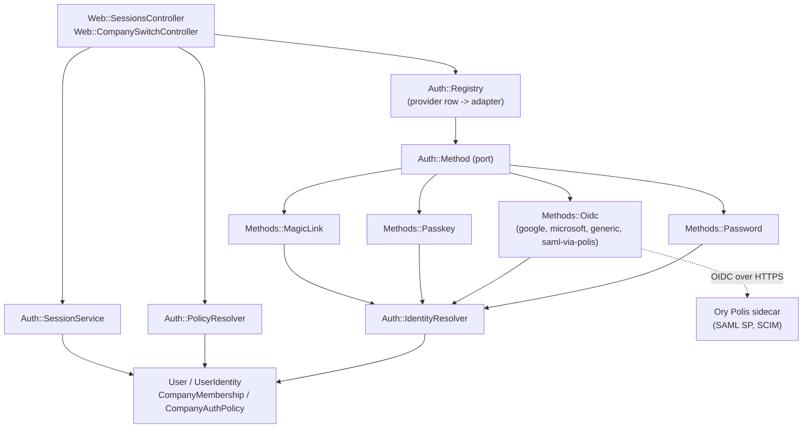
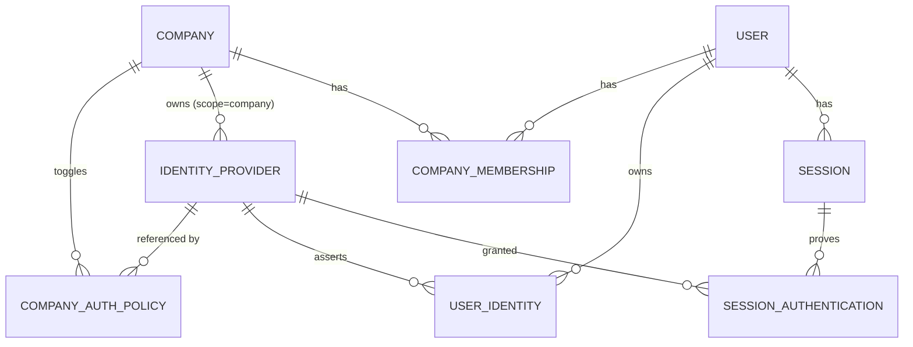
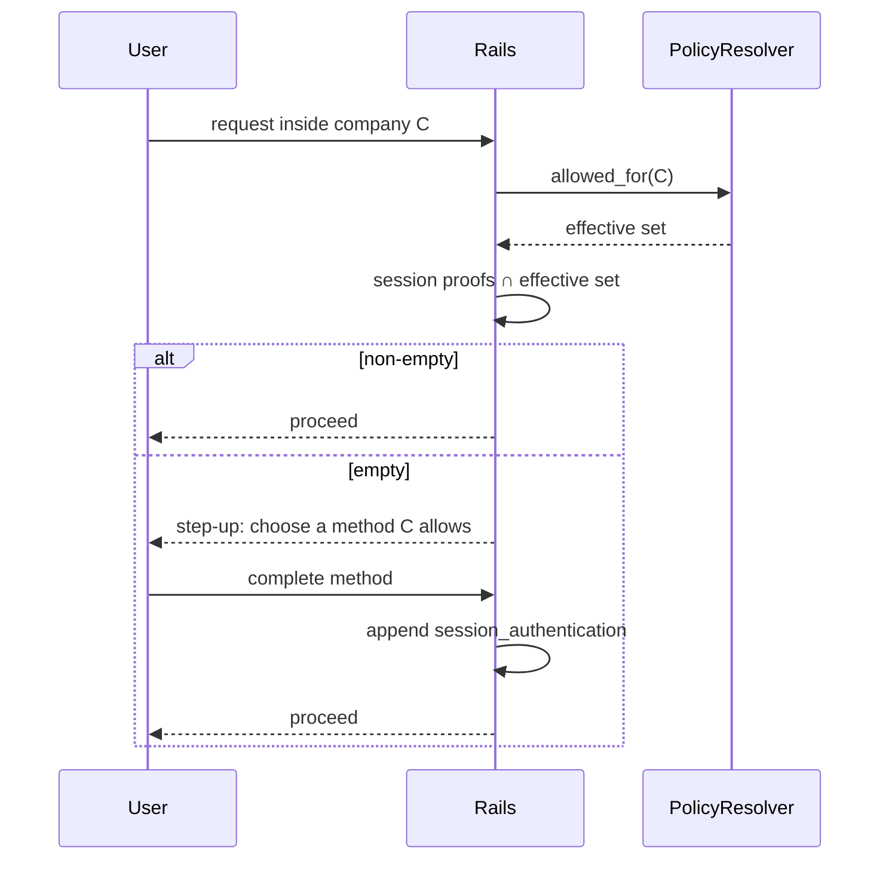

# Architecture Spine — Federated identity and SSO

## Design Paradigm

**Ports and adapters for authentication methods, inside the app's existing layered Rails.**

One port — `Auth::Method` — with one adapter per method kind under `app/services/auth/methods/`.
Controllers and services never branch on a provider kind string; they hold an `IdentityProvider` row
and ask the port. The rest of the app keeps its existing layering (controller → form/service → model,
Alba resources out, Pundit policies for authorization).



Dependency direction is one-way: adapters depend on the port and on `Auth::IdentityResolver`; nothing
in `Auth::` depends on a controller; nothing outside `Auth::` constructs an adapter directly.

## Invariants & Rules

### AD-1 — Rails is the system of record for identity [ADOPTED]

- **Binds:** all
- **Prevents:** a second user/organization model drifting from ours inside an external IdP, and a
  migration of `companies` / `company_memberships` / invitations / impersonation into a vendor's
  org primitive.
- **Rule:** Users, companies, memberships, invitations and sessions live in our Postgres. External
  identity providers supply protocol plumbing only. No external system is consulted to answer "may
  this person sign in" or "what may they see".

### AD-2 — One port, one adapter per method kind

- **Binds:** all
- **Prevents:** per-provider `if`-ladders spreading through controllers (the shape
  `sessions_controller.rb:63` has today, where the callback hardwires one service class).
- **Rule:** Every method kind implements `Auth::Method` (`#begin`, `#complete` → an
  `Auth::Assertion`). Resolution is `Auth::Registry.for(identity_provider)`. Adding a kind adds an
  adapter and a row type; it does not edit a controller.

### AD-3 — Identity is `(provider, subject)`, never email

- **Binds:** STAGE-0, STAGE-1, STAGE-3
- **Prevents:** account takeover by whoever controls any accepted IdP — today
  `google_omni_auth_service.rb:28` joins on email alone and never reads `email_verified`.
- **Rule:**
  1. `user_identities` is unique on `(identity_provider_id, subject)`. The subject is the
     provider's immutable identifier, and the claim is **binding per kind**, not illustrative:
     OIDC `sub`; Entra ID `oid` (never `email`, `preferred_username` or UPN); a sidecar-bridged
     SAML assertion's `NameID` as re-exposed in the bridge's `sub`. An adapter that cannot obtain
     its bound claim fails the sign-in; it never substitutes another.
  2. **An absent claim is not a true claim.** Email may promote an assertion to an existing user
     only when `email_verified` is **present and true**. An adapter that cannot establish
     verification reports `email_verified: false`.
  3. Promotion additionally requires **either** that the asserting provider is deployment-scoped —
     configured by this installation's operator, so its claims carry the operator's own trust —
     **or** that it is company-scoped and the email's domain is that company's `email_domain`.
     Today that domain is a trust anchor set by a platform operator
     (`admin/companies_controller.rb:12` is the only creation path), which is what makes it
     trustworthy; see AD-17. Without the deployment branch an existing password user could never
     add Google, because the Google client is deployment-wide.
  4. A changed email on an existing identity updates the stored email and **never** re-links the
     identity to a different user. Mailbox reassignment does not transfer an account.
  5. `Auth::IdentityResolver` is the only writer of `user_identities`.

### AD-4 — Providers and policy are two tables, not one

- **Binds:** ORG-POLICY, all stages
- **Prevents:** the incoherence of a per-company row for methods that are not per-company — one
  deployment-wide Google OAuth client and one `password_digest` column, which a literal "a row per
  method per company" would force into one identity row per company, and would force company-first
  login, breaking the entry page that exists today. Also prevents two policy models (flags for
  built-ins, rows for connections) diverging once per-customer connections arrive.
- **Rule:** Two tables.
  - `identity_providers` — what can authenticate. `scope: deployment` (password, Google, passkey,
    magic link, and any deployment-wide Entra app) or `scope: company` (a customer's own OIDC,
    SAML or Entra tenant). `user_identities` points here (AD-3).
  - `company_auth_policies` — `(company_id, identity_provider_id, enabled)`. This is the only thing
    an org admin toggles. A deployment-scoped provider is referenced by many companies' rows; a
    company-scoped one by exactly its owner's.

  The effective set is `deployment_allowlist ∩ company_auth_policies where enabled`, computed only
  by `Auth::PolicyResolver#allowed_for(company)`. The deployment allowlist is configuration
  (`Settings.auth.enabled_kinds`), never a row. **The login screen is governed by the deployment
  allowlist alone** — company discovery stays where it is today, after authentication completes.

### AD-5 — Policy is enforced at company entry, re-evaluated every request

- **Binds:** ORG-POLICY
- **Prevents:** a contractor on a foreign email domain bypassing an org's SSO-only rule by signing
  in at a login screen that only knows their own domain; a multi-company user being locked out by
  the strictest org's policy; and a revoked connection staying usable for the life of a session.
- **Rule:** Signing in is governed by the deployment allowlist alone. A company becomes or stays
  `session[:current_company_id]` only while the session satisfies that company's effective set —
  checked in `AuthConcern`, in the same pass that already re-validates membership on every request.
  A mismatch redirects to step-up re-authentication; it never signs the user out and never drops
  them to an unscoped page.

### AD-6 — Sessions are server-side records, their proofs append, and the token rotates

- **Binds:** STAGE-0, ORG-POLICY, STAGE-4
- **Prevents:** step-up ping-pong for a user switching between two companies with disjoint policies;
  deprovisioning that cannot cut off access — today a session is only `session[:user_id]` in a
  cookie (`auth_concern.rb:8-18`), so nothing can revoke it; and session fixation, where a session
  fixed before a step-up inherits the victim's new proof.
- **Rule:**
  1. A `Session` row per sign-in (token digest, user, IP, user agent, `last_seen_at`, `revoked_at`).
  2. **The session identifier rotates on every successful authentication** — `reset_session` plus a
     new token digest — and the proof is appended to the rotated session, never to the pre-auth one.
  3. Each authentication appends a `session_authentication` row naming the `identity_provider` that
     granted it and its `proved_at`.
  4. A company is satisfied when the intersection of the session's proofs with that company's
     **currently enabled** providers is non-empty. The intersection is computed on read by
     `Auth::PolicyResolver` against live rows — never from a cache, never by a background sweep
     writing tombstones — so disabling a provider voids its proofs on the very next request.
  5. A company may set `max_proof_age`; a proof older than it stops satisfying that company. Unset
     by default, so no new timer exists unless an org asks for one.

### AD-7 — A policy edit may not strand anyone, and deletion is an edit

- **Binds:** ORG-POLICY
- **Prevents:** an organization locking members out on a connection never known to work; two
  individually-safe concurrent admin actions racing to an empty effective set; and a single
  compromised admin unilaterally downgrading a company to its weakest seeded method.
- **Rule:**
  1. Enabling a company-scoped provider requires a completed real sign-in through it by an admin of
     that company first. That sign-in must therefore be **startable while the connection is still
     switched off**, for an admin of the owning company only — otherwise the two halves of this rule
     deadlock: no sign-in until enabled, no enabling until signed in, and only a platform operator
     could break the cycle. It remains a verification, not a way in: the company does not accept the
     method, so the entry gate (AD-5) turns the resulting session away exactly as before.
  2. **Deleting a policy row or a provider is evaluated exactly as disabling it.**
  3. A policy edit is refused when it would leave **any currently active member** — not merely the
     acting admin — with an empty effective set. The check and the write happen in one transaction
     holding a row lock on the company, so concurrent edits serialise.
  4. The acting admin must hold a live proof from a method the company still allows after the edit;
     a policy edit is itself a step-up-guarded action.
  5. Every policy edit, and every `super_admin` override of rules 1-4, is written to the
     `Audited::Audit` trail with the before and after effective sets.

### AD-8 — SAML never enters the Rails process [RETIRED by AD-28]

- **Binds:** STAGE-3
- **Prevents:** inheriting `ruby-saml`'s disclosure history (five Critical authentication-bypass
  advisories in fifteen months) inside the process that serves the app.
- **Rule:** A `saml` `AuthProvider` row stores Polis tenant/product keys, not IdP XML metadata.
  Rails completes it through `Methods::Oidc` against the Polis sidecar. No XML signature
  verification, no `ruby-saml`, no `omniauth-saml` in this codebase.

### AD-9 — The sidecar is split by reachability, and owns its own database [RETIRED by AD-28]

- **Binds:** STAGE-3, STAGE-4
- **Prevents:** exposing an unauthenticated admin API to the internet (the failure class of the
  Casdoor SCIM advisory), and an app-database migration being blocked by a vendor's schema.
- **Rule:** Only the sidecar's SAML ACS/OIDC endpoints are publicly routable — a customer IdP must
  be able to POST an assertion to them. Its admin API is cluster-internal and reachable only from
  the app. The sidecar gets its own database and its own credentials; the app never reads that
  database directly, only its HTTP API.

### AD-10 — Every membership change is a state-machine event, and SCIM owns no identities

- **Binds:** STAGE-4
- **Prevents:** SCIM deprovisioning taking a different, unaudited path into rows the UI writes
  through `CompanyMembershipStateMachine` (`invited/active/suspended/revoked`); and a second writer
  of `user_identities` contradicting AD-3.
- **Rule:** SCIM writes `User` and `CompanyMembership` only, through the same AASM events as the UI
  (`accept`, `suspend`, `revoke`, `reinvite`), attributed to the connection that made them.
  **SCIM never writes `user_identities`.** A SCIM-provisioned user has no identity row until their
  first successful authentication creates one via `Auth::IdentityResolver`, which is what makes
  provisioning-before-first-login coherent rather than a second identity authority.

### AD-11 — Entering a company through an invitation is still entering a company

- **Binds:** ORG-POLICY, STAGE-0
- **Prevents:** the invitation flow becoming the hole in an SSO-only policy — today all three accept
  call sites run `membership.accept!` **before** any session or proof exists
  (`auth_concern.rb:87-106`, `web/invitations_controller.rb`), so the gate has nowhere to stand.
- **Rule:**
  1. Acceptance moves **after** the session and its first proof exist, and is performed by
     `Auth::SessionService` at company entry — one call site, not three.
  2. `InvitationsController#signup`, which mints a user's first credential, is gated on the
     *kind being minted*: it offers only methods in the company's effective set. A company with
     password disabled shows no password form.
  3. An invited user who cannot satisfy the effective set is sent to step-up, not admitted.

### AD-12 — Credential existence is a question about identities, and an invite binds to its invitee

- **Binds:** STAGE-0
- **Prevents:** the `password_digest.present? || provider.present?` test
  (`invitations_controller.rb:27,114`) going wrong once a user has several identities and no
  password; and first-redeemer-wins, where whoever holds the invite link attaches the account's
  first credential.
- **Rule:** Credential existence is `user.user_identities.any?`. `users.provider` / `users.uid` are
  dropped after backfill and nothing reads them. For that to be *true* rather than merely stated,
  **the identity row appears with the credential**: setting a password links it (a `User` callback
  through `Auth::LocalCredential`, which still writes via `Auth::IdentityResolver`), whatever wrote
  the password — the login form, an invitation signup, the admin panel, or seeds. A credential that
  exists without an identity is the defect this rule exists to prevent, and it silently breaks the
  AD-7 stranding guard, which reads identities. An invitation token binds to the invited email
  address: redeeming it requires the authenticating identity to assert that same address with
  `email_verified`, it is single-use, and it is consumed in the same transaction as the acceptance.

### AD-13 — Every assertion is bound to the row that claims it

- **Binds:** STAGE-1, STAGE-3
- **Prevents:** the multi-tenant confused deputy — an assertion minted for one tenant satisfying
  another company's connection, open on two fronts (the shared sidecar, and a multi-tenant Entra
  app).
- **Rule:** Before an assertion is accepted, the adapter verifies the claims that identify its
  origin against the `identity_provider` row being satisfied: `iss` and `aud` for every OIDC
  connection; additionally `tid` for Entra; additionally the bridge's tenant and product keys for a
  sidecar-bridged SAML assertion. Any mismatch rejects the sign-in. There is no email fallback and
  no "try the other connections" retry.

### AD-14 — The cutover is expand/contract

- **Binds:** STAGE-0
- **Prevents:** two builders picking different migration shapes for the same columns, and a rolling
  deploy in which new code meets old rows (the failure mode this team already knows from splitting a
  JS bundle from its API).
- **Rule:** Three phases, each independently deployable. **Expand:** create
  `identity_providers` / `company_auth_policies` / `user_identities` / `sessions` /
  `session_authentications`; backfill an identity row per existing `users.provider`+`uid` and per
  existing `password_digest`; write both old and new on every sign-in. **Migrate:** switch all reads
  to the new tables; `GoogleOmniAuthService` is replaced by `Methods::Oidc` behind the registry.
  **Contract:** drop `users.provider` and `users.uid`. No phase both writes the new shape and drops
  the old one.

  **Live sessions do not survive the Migrate phase.** Every existing cookie session is invalidated
  once, and everyone signs in again. There is no legacy-cookie adoption path and no "legacy" proof
  kind — a proof always names a real `identity_provider`, in every phase, so no half-trusted shape
  exists for a builder to interpret.

### AD-15 — The single-writer rules are enforced mechanically

- **Binds:** all
- **Prevents:** AD-3, AD-4 and AD-10's "only X may do Y" decaying into prose nobody checks — the
  repo already enforces doctrine with custom cops rather than documentation.
- **Rule:** Each single-writer claim carries a mechanism: a custom `Auth/` rubocop cop rejecting
  `UserIdentity` writes outside `Auth::IdentityResolver` and effective-set computation outside
  `Auth::PolicyResolver`; database unique indexes on `(identity_provider_id, subject)` and
  `(company_id, identity_provider_id)`; a Pundit policy for policy administration. A rule with no
  mechanism is a convention and is written in the conventions table, not as an AD.

### AD-16 — Nobody silently loses their last way in

- **Binds:** ORG-POLICY, STAGE-2
- **Prevents:** a password-only member discovering at sign-in that their sole method was disabled
  last week, with no path back.
- **Rule:** When a policy edit would remove the last method a given member has ever proved, that
  member is emailed before the change takes effect, and the step-up screen names the methods the
  company does allow plus who to contact. Members with no usable method are listed to the admin in
  the policy UI before the edit is confirmed, not after.

### AD-17 — The domain trust anchor is only as strong as who sets it

- **Binds:** AD-3, ORG-POLICY
- **Prevents:** a company claiming a public mail domain, or any domain it does not own, and thereby
  minting identity-attaching assertions for arbitrary victims — the pre-existing weakness that
  `Company.find_by_email_domain` auto-join already carries.
- **Rule:** `companies.email_domain` may be set only by a platform operator (today's only creation
  path). Before self-serve company creation is ever introduced, `email_domain` must become a
  verified claim — DNS TXT proof recorded with a `verified_at` — and public mail-provider domains
  must be blocklisted. AD-3 promotion is permitted only against a domain that satisfies whichever
  of those two regimes is in force.

### AD-18 — A passkey is the user's credential; accepting it is the company's choice

- **Binds:** STAGE-2, ORG-POLICY
- **Prevents:** a company admin deleting or disabling a credential that lives on the user's own
  device and works across every company they belong to — while still letting an SSO-only company
  refuse passkey entry.
- **Rule:** Passkey credentials hang off the user, on the deployment-scoped `passkey` provider.
  Registration, listing and deletion are the user's alone; no company admin surface touches them,
  and disabling `passkey` in a company's policy **never** deletes or invalidates the credential.
  It only stops a passkey proof from satisfying that company (AD-6), leaving it usable everywhere
  else. The same reasoning governs any future user-owned credential kind.

### AD-19 — The operator account bypasses every company surface and holds one key

- **Binds:** ORG-POLICY, all stages
- **Prevents:** a platform operator being locked out of the product by a customer's policy; and the
  highest-privilege account in the installation depending on an external identity provider, or on a
  company-scoped connection whose own customer administers it.
- **Rule:** A `super_admin` satisfies every company's effective set without a proof, is never counted
  when deciding whether a policy edit would strand a member, and may override the AD-7 guards —
  every override audit-logged. In exchange the account authenticates **by password only**: an
  assertion from any other provider is refused before a session is minted, whatever the deployment
  allowlist or a company policy says.

### AD-20 — An impersonation is anchored to the session that earned it

- **Binds:** STAGE-0, ORG-POLICY
- **Prevents:** a cookie key outliving the operator session that set it and nominating an operator
  identity for whoever signs in on that browser next — which passes an admin gate that only asks
  "is the true user a super_admin?".
- **Rule:** The impersonation marker is never carried across a session rotation and is deleted on
  sign-out. "Who actually authenticated" is read from the live `AuthSession`, never from a session
  key, and an impersonation with no live session behind it is not an impersonation. Stopping one
  returns to the `AuthSession`'s own user, never to an id read out of the cookie.

### AD-21 — The deployment ceiling is derived from configuration, not declared

- **Binds:** ORG-POLICY, all stages
- **Prevents:** offering a provider the installation cannot complete — a button that dead-ends on a
  broken consent screen, and a company toggle for something that will never work. Before this, the
  default allowlist named Google whether or not any Google credentials existed.
- **Rule:** The effective ceiling is the declared allowlist **intersected with**
  `Auth::DeploymentProviders.configured_kinds`. A kind whose credentials are absent is not offered,
  whatever the allowlist says. Kinds that need nothing external (password, passkey, magic link, TOTP)
  and company-scoped kinds (OIDC, SAML — their credentials live on the connection row) are
  configured by definition. An OmniAuth strategy is likewise registered only when its credentials
  exist, so the middleware and the ceiling can never disagree.

### AD-22 — A one-time code is a step-up, never a sign-in

- **Binds:** STAGE-2, ORG-POLICY
- **Prevents:** a TOTP code being treated as a first factor — it proves possession of a device, not
  who the person is, so there is nobody to look up from it — and prevents needing the conjunctive
  proof semantics this spine defers.
- **Rule:** TOTP appends a proof to a session that already exists and can never start one. A company
  that accepts only TOTP is therefore requiring a proof its members can only obtain after
  authenticating some other way. A generated-but-unconfirmed secret is inert: `totp_confirmed_at` is
  what makes it live, so a half-finished enrolment cannot strand anybody.

### AD-23 — An emailed link confirms before it consumes

- **Binds:** STAGE-2
- **Prevents:** a single-use link being burned by the recipient's own mail infrastructure. Scanners
  and link-preview bots fetch every URL in a message, so a link that authenticated on GET would
  routinely be spent before its owner clicked it — and "used" by something that was not them.
- **Rule:** The GET renders a confirmation and touches nothing; the POST consumes the token and
  signs in, inside one transaction that also marks it spent. Expiry is minutes, not days — an
  invitation token's 7-day reusable shape is the wrong one for a credential.

### AD-24 — SCIM is a first-party endpoint, scoped by its token alone

- **Binds:** STAGE-4
- **Prevents:** directory sync inheriting a dependency on the SAML bridge being deployed (an
  installation may want joiners and leavers without wanting SAML at all); and a tenant identifier in
  a URL, which makes a leaked link an attack surface rather than a dead end.
- **Rule:** The SCIM service provider is ours, mounted once at `/scim` with no tenant in the path.
  The bearer token is the only thing that resolves the company, it is stored as a digest and shown
  once, and disabling its configuration ends access on the next request. The SCIM resource is a
  `CompanyMembership`, not a `User`: a person may belong to several companies, and a customer's
  directory owns their presence in that customer's company only.

### AD-25 — A federated assertion may create an account, never adopt one

- **Binds:** STAGE-1, STAGE-3
- **Prevents:** the "anyone can stand up a directory" takeover. Entra ID sends no `email_verified`
  claim and does not prove that a tenant owns the domain of an address it asserts, and creating a
  tenant is free — so treating "not a personal account" as verification lets an attacker set a
  victim's address on their own directory and be promoted onto the victim's account.
- **Rule:** A deployment-wide federated provider (one OmniAuth strategy serving every customer)
  reports `email_verified: false`. It may create a new account under the usual domain auto-join, and
  it may sign in an identity it already owns, but it may never attach itself to an account that
  already exists. When the address is taken, the sign-in is refused with a specific instruction —
  authenticate with a method you already hold, then link this one from your own settings — rather
  than a collision or a generic failure. Promotion stays available only where the domain is
  demonstrably the company's (AD-3, AD-17).

### AD-26 — A directory owns presence, not identity

- **Binds:** STAGE-4
- **Prevents:** a SCIM `PATCH` repointing an existing membership — with whatever role it holds — at
  an unrelated global account, detaching the original holder; and a directory conscripting an
  account outside the domain it demonstrably owns.
- **Rule:** `userName` is immutable over SCIM. The address is set once, at provisioning; changing who
  a membership points at is an account-level act that belongs to the person. Auto-acceptance applies
  only inside the company's own verified domain — outside it a SCIM-created membership stays
  `invited` and waits to be accepted, exactly as a hand-written invitation does.

### AD-27 — One IdP entity may serve only one company on the bridge [RETIRED by AD-28]

- **Binds:** STAGE-3
- **Prevents:** a confusing failure at connection time being discovered by a customer rather than by
  us. Measured, not assumed: the bridge refuses a second connection carrying an entityID it already
  holds, with `EntityID already exists for different tenant`.
- **Rule:** A SAML `entityID` is globally unique across the bridge, so two companies cannot both
  connect the same corporate identity provider — which is exactly what two subsidiaries of one group
  would try. The connection form says so before the attempt, and the failure is surfaced as that
  sentence rather than as a bridge error.

### AD-28 — Enterprise SSO is OIDC; there is no SAML and no sidecar

- **Binds:** all
- **Prevents:** carrying a second service for a protocol our customers' identity providers do not
  require, and the only alternative to that service — a SAML parser in the web process with five
  Critical authentication-bypass advisories in fifteen months.
- **Rule:** Enterprise SSO is a per-company OIDC connection. Every identity provider that matters
  speaks it: Entra ID, Okta, Ping, OneLogin, JumpCloud, Google Workspace. No SAML adapter, no bridge,
  no extra container — a self-hosted installation is one Rails app and a Postgres, and that is the
  point. `ruby-saml` and its wrappers are barred from `Gemfile.lock` by a test, so adding SAML later
  is a deliberate decision taken with that advisory history in front of whoever takes it, not a
  quiet `bundle add`.
- **Retires:** AD-8, AD-9, AD-27, which described the sidecar this decision removes. Their IDs stay
  spent; nothing reuses them.

## Consistency Conventions

| Concern | Convention |
| --- | --- |
| Namespacing | Everything auth-related lives under `Auth::` (`app/services/auth/`). Models: `IdentityProvider`, `CompanyAuthPolicy`, `UserIdentity`, `Session`, `SessionAuthentication`. |
| Method kinds | A closed enum on `identity_providers.kind`: `password`, `google`, `microsoft`, `oidc`, `saml`, `passkey`, `magic_link`. Kind strings appear only inside `Auth::`. |
| Secrets | Connection secrets use the existing `Encryptable` concern, as `OauthCredential` and `AgentCredential` already do. Never a plaintext column — the dead plaintext Google token columns were already dropped once. |
| Redirect state | Every redirect-based flow carries state through the existing `Oauth::State` shape: signed, short TTL, single-use nonce, user-pinned, PKCE verifier held server-side. Copied into `Auth::State`, not reused from the integrations broker. |
| Assertions | Adapters return an `Auth::Assertion` value object (`provider`, `subject`, `email`, `email_verified`, `name`, `raw`). Controllers never see a provider-specific payload. |
| Authorization | Org-policy administration is a Pundit policy on `CompanyAuthPolicy`, scoped to the company `admin` role, same as the rest of the admin surface. |
| Rate limiting | Every credential-accepting endpoint gets an explicit `rack-attack` rule (the gem is already in the Gemfile). |
| Audit | Policy changes, super_admin overrides, identity links and session revocations are recorded through the existing `Audited::Audit` trail used by impersonation. |
| Tests | Per `docs/testing.md`: never stub the class under test, no `any_instance`; each adapter gets a fake at the port boundary, contract-tested against the real one. |

## Stack

| Name | Version |
| --- | --- |
| Ruby | 4.0.6 |
| Rails | 8.1.3.1 |
| omniauth | 2.1.4 (present) |
| omniauth-google-oauth2 | 1.2.3 (present; its flow moves behind `Methods::Oidc`) |
| omniauth-entra-id | 3.1.1 |
| openid_connect | 2.5.0 |
| webauthn (cedarcode) | 3.4.3 |
| @simplewebauthn/browser | not used — the ceremony is two `navigator.credentials` calls plus base64url conversion (`shared/lib/webauthn.ts`), which is not worth a dependency in the shared node_modules |
| rotp | 6.3.0 (was vendored and unused; now carries TOTP) |
| SAML bridge (Ory Polis) | Apache-2.0 sidecar, optional `sso` compose profile. **Deliberately unpinned** — the version is chosen and pinned by the Open Question 1 spike, because adopting it at all is still conditional. AD-8/AD-9 bind the strategy, not the release. |
| scimitar | 2.15.0 — STAGE-4 uses a first-party endpoint, not the sidecar's directory sync (AD-24) |

## Structural Seed





```text
app/
  services/auth/
    method.rb                 # the port
    registry.rb               # IdentityProvider row -> adapter
    policy_resolver.rb         # the ONLY computation of a company's effective set
    identity_resolver.rb       # the ONLY writer of user_identities
    session_service.rb         # create / append proof / revoke
    state.rb                   # signed, single-use redirect state (PKCE)
    assertion.rb
    methods/                   # password, oidc, passkey, magic_link
  models/
    identity_provider.rb  company_auth_policy.rb  user_identity.rb
    session.rb  session_authentication.rb
docker/
  polis/                       # optional compose profile `sso` (STAGE-3)
```

Deployment envelope: the sidecar is one container in the managed cloud (own database, internal
admin API, public ACS route) and an **optional** compose profile for self-hosters, who need it only
if they want SAML. Nothing in STAGE-0..2 requires it, so a default `docker compose up` gains no new
service.

## Capability → Architecture Map

| Stage | Delivers | Governed by |
| --- | --- | --- |
| STAGE-0 foundation ✅ built | `user_identities`, server-side `Session`, proof append, registry+port, backfill and drop of `users.provider/uid` | AD-1, AD-2, AD-3, AD-6, AD-12, AD-14, AD-15, AD-20 |
| ORG-POLICY ✅ built | `identity_providers` + `company_auth_policies`, deployment ceiling, entry gate, step-up, no-stranding guard | AD-4, AD-5, AD-7, AD-11, AD-16, AD-17 |
| STAGE-1 oidc ✅ built | Microsoft Entra (multi-tenant), generic per-company OIDC with PKCE | AD-2, AD-3, AD-13, AD-21, AD-25 |
| STAGE-2 passwordless ✅ built | Passkeys, TOTP (step-up only), magic links | AD-2, AD-6, AD-18, AD-22, AD-23 |
| ~~STAGE-3 saml~~ dropped | Superseded: enterprise SSO is per-company OIDC (STAGE-1) | AD-28 |
| STAGE-4 scim ✅ built | Inbound provisioning and deprovisioning | AD-10, AD-24, AD-26 |

## Deferred

- **Which SCIM implementation** — the sidecar's directory sync versus `scimitar` in-app. Decided
  after STAGE-3 gives operational experience with the sidecar. AD-10 binds either choice.
- **Being an OIDC provider ourselves** (customers' tools signing in with Aixle). Out of scope; Ory
  Hydra noted in the research as the low-risk path if it is ever wanted.
- **Per-company login branding** beyond the existing `Company#branding`.
- **Step-up for sensitive actions** inside a company (as opposed to entry). The AD-6 proof model
  supports it; no requirement yet.
- **Additive MFA ("SAML *and* TOTP").** AD-6's non-empty-intersection test is deliberately OR-only,
  so it cannot express a conjunction. Upgrading it means requiring a *subset* rather than a
  non-empty intersection — a contained change to one predicate, not a remodel. Not needed until an
  org asks for a second factor on top of SSO.

## Open Questions

| # | Question | Resolve by |
| --- | --- | --- |
| 1 | **CLOSED — the question no longer applies.** It was answered by a live spike first (the OSS bridge did take three per-company connections, with no licence gate), and then made moot: the sidecar is gone. Kept for the record because the spike is what proved the image name in the compose profile did not even resolve. Original text: **ANSWERED 2026-09-17 by a live spike.** The OSS build takes per-company connections with no licence gate: three tenants registered through the admin API, each with its own `clientID`, and the authorize endpoint accepts the adapter's exact `client_id=tenant=X&product=Y` shape, redirecting to the IdP with a real `SAMLRequest`. An unknown tenant resolves to the bridge's error page. What the spike did **not** cover: a full round trip needs a real IdP to post a signed assertion, so the token and userinfo halves stay covered by the contract test alone. | Done. Remaining: one end-to-end sign-in against a real IdP before a customer relies on it. |
| 2 | IdP-initiated SSO. Enterprise buyers expect a tile in their IdP to land them signed in, which inverts AD-5's "authenticate, then enter a company" order. The sidecar supports it; our gate has not been designed for it. | During the Open Question 1 spike, before STAGE-3. |
